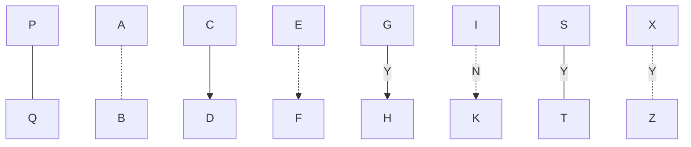
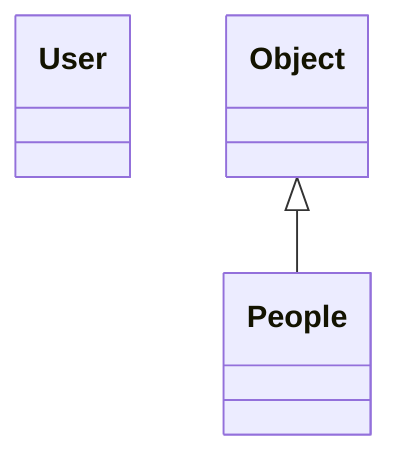
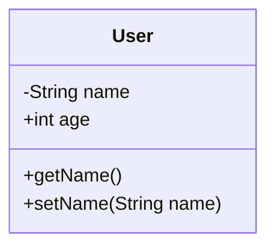
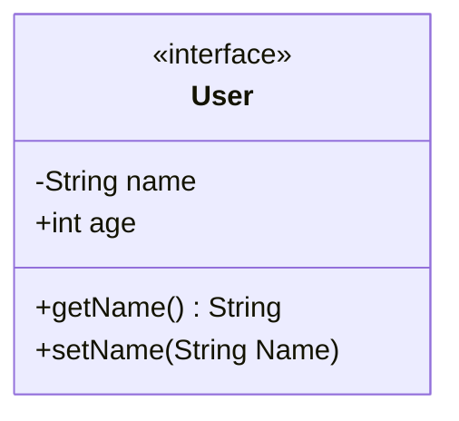
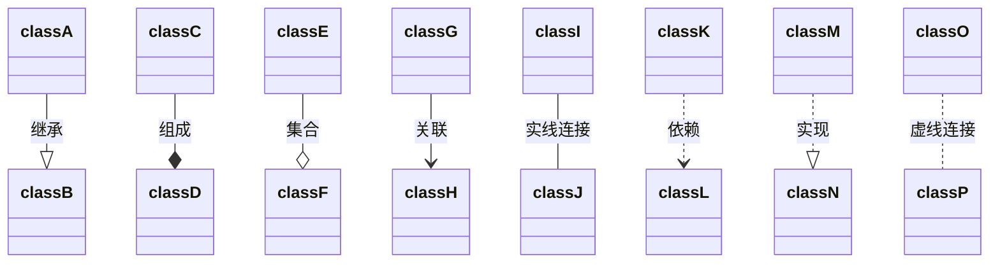

## 一、前言

````shell
```mermaid
	各种图代码
```
````

## 二、流程图

### 流程图声明

```shell
graph TB
	......
	......
```

> TB: Top Bottom 从上向下布局
> BT
> LR: Left Right
> RL

### 节点的画法

四种节点：圆角矩形、矩形、菱形、圆形

```shell
graph LR
    A(圆角矩形)
    B[矩形]
    C{菱形}
    D((圆))
    D>右向旗帜]
```


### 线段的画法

```shell
graph TB
	# 实线
	P --- Q
	# 虚线
	A -.- B
	# 箭头实线
	C --> D
	# 箭头虚线
	E -.-> F
	# 文本箭头实线
	G --Y--> H
	# 文本箭头虚线
	I -.N.-> K
	# 文本实线
	S --Y--- T
	# 文本虚线
	X -.Y.- Z
```



## 三、类图

### 概述

在类图中，一个类由三部分组成：

- 类名称：在类图的最顶端
- 类属性：在类图的中间层
- 类方法：在类图的最下层

### 类图声明

```shell
classDiagram
	......
	......
```

### 类定义

```shell
classDiagram
	class User
	Object <|-- People
```




### 类成员定义

```shell
classDiagram
	class User
	User: -String name
	User: +int age
	User: +getName()
	User: +setName(String name)
```



```shell
classDiagram
	class User{
		<<interface>>
		-String name
		+int age
		+getName() String
		+setName(String Name)
	}
```



### 类之间的关系

````shell

````


