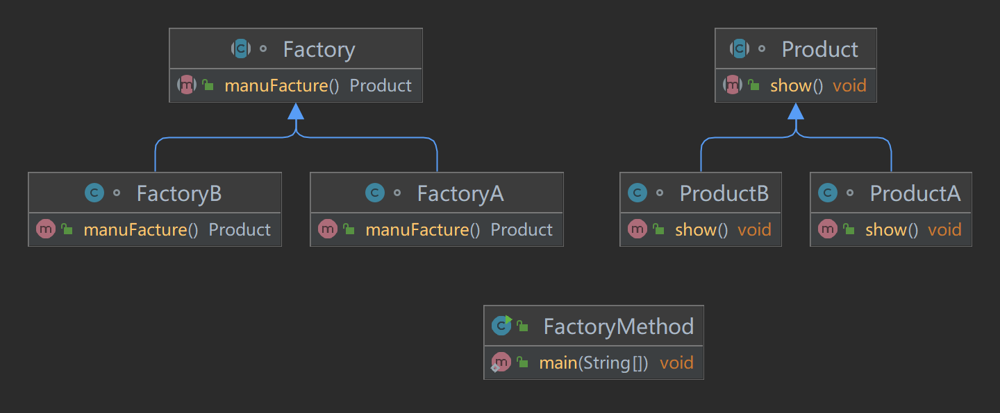

## 别称

虚拟构造器

## 目的

为创建一个对象定义一个接口，但是让子类决定实例化那个类。工厂方法允许类将实例化延迟到子类。

## 程序实例

```java
package com.taiyi.creational;

// 抽象产品和抽象工厂类
abstract class Product {
    public abstract void show();
}

abstract class Factory {
    public abstract Product manuFacture();
}

// 具体产品
class ProductA extends Product {
    @Override
    public void show() {
        System.out.println("产品 A ...");
    }
}

class ProductB extends Product {

    @Override
    public void show() {
        System.out.println("产品 B ...");
    }
}

// 具体工厂
class FactoryA extends Factory {

    @Override
    public Product manuFacture() {
        return new ProductA();
    }
}

class FactoryB extends Factory {

    @Override
    public Product manuFacture() {
        return new ProductB();
    }
}


public class FactoryMethod {
    public static void main(String[] args) {
        new FactoryA().manuFacture().show();
        new FactoryB().manuFacture().show();
    }

}
```

## UML图



## 适用性

- 一个类无法预料它所要必须创建的对象的类
- 一个类想要它的子类来指定它要创建的对象
- 类将责任委派给几个帮助子类中的一个，而你想定位了解是具体之中的哪一个

## Java中的例子

- [java.util.Calendar](http://docs.oracle.com/javase/8/docs/api/java/util/Calendar.html#getInstance--)
- [java.util.ResourceBundle](http://docs.oracle.com/javase/8/docs/api/java/util/ResourceBundle.html#getBundle-java.lang.String-)
- [java.text.NumberFormat](http://docs.oracle.com/javase/8/docs/api/java/text/NumberFormat.html#getInstance--)
- [java.nio.charset.Charset](http://docs.oracle.com/javase/8/docs/api/java/nio/charset/Charset.html#forName-java.lang.String-)
- [java.net.URLStreamHandlerFactory](http://docs.oracle.com/javase/8/docs/api/java/net/URLStreamHandlerFactory.html#createURLStreamHandler-java.lang.String-)
- [java.util.EnumSet](https://docs.oracle.com/javase/8/docs/api/java/util/EnumSet.html#of-E-)
- [javax.xml.bind.JAXBContext](https://docs.oracle.com/javase/8/docs/api/javax/xml/bind/JAXBContext.html#createMarshaller--)
