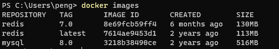

## 零、安装Portainer

拉取镜像

```shell
 docker pull portainer/portainer-ce
```

创建镜像

```shell
docker run -d -p 9000:9000 -v /var/run/docker.sock:/var/run/docker.sock -v /home/taiyi/docker_data/portainer
/data:/data --restart=always --name myPortainer portainer/portainer-ce:latest
```

## 一、Docker 概述

### 1、Docker 简介

### 2、为什么使用 Docker

Docker 与虚拟化技术比较

| 特性       | 容器               | 虚拟机     |
| ---------- | ------------------ | ---------- |
| 启动       | 秒级               | 分钟级     |
| 硬盘占用   | 一般为MB           | 一般为GB   |
| 性能       | 接近原生           | 弱于原生   |
| 系统支持量 | 单机支持上千个容器 | 一般几十个 |

- 尝试新软件
- 避免机器之间环境不同
- 更好地利用资源
- 为微服务定制
- 便于服务器之间迁移

### 3、Docker 安装

1. 安装

   ```shell
   curl -fsSL https://get.docker.com -o get-docker.sh
   sudo sh ./get-docker.sh --dry-run
   ```

   添加 docker 用户组

   ```shell
   sudo groupadd docker
   ```

   将当前用户添加至 docker 组

   ```shell
   sudo usermod -aG docker $USER
   ```

   更新 docker 用户组

   ```shell
   newgrp docker
   ```

2. 设置开机自启动

   ```shell
   systemctl enable docker
   ```

3. 验证

   ```shell
   docker version
   ```

4. 开启容器镜像加速

   ```shell
   vim /etc/docker/daemon.json
   ```

   ```json
   {
       "registry-mirrors": [
           "https://dockerproxy.com",
           "https://hub-mirror.c.163.com",
           "https://mirror.baidubce.com",
           "https://ccr.ccs.tencentyun.com"
       ]
   }
   ```

   ```shell
   systemctl daemon-reload
   ```

   ```shell
   systemctl restart docker
   ```

5. 查看配置信息

   ```shell
    docker info
   ```

6. hello-world

   ```shell
   docker run hello-world
   ```


## 二、Docker 镜像命令

### 1、帮助命令

```shell
docker version
```

```shell
docker info
```

```shell
docker --help
```

### 2、docker  images



- REPOSITORY：镜像仓库源
- TAG：镜像标签
- IMAGES ID：镜像 ID
- CREATED：镜像创建时间
- SIZE：镜像大小

可选项：

- -a：列表本地的所有镜像及子镜像
- -q：之前是镜像 ID
- --digests：显示镜像的摘要信息
- --no-trunc：显示完整的镜像信息

### 3、docker search

镜像搜索，默认从 https://hub.docker.com 进行搜索

```shell
docker search 镜像名称
docker search 镜像名称 -s 收藏数
```

### 4、docker pull

镜像下载

拉取指定版本号

```shell
docker pull 镜像名称:[TAG]
```

拉取最新版本号

```shell
docker pull 镜像名称
```

### 5、docker rmi

删除镜像

```shell
docker rmi 镜像仓库名称
docker rmi 镜像ID
```

带有容器的镜像不能被删除

## 三、Docker 容器命令

> 容器镜像是一个软件的轻量级独立可执行软件包，包含运行它所需的一切：代码，运行时，系统工具，系统库，设置。
>
> 不管环境如何，集装箱化软件都可以运行相同的 Linux 和 Windows 应用程序。
>
> 容器将软件与其周围环境隔离开来，例如开发环境和生产环境之间的差异，并有助于减少在同一基础架构上运行不同软件的团队之间的冲突。

### 1、创建并启动容器

```shell
docker run [options] images [command][args] /参数
```

options 说明：

- --name：为容器指定一个名称
- -d：后台运行容器，并返回一个容器ID，也即启动守护式容器
- -i：以交互模式运行容器，通常与 -t 同时使用
- -t：为容器重新分配一个伪输入终端，通常与 -i 同时使用
- -P：随机端口映射
- -p：指定端口映射，四种格式：
  - ip:host_port:container_port
  - ip::container_port
  - host_port:container_port
  - container_port

### 2、退出容器

退出并关闭容器

```shell
exit
```

退出不关闭容器

```shell
Ctrl + p + q
```

### 3、列举所有容器

默认列举所有正在运行的容器

```shell
docker ps [options]
```

options 说明：

- -a：显示所有运行和没有运行的容器
- -q：是现实容器编号

### 4、启动、重启、关闭容器

- 启动

  ```shell
  docker start 容器ID或者名称
  ```

- 重启

  ```shell
  docker restart 容器ID或者名称
  ```

- 关闭

  ```shell
  docker stop 容器ID或者名称
  ```

- 强制停止

  ```shell
  docker kill 容器ID或者名称
  ```

### 5、删除容器

- 删除指定容器

  ```shell
  docker rm 容器ID或者名称
  ```

- 删除所有容器

  ```shell
  docker rm -f $(docker ps -aq)
  ```

- 注意：只能删除没有运行的容器

### 6、启动守护式容器

```shell
docker run -d 镜像名
```

### 7、启动交互式容器

```shell
docker run -it --name=myTomcat tomcat /bin/bash
```

### 8、查看容器日志

```shell
docker logs [options] 容器ID
```

option:

- -t：加入时间戳
- -f：跟随最新的日志打印
- --tail 10：显示最新的10条日志

### 9、查看容器运行进程

```shell
docker top 容器ID或进程
```

### 10、查看容器内部信息

```shell
docker inspect 容器ID
```

### 11、进入正在运行的容器

方式1：exec

重新打开一个新的终端，exit 退出（不会关闭容器）

```shell
docker exec -it 容器ID /bin/bash
```

方式2：attach（不推荐）

直接进行容器终端，不会启动新进程，exit 退出（会关闭容器），Ctrl + p + q 不关闭容器退出

### 12、拷贝容器内的文件到主机

容器 --> 宿主机

```shell
docker cp 容器ID或名称:容器内文件 宿主机文件
```

宿主机 --> 容器

```shell
docker cp 宿主机文件 容器ID或名称:容器内文件
```

## 四、Docker 镜像

### 1、什么是镜像

- 概述

  UnionFs（联合文件系统）：Union 文件系统（UnionFS）是一种分层、轻量级并且高性能的文件系统，它支持对文件系统的修改作为一次提交来一层层的叠加，同时可以将不同目录挂载到同一个虚拟文件系统下（unite several directories into a single virtual flesystem）Union 文件系统是 Docker 镜像的基础。镜像可以通过分层来进行继承，基于基础镜像（没有父镜像），可以制作各种具体的应用镜像，

- Docker 镜像加载原理

  Docker 的镜像实际上由一层一层的文件系统组成，这种层级的文件系统 UnionFS。

  bootfs（boot file system）主要包含 bootloaderkernel，bootloader 主要是引导加载 kernel，Linux 刚启动时会加载 bootfs 文件系统，在 Docker 镜像的最底层是botfs。这一层与我们典型的 Linux/Unix 系统是一样的，包含 boot 加载器和内核。当boot加载完成之后整个内核就都在内存中了，此时内存的使用权已由bootfs转交给内核，此时系统也会卸载bootfs。

  rootfs（root file system），在 bootfs 之上包含的就是典型 Linux 系统中的 /dev、/proc、/bin、/etc 等标准目录和文件。rootfs 就是各种不同的操作系统发行版，比如如 Ubuntu，Centos 等等

- 为什么镜像要使用分层结构
  最大的一个好处就是：共享资源
  比如:有多个镜像都从相同的 base 镜像构建而来，那么宿主机只需在磁盘上保存一份 base 镜像，同时内存中也只需加载一份 base 镜像，就可以为所有容器服务了。而且镜像的每一层都可以被共享

### 2、镜像特点

Docker镜像都是只读的，当容器启动时，一个新的可写的镜像被加载到镜像层的顶部，这一层通常被叫做容器层，容器层之下的都叫镜像层。

### 3、镜像 commit

```shell
docker commit -a="作者" -m="新景祥描述信息" 容器ID 要创建的新镜像名:[标签名]
```

### 4、Docker 容器数据卷

- Docker的理念:

  - 将应用与运行的环境打包形成容器运行，运行可以伴随着容器，但是我们对数据的要求希望是持久化的
  - 容器之间希望有可能共享数据

- Docker容器产生的数据，如果不通过 docker commit 生成新的镜像，使得数据做为镜像的一部分保存下来，那么当容器删除后，数据自然也就没有了。为了能保存数据在 docker 中我们使用卷

- 容器数据卷可以为我们做到以下两点

  - 容器数据的持久化
  - 容器之间继承和共享数据

- 添加数据卷：

  ```shell
  docker run -d -v /宿主机目录:容器内目录 镜像ID
  ```

## 五、Dockerfile

### 1、Dockerfile 概述

Dockerfile 是用来构建 Docker 镜像的构建文件，是由一系列目录和参数构成的脚本。使用步骤：

- 编写 Dockerfile 文件
- docker build 生成新的镜像
- docker run 运行新镜像

Dockerfile 编写流程：

1. Docker 从基础镜像运行一个容器
2. 执行一条指令并对容器进行修改
3. 执行类似于 docker commit 的操作提交一个新镜像
4. docker run 给予新镜像创建容器
5. 执行 Dockerfile 的下一条指令再从第2点开始知道没有指令

### 2、Dockerfile 体系结构

- FROM：基础镜像，当前新镜像是基于哪个镜像的

- MAINTAINER：镜像维护者的姓名和邮箱地址

- RUN：容器构建时需要运行的命令

- EXPOSE：当前容器对外暴露的端口

- WORKDIR：指定在创建容器后，终端默认登陆进来的工作目录

- ENV：用来在构建镜像过程中设置环境变量

- ADD：将宿主机目录下的文件拷贝进镜像并且ADD命令会自动处理URL和解压tar包

- COPY：类似ADD，拷贝文件和目录到镜像中，语法COPY src dest COPY[src","dest"]

- VOLUME：容器数据卷，用于数据保存和持久化工作，VOLUMN不能指定挂载位置

- CMD：指定一个容器启动时要运行的命令格式
  shell: CMD <命令>
  execCMD[可执行文件"参数1"参数2”]

- DockerFile：中可以有多个CMD指令，但只有最后一个生效，CMD会被docker run之后的参数替换

- ENTRYPOINT ：指定一个容器启动时要运行的命令

  ENTRYPOINT 的目地和CMD一样，都是在指定容器启动程序及参数

- ONBUILD：当构建一个被继承的Dockerfile时运行命令，父像在被子镜像继承后触发父镜像的onbuild

### 3、Dockerfile 自定义镜像

带有 vim 的 CentOS

```dockerfile
# 使用 FROM 制定该镜像给予那个镜像构建的
FROM centos
# 制定作者
MAINTAINER taiyi<taiyi.qq.com>
# 配置环境变量
ENV MYPATH /usr/local
# 配置工作目录
WORKDIR $MYPATH
# 安装 VIM
RUN yum install -y vim
# 向外暴露端口
EXPOSE 8848
# 执行 docker run 和 docker start 是需要执行什么命令
CMD echo $MYPATH
CMD echo "my centos build success"
CMD /bin/bash
```

VOLUMN 使用

```dockerfile
# 使用 FROM 制定该镜像给予那个镜像构建的
FROM tomcat:8.5.38
# 制定作者
MAINTAINER taiyi<taiyi.qq.com>
VOLUME ["/usr/local/tomcat/webapps", "/usr/local/tomcat/conf"]
# 向外暴露端口
EXPOSE 8080
# 执行 docker run 和 docker start 是需要执行什么命令
CMD echo "my tomcat build success"
CMD /bin/bash
```

构建

```shell
docker build -t custom_name:1.0.1 .
```

### 4、Dockerfile 制作镜像

```dockerfile
# 使用 FROM 制定该镜像给予那个镜像构建的
FROM centos:centos7
# 制定作者
MAINTAINER taiyi<taiyi.qq.com>
# 配置环境变量
ENV MYPATH /usr/local/tomcat
# 创建一个目录
RUN mkdir -p /usr/local/java
# 把 tomcat 和 jdk 放到镜像中
ADD jdk8.tar.gz /root/
ADD tomcat8.tar.gz /root/
# 列出 root 下面的目录
RUN ls -lh /root/
# 把 tomcat 放到 /usr/local 下面
RUN mv /root/tomcat8 /usr/local/tomcat
RUN mv /root/jdk8 /usr/local/java
# 配置工作目录
WORKDIR $MYPATH
# 挂在目录
VOLUME ["/usr/local/tomcat/webapps", "/usr/local/tomcat/logs"]
# 安装 VIM
ENV JAVA_HOME /usr/local/java/jdk8
ENV CLASSPATH $JAVA_HOME/ ib/dt.jar:$JAVA_HOME/Tib/tools.jar
ENV CATALINA_HOME /usr/local/tomcat
ENV CATALINA_BASE /usr/local/tomcat
ENV PATH $PATH:$JAVA_HOME/bin:$CATALINA_HOME/ib:$CATALINA_HOME/bin

# 向外暴露端口
EXPOSE 8080
# 执行 docker run 和 docker start 是需要执行什么命令
CMD bin/startup.sh && tail -f logs/catalina.out
```

### 5、案例：构建 Tomcat 镜像

### 6、命令说明

Dockerfile 中可以有多个 CMD 命令，但只有最有一个生效，CMD 会被 docker run 之后的参数替换掉

ENTRYPOINT 能够在现有命令的基础上追加参数

### 7、构建 jar 包

```dockerfile
FROM XXXX:1.0
ENV WORKPATH /usr/local/project
WORKDIR $WORKPATH
RUN mkdir -p /usr/local/project
ADD xxx.jar /usr/local/project
EXPOSE 8080
ENTRYPOINT ["java", "-jar", "xxx.jar"]
```

```shell
docker build -t project:1.0.0 .
```

```shell
docker run -d -p 9090:8080 project:1.0.0
```

## 六、Docker 安装各种服务

### 1、Redis

拉取镜像

```shell
docker pull redis:7.2
```

启动容器

```shell
docker run -p 6379:6379 
		  --name myredis \
		  -v /home/taiyi/docker_data/redis/data/:/data \
		  -v /home/taiyi/docker_data/redis/conf/redis.conf:/etc/redis/redis.conf \
		  -d redis:7.2 \
		  redis-server /etc/redis/redis.conf
```

简单操作：

```shell
docker run -it -d --name redis7 -p 6379:6379 redis:7.0 --bind 0.0.0.0 --protected-mode no
```

### 2、MySQL

```shell
docker run --name mysql8 \
	-v /home/taiyi/docker_data/mysql/log/:/var/log/mysql \
	-v /home/taiyi/docker_data/mysql/data/:/var/lib/mysql \
	-v /home/taiyi/docker_data/mysql/conf/:/etc/mysql/conf.d \
	-p 3306:3306 \
	-e MYSQL_ROOT_PASSWORD=123456 \
	-d mysql:8.0.35 \
	--init-connect="SET collation_connection=utf8mb4_0900_ai_ci" \
	--init-connect="SET NAMES utf8mb4" \
	--skip-character-set-client-handshake
```

