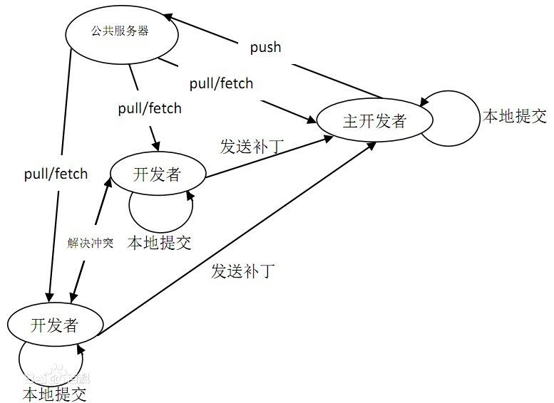

## 一、代码管理控制工具

### 1、集中式版本控制工具

> 集中式版本控制工具，版本库是集中存放在中央服务器的，团队里每个人工作时从中央服务器下载代码，是必须联网才能工作，局域网或互联网。个人修改后然后提交到中央版本库。

- SVM
- CVS

### 2、分布式版本控制工具-Git

> Git 是一个开源的分布式版本控制系统，可以有效、高速地处理从很小到非常大的项目版本管理。Git 是 Linus Torvalds 为了帮助管理 Linux 内核开发而开发的一个开放源码的版本控制软件。
>
> Git是分布式的，Git不需要有中心服务器，我们每台电脑拥有的东西都是一样的。我们使用Git并且有个中心服务器，仅仅是为了方便交换大家的修改，但是这个服务器的地位和我们每个人的 PC 是一样的。我们可以把它当做一个开发者的 PC 就可以就是为了大家代码容易交流不关机用的。没有它大家一样可以工作，只不过"交换"修改不方便而已。

#### 2.1、Git 工作流程



#### 2.2 常用命令

- **clone**（克隆）: 从远程仓库中克隆代码到本地仓库
- checkout （检出）:从本地仓库中检出一个仓库分支然后进行修订
- **add**（添加）: 在提交前先将代码提交到暂存区
- **commit**（提交）: 提交到本地仓库。本地仓库中保存修改的各个历史版本
- fetch (抓取) ： 从远程库，抓取到本地仓库，不进行任何的合并动作，一般操作比较少。
- **pull** (拉取) ： 从远程库拉到本地库，自动进行合并(merge)，然后放到到工作区，相当于fetch+merge
- **push**（推送） : 修改完成后，需要和团队成员共享代码时，将代码推送到远程仓库

## 二、Git 安装与基本使用

### 1、官网下载 exe 安装包并安装

### 2、配置

#### 2.1 验证

```shell
git -v
git --version
```

#### 2.2 配置（用户名和邮箱可编）

```shell
git config --global user.name "taiyi"
git config --global user.email "taiyi@qq.com"
```

查看配置信息

```shell
git config --global user.name
git config --global user.email
```

## 三、Git 常用操作

### 1、初始化

进入目录、执行命令

```shell
git init
```

> 执行命令后，仓库目录，可以看到.git目录，用于管理当前目录（注意：这是一个隐藏目录）

### 2、版本库状态

```shell
git status
```

### 3、添加文件

```shell
git add test.txt
```

> 此时文件状态为cached file，这是什么意思呢？其实这也是Git管理文件时的一种状态：暂存状态，草稿状态。

### 4、提交文件

```shell
git commit -m 'first commit'
```

> -m 表示提交的备注信息（message）

### 5、修改提交到版本库文件

- 先添加后提交

  ```shell
  git add test.txt
  git commit -m 'update commit'
  ```

- 优化

  ```shell
  git commit -a -m 'update commit'
  ```

### 6、查看版本历史

```shell
git log
```

以行显示

```shell
git log --pretty=oneline
```

### 7、删除文件

> 删除文件后版本库状态，版本库中文件还在，但是物理磁盘内的文件已经删除。

- 提交删除
- 从版本库恢复文件

### 8、恢复历史文件

> **如果版本库中一份文件已经被删除了，那么还能找回来吗**？其实原则上来讲，已经不行了，因为文件删除本身也是一种变更操作，也算是版本库管理的一部分。所以想要将已经删除的那份文件从版本库中取出来，已经是不可能了。但是，要注意的是，**版本库管理的是文件不同版本的变更操作**，这个不同版本的概念还是非常重要的。也就是说，**最后的那个删除的文件版本已经没有了，但是之前版本的文件其实还是存在的**。所以如果我们能将文件恢复到某一个版本，那么那个版本的文件就依然存在。

- 查看版本库信息

  ```shell
  git log --oneline
  ```

- 降版本库文件重置到某一个版本

  ```shell
  $ git reset --hard 5e03000
  ```

### 9、添加文件至忽略列表

> 一般我们总会有些文件无需纳入Git 的管理，也不希望它们总出现在未跟踪文件列表。 通常都是些自动生成的文件，比如日志文件，或者编译过程中创建的临时文件等。 在这种情况下，我们可以在工作目录中创建一个名为 .gitignore 的文件（文件名称固定），列出要忽略的文件模式。
>

```shell
# no .a files
*.a
# but do track lib.a, even though you're ignoring .a files above
!lib.a
# only ignore the TODO file in the current directory, not subdir/TODO
/TODO
# ignore all files in the build/ directory
build/
# ignore doc/notes.txt, but not doc/server/arch.txt
doc/*.txt
# ignore all .pdf files in the doc/ directory
doc/**/*.pdf
```

## 四、Git 实战应用

### 1、Git 分支

#### 1.1 master 分支

默认情况下，Git软件就存在分支的概念，而且就是一个分支，称之为master分支，也称之为主干分支。

#### 1.2 其他分支

- 创建分支

  ```shell
  git branch dev
  git branch test
  ```

- 查看分支

  ```shell
  git branch -v
  ```

- 切换分支

  ```shell
  git checkout dev
  ```

- 删除分支

  ```shell
  git branch -d dev
  # 强制删除
  git branch -D dev
  ```

### 2、Git 合并

> 创建多个分支是因为需要在不同的工作环境中进行工作，但是，最后都应该将所有的分支合在一起。形成一个整体。作为项目的最终结果。

将 dev 分支合并到 master 分支上

```shell
git merge dev
```

### 3、Git 冲突

> 在多分支并行处理时，每一个分支可能是基于不同版本的主干分支创建的。如果每个分支都独立运行而不进行合并，就没有问题，但是如果在后续操作过程中进行合并的话，就有可能产生冲突。比如m1、m2两个分支都是基于master分支创建出来的。m1分支如果和m2分支修改了同一份文件，那么在合并时，以哪一个文件为准呢，这就是所谓的冲突。

- 合并多个分支

  ```shell
  git merge m1
  git merge m2
  ```

- 查看冲突

  ```shell
  git diff
  ```

- 处理冲突（手动）

### 4、开发中分支的使用建议

> 几乎所有的版本控制系统都以某种形式支持分支。 使用分支意味着你可以把你的工作从开发主线上分离开来进行重大的Bug修改、开发新的功能，以免影响开发主线。

在开发中，一般有如下分支使用原则与流程：

- master （生产） 分支：线上分支，主分支，中小规模项目作为线上运行的应用对应的分支
- develop（开发）分支：是从master创建的分支，一般作为开发部门的主要开发分支，如果没有其他并行开发不同期上线要求，都可以在此版本进行开发，阶段开发完成后，需要是合并到master分支,准备上线
- feature/xxxx分支：从develop创建的分支，一般是同期并行开发，但不同期上线时创建的分支，分支上的研发任务完成后合并到develop分支
- hotfix/xxxx分支：从master派生的分支，一般作为线上bug修复使用，修复完成后需要合并到master、test、develop分支
- 还有一些其他分支，在此不再详述，例如test分支（用于代码测试）、pre分支（预上线分支）等等

## 五、Git 远程仓库

### 1、常用的远程托管服务

- GitHub：（ https://github.com/ ）是一个面向开源及私有软件项目的托管平台，因为只支持
  Git 作为唯一的版本库格式进行托管，故名GitHub
- 码云：（https://gitee.com/ ）是国内的一个代码托管平台，由于服务器在国内，所以相比于
  GitHub，码云速度会更快
- GitLab：（https://about.gitlab.com/ ）是一个用于仓库管理系统的开源项目，使用Git作
  为代码管理工具，并在此基础上搭建起来的web服务,一般用于在企业、学校等内部网络搭建git私服

### 2、Gitee 托管服务

- 初始化

  ```shell
  git init
  ```

- 添加远程仓库

  ```shell
  # git remote add <远端名称> <仓库路径> | 远端名称：默认是origin，取决于远端服务器设置 | 仓库路径：从远端服务器获取此URL
  git remote add origin git@gitee.com:lgysy/sy-study.git
  ```

- 查看远程仓库

  ```shell
  git remote
  ```

- 推送数据到远程仓库

  ```shell
  # 将远程与本地仓库合并
  git pull --rebase origin master
  # 推送本地仓库数据到远程仓库
  git push --set-upstream origin master
  ```

- 克隆远程仓库

  ```shell
  # 本地路径可以不用写
  git clone <仓库路径> [本地目录]
  ```

- 从远程仓库抓取与拉取

  - 抓取指令就是将仓库里的更新都抓取到本地，不会进行合并

    ```shell
    git fetch [remote name] [branch name]
    ```

  - 拉取指令就是将远端仓库的修改拉到本地并自动进行合并，等同于fetch+merge

    ```shell
    git pull [remote name] [branch name]
    ```

  - 案例：第一个创建的仓库提交代码，去到第二个仓库拉取代码。

    ```shell
    # 第一个仓库推送
    git add test.txt
    git commit -m 'test'
    git push --set-upstream origin master
    # 第二个仓库拉代码
    git pull
    ```

- 解决合并冲突

  在一段时间，A、B用户修改了同一个文件，且修改了同一行位置的代码，此时会发生合并冲突。A用户在本地修改代码后优先推送到远程仓库，此时B用户在本地修订代码，提交到本地仓库后，也需要推送到远程仓库，此时B用户晚于A用户，**故需要先拉取远程仓库的提交，经过合并后才能推送到远端分支**。

## 六、分支使用建议

- **切换分支前先提交本地的修改**
- **每次进入 dev 开发分支之前，先拉最新代码合并，避免写太多代码合并麻烦**
- **一定要先拉代码再合并解决冲突，不能直接提交把其他同事代码覆盖了**