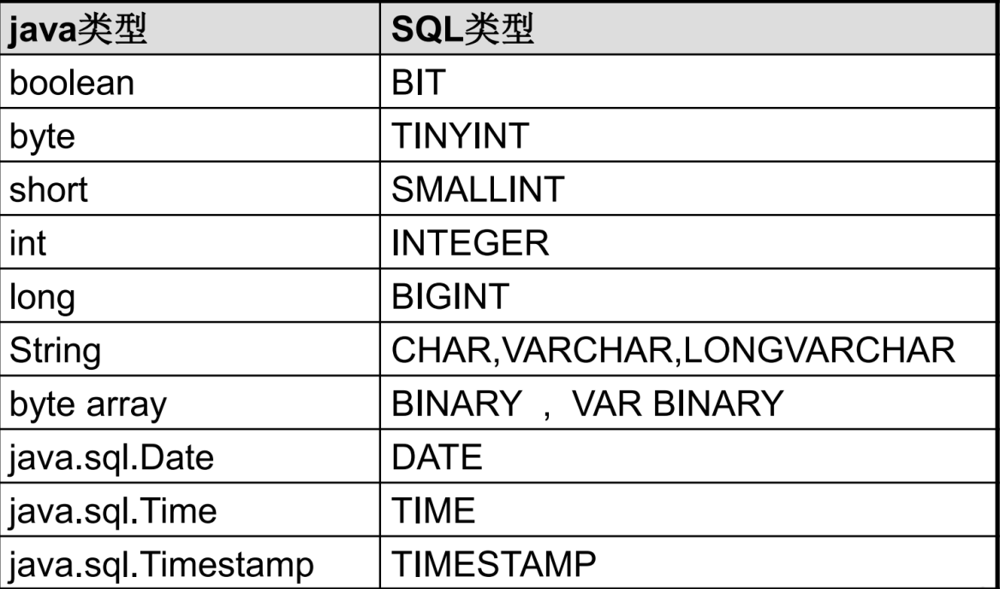

## 一、数据持久化

### 1、持久化


- 把内存中的保存到可掉电设备的一种方式，对于大多数的持久化来说，都是通过数据库（MySQL）进行持久化操作；

### 2、Java 中的数据库存储

#### 2.1、序列化与反序列化

#### 2.2、MySQL 存储数据

- 通过 JDBC 操作数据库

#### 2.3、Java如何操作

- JDBC 可以直接访问数据库
- 第三方 ORM 工具（MyBatis）
- JDBC 是 Java 访问数据库的基础，MyBatis等框架只是封装了 JDBC

## 二、JDBC 概述

### 1、概述

- JDBC（Java DataBase Connectivity）是 Java 操作数据库的一套 API ，是独立于数据管理系统（MySQL）的，定义了访问数据库的标准规范，通过 SQL 操作数据库；

### 2、JDBC 的本质

- 官方（sun 公司）定义了一套操作所有关系型数据库的规则，即接口；

- 各个数据库厂商去实现这套接口提供数据库驱动 jar 包；

- 使用这套接口（JDBC）编程，真正执行的代码是驱动 jar 包中的实现类（面向接口编程）；

  

## 三、JDBC API


- DriverManager 驱动管理类
- Connection 数据库连接对象
- Statemant 执行 SQL 语句
- ResultSet 结果集对象

## 四、JDBC 操作数据库

1、导入 MySQL 驱动包：mysql-connector

2、注册驱动

```java
Class.forName("com.mysql.cj.jdbc.Driver")
```

3、获取连接

```java
// 通过驱动管理接口（DriverManager）获取到连接对象（Connection）
Connection conn = DriverManager.getConnection(url, username, password);
```

4、定义 SQL

```java
String sql = "insert ...";
```

5、获取执行对象

```java
Statemant stmt = conn.createStatement();
```

6、执行 SQL

```sql
stmt.executeUpdate(sql);
```

7、处理结果并且释放资源

```java
// 在 finnally 中关闭 Statement 和 Connection 对象
```

注意：

- 将 xxx.jar 包添加为库文件是有如下选择：
  - Global Library：全局有效
  - Project Library：项目有效
  - Module Library：模块有效

案例代码

```java
public static void main(String[] args) throws ClassNotFoundException, SQLException {
    // 1 注册加载驱动
    Class.forName("com.mysql.cj.jdbc.Driver");

    // 2 获取连接
    String url = "jdbc:mysql://localhost:3306/jdbc";
    String username = "root";
    String password = "123456";
    Connection connection = DriverManager.getConnection(url, username, password);

    // 3 定义 sql
    String sql = "insert into account(money, user_name) values(1000, 'taiyi')";

    // 4 获取 statement
    Statement statement = connection.createStatement();

    // 5 执行 sql ，处理返回结果
    int count = statement.executeUpdate(sql);
    System.out.println(count);

    // 6 关闭资源
    statement.close();
    connection.close();
}
```

## 五、JDBC API 详解(面试重点)

### 1、加载与注册驱动

- 使用 DriverManager 类

- 方式

  ```java
  // 方式1
  Class.forName("com.mysql.cj.jdbc.Driver");
  // 方式2
  DriverManager.registerDriver(new Driver());
  // 方式3（同一，反射底层使用该方式）
  System.setProperty("jdbc.drivers", "com.mysql.cj.jdbc.Driver");
  ```

- 补充：

  - MySQL 5 之后的版本，可以省略注册驱动步骤

    

### 2、建立连接

- URL

  - 链接路径

  - 参数说明：

    ```java
    String url = "jdbc:mysql://localhost:3306/jdbc";
    // jdbc:子协议:子名称
    ```

    1. 协议：JDBC UTL 中的协议指的就是 jdbc

    2. 子协议：用来表示数据库驱动程序

    3. 子名称：表示数据库的方法；数据库需要：IP、端口PORT、数据库名

       

  - 常见数据库的JDBC URL：

    - Oracle：jdbc:oracle:thin:@主机名称:oracle服务端口:Databasename=数据库名称


- 建立连接方式

  ```java
  // 方式1
  String url = "jdbc:mysql://localhost:3306/jdbc";
  String username = "root";
  String password = "123456";
  Connection connection = DriverManager.getConnection(url, username, password);
  // 方式2
  String url = "jdbc:mysql://localhost:3306/jdbc";
  Properties properties = new Properties();
  properties.setProperty("user", "root");
  properties.setProperty("password", "123456");
  Connection connection = DriverManager.getConnection(url, properties);
  ```

- 事务相关

  ```java
  // 开启事务
  connection.setAutoCommit(false);
  // sql
  connection.commit();
  ```

- 获取 Statement 语句

  ```java
  // 获取 statement
  Statement statement = connection.createStatement();
  // 获取预编译语句 防止 SQL 注入
  PreparedStatement preparedStatement = connection.prepareStatement(sql);
  // 获取存储过程
  CallableStatement callableStatement = connection.prepareCall(sql);
  ```


### 3、Statement

- 概述

  - Statement 对象的作用是用来执行 SQL 语句的，但不同类型的 SQL 语句执行语法不同

  - 执行 DDL、DML 语句

    ```java
    // 返回 int ：受影响行数
    int statement.executeUpdate(sql)
    ```

  - 执行 DQL 语句

    ```java
    // 返回 ResultSet ： 结果集对象
    ResultSet statement.executeQuery(sql)
    ```

### 4、ResultSet

- 概述

  - 接口

  - 封装了 SQL 查询结果

  - 执行结果集方法

    ```java
    // 返回 ResultSet ： 结果集对象
    ResultSet statement.executeQuery(sql)
    ```

  - ResultSet 提供的方法

    ```java
    // 将光标从当前位置向前移动一行，判断当前行是否有效
    boolean next();
    // 获取数据，xxx：代表数据类型, columnIndex：列编号（1开始） columnlabel：列名称
    xxx getXxx(int columnIndex);
    xxx getXxx(String columnlabel);
    ```

  - Java 和 MySQL 之间的数据类型转换

    

### 5、SQL 注入问题

- 原因：改变 SQL 的语法结构

  ```java
  String userName = "root";
  String password = "1 or '1 = 1'";
  String sql = "select * from user user_name = " + userName + " password = " + password;
  ```

- 解决方案：预编译 SQL 语句并执行，预防 SQL 注入问题

  1. 通过 SQL 获取 PreparedStatement

     ```java
     String sql = "select * from account where user_name = ?";
     PreparedStatement preparedStatement = connection.prepareStatement(sql);
     preparedStatement.setString(1, "taiyi");
     ```

  2. 设置参数，把 ？占位符替换掉

     ```java
     // PreparedStatement 中的接口方法，parameterIndex：占位符？，从1开始 x：替换的值
     setXxx(int parameterIndex, Xxx x)
     ```

### 6、PreparedStatement 原理

- Java 将 SQL 语句发送到 MySQL 服务器

- MySQL 操作：

  - 检查 SQL 语法
  - 编译 SQL，将 SQL 编译成可执行函数
    - 检查 SQL 和编译 SQL 的时间比执行 SQL 的时间还要长；
    - 使用预编译语句不需要重复检查 SQL 语句和编译，可以提高性能；
  - 执行 SQL

- 通过查询日志来看原理

  - 开启预编译功能（步骤5 只是解决了 SQL 注入问题，预编译还没开启）

    - 在 url 添加如下参数：`useServerPrepStmts=true`

  - 配置 MySQL 执行日志，后重启生效

    ```ini
    general-log=1
    ```

    ```sql
    show variables like "general_log";
    set global general_log = 'ON';
    ```

## 六、单元测试 Junit

### 1、概述

- 单元测试时针对最小功能单元代码做测试；
- Java 中最小的功能单元是方法；
- 为什么要使用单元测试？Java 中只能有一个 main 方法；
- 使用单元测试优点：能够让单个方法顺利执行；

### 2、使用

```java
@Test
public void testJunit(){
    System.out.println("你好，Junit！");
}
```

## 七、优化 JDBC 配置

1. 新建 db.properties 配置文件

2. 加载 配置文件（配置文件放在 resources 目录下）

   ```java
   InputStream in = Env.class.getClassLoader().getResourceAsStream("db.properties");
   ```

3. 获取连接

   ```java
   /**
    * 获取连接工具类
    * @return 数据库连接
    */
   public static Connection getConnections() {
       InputStream in = Env.class.getClassLoader().getResourceAsStream("db.properties");
       Properties properties = new Properties();
       try {
           properties.load(in);
           Class.forName(properties.getProperty("driverClassName"));
           return DriverManager.getConnection(properties.getProperty("url"), properties.getProperty("username"), properties.getProperty("password"));
       } catch (IOException | ClassNotFoundException | SQLException e) {
           throw new RuntimeException(e);
       }
   }
   ```


## 八、JDBC 操作 CRUD

### 1、创建用户表

```sql
CREATE TABLE `user`
(
    `id`      bigint NOT NULL AUTO_INCREMENT COMMENT '主键',
    `name`    varchar(64)  DEFAULT NULL COMMENT '姓名',
    `age`     int          DEFAULT NULL COMMENT '年龄',
    `address` varchar(128) DEFAULT NULL COMMENT '家庭住址',
    `sex`     char(1)      DEFAULT NULL COMMENT '性别',
    PRIMARY KEY (`id`)
) ENGINE = InnoDB
  DEFAULT CHARSET = utf8mb4
  COLLATE = utf8mb4_0900_ai_ci COMMENT ='用户表'
```

### 2、查询用户表中的数据

```java
public List<User> queryUserList() {
    Connection connection = DBUtil.getConnections();
    PreparedStatement preparedStatement = null;
    ResultSet resultSet = null;
    String sql = "select * from user";
    List<User> users = new ArrayList<>();
    try {
        // 获取预编译语句
        preparedStatement = connection.prepareStatement(sql);
        // 查询结果
        resultSet = preparedStatement.executeQuery();
        // 将查询结果添加进 list 中
        while (resultSet.next()) {
            User user = new User();
            long id = resultSet.getLong(1);
            String name = resultSet.getString(2);
            int age = resultSet.getInt(3);
            String address = resultSet.getString(4);
            String sex = resultSet.getString(5);

            user.setId(id);
            user.setName(name);
            user.setAge(age);
            user.setAddress(address);
            user.setSex(sex);

            users.add(user);
        }

    } catch (SQLException e) {
        e.printStackTrace();
    } finally {
        if (resultSet != null) {
            try {
                resultSet.close();
            } catch (SQLException e) {
                e.printStackTrace();
            }
        }
        if (preparedStatement != null) {
            try {
                preparedStatement.close();
            } catch (SQLException e) {
                e.printStackTrace();
            }
        }
        if (connection != null) {
            try {
                connection.close();
            } catch (SQLException e) {
                e.printStackTrace();
            }
        }
    }
    return users;
}
```

### 3、向数据库中添加数据

```java
public int insert(User user) {
    String sql = "insert into user(name, age, address, sex) VALUES (?, ?, ?, ?)";
    Connection connection = DBUtil.getConnections();
    PreparedStatement statement = null;

    try {
        statement = connection.prepareStatement(sql);

        statement.setString(1, user.getName());
        statement.setInt(2, user.getAge());
        statement.setString(3, user.getAddress());
        statement.setString(4, user.getSex());

        return statement.executeUpdate();
    } catch (SQLException e) {
        e.printStackTrace();
    } finally {
        if (statement != null) {
            try {
                statement.close();
            } catch (SQLException e) {
                e.printStackTrace();
            }
        }
        if (connection != null) {
            try {
                connection.close();
            } catch (SQLException e) {
                e.printStackTrace();
            }
        }
    }
    throw new RuntimeException("插入失败！");
}
```

### 4、修改信息

```java
public int update(User user) {
    String sql = "update user set name = ?, age = ?, address = ?, sex = ? where id = ?";
    Connection connection = DBUtil.getConnections();
    PreparedStatement statement = null;

    try {
        statement = connection.prepareStatement(sql);

        statement.setString(1, user.getName());
        statement.setInt(2, user.getAge());
        statement.setString(3, user.getAddress());
        statement.setString(4, user.getSex());
        statement.setLong(5, user.getId());

        return statement.executeUpdate();
    } catch (SQLException e) {
        e.printStackTrace();
    } finally {
        if (statement != null) {
            try {
                statement.close();
            } catch (SQLException e) {
                e.printStackTrace();
            }
        }
        if (connection != null) {
            try {
                connection.close();
            } catch (SQLException e) {
                e.printStackTrace();
            }
        }
    }

    throw new RuntimeException("更新失败！");
}
```

### 5、根据 id 删除用户数据

```java
public int delete(Long id) {
    String sql = "delete from user where id = ?";
    Connection connection = DBUtil.getConnections();
    PreparedStatement statement = null;

    try {
        statement = connection.prepareStatement(sql);
        statement.setLong(1, id);
        return statement.executeUpdate();
    } catch (SQLException e) {
        e.printStackTrace();
    } finally {
        if (statement != null) {
            try {
                statement.close();
            } catch (SQLException e) {
                e.printStackTrace();
            }
        }
        if (connection != null) {
            try {
                connection.close();
            } catch (SQLException e) {
                e.printStackTrace();
            }
        }
    }

    throw new RuntimeException("删除失败！");
}
```

## 九、数据库连接池

### 1、不使用连接池存在的问题

- 使用 DriverManager 来获取连接，每次向数据库建立连接的时候，都需要将 Connection 对象加载到内存中，还需要验证账号和密码；
- 每次连接的建立和关闭都需要消耗资源；
- 若服务器同时有上千人建立关闭连接可能会导致服务器崩溃；
- 这种方式不能去管理创建的连接对象，分配资源没有管理能力，可能导致内存泄漏服务崩溃；
- 如果建立连接之后不去断开，会导致内存泄漏，导致需要重启 MySQL 服务器；

###  2、连接池概述


- 数据库的连接池就是一个容器，负责分配管理数据库连接；
- 允许应用程序重复使用现有的数据库连接，不需要新建；
- 关闭资源时间超过了最大空闲时间时，数据库会释放；

### 3、优势

- 资源重用；
- 提升性能；
- 避免数据库连接的泄漏；

### 4、实现

- 通过标准接口 DataSource 实现

- 接口中定义了获取连接的功能

  ```java
  Connection getConnection();
  ```

- 注意：

  - 不需要通过 DriverManager对象去获取连接对象，而是通过 DataSource 获取；

### 5、常见的连接池

- DBCP
  - Apache 提供，速度相对于 C3P0 快；
- C3P0
  - 速度相对较慢，稳定性可以，Hibernate 框架官方推荐；
- **Druid**
  - Alibaba 提供，集所有连接池优点于一身；
  - 速度不是最快，但是企业使用最多；

### 6、配置连接池

#### 6.1、配置 DBCP 连接池

- 使用之前需要先导入依赖（Tomcat 的连接池就是使用 DBCP 实现）
- dbcp连接池常用基本配置属性

| 属性                       | 文字说明                                                     |
| -------------------------- | ------------------------------------------------------------ |
| initialSize                | 连接池启动时创建的初始化连接数量（默认值为0）                |
| maxActive                  | 连接池中可同时连接的最大的连接数（默认值为8，调整为20，高峰单机器在20并发左右，自己根据应用场景定） |
| maxIdle                    | 连接池中最大的空闲的连接数，超过的空闲连接将被释放，如果设置为负数表示不限制（默认为8个，maxIdle不能设置太小，因为假如在高负载的情况下，连接的打开时间比关闭的时间快，会引起连接池中idle的个数 上升超过maxIdle，而造成频繁的连接销毁和创建，类似于jvm参数中的Xmx设置) |
| minIdle                    | 连接池中最小的空闲的连接数，低于这个数量会被创建新的连接（默认为0，调整为5，该参数越接近maxIdle，性能越好，因为连接的创建和销毁，都是需要消耗资源的；但是不能太大，因为在机器很空闲的时候，也会创建低于minidle个数的连接，类似于jvm参数中的Xmn设置） |
| maxWait                    | 最大等待时间，当没有可用连接时，连接池等待连接释放的最大时间，超过该时间限制会抛出异常，如果设置-1表示无限等待（默认为无限，调整为60000ms，避免因线程池不够用，而导致请求被无限制挂起） |
| poolPreparedStatements     | 开启池的prepared（默认是false，未调整，经过测试，开启后的性能没有关闭的好） |
| maxOpenPreparedStatements  | 开启池的prepared 后的同时最大连接数（默认无限制，同上，未配置） |
| minEvictableIdleTimeMillis | 连接池中连接，在时间段内一直空闲， 被逐出连接池的时间        |
| removeAbandonedTimeout     | 超过时间限制，回收没有用(废弃)的连接（默认为 300秒，调整为180） |
| removeAbandoned            | 超过removeAbandonedTimeout时间后，是否进 行没用连接（废弃）的回收（默认为false，调整为true) |

- 实现方式

  - 方式1

    ```java
    @Test
    public void testDBCP() throws SQLException {
        BasicDataSource source = new BasicDataSource();
        source.setDriverClassName("com.mysql.cj.jdbc.Driver");
        source.setUrl("jdbc:mysql://localhost:3306/jdbc?useServerPrepStmts=true");
        source.setUsername("root");
        source.setPassword("123456");
    
        Connection connection = source.getConnection();
        System.out.println(connection);
    
    }
    ```

  - 方式2

    ```java
    @Test
    public void testDBCP2() throws IOException, SQLException {
        Properties properties = new Properties();
        InputStream in = DBCPTest.class.getClassLoader().getResourceAsStream("db.properties");
        properties.load(in);
    
        BasicDataSource source = BasicDataSourceFactory.createDataSource(properties);
        Connection connection = source.getConnection();
        System.out.println(connection);
    }
    ```

    ```properties
    url=jdbc:mysql://localhost:3306/jdbc?useServerPrepStmts=true
    username=root
    password=123456
    driverClassName=com.mysql.cj.jdbc.Driver
    initialSize=10
    ```

  - 方式3（工具类）

    ```java
    private static DataSource dataSource = null;
    
    static {
        Properties properties = new Properties();
        InputStream in = DBCPTest.class.getClassLoader().getResourceAsStream("db.properties");
        try {
            properties.load(in);
        } catch (IOException e) {
            e.printStackTrace();
        }
    
        try {
            dataSource= BasicDataSourceFactory.createDataSource(properties);
        } catch (SQLException e) {
            e.printStackTrace();
        }
    }
    
    public static Connection getConnection() throws SQLException {
        return dataSource.getConnection();
    }
    ```

#### 6.2、C3P0 连接池

```java
@Test
public void testC3P0() throws PropertyVetoException, SQLException {
    ComboPooledDataSource cpds = new ComboPooledDataSource();
    cpds.setDriverClass("com.mysql.cj.jdbc.Driver"); //loads the jdbc driver
    cpds.setJdbcUrl("jdbc:mysql://localhost:3306/jdbc?useServerPrepStmts=true");
    cpds.setUser("root");
    cpds.setPassword("123456");

    Connection connection = cpds.getConnection();
    System.out.println(connection);
}
```

#### 6.3、Druid 连接池

```java
@Test
public void testDruid() throws Exception {
    Properties properties = new Properties();
    InputStream in = Thread.currentThread().getContextClassLoader().getResourceAsStream("db.properties");
    properties.load(in);
    DataSource dataSource = DruidDataSourceFactory.createDataSource(properties);

    Connection connection = dataSource.getConnection();
    System.out.println(connection);
}
```

## 十、JDBC 事务处理

### 1、事务的特点

- 事务一旦提交，就不能回滚
- 数据什么提交？
  - 当获取连接时，默认情况下，自动提交事务；
  - 关闭数据库连接时，自动提交事务；
  - 只要谈事务，多个操作必须使用同一个连接才有意义；

### 2、JDBC 操作多条 SQL 事务

1. 调用 Connection 对象的 setAutoCommit(false) 取消自动提交事务；
2. 所有 SQL 执行完之后做 commit；
3. 出现异常回滚：调用 rollback() 回滚事务；

- 注意：
  - 如果同一个连接没有被关闭，可能会存在重复使用，需要手动设置自动提交方式：setAutoCommit(false)；
  - 特别是在连接池使用的过程中，调用 close() 方法前，需要恢复事务自动提交状态；

### 3、JDBC 操作 “银行转账案例” 事务

```java
@Test
public void testTransfer() {
    Connection connection = null;

    try {
        // 1、获取连接
        connection = DruidUtil.getConnection();
        // 2、设置自动提交为 false
        connection.setAutoCommit(false);
        // 3、SQL 操作
        String sql1 = "update account set money = money - 1000 where user_name = ?";
        DruidUtil.update(connection, sql1, "taiyi");

        // 异常
        int num = 1/0;
        System.out.println(num);

        String sql2 = "update account set money = money + 1000 where user_name = ?";
        DruidUtil.update(connection, sql2, "zs");

        // 4、提交事务
        connection.commit();
    } catch (Exception e) {
        try {
            if (connection != null) {
                connection.rollback();
            }
        } catch (SQLException ex) {
            e.printStackTrace();
        }
        e.printStackTrace();
    } finally {
        try {
            if (connection != null) {
                connection.setAutoCommit(true);
            }
        } catch (SQLException e) {
            e.printStackTrace();
        }
    }
}
```

```java
private static DataSource dataSource = null;

static {
    Properties properties = new Properties();
    InputStream in = Thread.currentThread().getContextClassLoader().getResourceAsStream("db.properties");
    try {
        properties.load(in);
    } catch (IOException e) {
        e.printStackTrace();
    }
    try {
        dataSource = DruidDataSourceFactory.createDataSource(properties);
    } catch (Exception e) {
        e.printStackTrace();
    }
}

/**
 * 获取 Druid 连接池中的连接对象
 *
 * @return Connection 对象
 * @throws SQLException SQL 异常
 */
public static Connection getConnection() throws SQLException {
    return dataSource.getConnection();
}

/**
     * 执行更新操作
     *
     * @param connection 数据库连接对象
     * @param sql        SQL 语句
     * @param args       具体执行参数
     * @return 受影响行数
     */
public static void update(Connection connection, String sql, Object... args) {
    PreparedStatement statement = null;
    try {
        // 1、获取预编译语句
        statement = connection.prepareStatement(sql);
        // 2、参数占位
        for (int i = 0; i < args.length; i++) {
            statement.setObject(i + 1, args[i]);
        }
        // 3、执行 SQL 语句
        boolean isSuccess = statement.execute();
    } catch (SQLException e) {
        e.printStackTrace();
    } finally {
        if (statement != null) {
            try {
                statement.close();
            } catch (SQLException e) {
                e.printStackTrace();
            }
        }
    }
}
```

## 十一、批量处理

### 1、使用前提

- 当需要成批插入或更新数据时，可以采用 Java 的批量更新机制，这一机制允许多条语句一次性提交给数据库批量处理，通常情况下比单独提交更优效率

### 2、JDBC 批量处理方法

- addBatch(String)：添加需要批量处理的 SQL 语句或参数
- executeBatch()：执行批量处理语句
- clearBatch()：清空缓存的数据

### 3、业务场景

- 多条 SQL 语句的批量处理
- 一个 SQL 语句批量传参

### 4、批量处理案例

- 需求：向数据库中添加 5万 条数据；

- 方式1

  - 使用 statement

    ```java
    @Test
        public void testBatch1() throws SQLException {
            Connection connection = DruidUtil.getConnection();
            Statement statement = connection.createStatement();
            for (int i = 0; i < 50000; i++) {
                String sql = "insert into account(user_name) values (" + i + ")";
                statement.execute(sql);
            }
            statement.close();
        }
    ```

- 方式2

  - 使用 PreparedStatement

  - 耗时：37,5666

    ```java
    @Test
    public void testBatch2() throws SQLException {
        long begin = System.currentTimeMillis();
        String sql = "insert into account(user_name) values (?)";
        Connection connection = DruidUtil.getConnection();
        PreparedStatement statement = connection.prepareStatement(sql);
        for (int i = 0; i < 20000; i++) {
            statement.setString(1, String.valueOf(i));
            statement.executeUpdate();
        }
        statement.close();
        System.out.println(System.currentTimeMillis() - begin);
    }
    ```

- 方式3

  - 使用 批处理

  - 耗时：33,7117

    ```java
    @Test
    public void testBatch3() throws SQLException {
        long begin = System.currentTimeMillis();
        String sql = "insert into account(user_name) values (?)";
        Connection connection = DruidUtil.getConnection();
        PreparedStatement statement = connection.prepareStatement(sql);
        for (int i = 0; i < 20000; i++) {
            statement.setString(1, String.valueOf(i));
            // 暂存 SQL
            statement.addBatch();
            // 批处理
            if (i % 1000 == 0) {
                statement.executeBatch();
                // 清空缓存
                statement.clearBatch();
            }
        }
        statement.close();
        System.out.println(System.currentTimeMillis() - begin);
    }
    ```

- 方式4

  - 批处理 + 事务

  - 耗时：2,0211

    ```java
    @Test
    public void testBatch4() throws SQLException {
        long begin = System.currentTimeMillis();
        String sql = "insert into account(user_name) values (?)";
        Connection connection = DruidUtil.getConnection();
        // 设置手动提交事务
        connection.setAutoCommit(false);
        PreparedStatement statement = connection.prepareStatement(sql);
        for (int i = 0; i < 20000; i++) {
            statement.setString(1, String.valueOf(i));
            // 暂存 SQL
            statement.addBatch();
            // 批处理
            if (i % 1000 == 0) {
                statement.executeBatch();
                // 清空缓存
                statement.clearBatch();
            }
        }
        connection.commit();
        statement.close();
        System.out.println(System.currentTimeMillis() - begin);
    }
    ```

## 十二、自定义工具类

### 1、配置 Druid 连接池

```java
/**
 * 连接池对象
 */
private static DataSource dataSource;

static {
    // 1、加载配置文件
    Properties properties = new Properties();
    InputStream in = Thread.currentThread().getContextClassLoader().getResourceAsStream("db.properties");
    try {
        properties.load(in);
    } catch (IOException e) {
        e.printStackTrace();
    }

    // 2、程序启东市获取连接池对象
    try {
        dataSource = DruidDataSourceFactory.createDataSource(properties);
    } catch (Exception e) {
        e.printStackTrace();
    }
}
```

### 2、获取连接对象

```java
/**
 * 获取连接对象
 *
 * @return 返回连接对象
 */
public static Connection getConnection() {
    Connection connection = null;
    try {
        connection = dataSource.getConnection();
    } catch (SQLException e) {
        e.printStackTrace();
    }
    return connection;
}
```

### 3、新增、删除、更新方法 

```java
 /**
  * 新增、删除、更改公共方法
  *
  * @param connection 连接
  * @param sql        SQL 语句
  * @param args       SQL 中的参数
  * @return 受影响行数
  */
public static int update(Connection connection, String sql, Object... args) {
    int count = 0;
    PreparedStatement statement = null;
    try {
        // 1、获取预编译语句
        statement = connection.prepareStatement(sql);
        // 2、参数填充
        for (int i = 0; i < args.length; i++) {
            statement.setObject(i + 1, args[i]);
        }
        // 3、执行 SQL
        count = statement.executeUpdate();
    } catch (SQLException e) {
        e.printStackTrace();
    } finally {
        close(null, statement, connection);
    }
    // 4、返回受影响行数
    return count;
}
```

### 4、关闭资源

```java
/**
 * 关闭资源
 *
 * @param resultSet  查询结果集
 * @param statement  预编译语句
 * @param connection 连接对象
 */
public static void close(ResultSet resultSet, Statement statement, Connection connection) {
    if (resultSet != null) {
        try {
            resultSet.close();
        } catch (SQLException e) {
            e.printStackTrace();
        }
    }

    if (statement != null) {
        try {
            statement.close();
        } catch (SQLException e) {
            e.printStackTrace();
        }
    }

    if (connection != null) {
        try {
            // 对于连接池来说，并不是真正关闭连接，而是放回连接池中
            connection.close();
        } catch (SQLException e) {
            e.printStackTrace();
        }
    }
}
```

### 5、查询工具方法

- 通过反射处理结果集的赋值问题

  ```java
  /**
       * 查询公共方法
       *
       * @param connection 连接
       * @param sql        SQL 语句
       * @param clazz      结果集中对象的 Java 实体类的 字节码对象
       * @param args       SQL 中的参数
       * @param <T>        Java 实体类泛型
       * @return Java 实体类列表
       */
  public static <T> List<T> query(Connection connection, String sql, Class<T> clazz, Object... args) {
      PreparedStatement statement = null;
      ResultSet resultSet = null;
      List<T> list = new ArrayList<>();
      try {
          // 1、获取预编译语句
          statement = connection.prepareStatement(sql);
          // 2、参数填充
          for (int i = 0; i < args.length; i++) {
              statement.setObject(i + 1, args[i]);
          }
          // 3、执行 SQL
          resultSet = statement.executeQuery();
          ResultSetMetaData metaData = resultSet.getMetaData();
          int columnCount = metaData.getColumnCount();
  
          // 4、处理结果集
          while (resultSet.next()) {
              T t = clazz.newInstance();
              for (int i = 0; i < columnCount; i++) {
                  // 列名
                  String columnLabel = metaData.getColumnLabel(i + 1);
                  // 列值
                  Object object = resultSet.getObject(i + 1);
                  // 获取字段
                  Field field = clazz.getDeclaredField(toCamel(columnLabel));
                  field.setAccessible(true);
                  field.set(t, object);
              }
              list.add(t);
          }
      } catch (SQLException | InstantiationException | IllegalAccessException | NoSuchFieldException e) {
          e.printStackTrace();
      } finally {
          close(resultSet, statement, connection);
      }
      // 4、返回查询列表
      return list;
  }
  ```
  

下划线转驼峰命名

```java
  /**
   * 下划线命名转驼峰命名
   *
   * @param columnLabel 下划线命名
   * @return 驼峰命名
   */
  private static String toCamel(String columnLabel) {
      String name = columnLabel;
      int index = name.indexOf("_");
      if (index > 0 && name.length() != index + 1) {
          name = name.replaceFirst("_", "");
          String upperCase = name.substring(index, index + 1).toUpperCase();
          columnLabel = name.substring(0, index) + upperCase + name.substring(index + 1);
      } else {
          return columnLabel;
      }
      return toCamel(columnLabel);
  }
```

