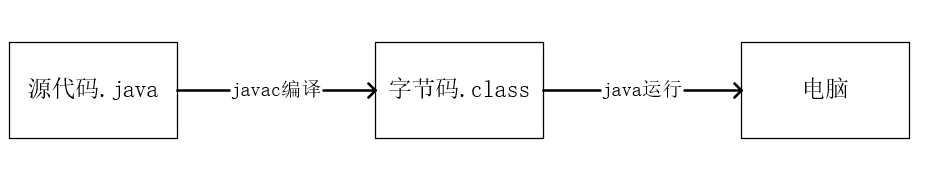
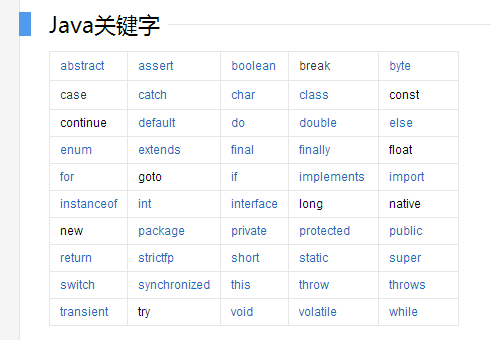
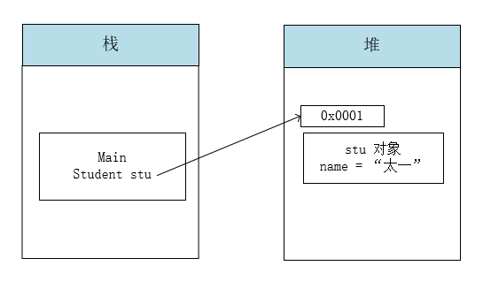
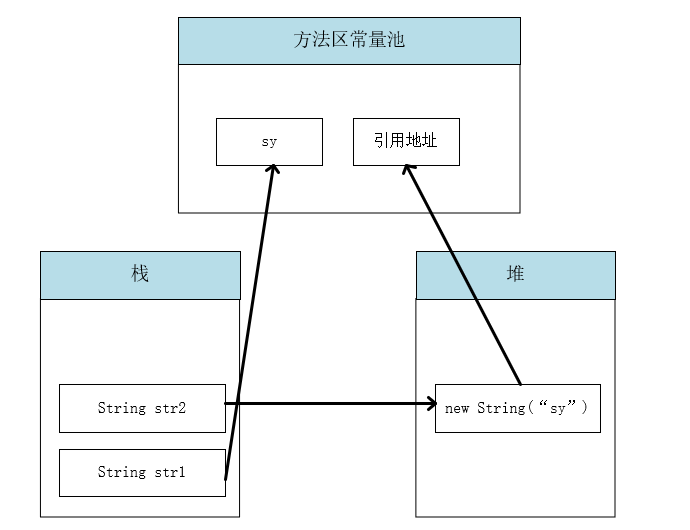
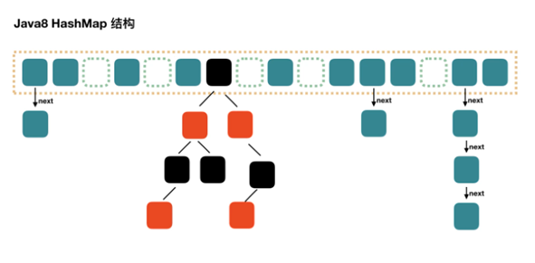
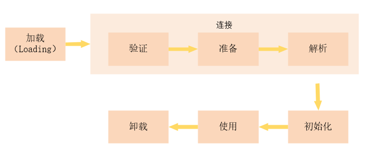
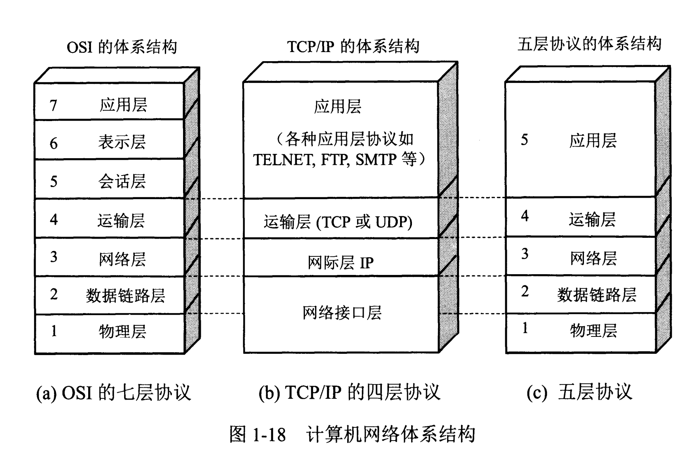

## 1、Dos 命令及快捷键

1. 常用命令

```powershell
ipconfig	# 查看IP地址
cls # 清屏
ping # 查看 IP 通否
D: # 切换盘符
cd folder  # 切换目录
```

2. 常用系统快捷键
   - win + e ：打开 **文件资源管理器**
   - win + d：快速回到 **桌面**
   - win + L：锁屏
   - alt + tab：切换 **软件窗口**

## 2、Java 概述

### 1、计算机组成

- 硬件：CPU、内存、硬盘、主板
- 软件：系统软件、应用软件

### 2、Java 语言特点：

- 简单：没有指针概念，不允许通过指针操作内存；只支持单继承；
- 跨平台：Windows、Linux、MacOS

### 3、环境变量

- 新建变量 JAVA_HOME
- PATH 中添加：%JAVA_HOME%\bin （bin目录下有可执行文件）
- 验证：`java -version` 、 `java` 、 `javac -version`

### 4、JDK 与 JRE 的关系

- JDK：Java 开发环境
- JRE：Java Runtime Environment （Java 运行时环境）
- JDK 包含了 JRE

### 5、Java 加载与执行过程

- 图解

  

- java 源文件：程序员编写的代码文件，扩展名以 `.java` 结尾
- 编译：通过 javac 将源文件编译成字节码文件 (.class)
- 运行：通过解释器 java 运行字节码文件

### 6、HelloWorld 程序

```java
// public 类的修饰符
// class 类的关键字
// HelloWorld 类名
// {} 类的范围
public class HelloWorld {
    // public 公共的，修饰符
    // static 代表静态的，一个关键字
    // void 代表没有返回类型
    // main 代表程序入口
    // String[] args 代表数组，程序参数

    public static void main(String[] args) {
        // 输出语句 输出 Hello World!
        System.out.println("Hello World!");
    }
}
```

### 7、中文乱码问题

`java HelloWorld` 终端输出中文乱码：

Windows 默认支持 GB2312，源代码 Java 文件使用的是 utf-8 编码方式。

## 3、Java 注释、关键字、标识符

### 1、Java注释

- 源代码中添加文字，解释说明
- 三种注释
  - 单行注释 `// 注释内容`
  - 多行注释 `/* 多行注释 */`
  - 文档注释 `/** 注释内容 */`

### 2、Java 关键字



- 小写字母开头

### 3、标识符

- 标识符就是名称的意思，定义类、包、方法、变量名
- 标识符的组成：
  - 英文字母 a-z A-Z
  - 数字 0-9
  - 符号 _ $
- 标识符规则：
  - 数字不能打头
  - 不可以使用关键字
  - 严格区分大小写 见名知意
  - 驼峰命名法

## 4、计算机的存储单元

### 1、计算内存如何存储数据？

- 计算机的最小存储单元：字节（byte），B 来表示；
- 计算机存储设备的最小信息单元：位（bit），b 来表示；

### 2、存储单元

- 1 B = 8 b
- 1 KB = 1024 B
- 1 MB = 1024 KB
- 1 GB = 1024 MB
- 1 TB = 1024 GB

### 3、进制转换

- 十进制 -> 二（八 十六）进制：短除法
- 八进制：0
- 十六进制：0x

## 5、数据类型

### 1、基本数据类型

|  四类  |     八种     | 字节数 |    数据范围    |
| :----: | :----------: | :----: | :------------: |
|  整形  |     byte     |   1    |   -128 ~ 127   |
|        |    short     |   2    | -2^15 ~ 2^15-1 |
|        |     int      |   4    | -2^31 ~ 2^31-1 |
|        |     long     |   8    | -2^63 ~ 2^63-1 |
| 浮点型 | float(f, F)  |   4    |                |
|        | double(d, D) |   8    |                |
| 字符型 |     char     |   2    | “A”, "a", "1"  |
| 布尔型 |   boolean    |   1    |  true, false   |

### 2、引用数据类型

- String 字符串
- 其他引用数据类型：数组、类

### 3、基本数据类型强制类型转换

```java
byte b = (byte)300;
```

- 超过给定的数据范围，就会循环；
- 多种数据类型混合运算，首先会转换成大容量数据类型，再运算；原因：避免出现精度损失；

## 6、变量

1、定义格式

```java
数据类型 变量名 复制符号 数值
   int   num    =    10;
```

## 7、常量

1、定义：永远不会变的量

```shell
System.out.println(10);
```

2、使用 final 修饰的变量

```java
final int num = 10;
```

- 注意：常量重新赋值会报错

  ```java
  final int num = 10;
  num = 20;
  ```

  ```shell
  java: 无法为最终变量num分配值
  ```

## 8、运算符

### 1、算数运算符

- 被运算符操作的数（变量、常量）成为操作数；

- 算数运算符：+ - * /

  | 运算符 | 运算规则 |        例子        |    结果    |
  | :----: | :------: | :----------------: | :--------: |
  |   +    |    正    |        +10         |     10     |
  |   +    |   加法   |       10+20        |     30     |
  |   +    |  连接符  |  "name:"+"taiyi"   | name:taiyi |
  |   -    |    负    |        -10         |    -10     |
  |   -    |   减法   |       20-10        |     10     |
  |   *    |   乘法   |        2*10        |     20     |
  |   /    |   除法   |   5/2（下取整）    |     2      |
  |   %    |   取模   |        5%2         |     1      |
  |   ++   |   自增   | int a = 1;++a/a++; |     2      |
  |   --   |   自减   | int b = 2;--b/b--; |     1      |


### 2、原码、反码、补码

- 1 正数的原码、反码、补码都一样

  ```shell
  原码：
  	00000000 00000000 00000000 00000001
  反码：
  	00000000 00000000 00000000 00000001
  补码：
  	00000000 00000000 00000000 00000001
  ```

- -1

  ```shell
  原码：
  	10000000 00000000 00000000 00000001
  反码：
  	11111111 11111111 11111111 11111110
  补码 = 反码 + 1
  	11111111 11111111 11111111 11111111
  ```

- 打印二进制数

  ```java
  Integer.toBinaryString(-1)
  ```

  ```shell
  11111111111111111111111111111111
  ```

- 十进制 -> 原码 --> 补码 --> 运算 --> 原码 --> 十进制

### 3、逻辑运算符

与 boolean 类型的值进行比较的，最终的值为 true 或 false

| 运算符 |       运算规则        |       例子       | 结果  |
| :----: | :-------------------: | :--------------: | :---: |
|   &    |   与（一假即为假）    |   true & false   | false |
|   \|   |   或（一真即为真）    |  true \| false   | true  |
|   !    |      非（取反）       |      !true       | false |
|   ^    | 异或（同false异true） |    true^false    | true  |
|   &&   |   短路与（性能高）    |  false && true   | false |
|  \|\|  |   短路或（性能高）    | true \|\| false  | true  |
|   ^    |    异或二进制运算     | 二进制无进位相加 |       |

### 4、条件运算符

三元运算符 (三目运算符)

```java
boolean ? var1 : var2;
```

### 5、位运算符

当使用数据操作位运算符时，是使用二进制运算的。

1 = true， 0 = false。

- & （与）：1&1=1, 1&0=0

- | （或）：1|1=1,1|0=1，0|0=0

- ^（异或）：1^1=0 1^0=1

- ~（取反）：~1=0，~0=1 （二进制元素位）

- << （左移）：左移一位相当于乘2

  ```shell
  0000 0001
  	<<1
  0000 0010
  ```

- **>>** （带符号右移）

- **>>>** （无符号右移）

## 9、条件与循环语句

### 1、选择结构 if

1. if

```java
if (boolean) {
    // 条件为 true 执行代码块
}
```

2. if...else 语句

```java
if (boolean) {
    // 语句块1
} else {
    // 语句块2
}
```

3. if...else if ... else if ... else 语句

```java
if (boolean) {
    // 语句块1
} else if (boolean) {
    // 语句块2
}else if (boolean) {
    // 语句块3
}else {
    // 语句块4
}
```

- 互锁
- 最多只有一个分支执行，如果有else，一定有一个分支执行

### 2、选择结构  switch

```java
switch (表达式) {
    case 目标值:
        // 语句块
        break;
    case 目标值:
        // 语句块
        break;
    case 目标值:
        // 语句块
        break;
    default:
        // 语句块
}
```

- switch 可以使用的数据类型 int String 枚举

### 3、循环结构 while

```java
while (boolean) {
    // 语句块
}
```

### 4、循环结构 do ... while

```java
do{
    // 语句块
}while (boolean)
```

### 5、循环结构 for

```java
for (表达式1; 表达式2; 表达式3) {
    // 语句块
}
```

### 6、break 语句

- 在switch条件语句和循环结构中都可以使用 break 。当初现在switch条件语句中时，作用是终止某个case并跳出switch 结构。

- 在嵌套循环中，break 只能终止当前循环；

- 可以使用 **标记** 的方式指定break终止的循环位置；

  ```java
  it: for (表达式1; 表达式2; 表达式3) {
      for (表达式1; 表达式2; 表达式3) {
      	// 语句块
          break it;
  	}
  }
  ```


### 7、continue 语句

- 用在循环中，作用是终止本次循环，执行下一次循环；

### 8、嵌套循环

```java
for (表达式1; 表达式2; 表达式3) {
    for (表达式1; 表达式2; 表达式3) {
    	// 语句块
	}
}
```

## 10、数组

### 1、数组定义

- 动态定义：数组初始化时，数组元素是空的，需要我们重新赋值才有数据。

  ```java
  数据类型[] 数组名 = new 数据类型[元素个数];
  
  // 赋值
  数组名[对应的索引]
  ```

- 静态定义：数组初始化的时候，就已经确定个索引元素的值。

  ```java
  // 方式1
  数据类型[] 数组名 = new 数据类型[]{数据1, 数据2, 数据3};
  
  // 方式2
  数据类型[] 数组名 = {数据1, 数据2, 数据3};
  ```

- 赋值 取值

  ```java
  // 赋值
  数组名[索引] = 值;
  
  // 取值
  数据类型 变量名 = 数组名[索引];
  ```

- length：数组长度

- 索引：0 ~ length-1

### 2、数组遍历

- 语法

  ```java
  // for 循环
  for (int i = 0; i < arr.length; i++) {
      // 语句块
  }
  
  // foreach
  for (int age : ages) {
      // 语句块
  }
  ```

### 3、数组特点

1、常见问题

- 索引越界异常

  ```shell
  ArrayIndexOutOfBoundsException
  ```

- 数组未初始化

- 空指针异常

  ```shell
  NullPointerException
  ```

2、数组元素的特点

- 数组元素数据类型必须一致
- 数组元素连续，空间大小一致，并且内存地址连续，呈现线性结构
- 数组长度固定之后，不可改变
- 数组不仅可以存储基本数据类型，还可存储引用数据类型；数组本身就是引用数据类型

3、优缺点

- 优点
  - 根据索引取获取访问元素（快）
  - 能存储较多的数据
- 缺点
  - 数组长度固定，不可改变（超过容量增加数组时，只能用新数组代替）
  - 只能存储一种数据类型

### 4、数组工具类 Arrays

```java
String s = Arrays.toString(array);
```

### 5、二维数组

- 定义

  ```java
  // 动态定义
  int[][] arr = new int[2][3];
  
  // 静态定义
  int[][] arr = new int[][]{{1, 2, 3}, {4, 5, 6}};
  int[][] arr = {{1, 2, 3}, {4, 5, 6}};
  ```

## 11、简单算法

### 1、两个变量交换

```java
// 1 中间变量 temp
int a = 10;
int b = 20;
int temp = a;
a = b;
b = temp;
System.out.println(a);
System.out.println(b);

// 2 异或的方式
int c = 1;
int d = 2;
c = c ^ d;
d = c ^ d;
c = c ^ d;

// 3 + -
a = a + b;
b = a - b;
a = a - b;
```

### 2、冒泡排序（升序）

```java
int[] heights = {9, 2, 6, 7, 4, 1};
System.out.println(Arrays.toString(heights));
for (int i = 0; i < heights.length - 1; i++) {
    for (int j = 0; j < heights.length - 1 - i; j++) {
        if (heights[j] > heights[j + 1]) {
            heights[j] = heights[j] ^ heights[j + 1];
            heights[j + 1] = heights[j] ^ heights[j + 1];
            heights[j] = heights[j] ^ heights[j + 1];
        }
    }
}
System.out.println(Arrays.toString(heights));
```

- 时间复杂度：O（n^2）

### 3、选择排序

```java
int[] heights = {9, 2, 6, 7, 4, 1};
System.out.println(Arrays.toString(heights));

for (int i = 0; i < heights.length - 1; i++) {
    for (int j = i + 1; j < heights.length; j++) {
        if (heights[i] > heights[j]) {
            heights[i] = heights[i] ^ heights[j];
            heights[j] = heights[i] ^ heights[j];
            heights[i] = heights[i] ^ heights[j];
        }
    }
}

System.out.println(Arrays.toString(heights));
```

- 时间复杂度：O（n^2）

### 4、二分查找

- 要求：数组有序

- 代码

  ```java
  int[] arr = {1, 2, 3, 5, 6, 8, 9, 11, 12, 16};
  
  int num = 0;
  
  int min = 0;
  int max = arr.length - 1;
  
  while (min <= max) {
      // 中间元素的索引
      int mid = (max + min) >> 1;
      // 中间元素的值
      int midValue = arr[mid];
  
      if (midValue < num) {
          min = mid + 1;
      } else if (midValue > num) {
          max = mid - 1;
      } else {
          System.out.println(num + " 所在的位置： " + mid);
          break;
      }
  }
  
  if (min > max){
      System.out.println("arr 中没有该元素");
  }
  ```

## 12、方法

### 1、定义

用于解决某件事情或实现某个功能的办法

```java
修饰符 void 方法名(形式参数){
    方法体
}

修饰符 返回值类型 方法名(形式参数){
    方法体
    return 返回值类型;
}
```

- return 作用：结束当前的方法
- 返回值类型：
  - 八大基本数据类型
  - 引用数据类型
  - void（没有返回）
- 方法的可变参数底层实际上就是数组

### 2、方法的重载

- 定义：同一个类里面，方法允许存在一个以上的同名方法，要求参数列表不同
- 参数列表不同：
  - 参数类型不同
  - 参数顺序不同，参数个数不同
- 和返回值类型无关

## 13、JVM 内存模型

- 栈：线程私有，生命周期与线程相同，线程之间不共享，里面拥有多个栈帧

  - 局部变量
    - 方法内定义的局部变量
    - 参数列表变量
    - 对象引用（指向对象的引用地址），指向堆里面
  - 栈是一块连续的空间，相对于堆来说，内存较小，运行速度较快，不需要垃圾回收机制

- 堆：是 JVM 内存模型中最大的一块，被所有线程共享，在 JVM 启动时所共享，在 JVM 启动时所创建

  - 存放对象实例（new 对象）并且会给初始值
  - 需要垃圾回收机制回收垃圾
  - 配置大小：-Xmx -Xms
  - 堆中的对象没有被栈引用时，会被垃圾回收器不定时回收

- 字符串常量池

  存储在类加载完成，经过验证、解析阶段的一些常量字符串

- 程序计数器PC

  - 是一块很小的内存区域，记录当前线程执行的字节码的行号指示器，可以通过计数器控制，指令、循环、跳转
  - 线程私有，每条线程都有自己的程序计数器

- 方法区

  - 类信息，记录类和字节码的信息，常量池（String 和 包装类）

- GC （垃圾回收）

  - 不定时回收垃圾，回收一些没有引用的堆内存的垃圾，不需要程序员手动操作

## 14、JVM 方法执行内存模型变化

栈：先进后出原则

## 15、方法的递归

### 1、定义

方法自己调用自己

### 2、错误

没有定义出口，会出现 StackOverFlow 异常

## 16、软件设计概况

### 1、软件的生命周期

- 产品提出需求
- 分析以及规划
- 软件编写及调试（自测、联调）
- 上测试环境，给测试人员测试（提 Bug）
- 上 Linux 生产环境（运维人员维护、修改 Bug、体统迭代升级）

### 2、软件设计原则

- 可重用性
- 可拓展性
- 可维护性
- 高内聚、低耦合（模块之间相互独立）

## 17、面向过程

- Procedure Oriented Programming （POP）
- 流程性的执行，需要去处理方法与方法之间的关系，或者是方法的调用
- 存在的问题：从上往下设计的方式，分别考虑每个方法干啥，细分很难

## 18、面向对象

### 1、面向对象

- Object Oriented Programming （OOP）
- 站在对象的角度考虑问题，处理类和类之间的调用和操作，把每个类，拆分成不同的功能

### 2、面向对象的三大特征：

- 封装：把功能的特征、方法封装成一个类，将细节隐藏起来，通过公共方法来调用，暴露功能
- 继承：做到代码的复用
- 多态：把子类赋值给父类的对象，调用的时候，还是调用子类，表现出不同的特征

### 3、类

- 具有相同特征和行为的实物进行一个抽象

### 4、对象

- 对象是类的实例，类是对象的模板

### 5、POP 和 OOP 的区别

- POP 更加平面化
- OOP 更加立体

## 19、类

### 1、类的定义

- 成员变量（字段）

- 方法

- 定义格式

  ```java
  public class 类名{
      0-N 个成员变量;
      
      0-N 个方法;
  }
  ```

### 2、对象的创建和使用

- 创建方式

  ```java
  类名 对象名 = new 类名();
  
  Student student = new Student();
  ```

- 给对象设置值

  ```java
  对象名.成员变量 = 值;
  
  student.name = "太一";
  ```

- 获取成员变量的值

  ```java
  数据类型 变量名 = 对象名.成员变量;
  
  String name = student.name;
  ```

- 实例方法的调用

  ```java
  对象名.方法名();
  
  student.showInfo();
  ```


- 创建对象是 JVM 内存模型

  

### 3、构造方法

- 也叫构造器（构造方法），是用来创建对象的，创建对象时，一定执行
- 构造方法
  - 也有修饰符
  - 不具备方法的返回值类型
  - 可以带参数
  - 默认的构造方法，里面没有任何内容
  - 构造方法可以重载
  - 构造方法，创建对象时，可以传参Book book = new Book("E3层");
- 注意：不提供构造方法时，默认提供一个不带参数的构造器

### 4、实例方法

- 定义方式：

  - 具有修饰类型
  - 有返回值类型
  - 有方法名和参数列表

- 定义

  ```java
  修饰符 返回值类型 方法名(参数列表) {
  }
  ```

- 调用方式，使用对象调用。

  ```java
  对象变量名.方法名()
  ```

- 空指针异常（没有去创建对象，就是调用对象的属性或者是方法）

## 20、static 关键字

### 1、static

- 是一个修饰符，表示静态的，可以用来修饰，方法、字段、代码块、内部类，最优先加载进内存的。

### 2、注意

- static 关键字，表示该资源属于类（而不是属于类对象）。只要使用 static 修饰的，直接使用类名.来调用，不用创建对象

- 在非 static 方法中，可以去访问 static 方法，但是最好用类名.来调用

- 在 static 方法中，不能直接访问普通方法

- 静态代码块优先于一切先执行

  ```java
  static {
    System.out.println("static 修饰的代码块");
  }
  ```

### 3、使用场景

- 写工具类的时候
- 资源加载，加载配置文件（MySQL JDBC）

## 21、深入变量

### 1、语法

```java
数据类型 变量名 = 值;
```

### 2、根据位置分类

- 成员变量
  - 类成员变量
    - 生命周期：从类加载到程序结束
    - 使用 static 修饰的，直接定义到类里面的
  - 实例成员变量
    - 生命周期：从创建对象开始，到GC垃圾回收器回收垃圾结束
    - 直接定义到类里面的
- 局部变量
  - 生命周期；从定义开始，到最近的花括号结束
  - 方法内部的变量
  - 参数列表
  - 代码块里面的变量
- 什么时候使用成员变量？什么时候使用局部变量？
  - 变量考虑生存时间（影响内存开销）
  - 尽可能减少作用域（减少内存开销）
  - 定义工具类，static 用起来比较方便，成员变量封装好，利于方法使用

## 22、package

### 1、类的全限定名

- 反射使用

- 从 src 到 .java 文件的文件名

### 2、导包

- java.lang 是Java 语言的核心包，里面的类直接使用，不需要手动导包
- java.util Java 工具包，需要手动导包

## 23、封装

### 1、定义

- 把对象的状态和行为看成一个统一的整体，放到一个独立的模块中（类）
- 做到信息的隐藏，把不需要的外界看到的信息隐藏起来，向外提供方法，保证外界的安全访问

### 2、封装的好处和意义

- 代码的复用性
- 使用者可以正常操作，方便使用系统功能
- 隐藏实现细节，提升安全性

## 24、访问控制权限修饰符

### 1、为什么

- 封装的目的，有些类让一些类看不到里面在做什么事情，因此提供了访问控制权限修饰符来解决

### 2、访问权限修饰符

|  修饰符   | 类内部 | 同一个包 | 子类 | 任何地方 |
| :-------: | :----: | :------: | :--: | :------: |
|  public   |   √    |    √     |  √   |    √     |
| protected |   √    |    √     |  √   |          |
|   缺省    |   √    |    √     |      |          |
|  private  |   √    |          |      |          |

## 25、封装的实现

### 1、规范

遵循 Java Bean 规范

- set get 方法，使用驼峰命名
- 变量：就近原则
- this 关键字：代表当前对象的引用
- 对于私有属性传参：
  - 使用set get
  - 使用构造器
- 注意
  - static 不能使用 this
  - 默认 get 方法底层使用 this 关键字
  - this 关键字也可以在构造器中使用

## 26、继承思想

### 1、定义

- 基于某个父类对其进行拓展，定义新的子类，子类可以继承父类原来的属性和行为，并且可以增加父类没有的特性，或者父类中的某些特性

### 2、继承的语法

```java
public class 子类类名 extends 父类类名{
    
}
```

### 3、注意

- Java 只支持单继承，不允许多重继承
- 任何类都是 Object 的子类

### 4、构造器执行顺序

1. 父类静态代码块
2. 子类静态代码块
3. 父类构造器
4. 子类构造器
5. set get 方法
6. 创建对象时，创建的谁，打印的 this 就是谁（多态）

## 27、重写

### 1、定义

- 当父类特征不能满足子类需求时，可以对父类方法进行重写

### 2、要求

- 子类的访问修饰符 >= 父类的访问修饰符
- 父类不能使用 private 修饰
- 子类的返回值类型 <= 父类

## 28、重载和重写区别

- 没有任何关系，不具备可比性
- 重载：放生在同一个类中：方法名相同，参数列表不同，与返回值无关
- 重载（overload）：解决一个类中，相同功能方法名不同的问题
- 重写（override）：解决继承过程中，父类方法不能满足子类需求的问题

## 29、抽象类

### 1、要求

- 必须使用 abstract 关键字修饰，并且没有方法体，留给子类实现
- 不能使用 private 以及 static 和 final
- 抽象方法必须定义到抽象类或着接口中

### 2、特点

- 不能实例化
- 抽象类可以有普通方法
- 抽象类的构造器不能私有化

## 30、接口

### 1、定义

```java
class interface 接口名{
    
}
```

### 2、注意

- 接口只能定义抽象方法
- 接口方法默认提供 public  abstract 修饰符
- 接口不能实例化（和抽象类一样）

### 3、实现

- 使用 implement 关键字 

### 4、接口支持多实现

- 分别把每个接口的抽象方法都实现

### 5、接口的多继承

## 31、抽象类和接口怎么选择

### 1、选择

- 不需要具体实现时，使用接口
- 除了定义规范，还有一定的功能，使用抽象类

### 2、抽象类的应用场景

- 模板方法

## 32、Object 类

1、定义

- Object 类是所有类的超类（Ctrl + H 查看类的集成结构）

2、常用方法

- toString() 打印当前对象，直接打印对象，就是使用 toString() 方法

  ```java
  public String toString() {
      return getClass().getName() + "@" + Integer.toHexString(hashCode());
  }
  ```

- getClass() 获取类的字节码对象、getClass().getName() 获取类的全限定名

- hashCode() 获取对象的哈希值，存到 HashTable 中

- finalize() 当对象不被引用时，要被 GC 不定时回收，GC 调用该方法

- equals() 比较是否是同一个对象

  ```java
  public boolean equals(Object obj) {
      return (this == obj);	// == 比较的是地址值
  }
  ```

  - equals() 没有被重写时，== 和 equals() 没有区别
  - == 比较地址值
  - String 类对 equals() 方法进行重写，比较的是字符串中的内容值

## 32、多态

### 1、语法

```java
父类 对象名 = new 子类();
```

- 通过实现接口或继承类都可以产生接口

### 2、实际开发

- 要求面向接口编程
- 多态调用，如果父类（接口）没有子类的字段或者方法，不能去调用

### 3、多态类型转换

```java
子类 对象名 = (子类) 多态对象名;
```

### 4、面相多态（接口）编程

- 不需要面向具体
- 降低耦合，提高拓展性
- 软件开发原则：OCP 开闭原则

## 33、super 关键字

执行顺序：

1. 父类静态代码块
2. 子类静态代码块
3. 父类构造器
4. 子类构造器

## 34、内部类

### 1、成员内部类

```java
public class 外部类名 {
    public class 内部类名 {

    }
}
```

- 访问

  ```java
  ExternalClass externalClass = new ExternalClass();
  ExternalClass.InnerClass innerClassTest = externalClass.new InnerClass();
  ```

### 2、匿名内部类

```java
接口名 对象名 = new 接口名(){
    @override
    // 实现接口方法
}
```

- 编译之后生成一个XXX$1.class 的文件，实现了接口
- 底层生成一个该接口的实现类

### 3、局部内部类（不要去使用）

- 作用域很小

## 35、匿名对象

### 1、定义

- 不给对象一个变量名

  ```java
  new Student();
  ```

### 2、作用和意义

- 少开辟空间，有效节约空间（ GC 可以不定期回收）

## 36、代码块

### 1、静态代码块

```java
static {
    
}
```

### 2、构造代码块

```java
{
    
}
```

### 3、局部代码块

```java
方法 {
    {
        
    }
}
```

- for 循环

### 4、执行顺序

1. 父类静态代码块
2. 子类静态代码块
3. 父类构造代码块
4. 父类构造器
5. 子类构造代码块
6. 子类构造器

- 注意
  - 构造代码块使用并不是很多，可以用构造器代替
  - 子类不能重写父类的 static 方法：static 属于类，而不是属于对象

## 37、instanceof

## 38、Sysytem 系统类

### 1、常用方法

```java
// 数组拷贝
public static native void arraycopy(Object src,  int  srcPos, Object dest, int destPos, int length);

// 当前时间
public static native long currentTimeMillis();

// 垃圾回收
public static void gc() {
    Runtime.getRuntime().gc();
}
```

## 39、字符串类

### 1、构造器

```java
// 无参构造器
public String() {
    this.value = "".value;
}

// 带一个参数的构造器
public String(String original) {
    this.value = original.value;
    this.hash = original.hash;
}

public String(char value[]) {
    this.value = Arrays.copyOf(value, value.length);
}
```

### 2、字段

```java
// 存储字符的数组
private final char value[];

// 缓存 hash code
private int hash; // Default to 0
```

### 3、方法

```java
// 查看字符串长度
public int length() {
    return value.length;
}

// 查看字符串是否为空
public boolean isEmpty() {
    return value.length == 0;
}

// 根据索引返回对应的字符
public char charAt(int index) {
    if ((index < 0) || (index >= value.length)) {
        throw new StringIndexOutOfBoundsException(index);
    }
    return value[index];
}

// 判断是否包含特定字符
public boolean contains(CharSequence s) {
    return indexOf(s.toString()) > -1;
}

// 获取 bytes 数组
public byte[] getBytes() {
    return StringCoding.encode(value, 0, value.length);
}

// 判断以什么开头
public boolean startsWith(String prefix) {
    return startsWith(prefix, 0);
}

// 判断以什么结尾
public boolean endsWith(String suffix) {
    return startsWith(suffix, value.length - suffix.value.length);
}

// equals
public boolean equals(Object anObject) {
	// 循环判断字符是否相等
}

// 断开
public String[] split(String regex) {
    return split(regex, 0);
}

// 去掉空字符串
public String trim(){
    // 语句块
}
```

### 4、字符串的创建方式

```java
String str1 = "sy";		// 常量池地址
String str2 = new String("sy");		// 会在堆中开辟一块内存空间
System.out.println("两个字符串的内容是否相等：" + str1.equals(str2));	// true
System.out.println("两个字符串的空间是否是同一块：" + (str1 == str2));		// false
```

- javap -verbose xxx.class



### 5、不能被继承

- final 修饰的类不能被继承

## 40、StringBuilder 字符缓冲区

### 1、不能被继承

- final 修饰

### 2、char[] 数组可以替换

- 没有使用 final 修饰
- 相比于 String 中使用 final 修饰，不可替换

### 3、构造器

```java
// 默认长度 16
public StringBuilder() {
    super(16);
}

// 可以指定容量
public StringBuilder(int capacity) {
    super(capacity);
}

public StringBuilder(String str) {
    super(str.length() + 16);
    append(str);
}
```

### 4、常用方法

```java
// char[] 数组的拷贝或者拼接
@Override
public StringBuilder append(String str) {
    super.append(str);
    return this;		// 返回当前对象，链式编程
}

// 将 StringBuilder 对象转换成 String 对象
@Override
public String toString() {
    // Create a copy, don't share the array
    return new String(value, 0, count);
}
```

### 5、字段

```java
char[] value;

int count;
```

## 41、StringBuffer

1、使用 synchronized 修饰，是线程安全的，因此性能差

## 43、面试题：String、StringBuilder、StringBuffer 的区别？

1、性能：StringBuilder > StringBuffer > String

2、StringBuffer 是线程安全的

原因：String中的 value 使用 final 修饰，每次更改都需要重新创建

## 44、Number 抽象类

```java
// 获取int类型的值
public abstract int intValue();

// 获取 long 类型的值
public abstract long longValue();

// 获取 float 类型的值
public abstract float floatValue();

// 获取 double 类型的值
public abstract double doubleValue();

public byte byteValue() {
    return (byte)intValue();
}

public short shortValue() {
    return (short)intValue();
}
```

## 45、基本数据类型的包装类型

### 1、Integer

- 构造器

  ```java
  public Integer(String s) throws NumberFormatException {
      this.value = parseInt(s, 10);
  }
  ```

- 常用方法

  ```java
  // 将 String 解析成 int 类型
  public static int parseInt(String s) throws NumberFormatException {
      return parseInt(s,10);
  }
  
  // 将 String 解析成 Integer 类型
  public static Integer valueOf(String s) throws NumberFormatException {
      return Integer.valueOf(parseInt(s, 10));
  }
  
  // 将 Integer 类型转换成 int 类型
  public int intValue() {
      return value; 
  }
  ```

- 自动装箱和拆箱

  ```java
  // 自动装箱
  Integer integer = 2;
  Integer integer = Integer.valueOf(2);	// 底层调用
  // 自动拆箱
  int intValue = integer;
  int intValue = integer.intValue();		// 底层调用
  ```

- 缓存

  ```java
  private static class IntegerCache {
      // 缓存 [-128, 127]
  }
  ```

  - 缓存设计的优点
    - 节约空间开销
    - 超过缓存范围才重新分配空间

- int 类型 和 Integer 类型不是同一种类型

  - 通过方法的重载证明

- 当 int 类型的值超过 short 的最大值时，存储到常量池里面

### 2、String Integer int 相互转换

```java
// String 转换成 Integer
Integer integer1 = new Integer("123");
Integer integer2 = Integer.valueOf("123");

// Integer 转换成 String
String s = integer1.toString();

// Integer 转换成 int
int i = integer1;
int i1 = integer1.intValue();

// int 转换成 String
String s1 = i + "";
```

### 3、包装类型对应

| 基本类型 | 默认值 | 包装类型  | 默认值 |
| :------: | :----: | :-------: | :----: |
|   int    |   0    |  Integer  |  null  |
|   long   |   0    |   Long    |  null  |
| boolean  | false  |  Boolean  |  null  |
|   byte   |   0    |   Byte    |  null  |
|  short   |   0    |   Short   |  null  |
|  float   |  0.0   |   Float   |  null  |
|  double  |  0.0   |  Double   |  null  |
|   char   |   ''   | Character |  null  |

- 注意：开发过程中，简易使用包装类型

## 46、大数据运算

### 1、BigInteger

- Java 开发中，超过 long 类型，使用它

- 构造方法

  ```java
  public BigInteger(String val) {
      this(val, 10);
  }
  ```

- 四则运算

  ```java
  public BigInteger add(BigInteger val) {}
  
  public BigInteger subtract(BigInteger val) {}
  
  public BigInteger multiply(BigInteger val) {}
  
  public BigInteger divide(BigInteger val) {}
  ```

### 2、BigDecimal

- 精度运算
- 需求：0.09 + 0.01
- 金钱运算：BigDecimal
- 有加减乘除的方法

## 47、Random 随机数

1、随机生成 0-100 之间的数，生成10次

```java
Random random = new Random();

for (int i = 0; i < 10; i++) {
    // [0, 100)
    System.out.println(random.nextInt(100) + 1);
}
```

2、随机生成 100-200 之间的数，生成10次

```java
Random random = new Random();

for (int i = 0; i < 10; i++) {
    // [0, 100)
    System.out.println(random.nextInt(100) + 1 + 100);
}
```

## 48、Math 和 Arrays

## 49、正则表达式

### 1、定义

- 使用字符串来定义匹配规则
- regex

### 2、注意

- 了解，不用去记
- 正则表达式代码生成器

## 50、日期处理

### 1、Date

```java
// 创建当前日期的对象
public Date() {
    this(System.currentTimeMillis());
}

// 打印符合国人观看的时间日期
@Deprecated
public String toLocaleString() {
    DateFormat formatter = DateFormat.getDateTimeInstance();
    return formatter.format(this);
}
```

### 2、SimpleDateFormat

- 日期 变 字符串

  ```java
  public final String format(Date date)
  ```

- 字符串 变 日期

  ```java
  public Date parse(String source)
  ```

- 常用的日期格式

  - yyyy-MM-dd
  - yyyy-MM-dd HH:mm:ss

## 51、Calender 日历类

1、获取日历对象

```java
public static Calendar getInstance()
```

2、获取当前时间

```java
public final Date getTime() {
    return new Date(getTimeInMillis());
}
```

## 52、工具类的设计

## 53、枚举

### 1、解决的问题

- 非法的数据设置
- 私有化构造器，使用对象来代替

### 2、定义

```java
public enum 枚举名{
    常量1, 常量2;
}
```

### 3、特点

- 构造器私有化
- 里面是一个个常量
- 枚举里面可以提供带参数的构造器
- 可以提供 set get 方法
- 还可以定义普通方法
- 通过 static 代码块 创建对象
- 继承了 Enum 的 final 类

## 54、单例设计模式

1、定义

- 只能创建一个对象

## 55、异常

1、解决的问题：

- 使用方法的返回值表示异常，无法穷尽所有情况来表示
- 异常代码和正常流程混在一起；代码臃肿，可读性降低
- 随着系统规模扩大。维护性遍地

## 56、异常机制

### 1、解决上述问题

- 把不同的异常类型描述成不同的类（异常类）

### 2、异常继承结构

- Throwable
  - Error
    - 错误，值 JVM 不可修复的错误，如内存溢出、JVM 错误 ...
    - 常见错误
      - StackOverflowError：递归没有出口
      - OutOfMemoryError：内存不够
  - Exception
    - NullPointerException：空指针异常
    - ArrayOutOfBundsException：数组索引越界

## 57、异常处理

### 1、原因

- 程序出现异常，无法继续执行，需要程序员手动处理异常

### 2、两种方式

- 如果方法不处理，通过方法声明抛出，由该方法的调用者来处理（thows）
- 在方法中使用 try{}catch(){} 代码块进行处理

### 3、语法格式

- throws 关键字
  - 声明：把问题标识出来，报告给调用者，由调用者处理
  - 在参数列表上，通过 throws + 具体异常类型
  - 用在方法上

- throw 关键字
  - 用来抛出指定类型的异常
  - 创建一个异常对象 throws 异常对象
  - 用在方法内部

- try...catch

  - 用来处理异常

  - 定义格式

    ```java
    try{
        // 可能出现异常的代码
    } catch (异常类型 变量) {
        // 异常执行代码
    }
    ```

- try...catch...finally

  ```java
  try{
      // 可能出现异常的代码
  } catch (异常类型 变量) {
      // 异常执行代码
  } finally{
      // 必然会执行的代码，常用来关闭资源
  }
  ```

- 使用时机

  - throws：当前方法不需要处理，只需要提供异常信息，给调用者处理即可
  - throw：方法会出现异常时，需要提醒调用者
  - try...catch：具体需要处理时


### 4、Exception 和 RuntimeException 的区别

- **Exception**：是受检查异常，必须处理或者 throws 出去
- **RuntimeException**：运行时异常，运行时，才去检查

### 5、异常对象常用方法

- getMessage() 获取具体的异常原因
- printStackTrace() 打印具体的错误

## 58、面试：final、finalize、finally的区别

1、final：表示最终的，不可修改的。

- 修饰变量：常量；
- 修饰类：不能被继承的类（String）
- 修饰方法：不可以被重写

2、finalize：Object 中的一个方法

- 提供给 GC 垃圾回收器使用

3、finally：异常处理代码块

- 表示一定会执行的代码块，常用来关闭资源

## 59、自定义异常

### 1、问题

- 现有的异常不能满足业务开发需求，需要自定义

### 2、自定义异常类

- 语法

  ```java
  public class 自定义异常类 extends 异常类 {
      // 无参构造器
      public 自定义异常类(){
          super();
      }
      
      // 带一个 String 参数的构造器
      public 自定义异常类(String s){
          super(s);
      }
  }
  ```

### 3、异常在开发中的使用

- 项目中会做统一异常处理，状态码返回 200 400 404 500
- 普通的正常异常处理

## 60、数据结构

### 1、定义

- 用来做计算存储、组织数据（增删改查）的一种方式
- 是相互之间一种或多种特定关系的结合
- 需要高效的算法和索引技术

### 2、常见数据结构

- 数组
- 链表
- 队列
- 栈
- 哈希表
- 树

### 3、意义

- 带来更高的存储和运行效率

### 4、要求

- 高效检索算法和索引技术

### 5、作用

- 增删改查

## 61、ArrayList

### 1、性能

- 增：O(n)
- 删：O(n)
- 改：O(n)
- 查
  - 根据索引：O(1)
  - 根据元素：O(n)

### 2、优劣

## 62、LinkedList

### 1、分类

- 单向链表
- 双向列表

### 2、性能

- 增：O(1)
- 删：
  - 头尾删除：O(1)
  - 中间删除：O(n)
- 改
  - 头尾修改：O(1)
  - 中间修改：O(n)
- 查
  - 头尾查询：O(1)
  - 中间查询：O(n)

### 3、优劣

- 新增、删除快
- 修改、查询慢

## 63、Queue 队列

### 1、定义

- 一种特殊的线性表，只允许在表的前端或者后端操作

### 2、分类

- 单项队列（Queue）：先进先出（FIFO）
- 双向队列（DeQueue）

## 64、Stack 栈

### 1、定义

- 一种受限的线性表，先进后出（FILO）

## 65、Hash 哈希表

### 1、定义

- 数组：通过索引操作，索引和值不存在确定关系。查找值直接查找索引就行
- HashTable：元素值和 HashTable 存在对应关系

### 2、优点

- 插入、查询特别快

## 66、集合

### 1、常见集合

- List（列表）：集合中列表按照索引位置排序，允许元素重复
- Set（集）：集合中的元素不按特定方式排序，不允许重复
- Map（映射）：集合中的元素（key-value），不允许 key 重复，value 可以重复

## 67、Collection

### 1、常用方法规范

```java
// 集合容量大小
int size();

// 判断集合是否为空
boolean isEmpty();

// 包含某一元素
boolean contains(Object o);

// 迭代器
Iterator<E> iterator();

// 返回一个数组
Object[] toArray();

// 添加元素
boolean add(E e);

// 删除元素
boolean remove(Object o);

// 判断集合是否包含另一个集合
boolean containsAll(Collection<?> c);

// 添加一个集合
boolean addAll(Collection<? extends E> c);

// 清空
void clear();

// 获取哈希值
int hashCode();
```

### 2、通用迭代

```java
Iterator it = 集合对象.iterator()；
while (it.hasNext()){
    Object eleement = it.next();
}
```

迭代器接口

```java
// 判断是否下一个元素
boolean hasNext();

// 获取下一个元素
E next();
```

## 68、List 接口

### 1、List 接口规范

```java
// 根据索引获取元素
E get(int index);

// 设置索引位置的值
E set(int index, E element);

// 删除索引位置的值
E remove(int index);

// 截取
List<E> subList(int fromIndex, int toIndex);
```

### 2、Vector 实现类

- 常用函数

  ```java
  public class Vector<E> extends AbstractList<E> implements List<E>{
      // 元素数组
      protected Object[] elementData;
      // 元素数量
      protected int elementCount;
      // 容量自增
      protected int capacityIncrement;
      
      // 构造器
      public Vector(int initialCapacity, int capacityIncrement) {
          super();
          if (initialCapacity < 0)
              throw new IllegalArgumentException("Illegal Capacity: "+
                                                 initialCapacity);
          this.elementData = new Object[initialCapacity];
          this.capacityIncrement = capacityIncrement;
      }
      public Vector(int initialCapacity) {
          this(initialCapacity, 0);
      }
      public Vector() {
          this(10);
      }
      
      // 添加元素
      public synchronized void addElement(E obj) {
          modCount++;
          ensureCapacityHelper(elementCount + 1);
          elementData[elementCount++] = obj;
      }
      
      // 扩容逻辑
      private void grow(int minCapacity) {
          // overflow-conscious code
          int oldCapacity = elementData.length;
          int newCapacity = oldCapacity + ((capacityIncrement > 0) ?
                                           capacityIncrement : oldCapacity);
          if (newCapacity - minCapacity < 0)
              newCapacity = minCapacity;
          if (newCapacity - MAX_ARRAY_SIZE > 0)
              newCapacity = hugeCapacity(minCapacity);
          elementData = Arrays.copyOf(elementData, newCapacity);
      }
  }
  ```

  

- 总结

  - 底层使用 Object[] 数组
  - 调用无参构造器是，默认长度为10
  - 不传扩容参数，默认扩容2倍
  - **增**删改**查**
  - 添加
    - add(E e)
    - addElement(E obj)
  - 查询
    - size() 长度
    - get(int index) 根据索引查元素
    - isEmpty() 判断集合为空
  - 删除
    - remove(int index) 根据索引删除
    - remove(E obj) 删除指定元素
    - removeLast() 循环，设置 null，等待 GC 回收
  - 修改
    - set(int index, E obj) 修改索引位置的元素值
  - toString() 已经重写

### 3、Stack 栈

- FILO

- 实现

  ```java
  // 添加元素
  public E push(E item) {
      addElement(item);
      return item;
  }
  
  // 取元素并且删除
  public synchronized E pop() {
      E       obj;
      int     len = size();
  
      obj = peek();
      removeElementAt(len - 1);
  
      return obj;
  }
  
  // 查看栈顶元素
  public synchronized E peek() {
      int     len = size();
      if (len == 0)
          throw new EmptyStackException();
      return elementAt(len - 1);
  }
  ```

- 简易使用 ArrayDeque 方法更加友好

### 4、ArrayList

- 用来取代 Vector 。两者底层原理和算法一样

- ArrayList 和 Vector 的区别

  - Vector 所有方法都是用 synchronized 修饰，线程安全，适用于多线程环境；

    ArrayList 线程不安全，性能高，多线程使用 Collections.synchronizedList(list)

  -  ArrayList 底层扩容 1.5 倍；

    Vector 底层扩容 2 倍

  - ArrayList 底层构造器优化，默认创建对象的时候给一个空数组；第一次 add 方法时，采取重新初始化数组；

### 5、LinkedList

- 是一个双向链表、双向队列（单项队列）的实现类
- **面试题**：编写一个双向链表
- 注意
  - LinkedList 是非线程安全的；为保证现成安全，使用 Collections.synchronizedList(list)
  - 擅长头尾操作，常用方法：addFirst、addLiat、removeFirst
  - 链表不存在索引；但是可以使用 get(int index) 是因为底层提供了 ListItr 这个内部类，提供了一个 int 索引
  - 擅长增加和删除

### 6、List总结

1. 根据 Vector、ArrayList、LinkedList 类的所有特点进行一个抽象，定义一个规范
2. 特点
   - 允许元素重复
   - 会记录添加顺序
   - 有很多共同方法
3. 实现类的选用
   - ArrayList 取代 Vector 直接使用
   - LinkedList：
     - 数组结构算法：插入和删除速度慢，查询和更改速度快
     - 链表结构算法：插入和删除速度快，查询和更改速度慢

## 69、泛型

1、问题

- 取集合中元素，取出来的是 Object 类型，需要强制类型转换
- 添加元素缺乏规范，导致需要使用时，会出现类型转换异常

2、定义

- JDK 1.5 之后
- 是一种数据规范和约束，提供编译时期的安全检查机制，底层做强制类型转换

3、使用

- 常见字母

  - T（type）类型使用到类上面
  - K V （key value）
  - E（element）

- 使用

  - 使用到类或接口上面

    ```java
    public class 类名<T, E, K, V>{
        
    }
    
    public interface 接口名<T, E, K, V>{
        
    }
    ```

## 70、Map 接口

### 1、概述

- key-value 的映射关系，以键值对关系存储
- Map 是一种两个集合之间的映射关系，Map 并没有集成 Collection 接口
  - key 不允许重复
  - value 允许重复

### 2、常用实现类

- HashTable
- HashMap
- LinkedHashMap
- Properties
- ConcurrentHaskmap

3、常用方法

```java
// 大小
int size();

// 判断 key 是否存在
boolean containsKey(Object key);

// 根据 key 获取对应的 value
V get(Object key);

// 设置 key-value
V put(K key, V value);

// 根据 key 删除 key-value
V remove(Object key);

// 获取所有的 key
Set<K> keySet();

// 获取所有的 value
Collection<V> values();

// 获取键值对象
Set<Map.Entry<K, V>> entrySet();
```

### 3、HashMap

- 结构图

  

- put 方法

  ```java
  public V put(K key, V value) {
      return putVal(hash(key), key, value, false, true);
  }
  
  hash(key);
  
  Node<K, V>	// 单向列表
      
  TreeNode<K, V>
  ```

- get 方法

  ```java
  public V get(Object key) {
      Node<K,V> e;
      return (e = getNode(hash(key), key)) == null ? null : e.value;
  }
  
  // 1、获取 key 的 hash
  // 2、判断是 TreeNode 还是 Node
  // 3、判断 key 是否相同
  ```

- 注意

  - 以对象作为 key 存储HashMap 时，需要重写 equals 方法和 hashCode 方法（不然对象可以重复）


### 4、面试题：Java7 和 Java8 的 HashMap 的区别？

Java7 使用链表保存，Java8 数据超出阈值之后使用红黑树保存

### 5、LinkedHashMap

1. 记录添加顺序
2. key 不允许重复，判断 key 是否重复和 HashMap 标准一致

### 6、HashTable

1. 和 HashMap 基本一致
2. 线程安全的，被 HashMap 所替代
3. 所有方法使用 synchronized 修饰，性能低

### 7、Properties

1. 继承 HashTable

2. 用来加载资源文件

   ```java
   public synchronized void load(InputStream inStream) throws IOException {
       load0(new LineReader(inStream));
   }
   ```


### 8、TreeMap

1. 红黑树算法，key 按照自然顺序排序（或者定制顺序）
2. key 不能重复，判断key 使用 Comparator 的返回值判断
   - = 0：
   - \> 0：升序
   - < 0：降序

## 71、Set 接口

### 1、概述

- Set接口是 Collection 的子接口，相当于数学上的集合
- Set 存储元素的特点
  - 不允许元素重复；尝试添加重复元素会返回 false
  - 不会记录元素的添加顺序
  - 判断两个元素对象是否相等，使用的是 equals 方法

### 2、HashSet

1. 底层使用 Hash（散列）算法，查询和插入速度快

2. HashSet 判断两个对象是否相等，使用 equals 判断

3. 对象中的 HashCode 值决定了 hash 表中的位置

   - 判断添加对象和集合中元素的 HashCode
     - 不等：将添加对象存储到对应位置
     - 相等：继续判断新对象和集合中对象的具体值，equals 判断

4. 注意

   - 存储到 HashSet 中的对象，应该 **重写 equals 方法和 hashCode 方法**

5. 代码

   ```java
   // 代码复用
   private transient HashMap<E,Object> map;
   
   // value 永远设置同一块空间 new Object() 的静态常量
   public boolean add(E e) {
       return map.put(e, PRESENT)==null;
   }
   
   // 得到 HashMap 的 key
   public Iterator<E> iterator() {
       return map.keySet().iterator();
   }
   ```

### 3、LinkedHashSet

1. 底层使用 Hash 表算法和链表算法

   - Hash 表 保证唯一性，HashSet 不记录元素的添加顺序
   - **链表：记录元素的添加顺序**

2. 底层

   ```java
   public LinkedHashSet() {
       super(16, .75f, true);
   }
   
   // super 使用 LinkedHashMap
   HashSet(int initialCapacity, float loadFactor, boolean dummy) {
       map = new LinkedHashMap<>(initialCapacity, loadFactor);
   }
   ```

### 4、TreeSet

1. 底层使用红黑树算法，会对存储的元素的自然排序（升序）

2. 底层

   ```java
   // 底层使用 TreeMap
   public TreeSet() {
       this(new TreeMap<E,Object>());
   }
   
   // 可以传一个自定义比较器
   public TreeSet(Comparator<? super E> comparator) {
       this(new TreeMap<>(comparator));
   }
   ```

## 72、Collections 工具类

1、常用方法

```java
// 获取线程安全集合
Collections.synchronizedList(new ArrayList());

// 空 List Set Map
public static final <T> List<T> emptyList() {
    return (List<T>) EMPTY_LIST;
}

// list 排序
public static <T extends Comparable<? super T>> void sort(List<T> list) {
    list.sort(null);
}
```

## 73、集合总结

1、记录添加顺序、添加就排序

|   数据类型    | 是否记录添加顺序 | 是否添加就排序 |         底层算法         |
| :-----------: | :--------------: | :------------: | :----------------------: |
|   arrayList   |       true       |     false      |           数组           |
|  linkedList   |       true       |     false      |           链表           |
|    hashSet    |      false       |     false      | 哈希算法（链表、红黑树） |
| linkedHashSet |       true       |     false      | 哈希算法、链表（红黑树） |
|    treeSet    |      false       |      true      |          红黑树          |
|    hashMap    |      false       |     false      |    哈希算法（红黑树）    |
| linkedHashMap |       true       |     false      | 哈希算法、链表（红黑树） |
|    treeMap    |      false       |      true      |          红黑树          |

## 74、IO 概述

### 1、问题

1. 数据存储到内存中，当程序运行结束时，数据就没了此时就需要把数据 **持久化** 存储起来。
2. I：Input Reader
3. O：Output Write
4. java.io 包

## 75、File 类

### 1、File 类

文件、目录的一个抽象

### 2、文件路径分隔符

- Windows：使用 \ 分割，Java 中使用转义符 `\\` ，分割属性 `;`，（不区分大小写）
- Unix：使用 / 分割，（区分大小写）

- 获取当前系统的分隔符

```java
// 获取系统分割属性
String pathSeparator = File.pathSeparator;
char pathSeparatorChar = File.pathSeparatorChar;

// 分割符
String separator = File.separator;
char separatorChar = File.separatorChar;
```

- 获取路径和名称

  - 相对路径：参考一个坐标，与这个坐标的路径

    ```java
    . 当前目录
    .. 上级目录
    ../ 
    ```

  - 绝对路径：从磁盘的根目录到文件的路径

    ```java
    // 获取绝对路径
    public String getAbsolutePath()
    // 获取绝对文件路径
    public File getAbsoluteFile()
    // 获取文件路径
    public String getPath()
    // 获取上级目录文件
    public File getParentFile()
    // 获取上级目录路径
    public String getParent()
    ```

### 3、构造方法

```java
// pathname 可以是文件,也可以是目录
public File(String pathname)
// 从目录对象下创建文件对象
public File(File parent, String child)
// 目录路径和文件路径分开传
public File(String parent, String child)
```

### 4、方法

```java
// 创建新文件
public boolean createNewFile() throws IOException
// 判断是否为目录
public boolean isDirectory()
// 判断是否为文件
public boolean isFile()
// 删除文件
public boolean delete()
public void deleteOnExit()
// 判断文件是否存在
public boolean exists()
// 创建目录
public boolean mkdir()
public boolean mkdirs()
// 获取的文件对象
public File[] listFiles(FileFilter filter)
// 获取当前层级的文件名
public String[] list()
// 重命名
public boolean renameTo(File dest)
```

## 76、FilenameFilter 文件过滤器

### 1、FilenameFilter

 ```java
 FilenameFilter filenameFilter = new FilenameFilter(){
     @Override
     public boolean accept(File dir, String name) {
         return false;
     }
 };
 ```

## 77、IO 流

### 1、分类（java.io）

- 按流向：输入流和输出流
- 按数据单位：字节流和字符流
- 四大基本流
  - 字节输入流
  - 字节输出流
  - 字符输入流
  - 字符输出流

注意

- 不管什么流，都需要关闭资源

## 78、文件流

### 1、字节流

1. FileInputStream 文件输入流

- 常用方法

  ```java
  // 构造器
  public FileInputStream(String name) throws FileNotFoundException {
      this(name != null ? new File(name) : null);
  }
  
  public FileInputStream(File file)
  // 通过 byte[] 数组读
  public int read(byte b[]) throws IOException {
      return readBytes(b, 0, b.length);
  }
  
  // 关闭流
  public void close()
  ```


2. FileOutputStream 文件输出流

- 常用方法

  ```java
  // 构造器 append 表示追加
  public FileOutputStream(String name, boolean append)
      
  // 写
  public void write(byte b[])
      
  // 关闭流
  public void close()
  ```

### 2、字符流

1. FileReader
2. FileWriter

### 3、字节流与字符流的选择

1. 二进制文件、图片、音频、视频等必须使用字符流
2. 纯文本文件（txt）使用字符流
3. **不清楚文件内容，使用字节流**

### 4、flush 刷新操作

- 计算机直接访问磁盘，比内存慢；因此设置一个缓冲区，写的时候，直接写到内存，达到特定值再写进磁盘
- 使用缓冲区的意义：
  - 提高 CPU 的使用率
  - 回滚写入放入数据
- 操作系统使用 -1 代表磁盘文件的结尾的标志
- IO 是最影响程序性能，缓冲区设置容量的整数倍，可以有效提高 IO 性能

### 5、try with resources

- 语法

  ```java
  try (需要关闭资源的文件) {
      
  }catch{
      
  }
  ```

## 79、缓冲流

### 1、定义

- 包装流，目的是起到缓冲作用，提升 IO 性能

### 2、字节缓冲流

- BufferedInputStream
- BufferedOutputStream

### 3、字符缓冲流

- BufferedReader
- BufferedWriter

### 4、注意

- 默认 buffer 长度 8192
- 缓冲流效率更高

## 80、字符编码

### 1、字符编码的发展流程

- 只存储一个字节，数字和字母，ASCII 美国标准信息交换码
- 一个字节对于别国语言（汉字）范围不够，用两个字节来存储汉字 GB2312 编码 GBK
- 中国人使用汉字，别的国家不认识，显示乱码，需要统一编码：Unicode（两个字节）

### 2、常用字符集编码

- ASCII：一个字节，128个符号
- ISO-8859-1（lanti-1）：一个字节，收录西欧的语言
- ANSI：两个字节，可以表达汉字（GB2312， GBK）
- **UTF-8**：针对 Unicode 的可变长度的字符编码，又称万国码。物联网工程小组，要求所有的互联网协议必须支持 UFT-8

### 3、字符的编码以及解码

- 保证使用相同的编码

- 编码：把字符串转换成 byte 数组

  ```java
  // 默认使用utf-8
  str.getBytes();
  str.getBytes("utf-8");
  ```

- 解码：把 byte 数组转换成字符串

  ```java
  new String(bytes);
  ```

## 81、转换流

### 1、定义

- 把字节流转换成字符流
- InputStreamReader
- OutputStreamWriter

## 82、合并流

### 1、定义

- 把多个输入流合并成一个

## 83、对象流

### 1、序列化和反序列化

1. 序列化（写）：把内存中的 Java 对象，存储到磁盘中去，或者给其他网络节点使用
2. 反序列化（读）：磁盘文件的数据转换成 Java 对象

### 2、为什么使用（反）序列化

- 分布式系统中，数据的共享都需要序列化（Redis）
- 服务的钝化，把不常用的对象存储到磁盘中，节约内存开销
- 使用 JSON 传输

### 3、要求

- 必须实现序列化接口：`Serializable` 接口

### 4、对象流

- ObjectInputStream：反序列化，文件 --> Java 对象

  ```java
  /**
   * 反序列化
   *
   * @param filePath 文件路径
   * @return 对象
   */
  public static Object readObject(String filePath) throws IOException, ClassNotFoundException {
      ObjectInputStream ois = new ObjectInputStream(new FileInputStream(filePath));
      Object obj = ois.readObject();
      ois.close();
      return obj;
  }
  ```

- ObjectOutputStream：序列化，Java 对象 --> 文件

  ```java
  /**
   * 序列化
   *
   * @param obj      对象
   * @param filePath 文件路径
   */
  public static void writeObject(Object obj, String filePath) throws IOException {
      ObjectOutputStream oos = new ObjectOutputStream(new FileOutputStream(filePath));
      oos.writeObject(obj);
      oos.close();
  }
  ```

- 常见问题

  - class invalid for deserialization 没有实现序列化接口
  - 序列号版本对不上（引入版本号，避免因为属性改变导致不兼容问题）

### 5、打印流

- 定义：打印数据，只能是输出流

- PrintStream：字节打印流

- PrintWriter：字符打印流

- 拓展

  ```java
  // 方式一
  System.out.println();
  
  // 方式二
  PrintStream out = System.out;
  out.println();
  ```

- 打印流中的格式化输出

  ```java
  PrintStream out = System.out;
  out.printf("姓名：%s, 年龄：%d", "太一", 19);
  ```

## 84、扫描器类 Scanner

- java.util.Scanner

```java
hasNextXxx();	// 判断有没有这种数据类型的数据
Xxx nextXxx();
```

## 85、数据流

### 1、定义

- 提供了可以读/写任何数据类型的方法

### 2、DataInputStream

- 提供了 readXxx() 的方法

### 3、DataOutputStream

- 提供了 writeXxx() 的方法

## 86、Properties

### 1、作用

- 配置文件，资源以 .properties 作为拓展名

### 2、使用

```properties
# key=value
username=value
password=123456
```

```java
Properties properties = new Properties();
String filePath = "D:\\Code\\JavaSE\\practice\\day21\\src\\org\\taiyi\\db.properties";
properties.load(new FileInputStream(filePath));

System.out.println(properties);

String username = properties.getProperty("username");
String password = properties.getProperty("password");

System.out.println(username);
System.out.println(password);
```

### 3、ClassLoader 类加载器读 （反射）

## 87、NIO

### 1、定义

- JDK 1.4 之后
- java.nio
- 可以把一块磁盘文件映射到内存中
- 应用在云服务器中
- JDK 1.7 提供了一个工具类：Files

### 2、NIO 与 IO 的区别

- Channels 和 Buffers：使用通道和缓冲区进行操作，性能更快
- 异步的：线程从通道读数据到缓冲区时，线程可以做其它事
- Selectors（选择器）：选择器可以监听多个通道事件

## 88、类加载机制

### 1、JVM 和 Class 的关系

- 运行带有主方法的类：启动 JVM 进程，并加载字节码文件，同一个 JVM 所有线程以及变量都处于同一个进程中
- JVM 何时退出
  - 程序正常运行结束
  - 出现异常，没有捕获异常时
  - System.exit() 方法
  - 强制杀进程
- JVM 进程一旦结束，进程的内存中保存的数据会丢失

### 2、类加载机制



### 3、类加载具体步骤

1. 加载
   - 类加载器（ClassLoader，由 JVM 提供），将字节码文件（class文件）加载进内存，并创建一个字节码对象（java.lang.Class）
2. 连接
   - 类加载进内存后，生成 Class 对象，把类的二进制数据合并到 JRE 中
   - 验证：检测被加载的类是否有正确的内部结构
   - **准备：负责为类的 Static 变量分配内存，设置默认值（不是初始化操作）**
   - 解析：把类的二进制数据中的符号引用替换为直接引用（深入分析 JVM）
3. 初始化
   - JVM 负责对类进行初始化，主要是对 static 变量进行初始化
   - 如果该类未被加载和连接，程序先加载并连接该类（**类还可以动态加载**）
   - 如果该类的父类未被初始化，则优先初始化父类
   - 如果该类有初始化语句（static 代码块），系统依次执行初始化语句

## 89、反射

### 1、概述

问：多态对象中如何调用子类的方法？

- 强制类型转换

问：不清楚其真实类型怎么办？

- 反射

问：一切皆对象。类这种事物是什么对象？使用什么类来表示这种对象？

- Class：表示所有类
- Constructor：表示所有构造器
- Method：表示所有方法
- Field：表示所有字段

通过反射：得到类的元数据信息（构造器、方法、字段、内部类）

类加载进内存，就变成 Class 对象，也叫字节码对象

## 90、Class

### 1、概述

- Class 表示所有类
- Class 实例表示一份份的字节码（类，接口、注解）

### 2、各种类如何表示？

- String Class<java.lang.String>
- HashMap Class<java.util.HashMap>

### 3、如何获取类的实例

```java
// 1、类名.class
Class<String> stringClass = String.class;
// 2、对象.getClass()
String str = "abc";
Class<? extends String> aClass = str.getClass();
// 3、使用 全限定类名
Class<?> aClass1 = Class.forName("java.lang.String");
```

- 注意：同一个 JVM 中，只存在一个类一份字节码和字节码对象

### 4、基本数据类型的字节码如何表示？

- JVM 已经提前内置好基本数据类型字节码实例

  ```java
  Class<Integer> integerClass = int.class;
  Class<Integer> integerClass1 = Integer.TYPE;
  ```

- 包装类型

  ```java
  Integer.class
  ```

- 如何证明 Integer 和 int 不是同一种数据类型

  ```java
  Integer.class == int.class
  ```

## 91、反射操作构造器

### 1、Class 取操作 Constructor 类

### 2、常用方法

```java
// 获取构造器
public Constructor<T> getConstructor(Class<?>... parameterTypes)
// 获取全部构造器对象
public Constructor<?>[] getConstructors()
// 获取全部构造器包括私有
public Constructor<?>[] getDeclaredConstructors()
```

### 3、常见错误

-  NoSuchMethodException：构造器私有化

### 4、获取构造器方法

```java
Class<?> userClass = Class.forName("org.taiyi.User");
// 获取单个
Constructor<?> userConstructor = userClass.getConstructor();
// 获取非私有全部构造器
Constructor<?>[] constructors = userClass.getConstructors();
// 获取私有单个
Constructor<?> declaredConstructor = userClass.getDeclaredConstructor();
// 获取全部（包括私有）
Constructor<?>[] declaredConstructors = userClass.getDeclaredConstructors();
// 带参数
Constructor<?> userConstructorWithString = userClass.getConstructor(String.class);
```

## 92、反射创建对象

### 1、问题

- 为什么使用反射创建对象，不直接 new 对象
  - 框架中，多半使用反射创建对象，使用类全限定类名操作

### 2、如何使用反射创建对象

```java
// 通过反射获取字节码对象
Class<?> userClass = Class.forName("org.taiyi.User");
// 通过字节码对象获取构造器对象
Constructor<?> userConstructor = userClass.getConstructor();
// 通过构造器对象创建对象
Object obj = userConstructor.newInstance();


// 通过反射获取字节码对象
Class<?> userClass = Class.forName("org.taiyi.User");
// 通过字节码对象获取私有构造器对象
Constructor<?> userConstructor = userClass.getDeclaredConstructor();
// 设置权限
userConstructor.setAccessible(true);
// 通过构造器对象创建对象
Object obj = userConstructor.newInstance();
```

### 3、常见错误

- IllegalAccessException: Class org.taiyi.NewObjectDemo can not access a member of class org.taiyi.User with modifiers "private"

  ```java
  // 设置权限
  userConstructor.setAccessible(true);
  ```

-  IllegalArgumentException: wrong number of arguments

  ```java
  Constructor<?> constructor = userClass.getConstructor(String.class, int.class);
  Object o = constructor.newInstance("太一", 18);
  ```

## 93、反射操作方法

### 1、实例方法

```java
// 1、获取字节码对象
Class<?> userClass = Class.forName("org.taiyi.User");
// 2、获取构造器
Constructor<?> userConstructor = userClass.getConstructor();
// 3、获取对象
Object user = userConstructor.newInstance();

// 4.1、无参获取方法对象
Method eatMethod = userClass.getMethod("eat");
eatMethod.invoke(user);

// 4.2、获取带参数的方法
Method eatMethod1 = userClass.getMethod("eat", String.class);
eatMethod1.invoke(user, "苹果");
```

### 2、静态方法

```java
// 1、获取字节码对象
Class<?> userClass = Class.forName("org.taiyi.User");

// 2、获取对象
Method getNameMethod = userClass.getMethod("getName", String.class);

// 3、执行方法
Object res = getNameMethod.invoke(null, "太一");
System.out.println(res);
```

## 94、反射操作字段

使用

```java
// 1、获取字节码对象
Class<?> userClass = Class.forName("org.taiyi.User");
// 2、获取构造器
Constructor<?> userConstructor = userClass.getConstructor();
// 3、获取对象
Object user = userConstructor.newInstance();

// 4、通过字节码对象获取字段
Field ageField = userClass.getDeclaredField("age");
ageField.setAccessible(true);

// 5、字段设置值
ageField.set(user, 33);

// 6、字段获取值
Object o = ageField.get(user);
System.out.println(o);
```

## 95、类加载器加载 Properties

### 1、使用绝对路径

```java
/**
 * 使用绝对路径加载 properties
 *
 * @param propertiesPath properties 文件的绝对路径
 * @return Properties 对象
 * @throws IOException IO 异常
 */
public static Properties loadAbsoluteProperties(String propertiesPath) throws IOException {
    Properties properties = new Properties();
    properties.load(new FileInputStream(propertiesPath));
    return properties;
}
```

### 2、当前线程的类加载器

```java
/**
 * 使用线程的类加载器
 *
 * @param propertiesPath 默认以 src 为参考的相对路径
 * @return Properties 对象
 * @throws IOException IO 异常
 */
public static Properties loadPropertiesByThreadClassLoader(String propertiesPath) throws IOException {
    Properties properties = new Properties();
    ClassLoader contextClassLoader = Thread.currentThread().getContextClassLoader();
    InputStream resourceAsStream = contextClassLoader.getResourceAsStream(propertiesPath);
    properties.load(resourceAsStream);
    return properties;
}
```

### 3、当前类的类加载器

```java
/**
 * 使用当前类的类加载器
 *
 * @param propertiesPath 相对于当前类的路径
 * @return Properties 对象
 * @throws IOException IO 异常
 */
public static Properties loadPropertiesByClassLoader(String propertiesPath) throws IOException {
    Properties properties = new Properties();
    InputStream resourceAsStream = PropertiesDemo.class.getResourceAsStream(propertiesPath);
    properties.load(resourceAsStream);
    return properties;
}
```

## 96、多线程

### 1、并行和并发

- 并行：多个任务同时执行
- 并发：多个任务同一时间段执行

- 单个CPU：一个时间点只能执行一个程序，多个程序可以交替执行
- 线程调度：多个线程一某顺序执行

### 2、进程与线程

1. 进程：内存中的应用程序，每个进程都有一块独立的内存空间，一个应用程序可以同时启用多个进程
2. 线程：进程中的执行任务单元，一个进程可以拥有多个线程；栈空间独立，**堆内存共享**
3. 多线程优势：内存开销小；
4. 多线程具体运行那个线程，取决于 CPU 调度；
5. Java 程序中的线程：
   - 主线程
   - GC 垃圾回收线程
6. 线程调度：JVM 采用抢占式调度，没有采用分时概念；

## 97、线程的实现方式

### 1、继承 Thread 类

1. 重写 run() 方法

   ```java
   public class MusicDemo extends Thread {
       @Override
       public void run() {
           for (int i = 0; i < 10; i++) {
               System.out.println("听音乐: " + i);
           }
       }
   }
   ```

2. 启动线程，调用 start() 方法

   ```java
   MusicDemo musicDemo = new MusicDemo();
   musicDemo.start();
   ```

### 2、实现 Runnable 接口

1. 实现 Runnable 接口，实现 run() 方法

   ```java
   public class PlayGame implements Runnable {
       @Override
       public void run() {
           for (int i = 0; i < 10; i++) {
               System.out.println("玩游戏：" + i);
           }
       }
   }
   ```

2. 启动线程

   ```java
   Thread thread = new Thread(new PlayGame());
   thread.start();
   ```

### 3、匿名内部类（一次性）

```java
new Thread(new Runnable() {
    @Override
    public void run() {
        for (int i = 0; i < 10; i++) {
            System.out.println("what ever");
        }
    }
}).start();
```

## 98、线程调度

### 1、线程控制操作

```java
Thread.sleep(1000L)
```

### 2、线程合并（联合线程）

- 操作线程执行完，等待线程才执行

```java
thread.join()
```

### 3、守护线程

- GC 使用

- 目的：为其他线程服务

- 特点：主线程结束，守护线程结束

- 创建线程：默认是前台线程

- 获取守护线程：start 方法之前

  ```java
  Thread.setDaemon(true);
  ```

### 4、获取当前线程及其名称

```java
Thread thread = Thread.currentThread();
System.out.println(thread.getName());
```

### 5、线程设置优先级

- 注意：线程优先级高，只是获取执行机会大（什么时候执行执行，取决于 CPU 调度）

  ```java
  // 最小优先级
  public final static int MIN_PRIORITY = 1;
  // 默认优先级
  public final static int NORM_PRIORITY = 5;
  // 最大优先级
  public final static int MAX_PRIORITY = 10;
  ```

### 6、线程让位

- yield()：当前线程去提示 CPU 自己愿意让出 CPU资源（但调度器可以忽略你的请求）
- sleep 和 yield 的区别
  - 都能使当前处于运行状态的线程暂时放弃 CPU，把机会让给其他线程
  - sleep 给你他线程运行机会，但不考虑其他线程优先级
  - yield 只会给相同优先级或者更高优先级
  - sleep 方法调用之后，线程进入计时等待状态
  - yield 方法调用之后，线程处于就绪状态

## 99、线程同步操作

### 1、同步代码块

- 语法

  ```java
  synchronized (同步锁){
  	// 代码块
  }
  ```

- 非静态：同步锁 this

- 静态：同步锁：类的字节码对象

- 为了保证每个线程都能够正常执行，原子操作

- 一般的，把当前并发访问的同步资源作为监听对象

- 任何时候，只能运行一个线程拥有同步锁

- 不要使用同步锁修饰 run 方法：串行

### 2、同步方法

```java
synchronized public void eat(){
    // 业务逻辑
}
```

### 3、锁机制（Lock）

```java
// 1、锁对象
Lock lock = new ReentrantLock();
// 2、上锁
lock.lock();
// 3、同步代码
// 4、解锁
lock.unlock();
```

### 4、同步代码块、同步方法、同步锁如何选用？

- 尽量减少锁（synchronized）的作用范围
- 建议使用锁机制，可以很好地控制锁的范围，性能更高

## 100、生产者与消费者模式

### 1、线程通信

- 不同线程执行不同任务，如果这些任务存在关系，线程之间必须能够通信，协调完成工作

### 2、数据紊乱问题

- 同步代码块
- 同步方法
- 同步锁

### 3、消费超出生产量，超前消费问题

- **使用等待唤醒机制**

## 101、线程通信

### 1、等待

- wait 方法：执行该方法的对象释放同步锁，JVM 会把该线程放在 **等待池** 中，等待其他线程唤醒

### 2、唤醒

- notify 方法：执行该方法的线程唤醒在等待池中的线程，把线程转到 **锁池** 中等待
- notifyAll 方法：执行该方法的线程唤醒在所有在等待池中的线程，把这些线程转到 **锁池** 中等待

### 3、注意

- 这些方法只能被同步监听锁对象锁（同步锁）调用

### 4、同步监听锁对象

- 多个线程有共同对象使用时，多个线程之间才会出现互斥现象，共同的这个对象就是同步监听锁对象

### 5、同步锁池

- 同步锁必须选择多个线程共同的资源对象；
- 当生产者生产数据时（先获取锁），生产者还没有生产出来，消费者只能等待（锁池等待）；
- 等生产者生产完，释放同步锁时，消费者就可以抢锁来进行消费

### 6、Lock 和 Condition 接口

- wait 和 notify 只能被同步监听锁对象调用，否则报错
- Lock 机制没有同步锁，也没有获取释放锁的逻辑
- 使用 Condition 接口对象的 await signal signalAll 方法取代 Object 类中的 wait notify notifyAll

### 7、案例

- 生产者

  ```java
  public class Producer implements Runnable {
  
      private ShareResource shareResource;
  
      public Producer(ShareResource shareResource) {
          this.shareResource = shareResource;
      }
  
      @Override
      public void run() {
          for (int i = 0; i < 20; i++) {
              if (i % 2 == 0) {
                  this.shareResource.push("女士服装", "S");
              } else {
                  this.shareResource.push("男士服装", "XXL");
              }
          }
      }
  }
  ```

- 消费者

  ```java
  public class Consumer implements Runnable {
  
      private ShareResource shareResource;
  
      public Consumer(ShareResource shareResource) {
          this.shareResource = shareResource;
      }
  
      @Override
      public void run() {
          for (int i = 0; i < 20; i++) {
              this.shareResource.pop();
          }
      }
  }
  ```

- 共享资源

  ```java
  public class ShareResource {
  
      private String name;
  
      private String size;
  
      private boolean isEmpty = true;
  
      private Lock lock = new ReentrantLock();
  
      private Condition condition = lock.newCondition();
  
      /**
       * 生产者生产产品
       *
       * @param name 产品名称
       * @param size 产品大小
       */
      public void push(String name, String size) {
          // 上锁
          this.lock.lock();
          try {
              // 判断是否需要生产
              while (!this.isEmpty) {
                  this.condition.await();
              }
              // 生产逻辑
              this.name = name;
              Thread.sleep(500L);
              this.size = size;
              // 生产完毕 唤醒消费者
              this.isEmpty = false;
              this.condition.signalAll();
          } catch (InterruptedException e) {
              e.printStackTrace();
          } finally {
              // 解锁
              this.lock.unlock();
          }
      }
  
      /**
       * 消费者消费产品
       */
      public void pop() {
          this.lock.lock();
          try {
              // 判断是否可以消费
              while (this.isEmpty) {
                  this.condition.await();
              }
              // 消费
              Thread.sleep(500L);
              System.out.println("服装名称： " + this.name + "  尺码： " + this.size);
  
              // 消费完毕，唤醒生产者
              this.isEmpty = true;
              this.condition.signalAll();
  
          } catch (InterruptedException e) {
              e.printStackTrace();
          } finally {
              // 解锁
              this.lock.unlock();
          }
      }
  
  }
  ```

- 主方法

  ```java
  public class Test {
      public static void main(String[] args) {
          // 共享资源对象
          ShareResource shareResource = new ShareResource();
  
          // 生产
          new Thread(new Producer(shareResource)).start();
  
          // 消费
          new Thread(new Consumer(shareResource)).start();
      }
  }
  ```

## 102、死锁

### 1、死锁

- 多线程通信，很容易出现死锁问题，不能解决，只能避免
- P线程和C线程都在等待对方线程所持有的锁

### 2、避免死锁

- 当多个线程访问共享资源时，保证每个线程都按照相同的顺序取访问

### 3、Thread 类的过时方法

- suspend() 使正在运行的线程放弃 CPU 执行
- resume() 使暂停的线程恢复运行
- 这两种方法很容易导致死锁
- 避免：上锁 --> 解锁

## 103、线程的生命周期

### 1、Thread.State

- NEW（新建）：new 新建线程，调用 start() 方法 线程启动
- RUNNABLE（可运行状态）：调用 start 方法，进入两种状态
  - ready
  - running
- BLOCKED（阻塞状态）：运行中的线程，因为某些原因，放弃了 CPU 暂停运行，此时JVM 不会给线程分配 CPU
  - 没有抢到同步锁，线程进入同步锁对象的锁池中，阻塞
  - 线程运行发出 IO 请求，阻塞
- WAITING（等待状态）：等待状态只能被其他线程唤醒
  - 运行中的线程调用 wait() 方法，JVM 把当前线程放到对象等待池中
- TIMED_WAITING（计时等待）：wait(long) sleep(long) ，计时等待
  - 调用上述方法，JVM 把当前线程放到对象的等待池中
- TERMINATED（终止状态）：表示线程结束
  - 正常执行完毕
  - 出现异常

## 103、定时器

Timer

```java
Timer timer = new Timer();
timer.schedule(new TimerTask() {
    @Override
    public void run() {
        System.out.println("======");
    }
}, 0, 1000L);
```

## 104、线程组

### 1、定义

- 对线程集中管理 ThreadGroup

### 2、注意

- A 线程中创建 B 线程，B 线程默认加入 A 线程线程组
- 默认创建的线程都属于 main 线程

## 105、注解

### 1、定义

- 也称 Java 标记
- JDK 1.5 引入
- 注解可以通过反射获取标记的内容，并且编译器生成类字节码文件时，标记也可以嵌入到字节码中

### 2、Java 内置注解

- @Override：检查方法是否被重写
- @Deprecated：标记过时 `data.toLocaleString()`
- @SuppressWarnings：忽略注解中生成的警告

### 3、元注解

- @Documented：标记该注解是否包含在用户文件中
- @Retention：标记注解保存的时间
  - SOURCE：源代码中
  - CLASS：字节码中
  - RUNTIME：运行时
- @Target：标记注解的使用目标
  - METHOD
  - FIELD
  - TYPE
- @Inherited：标记注解是继承那个注解类（默认没有）

### 4、自定义注解

```java
@Target(ElementType.METHOD)
@Retention(RetentionPolicy.RUNTIME)
public @interface MyAnnotation {
    String value() default "MyAnnotation";
}
```

### 5、自定义注解案例（Mybatis）

- TableName

  ```java
  @Target(ElementType.TYPE)
  @Retention(RetentionPolicy.RUNTIME)
  public @interface TableName {
      String value();
  }
  ```

- TableField

  ```java
  @Target(ElementType.FIELD)
  @Retention(RetentionPolicy.RUNTIME)
  public @interface TableField {
      /**
       * 字段名
       *
       * @return
       */
      String name();
  
      /**
       * 字段类型
       *
       * @return
       */
      String type();
  
      /**
       * 字段长度
       *
       * @return
       */
      int len();
  }
  ```

- User

  ```java
  @TableName("user")
  public class User {
  
      @TableField(name = "account", type = "VARCHAR", len = 64)
      private String username;
  
      @TableField(name = "password", type = "VARCHAR", len = 128)
      private String password;
  }
  ```

- getSQL

  ```java
  public class OrmTest {
      public static void main(String[] args) throws ClassNotFoundException {
          String sql = getSql("org.taiyi.OrmDemo.User");
          System.out.println(sql);
      }
  
      public static String getSql(String classPath) throws ClassNotFoundException {
          // 反射获取注解
          Class<?> aClass = Class.forName(classPath);
          // 获取 tableName
          TableName annotation = aClass.getAnnotation(TableName.class);
          String tableName = annotation.value();
  
          // 获取字段
          StringBuilder sb = new StringBuilder();
          Field[] fields = aClass.getDeclaredFields();
          for (int i = 0; i < fields.length; i++) {
              TableField fieldAnnotation = fields[i].getAnnotation(TableField.class);
              String name = fieldAnnotation.name();
              System.out.println(name);
              if (i == fields.length - 1) {
                  sb.append(name);
              } else {
                  sb.append(name).append(",");
              }
          }
  
          // 拼接 SQL 语句
          return String.format("select %s from %s", sb.toString(), tableName);
      }
  }
  ```

## 106、Java 8 特性

### 1、Lambda 表达式

- 定义：允许一个函数作为方法参数传递到方法中去

### 2、stream

- 支持聚合操作

- 数据源：集合数组

- 聚合操作：filter、map、reduce、find、match、soted

- 案例

  - filter 过滤

    ```java
    List<String> list = new ArrayList<>();
    list.add("A");
    list.add("");
    list.add("B");
    System.out.println(list);
    
    list = list.stream().filter(x -> !x.isEmpty()).collect(Collectors.toList());
    System.out.println(list);
    ```

  - forEach 循环

    ```java
    list.forEach(System.out::println);
    ```

  - map 映射

    ```java
    List<Integer> list1 = new ArrayList<>();
    list1.add(1);
    list1.add(2);
    list1.add(3);
    System.out.println(list1);
    list1 = list1.stream().map(x -> x * x).collect(Collectors.toList());
    System.out.println(list1);
    ```

  - limit

    ```java
    list1 = list1.stream().limit(2).collect(Collectors.toList());
    System.out.println(list1);
    ```

  - sorted 排序

    ```java
    List<Integer> list2 = new ArrayList<>();
    list2.add(1);
    list2.add(10);
    list2.add(3);
    list2.add(5);
    list2.add(9);
    list2.add(7);
    list2 = list2.stream().sorted(Integer::compareTo).collect(Collectors.toList());
    System.out.println(list2);
    ```

  - collect 

    ```java
    Collectors.toList();
    Collectors.toSet();
    Collectors.toMap()
    ```

  - mapToInt 统计操作

    ```java
    IntSummaryStatistics intSummaryStatistics = list2.stream().mapToInt(x -> x).summaryStatistics();
    System.out.println(intSummaryStatistics);
    ```

### 3、接口提供默认方法和静态方法

- 默认方法

  ```java
  public interface DefaultInterface {
      default void print(String str) {
          System.out.println(str);
      }
  }
  ```

- 静态方法

  ```java
  public interface DefaultInterface {
      static void eat(String food) {
          System.out.println(food);
      }
  }
  ```

### 4、新版 date API

- 问题

  - 设计差（java.util java.sql）
  - 非线程安全
  - 处理时区比较麻烦

- 新版

  - Local（本地）：简化了日期处理，没有时区问题
  - Zoned（时区）：指定时区处理时间

- 实操

  ```java
  // 获取时间
  LocalDateTime now = LocalDateTime.now();
  System.out.println(now);
  
  // 获取年 月 日
  System.out.println(now.getYear());
  System.out.println(now.getMonthValue());
  System.out.println(now.getDayOfMonth());
  
  // 查看系统时区
  ZoneId zoneId = ZoneId.systemDefault();
  System.out.println(zoneId);
  
  // 设置时区
  ZoneId of = ZoneId.of("Asia/Shanghai");
  System.out.println(of);
  ```


## 107、网络划分

### 1、划分

- 局域网
- 广域网
- 互联网

### 2、网络分层




- 网络模型：OSI 七层架构  TCP/ IP体系
- TCP/IP：网络互联的通信协议
  - 应用层：TELNET、FTP、SMTP等
  - 运输层：
    - **TCP：可靠的**，通过三次握手连接数据传输服务
    - **UDP：不可靠的**，无连接的数据传输服务
  - 网络层：解决主机到主机之间的通信问题；**IP协议 可靠的、无连接**的数据传输服务
  - 网络接口层：负责监视数据在主机和网络之间的交换

### 3、套接字

- 源IP 源端口号 和 目的IP 目的端口号的组合
- 用来标识客户端请求的服务器和服务

## 108、网络编程

### 1、定义

- 使用套接字来达到进程间通信的编程就是网络编程
- 进程间通信
  - 同一电脑不同进程间的通信
  - 网络连接：不同电脑进程间的通信
- java.net

### 2、IP

1. 网络之间互联的协议

2. ip 版本

   - ipv4
   - ipv6
   - ip地址编制方案
     - A（10.0.0.0）10.255.255.255
     - B（172.16.0.0）172.16.0.0
     - C（192.168.0.0）192.168.255.255
   
3. 本机地址

   - localhost
   - 127.0.0.1
   - 本机 ip（ipconfig）

4. 使用

   ```java
   InetAddress ip = InetAddress.getByName("DESKTOP-FREH3UP");
   System.out.println(ip.toString());
   System.out.println(ip.getHostAddress());
   ```

### 3、PORT

1. 常用端口：80 8080 3306 6379
2. 注意同一台电脑，不能同时出现同一个端口，否则端口冲突

## 109、协议

### 1、定义

- 网络协议的简称，是计算机双方必须遵守的规则

### 2、常见协议

- http：超文本传输协议
- https：安全的套接字传输的超文本传输协议（收费）
- ftp：文件传输协议
- file：文件，本机电脑和或者网上分享的电脑

## 110、URI 与 URL

### 1、URI

- 统一资源标识符：用来表示某一互联网资源名称的字符串
- 包含：主机名 端口 标识符 相对的 uri
- http://www.baidu.com/hello.html

### 2、URL

- 统一资源定位符，是互联网的标准资源地址
- 包含：主机名 端口 标识符 具体路径
- http://ip:80/home/index.png

## 111、传输层协议

### 1、TCP

- 面向连接（**三次握手**）

- 传输可靠（保证数据、数据顺序的正确性）

- 传输数据量大（流模式）

- 速度慢，建立连接开销大

- 服务端 客户端模式

- 案例

  ```java
  public class Server {
      public static void main(String[] args) throws IOException {
          // 创建服务端 端口号 9999
          ServerSocket socket = new ServerSocket(9999);
          System.out.println("服务端准备就绪");
  
          // 获取客户端请求，阻塞的
          Socket accept = socket.accept();
          System.out.println("获取到客户端的请求：" + accept.getInetAddress());
          PrintStream printStream = new PrintStream(accept.getOutputStream());
          printStream.println("你好，这里是服务端，感谢你的连接");
          // 关闭资源
          printStream.close();
          socket.close();
  
      }
  }
  ```

  ```java
  public class Client {
      public static void main(String[] args) throws IOException {
          // 通过 socket 与服务器建立连接
          Socket socket = new Socket("127.0.0.1", 9999);
  
          InputStream inputStream = socket.getInputStream();
          Scanner scanner = new Scanner(inputStream);
          while (scanner.hasNext()) {
              System.out.println(scanner.next());
          }
          // 关闭资源
          scanner.close();
          socket.close();
      }
  }
  ```

### 2、UDP

- 面向非连接

- 传输不可靠（丢包：数据丢失）

- 传输少量数据（数据报包模式）

- 速度快

- 发送端 接收端

- 案例

  ```java
  public class Receive {
      public static void main(String[] args) throws IOException {
          // 创建接收对象
          DatagramSocket datagramSocket = new DatagramSocket(110);
  
          byte[] buffer = new byte[1024];
          // 接收对象
          DatagramPacket packet = new DatagramPacket(buffer, 1024);
          datagramSocket.receive(packet);
          String s = new String(buffer, 0, packet.getLength());
          System.out.println(s);
  
          // 关闭资源
          datagramSocket.close();
      }
  }
  ```

  ```java
  public class Send {
      public static void main(String[] args) throws IOException {
          // 待发送的数据
          String data = "我是发送者";
          // 建立发送段对象
          DatagramSocket datagramSocket = new DatagramSocket(10010);
          // 发送数据
          DatagramPacket packet = new DatagramPacket(data.getBytes(), data.getBytes().length, InetAddress.getLocalHost(), 110);
          datagramSocket.send(packet);
          // 关闭资源
          datagramSocket.close();
      }
  }
  ```

### 3、常见错误

- 端口占用

## 问题

1、JDK 环境配置

JAVA_HOME 的作用是不是仅仅是给 PATH 提供 jdk 的安装目录；

比如：PATH中直接写 java bin 的绝对路径可行，不定义JAVA_HOME 变量。

2、静态代码块、构造器、实例方法、实例变量、静态变量 分别是在什么时候被创建执行的？

3、父类和子类的静态代码块和静态变量的执行顺序？

4、什么类型的数据可以使用增强for循环？迭代器？那为什么基本数据类型的数组也可以使用迭代器？

5、使用异或的方式交换a和b的值？可以交换非数字类型吗？

没必要。排序排的就是数字。

6、FileReader 只能操作纯文本文件，问什么还要 使用 FileReader

快！在不使用缓冲区的情况下，字符流比字节流快，字符流使用的是unicode编码的两个字节，而字节流使用的1字节进行传输。

7、static 变量和 static 代码块谁先执行

- static 变量在2阶段（连接）是开辟内存空间，附默认值，在3阶段（初始化）赋值初始化
- static 代码块在3阶段（初始化）时执行进行初始化工作

8、关于 stream 的 bug ？（解决）

```java
List<Integer> list1 = new ArrayList<>();
list1.add(1);
list1.add(2);
list1.add(3);
System.out.println(list1);
list1 = list1.stream().map(x -> x * x).collect(Collectors.toList());
System.out.println(list1);

//        list1 = new ArrayList<>();
//        list1.add(1);
//        list1.add(2);
//        list1.add(3);
list1 = list1.stream().limit(2).collect(Collectors.toList());
System.out.println(list1);
```

原因：limit() 中的参数表示限制集合中的元素数量，和元素值没有关系。

## 面试

### 1、开发中遇到的异常

- Error（错误）:是程序无法处理的错误，和运行环境相关。这类会有两个异常：
  1. StackOverFlower（栈溢出错误）
  2. OutOfMemoryError（ JVM 内存空间不足）
- Exception（异常）
  1. NullPointerException（空指针异常）
  2. ArrayIndexOutOfBoundsException （下标越界异常）使用数组，尤其是做for循环判断条件的时候，很容易引发的一个问题。
  3. UnkownTypeException (不知道类型异常) 有时候不强制转换，会报这个异常。
  4. IllegalArgumentException （非法参数异常）JDK版本和我们使用的框架版本不匹配会报这个错误。我觉得也算常见。
  5. ClassNotFoundException  Class.forName() 中手动指定类的全限定名
  6. ArithmeticException 算数异常
  7. SQLException：sql 语法不正确
  8. InstantiationException：反射创建对象实例，没有空构造函数

