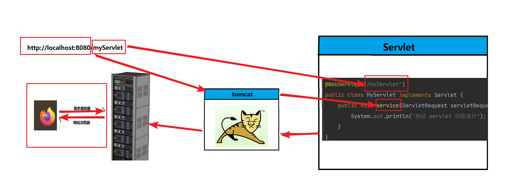

## 一、HTML

### 1、概述

- HTML 是用来写网页的语言，HyperText Markup Language 超文本标记语言。

  - 超文本：超越文本的限制，还可以去定义音频，视频，图片....

  - 标记语言：由标签构成 `<html></html>`

### 2、W3C

- W3C:W3C是万维网联盟,定义了网页由三部分组成

  - 结构：HTML 语言，基础框架

  - 表现：CSS 语言，控制界面的美观和排版

  - 行为：JavaScript 语言，相当于是方法可以去做一些跳转

### 3、标签

#### 3.1、基础标签

- 标题标签
- 段落标签
- 样式标签
- 加粗、斜体、下划线
- 换行标签

#### 3.2、图片标签

```html

```

#### 3.3、表格标签

```html
<table border=1>
    <caption>标题</caption>
    <tr>
        <th>表头1</td>
        <th>表头2</td>
    </tr>
    <tr>
        <td>col1</td>
        <td>col2</td>
    </tr>
</table>
```

#### 3.4、列表标签

1. 无序列表

   ```html
   <ul>
       <li>苹果</li>
       <li>西瓜</li>
   </ul>
   ```

2. 有序列表

   ```html
   <ol>
       <li>张三</li>
       <li>李四</li>
   </ol>
   ```

#### 3.5、布局标签

```html
<div>
    
</div>
```

#### 3.6、媒体标签

1. 音频

   ```html
   <audio src="音频路径" controls="controls"></audio>
   ```

2. 视频

   ```html
   <video src="视频路径" controls="controls"></video>
   ```

#### 3.7、表单标签

- form 属性
  - action：指定数据提交路径
  - method：get post
- input 属性
  - type：输入属性
    - text：文本
    - password：密文
    - radio：单选
    - checkbox：复选
  - value：默认值
  - readonly：只读
  - disabled：禁用
  - size：大小

```html
<form>
    账号 <input type="text" name="账号" value="admin"> <br>
    密码 <input type="password" name="密码" value="******"> <br>
    <input type="submit" value="登录">  <input type="submit" value="注册">
</form>
```

#### 3.8、超链接标签

```html
<a herf="https://www.baidu.com"></a>
```

#### 3.9、下拉框标签

```html
<select>
    <option value="price">价格优先</option>
    <option value="count">销量优先</option>
    <option value="good">好评优先</option>
</select>
```

#### 3.10、按钮标签

```html
<button type="button" onclick="alert('登录成功')">登录</button>
```

#### 3.11、文本域标签

```html
<textarea>

</textarea>
```

## 二、CSS

### 1、概述

- Cascading Style Sheets，层叠样式表
- 控制网页表现的一门语言；

### 2、快速开始

```html
<style>
    body{
        background: lightblue;
    }
</style>
```

### 3、语法


### 4、CSS 选择器

- 元素选择器：根据元素名称来选择 HTML 元素

- id 选择器：使用 HTML 元素的 id 属性来选择特定元素

  - id 唯一，不能以数字开头

    ```css
    #idName{
        color: red;
    }
    ```

- 类选择器：选择有特定 class 属性的 HTML 元素

  - className 不唯一

    ```css
    .className{
        color: red;
    }
    ```

  - 指定只有特定 HTML 元素会受影响：元素名称 .className

    ```css
    p.className{
        color: red;
    }
    ```

-  通用选择器

  ```css
  * {
      color: blue;
  }
  ```

### 5、CSS 导入

- 外部 CSS

  ```html
  <link rel="stylesheet" type="text/css" href="mystyle.css">
  ```

- 内部 CSS

  ```html
  <style>
  	body {
        background-color: linen;
      }
  
      h1 {
        color: maroon;
        margin-left: 40px;
      } 
  </style>
  ```

- 行内 CSS

  ```html
  <h1 style="color:blue;text-align:center;">一级标题</h1>
  <p style="color:red;">段落</p>
  ```

- 层叠顺序

  1. 行内样式
  2. 外部和内部样式表
  3. 浏览器默认

## 三、JavaScript

### 1、概述

- JavaScript 数据 HTML 和 Web 的编程语言；
- 控制页面动态变化

### 2、使用

#### 2.1、内部脚本

- head 中使用

  ```html
  <head>
      <script>
      </script>
  </head>
  ```

- body 中使用：可改善显示速度因为脚本编译会拖慢显示速度

  ```html
  <body>
      <script>
      </script>
  </body>
  ```

#### 2.2、外部脚本

- 把所有的 js 内容放在外部 js 文件中，在需要使用的地方引用

- 外部文件的扩展名 .js

- 已缓存的 js 文件可以加速页面加载

  ```html
  <script src="myscript.js"></script>
  ```

### 3、基本使用

#### 3.1 JS 输出

- 使用 `window.alert()` 写入警告框
- 使用 `document.write()` 写入 HTML 输出
- 使用 `innerHTML` 写入 HTML 元素
- 使用 `console.log()` 写入浏览器控制台

#### 3.2 JS 语句

- JS 语句构成：值、运算符、表达式、关键词和注释；
- 使用 ; 结尾

#### 3.3 JS 语法

- 变量：使用 var 修饰

- 运算符、字符串：和 Java 类似

- 标识符：由字母、数字、_、$ 符组成，数字不能是首字母；

- 注释：和 Java 一样

- let 关键字：改变变量的作用域

- const 关键字：Java 的 final

- 数据类型：

  - 数值
  - 字符串值
  - 数组
  - 对象
  - 空值 和 undefined 不是一回事
  - == 和 === 的区别

- 函数

  - 语法

    ```js
    function funName(param1, param2, ...){
        
    }
    ```

  - 可以有返回值，但是不用定义返回值类型，return

- 条件控制语句

  ```js
  if () {
      
  } else if () {
      
  } else {
      
  }
  ```

  ```js
  switch (表达式) {
      case n :
          代码块;
          break;
      case n:
          代码块;
          break;
      default:
          默认代码块;
  }
  ```

- 循环

  ```js
  for (语句 1; 语句 2; 语句 3) {
       // 要执行的代码块
  }
  
  for (key in object) {
    // code block to be executed
  }
  
  for (variable of iterable) {
    // code block to be executed
  }
  
  while (条件) {
      // 要执行的代码块
  }
  
  do {
      // 要执行的代码块
  }
  while (条件);
  ```


#### 3.4 常用对象

- 字符串

  - 长度使用 length 属性
  - == 和 === 的区别（前端面试题）


- 数组

  - 添加新元素使用 push() 方法
  - 删除元素：pop() 方法

- 对象

  ```js
  {key1: value; key2: value2;}
  ```

#### 3.5 HTML DOM

- 文档对象模型：**HTML DOM 是关于如何获取、更改、添加或删除 HTML 元素的标准**。

- DOM 规范

  - Document 文本对象
  - Element 元素对象
  - Text 文本对象

- DOM 方法

  - getElementById() 方法

  - innerHTML 属性

    


#### 3.6 BOM

- 浏览器对象模型（Browser Object Model (BOM)）允许 JavaScript 与浏览器对话

- 弹框方法：

  ```js
  // 警告框
  window.alert("sometext");
  // 确认框
  window.confirm("sometext");
  // 提示框
  window.prompt("sometext","defaultText");
  ```

#### 3.7 事件

- 常用事件
  - onClick：点击
  - onchange：改变
  - onmouseover：鼠标覆盖
  - onmouseout：鼠标离开

## 四、XML

### 1、概述

- 定义：
  - 可扩展标记语言（EXtensible Markup Language）；
  - XML 的设计宗旨是*传输数据*，而非显示数据；
  - XML 标签没有被预定义，需要自行定义标签；
- XML 和 HTML 的区别：
  - XML：被设计为传输和存储数据，其焦点是数据的内容
  - HTML：被设计用来显示数据，其焦点是数据的外观

### 2、XML 语法

- 语法规则：
  - 第一行：XML 的声明，包括版本号，文档的字符编码
  - 之后是自定义的 XML 标签

### 3、XML 组成

- 文档约束
- 标签
- 属性（官方建议：使用子标签代替）
- 文本

### 4、XML 命名规则

- 命名规则
  - 可以包含字母、数字、其他字符；
  - 不能以数字或其他标点符号开头；
  - 不能以 xml（ XML Xml） 开始；
  - 不能包含空格；
- 良好的命名：
  - 见名知意；
  - 简短
  - 避免使用 `- . :`
  - 尽量和数据库命名一致
- XML 标签对大小敏感
- 正确嵌套

### 5、XML 引用

- XML 中，5 个预定义的实体引用

  

### 6、XML 约束

#### 6.1 DTD 约束

- 编写 DTD 约束文件，后缀以 .dtd 结尾

  ```dtd
  <!ELEMENT note (to,from,heading,body)>
  <!ELEMENT to (#PCDATA)>
  <!ELEMENT from (#PCDATA)>
  <!ELEMENT heading (#PCDATA)>
  <!ELEMENT body (#PCDATA)>
  ```

  ```xml
  <?xml version="1.0" chatset="UTF_8"?>
  <!DOCTYPE note SYSTEM "node.dtd">
  <!-- 编写 xml -->
  ```

#### 6.2 Schema 约束

- 定义：XML Schema 的作用是定义 XML 文档的合法构建模块，类似 DTD

- 约束能力：

  - 定义可出现在文档中的元素
  - 定义可出现在文档中的属性
  - 定义哪个元素是子元素
  - 定义子元素的次序
  - 定义子元素的数目
  - 定义元素是否为空，或者是否可包含文本
  - 定义元素和属性的数据类型
  - 定义元素和属性的默认值以及固定值

- note.xsd

  ```xml
  <?xml version="1.0"?>
  <xs:schema xmlns:xs="http://www.w3.org/2001/XMLSchema"
  targetNamespace="http://www.w3school.com.cn"
  xmlns="http://www.w3school.com.cn"
  elementFormDefault="qualified">
  
  <xs:element name="note">
      <xs:complexType>
        <xs:sequence>
  	<xs:element name="to" type="xs:string"/>
  	<xs:element name="from" type="xs:string"/>
  	<xs:element name="heading" type="xs:string"/>
  	<xs:element name="body" type="xs:string"/>
        </xs:sequence>
      </xs:complexType>
  </xs:element>
  
  </xs:schema>
  ```

  ```xml
  <?xml version="1.0"?>
  <note
  xmlns="http://www.w3school.com.cn"
  xmlns:xsi="http://www.w3.org/2001/XMLSchema-instance"
  xsi:schemaLocation="note.xsd">
  
      <to>George</to>
      <from>John</from>
      <heading>Reminder</heading>
      <body>Don't forget the meeting!</body>
  </note>
  ```

### 3.7、XML 解析

- 方式
  - DOM
    - 将标记语言的文字一次性读进内存，在内存中形成一棵树
    - 优点：操作方便，可以增删改
    - 缺点：占内存
  - SAX
    - 逐行读取，基于事件驱动
    - 优点：不占内存
    - 缺点：只读，不能增删改
- 常见解析器：
  - JAXP：sun 公司提供；支持 DOM SAX
  - **DOM4J**：比较优秀
  - jsoup：HTML 解析器

### 3.8、XML 检索

- 使用 XPath
- Maven 导包 `jaxen`
- 方便检索，便于查找

## 五、JSON

### 1、JSON 概述

-  JavaScript Object Notation（JavaScript 对象标记法）

  ```js
  {
      name:"Bill Gates",
      age:62,
      city:"Seattle"
  }
  ```

- Java JSON 格式（key 有引号）

  ```json
  {
      "name":"Bill Gates",
      "age":62,
      "city":"Seattle"
  }
  ```

- 应用场景：数据载体

  - 传参
  - 接受参数

### 2、JSON 语法

- 语法规则：
  - 数据在名称/值对中
  - 数据由逗号分隔
  - 花括号容纳对象
  - 方括号容纳数组

### 2、JS 解析

- 字符串 --> JSON

  ```js
  let json = JSON.parse(str)
  ```

- JSON --> 字符串

  ```js
  let str = JSON.stringify(json)
  ```

### 3、JSON 和 Java 对象像话转换

- 通过 JSON 实现前后端交互：JSON 数据格式小，减少资源消耗；
- 后端：
  - 请求数据：json 字符串提交给后端处理
  - 响应数据：Java 对象转换成 json 字符串

### 4、FastJson 的使用

- Maven 导包

- Java 对象转 json

  ```java
  JSON.toJSONString(obj);
  ```

- json 转 Java 对象

  ```java
  JSON.parseObject(jsonStr, T.class);
  ```

## 六、Web概述

### 1、概述

- Web 是全球广域网，也称万维网（www），能够通过浏览器访问的网站；

### 2、Java Web

- 使用 Java 技术完成 web 网页技术栈；
- Java Web 技术栈
  - 静态资源（固定网页）
  - 动态资源（Java 动态生成，JS 动态获取）
  - 数据库（MySQL）
  - web 服务器（Tomcat）

### 3、B/S 架构

- Browser（浏览器） Server（服务器）
- 静态资源：
  - HTML、CSS、图片、视频、音频 ...
- 动态资源：
  - servlet、jsp，用来填充数据、处理逻辑
  - 处理流程：
    1. 查询数据库
    2. 根据业务逻辑处理数据
    3. 响应给静态资源，通过静态资源展示处理
- 数据库
  - MySQL
- HTTP 协议
  - TCP（常用）、UDP
- Web 服务器
  - 用来解析 HTTP 协议，处理请求数据，响应结果数据
  - 使用 Tomcat 服务器

### 4、HTTP

- HTTP：超文本传输协议，规定了 B/S 之间的数据传输规则
- 数据传输：请求数据请求后端服务器，服务器按照指定格式返回给浏览器

#### 4.1 HTTP 特点

- 基于 TCP （面向连接，三次握手）
- 基于请求、响应模型的（一次请求对应一次响应，一一对应的关系）
- HTTP 是无状态的，没有去存储响应数据，响应的数据是独立的
  - 优点：速度快
  - 缺点：上一次请求和下一次请求的数据不能共享

#### 4.2、请求数据格式

- 请求行
  - 请求方式有7种最常用：get post delete put
- 请求头
  - host: 表示请求的服务器地址
  - accept:表示浏览器能接受的资源类型 application/json,text/plain 
  - token：自定义的token
  - User-agent: 浏览器的版本信息
- 请求体
  - 如果是 GET请求或者 DELETE 请求，请求体放置到请求行位置
  - POST 放置到请求体中
  - GET请求参数大小是有限制的，POST 没有大小限制

#### 4.3、响应数据格式

- 响应行

  - 状态码：200、404、5xx
  - 版本：HTTP/1.1

- 响应头

  

- 响应体

  - 提供数据给前端进行数据展示

#### 4.4、状态码

| 状态码分类 | 说明                                                         |
| ---------- | ------------------------------------------------------------ |
| 1xx        | **响应中**——临时状态码，表示请求已经接受，告诉客户端应该继续请求或者如果它已经完成则忽略它 |
| 2xx        | **成功**——表示请求已经被成功接收，处理已完成                 |
| 3xx        | **重定向**——重定向到其它地方：它让客户端再发起一个请求以完成整个处理。 |
| 4xx        | **客户端错误**——处理发生错误，责任在客户端，如：客户端的请求一个不存在的资源，客户端未被授权，禁止访问等 |
| 5xx        | **服务器端错误**——处理发生错误，责任在服务端，如：服务端抛出异常，路由出错，HTTP版本不支持等 |

| 状态码 | 英文描述                               | 解释                                                         |
| ------ | -------------------------------------- | ------------------------------------------------------------ |
| 200    | **`OK`**                               | 客户端请求成功，即**处理成功**，这是我们最想看到的状态码     |
| 302    | **`Found`**                            | 指示所请求的资源已移动到由`Location`响应头给定的 URL，浏览器会自动重新访问到这个页面 |
| 304    | **`Not Modified`**                     | 告诉客户端，你请求的资源至上次取得后，服务端并未更改，你直接用你本地缓存吧。隐式重定向 |
| 400    | **`Bad Request`**                      | 客户端请求有**语法错误**，不能被服务器所理解                 |
| 403    | **`Forbidden`**                        | 服务器收到请求，但是**拒绝提供服务**，比如：没有权限访问相关资源 |
| 404    | **`Not Found`**                        | **请求资源不存在**，一般是URL输入有误，或者网站资源被删除了  |
| 428    | **`Precondition Required`**            | **服务器要求有条件的请求**，告诉客户端要想访问该资源，必须携带特定的请求头 |
| 429    | **`Too Many Requests`**                | **太多请求**，可以限制客户端请求某个资源的数量，配合 Retry-After(多长时间后可以请求)响应头一起使用 |
| 431    | **` Request Header Fields Too Large`** | **请求头太大**，服务器不愿意处理请求，因为它的头部字段太大。请求可以在减少请求头域的大小后重新提交。 |
| 405    | **`Method Not Allowed`**               | 请求方式有误，比如应该用GET请求方式的资源，用了POST          |
| 500    | **`Internal Server Error`**            | **服务器发生不可预期的错误**。服务器出异常了，赶紧看日志去吧 |
| 503    | **`Service Unavailable`**              | **服务器尚未准备好处理请求**，服务器刚刚启动，还未初始化好   |
| 511    | **`Network Authentication Required`**  | **客户端需要进行身份验证才能获得网络访问权限**               |

### 5、Tomcat

- web 服务器：是一个应用程序（**tomcat**）,是对 http 进行封装，能够简化程序员的开发，能够提供网上信息的交互和浏览。

- 访问项目服务器的流程

  - 编写前端静态页面，以及后端服务代码
  - 部署 web 服务器（tomcat）
  - 将编写好的静态页面部署到 web 服务器上

- tomcat 是免费的，是 apache 基金会下的

- JavaEE：Java 企业版

- 常见问题 —— 乱码问题：

  conf 目录下的 logging.properties

  ```properties
  java.util.logging.ConsoleHandler.encoding = UTF-8
  
  # 修改为
  java.util.logging.ConsoleHandler.encoding = GBK
  ```

- 常见问题 —— 修改端口

  conf server.xml

  ```xml
  <Connector port="8080" protocol="HTTP/1.1"
                 connectionTimeout="20000"
                 redirectPort="8443"
                 maxParameterCount="1000"
                 />
  ```

## 七、Servlet

### 1、概述

- Java Servlet 是运行在 Web 服务器或应用服务器上的程序，它是作为来自 Web 浏览器或其他 HTTP 客户端的请求和 HTTP 服务器上的数据库或应用程序之间的中间层。

- Servlet 架构

  

- Servlet :是 JavaEE 的规范（接口）；

### 2、快速入门

1. 导包

   ```xml
   <dependency>
       <groupId>javax.servlet</groupId>
       <artifactId>javax.servlet-api</artifactId>
       <version>3.1.0</version>
       <!-- 编译和测试有效，避免运行，和 Tomcat 自己的 Servlet 冲突-->
       <scope>provided</scope>
   </dependency>
   ```

2. 实现 Servlet 接口，使用注解配置 Servlet（还可以使用 web.xml 手动配置）

   ```java
   @WebServlet("/myServlet")
   public class MyServlet implements Servlet {
       public void init(ServletConfig servletConfig) throws ServletException {
   
       }
   
       public ServletConfig getServletConfig() {
           return null;
       }
   
       /**
        * 重写该方法
        *
        * @param servletRequest
        * @param servletResponse
        * @throws ServletException
        * @throws IOException
        */
       public void service(ServletRequest servletRequest, ServletResponse servletResponse) throws ServletException, IOException {
           System.out.println("测试 MyServlet");
   
       }
   
       public String getServletInfo() {
           return null;
       }
   
       public void destroy() {
   
       }
   }
   ```

3. 访问 servlet

   ```shell
   http://localhost:8080/myServlet
   ```

### 3、执行流程



- 浏览器发起 `http://localhost:8080/myServlet` 请求
  - `http://localhost:8080`：需要访问的服务器（Tomcat）
  - `myServlet`：使用 WebServlet 注解命名的类
- 找到 servlet 之后：
  - Tomcat 会为 MyServlet 创建一个对象，调用 service 方法，即子类实现的 service 方法
  - service 方法的两个参数
    - ServletRequest：封装了请求数据
    - ServletResponse：封装了响应数据
- 面试拓展：
  - Servlet 是谁创建的？Tomcat 服务器
  - 为什么一定能调用 service 方法？继承 servlet 接口，必须实现 service 方法，通过多态调用子类实现的 service 方法

### 4、Servlet 生命周期（面试可能会问）

- 创建

  - 第一次访问 Servlet 时，服务器调用 init 创建 Servlet，只创建一次（使用懒加载机制）

    - 优点：节约内存

    - 缺点：用户体验不好

    - loadOnStartup 非负时，容器启动时加载

      ```java
      @WebServlet(urlPatterns = "/myServlet", loadOnStartup = 0)
      ```

- 业务逻辑

  - service 方法处理业务逻辑；

- 销毁

  - 关闭服务或者手动调用 destroy 方法时，垃圾回收期会不定时回收 Servlet 对象；

### 5、Servlet 体系结构


- 继承 HttpServlet 

  - 单独重写想要实现的方法

    ```java
    @WebServlet(urlPatterns = "/myServletExtends")
    public class MyServletExtends extends HttpServlet {
        @Override
        protected void doGet(HttpServletRequest req, HttpServletResponse resp) throws ServletException, IOException {
            System.out.println("----------------访问 GET 请求------------------");
        }
    }
    ```

  - HttpServlet 中的 service 方法

    ```java
    protected void service(HttpServletRequest req, HttpServletResponse resp) throws ServletException, IOException {
            String method = req.getMethod();
            long lastModified;
            if (method.equals("GET")) {
                lastModified = this.getLastModified(req);
                if (lastModified == -1L) {
                    this.doGet(req, resp);
                } else {
                    long ifModifiedSince = req.getDateHeader("If-Modified-Since");
                    if (ifModifiedSince < lastModified) {
                        this.maybeSetLastModified(resp, lastModified);
                        this.doGet(req, resp);
                    } else {
                        resp.setStatus(304);
                    }
                }
            } else if (method.equals("HEAD")) {
                lastModified = this.getLastModified(req);
                this.maybeSetLastModified(resp, lastModified);
                this.doHead(req, resp);
            } else if (method.equals("POST")) {
                this.doPost(req, resp);
            } else if (method.equals("PUT")) {
                this.doPut(req, resp);
            } else if (method.equals("DELETE")) {
                this.doDelete(req, resp);
            } else if (method.equals("OPTIONS")) {
                this.doOptions(req, resp);
            } else if (method.equals("TRACE")) {
                this.doTrace(req, resp);
            } else {
                String errMsg = lStrings.getString("http.method_not_implemented");
                Object[] errArgs = new Object[]{method};
                errMsg = MessageFormat.format(errMsg, errArgs);
                resp.sendError(501, errMsg);
            }
    
        }
    ```

### 6、urlPattern 配置

- 想要访问 Servlet ，就需要配置访问路径，使用 `/` 开头
- 配置规则
  - 精确配置：/myServlet
  - 模糊配置：/*
  - 扩展名配置：/my.do
- 建议使用精确配置；优先级：精确配置 > 扩展名配置 > 模糊配置

### 7、XML 配置

```xml
<servlet>
    <servlet-name>xmlServlet</servlet-name>
    <servlet-class>org.taiyi.servlet.XmlServlet</servlet-class>
</servlet>
<servlet-mapping>
    <servlet-name>xmlServlet</servlet-name>
    <url-pattern>/xmlServlet</url-pattern>
</servlet-mapping>
```

## 八、Request 和 Response

### 1、概述

- Request：获取请求数据
  - 请求行、请求头、请求体
  - Tomcat 会把请求数据解析，存储到 Request 对象中，直接从 Servlet 对象中取
- Response：响应数据
  - 响应行、响应头、响应体
  - 业务的封装数据设置到响应数据包中
  - 封装数据进 Response 中，Tomcat 会把封装数据解析成特定格式返回给浏览器

### 2、登录案例

```java
@WebServlet("/login")
public class LoginServlet extends HttpServlet {
    @Override
    protected void doPost(HttpServletRequest req, HttpServletResponse resp) throws ServletException, IOException {
        System.out.println("login");
        String res = "";
        String username = req.getParameter("username");
        String password = req.getParameter("password");
        if ("taiyi".equals(username) && "123456".equals(password)) {
            res = "<h1>登录成功</h1>";
        } else {
            res = "<h1>账号或密码不正确，请重新登陆！</h1>";
        }
        // 响应回前端
        resp.setContentType("text/html");
        resp.setCharacterEncoding("utf-8");
        resp.getWriter().write(res);
    }
}
```

### 3、Request

#### 3.1 Request 继承体系


- ServletRequest 接口规范
-  HttpServletRequest 封装 http 协议
- HttpServletRequestWrapper：提供具体的实现

#### 3.2 Request 获取请求数据

- 获取请求头

  ```java
  @Override
  protected void doGet(HttpServletRequest req, HttpServletResponse resp) throws ServletException, IOException {
      String accept = req.getHeader("Accept");
      System.out.println(accept);
  }
  ```

- 获取请求行

  - 获取请求方法

  - 获取请求路径（项目访问路径）

  - 获取 URL （统一资源定位符）

  - 获取 URI （统一资源标识符）

  - 获取 GET 的请求参数

  - 代码

    ```java
    String method = req.getMethod();
    System.out.println(method);     // GET
    
    String contextPath = req.getContextPath();
    System.out.println(contextPath);
    
    StringBuffer requestURL = req.getRequestURL();
    System.out.println(requestURL);     // http://localhost:8080/request
    
    String requestURI = req.getRequestURI();
    System.out.println(requestURI);     // /request
    
    String queryString = req.getQueryString();
    System.out.println(queryString);    // username=sy
    ```

- 获取请求体

  - 注意：GET 方法没有请求体，POST 、PUT等方法有

  - 代码

    ```java
    @Override
    protected void doPost(HttpServletRequest req, HttpServletResponse resp) throws ServletException, IOException {
        /*
    	获取请求体
    	*/
        System.out.println("=========================================");
        BufferedReader reader = req.getReader();
        String s = reader.readLine();
        System.out.println(s);
    }
    ```

    ```java
    @Override
    protected void doPost(HttpServletRequest req, HttpServletResponse resp) throws ServletException, IOException {
        /*
    	获取请求体
    	*/
        ServletInputStream inputStream = req.getInputStream();
        byte[] buffer = new byte[1024];
        int len = 0;
        while ((len = inputStream.read(buffer)) != -1) {
            System.out.println(new String(buffer, 0, len));
        }
        inputStream.close();
    }
    ```

- 获取请求参数

  - GET 请求，请求参数在 **请求行** 中；POST 请求，请求参数在 **请求体** 中；

  - GET：`req.getQueryString()`

  - POST：`req.getInputStream()` `req.getReader()`

  - 获取所有参数的 Map 集合

    ```java
    Map<String, String[]> getParameterMap();
    ```

  - 获取单个参数

    ```java
    String getParameter(String name);
    ```

  - 请求参数乱码问题（Tomcat7）

    - 获取参数之前设置编码格式：`req.setCharacterEncoding("UFT-8");`

#### 3.3 请求转发

- 请求转发（forward）：在服务器内部做资源跳转；

- 实现方式

  ```java
  // class: ServletRequest
  RequestDispatcher getRequestDispatcher(String path);
  ```

  ```java
  // class: RequestDispatcher
  void forward(ServletRequest var1, ServletResponse var2) throws ServletException, IOException;
  ```

- 案例

  ```java
  @WebServlet("/hello")
  public class RequestHello extends HttpServlet {
      @Override
      protected void doGet(HttpServletRequest req, HttpServletResponse resp) throws ServletException, IOException {
          System.out.println("hello begin");
          req.getRequestDispatcher("/word").forward(req, resp);
          System.out.println("hello end");
      }
  }
  ```

  ```java
  @WebServlet("/word")
  public class RequestWord extends HttpServlet {
      @Override
      protected void doGet(HttpServletRequest req, HttpServletResponse resp) throws ServletException, IOException {
          System.out.println("word print");
      }
  }
  ```

- 数据共享问题

  ```java
  // class: ServletRequest
  Object getAttribute(String var1);
  void setAttribute(String var1, Object var2);
  void removeAttribute(String var1);
  ```

- 特点（面试可能会问）

  - 浏览器地址不变
  - 只能内部服务器之间转发
  - 只发起一次请求

### 4、Response

#### 4.1 Response 集成结构


- ServletResponse 接口规范
- HttpServletResponse 封装 http 协议
- HttpServletResponseWrapper：提供具体的实现

#### 4.2 Response 响应数据

- 设置响应头

  ```java
  @WebServlet("/response")
  public class ResponseServlet extends HttpServlet {
      @Override
      protected void doGet(HttpServletRequest req, HttpServletResponse resp) throws ServletException, IOException {
          resp.addHeader("user", "taiyi");
      }
  }
  ```

- 设置响应行

  ```java
  @WebServlet("/response")
  public class ResponseServlet extends HttpServlet {
      @Override
      protected void doGet(HttpServletRequest req, HttpServletResponse resp) throws ServletException, IOException {
          resp.setStatus(500);
      }
  }
  ```

- 设置响应体

  ```java
  // class: ServletResponse
  ServletOutputStream getOutputStream() throws IOException;
  PrintWriter getWriter() throws IOException;
  ```

#### 4.3 重定向

```java
// class: HttpServletResponse
void sendRedirect(String var1) throws IOException;
```

- 跨域访问与不跨域访问

  ```java
  @WebServlet("/redirect")
  public class RedirectServlet extends HttpServlet {
      @Override
      protected void doGet(HttpServletRequest req, HttpServletResponse resp) throws ServletException, IOException {
          System.out.println("公司内部处理不了，需要重定向");
          // 重定向
          //resp.sendRedirect("https://www.baidu.com");   // 跨域
          resp.sendRedirect("/login");    //  不跨域
      }
  }
  ```

- 重定向的特点

  - 浏览器地址栏变化
  - 可以重定向任何位置
  - 两次请求

### 5、重定向和请求转发的区别（面试）

| 重定向             | 请求转发             |
| ------------------ | -------------------- |
| 浏览器地址变化     | 不变                 |
| 可以重定向任何位置 | 只能在当前服务器内部 |
| 两次请求           | 一次请求             |
| 资源不共享         | 资源共享             |

### 6、模拟实战：登录和注册


## 九、JSP

### 1、概述

- Java Server Pages：是一种动态网页开发技术；
- JSP = 静态网页 + Java 动态展示；
- 思考？
  - 与纯 Servlet 相比：JSP可以很方便的编写或者修改HTML网页而不用去面对大量的println语句。
  - 与JavaScript相比：虽然JavaScript可以在客户端动态生成HTML，但是很难与服务器交互，因此不能提供复杂的服务，比如访问数据库和图像处理等等。
  - 与静态HTML相比：静态HTML不包含动态信息。

### 2、简单使用

```jsp
<%--解决乱码问题--%>
<%@ page contentType="text/html;charset=UTF-8" language="java" %>
<html>
<head>
    <title>Java Web</title>
</head>
<body>

<h1>欢迎学习 JavaWeb</h1>
<%
    System.out.println("==================");
%>

</body>
</html>
```

### 3、JSP 原理

- JSP是一种 **Java servlet** ，主要用于实现 Java Web 应用程序的用户界面部分。网页开发者们通过结合HTML代码、XHTML代码、XML元素以及嵌入JSP操作和命令来编写JSP
- HttpJspBase 继承自 HttpServlet
- Tomcat 将 jsp 编译成 servlet

### 4、JSP 语法

#### 4.1 脚本程序

- 脚本内容直接放到 _jspService

  ```jsp
  <% 代码片段 %>
  
  <jsp:scriptlet>
     代码片段
  </jsp:scriptlet>
  ```

- 脚本内容直接放到 servlet 类里面

  ```jsp
  <%! declaration; [ declaration; ]+ ... %>
  ```

- 内容放在打印中去

  ```jsp
  <%= 表达式 %>
  ```


#### 4.2 JSP 注释


#### 4.3 JSP 指令


#### 4.4 JSP 隐含对象


#### 4.5 JSP 问题

- 编写、阅读不方便
- 调试不方便

### 5、EL 表达式

- 概述：Expression Language，用户简化 JSP 页面内的 Java 代码；

- EL 表达式是用来获取数据的；

- 语法：

  ```jsp
  ${表达式}
  ```

- 默认 el 表达式已经被禁用了，需要使用需要手动开启

- 域对象

  - page:页面实例的引用,当前页面

  - request对象:代表这个请求，表示请求

  - session对象：跟踪在各个客户端请求间的会话，表示会话

  - application对象：当前的程序中

    

### 6、JSTL 标签

- JSP标准标签库（JSTL）是一个JSP标签集合，它封装了JSP应用的通用核心功能

## 十、MVC 模式

- MVC 是一种分层开发的思想

  - M：Model 数据模型
  - V：View,视图页面
  - C：Ctroller,控制器，处理器

- 意义：职责单一，低耦合，方便后期迭代升级

  

## 十一、三层架构

- 三层架构是将我们的项目分成了三个层面，分别是 表现层 、 业务逻辑层 、 数据访问层

  

  - **db**:存储数据的
  - **dao**:操作数据库的
  - **service**:处理逻辑业务的
  - **controller**:处理请求，响应数据

- 意义：职责单一，方便迭代升级，方便后期开发维护

## 十二、会话

### 1、概述

- 会话：访问浏览器，访问 Web 服务器的资源，建立会话，直到有一方断开连接，会话结束。

- 注意：
  - 在同一会话中，可以包含多次请求；
  - 同一窗口发起多次请求，产生多次响应是同一会话；
  - 不同浏览器之间是不同会话；


### 2、会话跟踪

- 会话跟踪：为了共享数据，保证用户访问的时候不会出现紊乱

- 实际应用：

  - 获取用户登录信息；
  - 用户在做操作的时候，可以去填写操作人信息；
  - 记住当前密码信息，下次进入网站不需要再去输入账号密码；
- 会话跟踪技术的实现方式：
  - 客户端技术：Cookie
  - 服务端技术：Session

## 十三、Cookie

### 1、概述

- Cookie:是客户端技术，可以将数据存储到客户端，然后每次请求访问的时候，都会携带 Cookie 数据访问

### 2、基本使用

- 创建 Cookie 对象

  ```java
  Cookie cookie = new Cookie(String name, String value);
  ```

- 响应 Cookie 给客户端

  ```java
  // class: HttpServletResponse
  void addCookie(Cookie cookie);
  ```

- 获取 Cookie

  ```java
  // class: 获取 Cookie
  Cookie[] getCookies();
  ```

- Cookie 常用方法

  ```java
  public String getName();
  public String getValue();
  ```

### 3、Cookie 原理


- 请求 RespServlet，添加了 Cookie 响应数据（username：sy），响应给浏览器；
- Tomcat 设置响应头：Set-Cookie：(username=taiyi)；
- 得到 Cookie 值之后，浏览器会将数据存储到 Cookie 中；
- 第二次发起请求的时候，从缓存文件中获取到 Cookie 值，在请求头中设置 Cookie 值：Cookie: (username=taiyi)；
- Server 可以通过 getCookies 方法获取所有的 Cookie 值

### 4、Cookie 使用

#### 4.1 Cookie 有效期设置

- 新打开的浏览器窗口不能使用之前存储的 Cookie；

- 记住密码的功能有时间限制，如何设置 Cookie 的存活时间？

  ```java
  // class: Cookie
  public void setMaxAge(int expiry);		// 设置0：删除 Cookie，负数：关闭浏览器就没，正数：过期时间，到期就没
  ```

#### 4.2 Cookie 存储中文乱码问题

```java
URLEncoder.encode(str, "UFT-8");
URLDecoder.decode(str, "UTF-8");
```

## 十四、Session

### 1、概述

- Session：服务端会话跟踪技术，将数据保存到服务端；
- Session 和 Cookie 的区别：
  - Cookie 保存到 Client，容易被钓鱼网站拿过去用，有安全隐患；
  - Session 保存到 Server，相对安全；
- 可以实现数据共享（存储会话请求的 Session，每一次请求都可以调用（没有过期））；

### 2、基本使用

- 获取 Session 对象（如果第一次请求没有，就创建一个）

  ```java
  // class: HttpServletRequest
  HttpSession getSession();
  ```

- 共享数据

  ```java
  // class: HttpSession
  void setAttribute(String var1, Object var2);
  Object getAttribute(String var1);
  void removeAttribute(String var1);
  ```

### 3、Session 原理

- Session 是基于 Cookie 实现的；


1. 请求 ReqServlet ，会得到一个 Cookie （JSEEIONID=1）；
2. 生成一次会话 Session 存储到服务端；
3. 再次请求 RespServlet 的时候，会携带上 JSSIONID=1 找到 Session 对象；

- 问题：如何通过 JSESSIONID 找到 Session 对象？
  - 第一次请求，浏览器获得 JSESSIONID 存储到 Cookie 中；
  - 第二次请求时就会携带 Cookie，其中存储着 JSESSIONID；
  - 如果这个时候手动修改浏览器存储在 Cookie 中的 JSESSIONID 的值，服务端就拿不到 Session 对象；

### 4、Session 使用

#### 4.1 Session 的钝化与活化

- Session 使用中可能存在的问题：
  - 第一次请求获取到的 Session 存储到服务器中；
  - 服务器重启；
  - 第二次请求时，Session 不存在了（影响用户体验）；
- 钝化与活化的目的：为了存储 Session ，保证正常关闭下正常启启动时，同一会话有效；
- 钝化：服务器正常关闭时，Tomcat 会把 session 数据写入硬盘 work 目录下（sessions.ser）
- 活化：服务器启动时，Tomcat 读取 sessions.ser 中的数据，并删除该文件（避免磁盘空间浪费）；

#### 4.2 Session 销毁

- 自动销毁

  - 默认情况下无操作30分钟；

  - 修改 web.xml 配置文件

    ```xml
    <web-app>
        <display-name>Archetype Created Web Application</display-name>
    
        <session-config>
            <session-timeout>30</session-timeout>
        </session-config>
    </web-app>
    ```

- 手动销毁

  ```java
  session.invalidate();
  ```

### 5、总结

- Cookie 与 Session 的作用：用来在会话中作共享数据、存储数据；

| 不同点         | Cookie                   | Session        |
| -------------- | ------------------------ | -------------- |
| 存储位置       | Client                   | Server         |
| 存储时间       | setMaxAge() 可以长期存储 | 默认 30 分钟   |
| 存储数据大小   | 最大 3KB                 | 无限制         |
| 安全           | 不安全                   | 安全           |
| 服务器性能影响 | 不占用服务器资源         | 占用服务器资源 |

| 应用场景 | Cookie | Session |
| -------- | ------ | ------- |
| 记住密码 | √      |         |
| 验证码   |        | √       |
| 登录名称 |        | √       |
| 购物车   | √      |         |

## 十五、Filter

### 1、Filter 概述

- Web 三大组件：Servlet、Filter、Listener
- File 是过滤器：可以把请求或者响应资源拦截下来

### 2、快速入门

```java
@WebFilter("/*")
public class FirstFilter implements Filter {
    @Override
    public void init(FilterConfig filterConfig) throws ServletException {

    }

    @Override
    public void doFilter(ServletRequest req, ServletResponse resp, FilterChain filterChain) throws IOException, ServletException {
        String username = req.getParameter("username");
        System.out.println(username);
        // 放行
        filterChain.doFilter(req, resp);
    }

    @Override
    public void destroy() {

    }
}
```

### 3、Filter 执行流程

- Filter 放行后访问资源，访问完成后有返回给 Filter

### 4、Filter 拦截路径

- 拦截路径：表示需要拦截的资源
- 使用注解配置：`@WebFilter("")`
- 配置如下：
  - 拦截具体资源：/login
  - 拦截所有资源：/*
  - 拦截后缀名：*.do，\*.action
  - 拦截目录名：/目录/*

### 5、过滤器链

- 先进后出原则
- 注意：具体的拦截优先级大于模糊拦截优先级

## 十六、Listener

### 1、概述

- Listener：监听器，监听 application（ServletContext）、session、request 等对象的创建、销毁，元素的添加、删除是可以执行的功能组件；

### 2、分类


- 学习 ServletContextListener

  ```java
  void contextInitialized(ServletContextEvent var1);
  
  void contextDestroyed(ServletContextEvent var1);
  ```


## 十七、Ajax

### 1、Ajax 概述

- Ajax（Asynchronous JavaScript And XML）：可以发送异步请求

- 官网学习

  

- 作用：

  - 发起异步请求，部分数据更新；
  - 请求服务器获取服务器数据；

### 2、同步请求和一步请求


### 3、Ajax 封装 —— axios

- 概述：Axios 是一个基于 *[promise](https://javascript.info/promise-basics)* 网络请求库，作用于[`node.js`](https://nodejs.org/) 和浏览器中。 它是 *[isomorphic](https://www.lullabot.com/articles/what-is-an-isomorphic-application)* 的(即同一套代码可以运行在浏览器和node.js中)。在服务端它使用原生 node.js `http` 模块, 而在客户端 (浏览端) 则使用 XMLHttpRequests

## 十八、Vue

### 1、Vue 概述

- 官网学习；

- Vue 是一款用于构建用户界面的 JavaScript 框架；

  

- Vue 使用数据的双向绑定

### 2、快速开始

- 引入 vue.js 文件

  ```html
  <script src="https://unpkg.com/vue@3/dist/vue.global.js"></script>
  ```

- 编写视图

  ```html
  <div id="app">
      {{message}}
  </div>
  ```

- 编写 JS 实现数据绑定

  ```html
  <script>
      var app = new Vue({
          el: '#app',
          data: {
              message: "Hello Vue"
          }
      })
  </script>
  ```

- 完整代码

  ```html
  <!DOCTYPE html>
  <html lang="en">
  <head>
      <meta charset="UTF-8">
      <title>快速开始</title>
      <script src="https://cdn.jsdelivr.net/npm/vue/dist/vue.js"></script>
  </head>
  <body>
  
  <div id="app">
      {{message}}
  </div>
  
  <script>
      var app = new Vue({
          el: '#app',
          data: {
              message: "Hello Vue"
          }
      })
  </script>
  </body>
  </html>
  ```

### 3、Vue 实例

#### 3.1 创建 Vue 实例

```js
var app = new Vue({
    // 选项
    // el: Vue 实例使用的根 DOM 元素 
    // data: 数据
})
```


#### 3.2 生命周期


- 注意：只需要关注 mounted 挂载完成部分就可以
  - 发送异步数据请求就可以实现数据的绑定

### 4、模板语法

#### 4.1 插值

- 文本：双大括号实现文本的插值

  ```vue
  <span>Message: {{ msg }}</span>
  ```

  - v-once指令：一次性插值


#### 4.2 指令

- v-bind 指令：实现 Class 和 Style 的绑定

  ```vue
  <div id="app">
      <a v-bind:href="url"> 点击我 </a>
  </div>
  ```

- v-model 指令：表单输入绑定，在 `<input>` `<textarea>` `<select>` 元素上创建数据双向绑定

  ```vue
  <div id="app">
      {{message}}<br>
  
      <a v-bind:href="url"> 点击我 </a><br>
  
      <input v-model="url" placeholder="在修改数据">
  </div>
  ```

  

#### 4.3 条件渲染

- v-if

- v-else-if

- v-else

- 案例

  ```vue
  <div id="app">
      <span v-if="number == 1">星期一</span>
      <span v-else-if="number == 2">星期二</span>
      <span v-else-if="number == 3">星期三</span>
      <span v-else-if="number == 4">星期四</span>
      <span v-else-if="number == 5">星期五</span>
      <span v-else-if="number == 6">星期六</span>
      <span v-else>星期日</span><br>
      <input v-model="number">
  </div>
  ```

- v-show：修改 style 控制是否隐藏

#### 4.4 列表渲染

- v-for

- 案例

  ```vue
  <div>
      <ul>
          <li v-for="item in items" :key="item.course">
              {{item.course}}
          </li>
      </ul>
  </div>
  ```

#### 4.5 事件处理

- v-on

- 案例

  ```vue
  <div id="app">
      <button v-on:click="counter += 1"> +1</button>
      <button v-on:click="add"> 点击方法</button>
      <p>count: {{counter}}</p>
  </div>
  
  <script>
      var app = new Vue({
          el: '#app',
          data: {
              counter: 0
          },
          methods: {
              add: function () {
                  this.counter += 1;
              }
          }
      })
  </script>
  ```

#### 4.6 常用指令

| **指令**  | **作用**                                            |
| --------- | --------------------------------------------------- |
| v-bind    | 为HTML标签绑定属性值，如设置  href , css样式等      |
| v-model   | 在表单元素上创建双向数据绑定                        |
| v-on      | 为HTML标签绑定事件                                  |
| v-if      | 条件性的渲染某元素，判定为true时渲染,否则不渲染     |
| v-else    | 条件性渲染某元素 执行 else语句                      |
| v-else-if | 条件性渲染某元素 执行 else if语句 判断              |
| v-show    | 根据条件展示某元素，区别在于切换的是display属性的值 |
| v-for     | 列表渲染，遍历容器的元素或者对象的属性              |

## 十九、Element

### 1、概述

- 官网学习
- 饿了么公司前端基于 Vue 开发出来的一套组件库；

### 2、快速使用

- 引入 JS 和 CSS

  ```html
  <script src="../js/vue.js"></script>
  <script src="../element-ui/lib/index.js"></script>
  <link rel="stylesheet" href="../element-ui/lib/theme-chalk/index.css">
  ```

- 创建 Vue 实例

  ```html
  <body>
  <div id="app">
      <template>
          <el-table
                  :data="tableData"
                  style="width: 100%">
              <el-table-column
                      prop="date"
                      label="日期"
                      width="180">
              </el-table-column>
              <el-table-column
                      prop="name"
                      label="姓名"
                      width="180">
              </el-table-column>
              <el-table-column
                      prop="address"
                      label="地址">
              </el-table-column>
          </el-table>
      </template>
  
  </div>
  
  <script>
      new Vue({
          el: "#app",
          data: {
              tableData: [{
                  date: '2016-05-02',
                  name: '王小虎',
                  address: '上海市普陀区金沙江路 1518 弄'
              }, {
                  date: '2016-05-04',
                  name: '王小虎',
                  address: '上海市普陀区金沙江路 1517 弄'
              }, {
                  date: '2016-05-01',
                  name: '王小虎',
                  address: '上海市普陀区金沙江路 1519 弄'
              }, {
                  date: '2016-05-03',
                  name: '王小虎',
                  address: '上海市普陀区金沙江路 1516 弄'
              }]
          },
          methods: {}
      })
  </script>
  </body>
  ```

  

### 3、组件

- 表格
  - 斑马条纹、带颜色
  - 待复选带
- 分页
- 对话框：dialog
- 按钮
- 单选框
- 多选框
- 输入框

### 4、布局

- Layout：将画布平分成 24 块
- Container：容器布局
