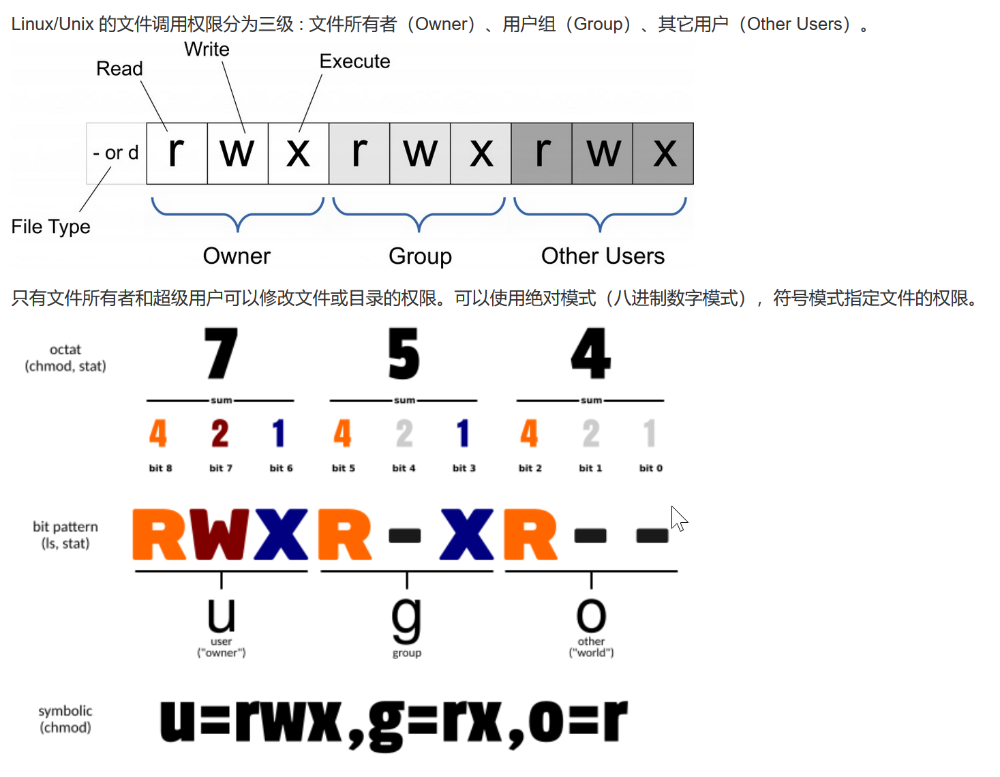
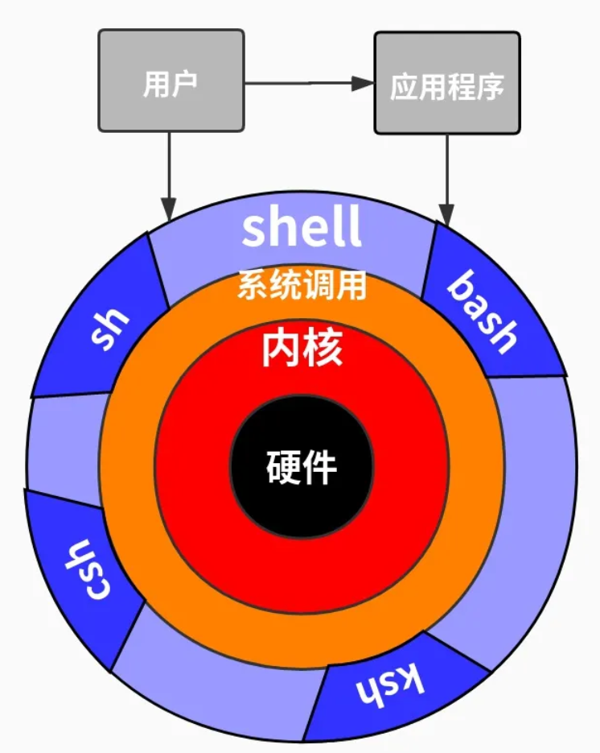

## 一、Linux 概述

### 1、概述

- **Linux：**是基于Unix的一个**开源、免费**的操作系统，其**稳定性、安全性、处理多并发**能力强，目前大多数企业级应用甚至是集群项目都部署运行在linux操作系统之上，在我国软件公司得到广泛的使用
- **Unix：**是一个强大的多用户、多任务操作系统。于1969年在AT&T的贝尔实验室开发。UNIX的商标权由国际开放标准组织（The Open Group）所拥有。UNIX操作系统是商业版，需要收费，价格比 Windows 正版要贵一些 

### 2、Linux 发行版


### 3、Linux 应用

- 可以做为服务器部署 JavaWeb 项目
- 桌面应用系统
- 数据库服务器
- 路由器、DNS

## 二、Linux 目录结构

### 1、Linux 的文件系统

- 是采用层级式的树状目录结构，在此结构中，最上层的是根目录 `/` ，然后再此目录下再创建其他目录

### 2、目录结构详解 

| 目录  | 缩写                  | 用途                                       |
| ----- | --------------------- | ------------------------------------------ |
| bin   | binaryies             | 用来存放二进制的可执行文件（cd ls mv ...） |
| sbin  | super user binaries   | 存放二进制可执行文件，只有 root 才能访问   |
| dev   | devices               | 存放设备文件                               |
| home  |                       | 存放用户文件的根目录                       |
| mnt   | mount                 | 系统超级管理员安装临时文件                 |
| tmp   | temporary             | 临时文件存放点                             |
| usr   | unix shared resources | 存放共享文件资源                           |
| boot  |                       | 存放用于系统引导使用的文件                 |
| etc   | etcetera              | 系统配置文件存放点                         |
| root  |                       | 系统管理员的用户主目录                     |
| lib   | library               | 共享库                                     |
| srv   | service               | 存放服务启动需要存储的数据                 |
| prov  |                       | 系统内存映射，虚拟目录                     |
| sys   |                       |                                            |
| opt   |                       | 额外安装软件的存放目录                     |
| var   |                       | 存放不断增所的文件，如日志文件             |
| run   |                       | 系统运行所需文件                           |
| media |                       | U盘、光盘的临时目录                        |

## 三、系统管理

### 1、Linux 用户管理

#### 1.1 概述

- Linux 是一个多用户多任务的一个操作系统，任何一个要使用系统资源的用户，都必须首先想系统管理员申请一个账号然后用这个账号的身份进入系统。root 用户是系统默认创建的管理员账号。

#### 1.2 添加用户

```shell
useradd [option] 用户名
```

#### 1.3 删除用户

```shell
userdel [option] 用户名

userdel -r 用户名 # 连带删除用户目录
```

#### 1.4 查询用户

```shell
id 用户名
```

#### 1.5 切换用户

```shell
su 用户名
```

- 注意：高权限用户切换到低权限用户不需要输入密码，反之，则需要输入密码；

### 2、Linux 组管理

#### 2.1 概述

- Linux的组类似于角色，系统可以对共享的多个用户进行统一管理；
- 每一个用户至少属于一个组，创建用户时如果不指定组，会默认创建一个根用户名相同的组，并把新创建的用户分配到该组中；root 用户默认属于 root 组；

#### 2.2 添加组

```shell
groupadd 组名 
```

#### 2.3 删除组

```shell
groupdel 组名
```

#### 2.4 新添加用户到指定组

```shell
useradd -g 组名 用户名
```

#### 2.5 将用户从指定组删除

```shell
# 添加
gpasswd -a 用户名 组名
# 删除
gpasswd -d 用户名 组名
```

#### 2.6 查看所有组信息

```shell
cat /etc/group
```

### 3、VI 与 VIM

#### 3.1 概述

- vi：是 Linux 和 Unix 上最基本的文本编辑器，工作在字符模式下；
- vim：vi 的增强版，比 vi 更易使用；

#### 3.2 三种工作模式

- **一般模式**
  - 进入（把内部切换）：`esc`
  - 进入（外部）：`vi` `vim`
- **编辑模式**
  - 进入：`i I o O a A r R`
- **命令模式**
  - 进入：`:`

#### 3.3 常用快捷键

| 操作                                | 快捷键                         |
| ----------------------------------- | ------------------------------ |
| 拷贝当前行（拷贝当前光标下的第5行） | yy （5yy）                     |
| 粘贴在下一行                        | p                              |
| 删除当前行                          | dd                             |
| 查找 word（命令行模式）             | /word （n：下一个，N：上一个） |
| 设置行号（命令行模式）              | set nu （set nonu）            |
| 光标跳转到文档最后一行              | G                              |
| 光标跳转到文档首行                  | gg                             |
| 光标跳转到底5行                     | 5G                             |
| 撤销                                | u                              |
| 下一行插入模式模式                  | O                              |
| 上一行进入插入模式                  | o                              |
| 当前行进入插入模式                  | i                              |
| 保存文档（命令行模式）              | wq                             |
| 强制保存文档（命令行模式）          | wq!                            |
| 退出文档不保存（命令行模式）        | q                              |

## 四、Linux 指令

### 1、帮助指令

#### 1.1 man

- 功能描述：获得帮助手册上的信息

  ```shell
  man [命令或配置文件]
  ```

  | 信息        | 作用         |
  | ----------- | ------------ |
  | NAME        | 命令名称     |
  | SYNOPSIS    | 如何使用命令 |
  | DESCRIPTION | 描述命令     |
  | SEE ALSO    | 相关手册     |

#### 1.2 help

- 功能描述：获取命令内置的帮助信息

  ```shell
  help [命令]
  ```

### 2、文件目录指令

#### 2.1 pwd 显示当前工作目录

- 语法

  ```shell
  pwd
  ```

#### 2.2 ls 列出目录内容

- 语法

  ```shell
  ls [选项] [目录或文献]
  ```

  列出全部文件，包括隐藏文件

  ```shell
  ls -a
  ```

  列出全部文件的所有信息

  ```shell
  ls -al
  ```

- 文件信息

  - 文件类型和权限
  - 连接数
  - 用户
  - 用户组
  - 文件大小
  - 日期
  - 名称

#### 2.3 cd 切换目录

- 语法

  ```shell
  cd [参数]
  ```

- 切换到上层目录

  ```shell
  cd ..
  ```

- 切换到当前用户目录

  ```shell
  cd ~
  ```

#### 2.4 mkdir 创建目录

- 语法

  ```shell
  mkdir 目录（可以多级）
  ```

#### 2.5 rmdir 删除目录

- 语法

  ```shell
  rmdir 目录
  ```

#### 2.6 torch 创建空文件

- 语法

  ```shell
  touch 文件名称列表
  ```

#### 2.7 cp 拷贝文件、目录

- 语法

  ```shell
  cp [选项] source dest
  ```

  ```shell
  cp -r source dest
  ```

- 覆盖不提示

  ```shell
  \cp
  ```

#### 2.8 rm 删除文件、目录

- 语法

  ```shell
  rm [选项] 要删除的文件或目录
  ```

- 选项

  ```shell
  -r ：递归删除整个文件夹
  -f ：强制删除不提示
  ```

#### 2.9 mv 移动文件、目录或重命名

- 移动语法

  ```shell
  mv /temp/movefile /targetFolder 
  ```

- 重命名语法

  ```shell
  mv oldNameFile newNameFile
  ```

#### 2.10 cat 查看文件内容

- 语法

  ```shell
  cat [选项] 要查看的文件名
  ```

- 选项

  ```shell
  -n 显示行号
  ```

#### 2.11 more 文件内容分屏查看

- 功能说明

  more指令是一个基于VI编辑器的文本过滤器，它以全屏幕的方式按页显示文本文件的内容

- 语法

  ```shell
  more 要查看的文件名
  ```

  | 操作         | 说明     |
  | ------------ | -------- |
  | 空格键 space | 向下翻页 |
  | enter        | 向下翻行 |
  | q            | 退出     |

#### 2.12 less 大文件显示

- 功能说明

  根据需要加载内容进行显示，所以支持大文件的查找效率更高

- 语法

  ```shell
  less 文件
  ```

  | 操作         | 说明                                      |
  | ------------ | ----------------------------------------- |
  | 空格键 space | 向下翻页                                  |
  | /内容        | 向下查找【内容】**n 向下查找 N 向上查找** |
  | ?内容        | 向上查找【内容】**n 向上查找 N向下查找**  |

#### 2.13 echo 输出内容到控制台

- 功能描述

  输出变量或常量内容到控制台

- 语法

  ```shell
  echo [选项] [输出内容]
  ```

#### 2.14 重定向输出 > 和 >>

- 语法

  将前一个查看指令中的结果 覆盖写入 到目标文件中，如果目标文件不存在，则新建

  ```shell
  查看指令 > 目标文件
  ```

  将前一个查看指令中的结果 追加写入 到目标文件中，如果目标文件不存在，则新建

  ```shell
  查看指令 >> 目标文件
  ```

#### 2.15 history 查看执行过的命令

- 语法

  ```shell
  history
  ```

### 3、查看日志

#### 3.1 head 显示文件头部内容

- 语法

  默认查看文件头10行内容

  ```shell
  head 文件
  ```

  查看文件头5行内容

  ```shell
  head -n 5 文件
  ```

#### 3.2 tail 显示文件尾部内容

- 语法

  默认查看文件尾10 行内容

  ```shell
  tail 文件
  ```

  查看文件尾 5 行内容

  ```shell
  tail -n 5 文件
  ```

- 选项

  ```shell
  -f 监听文件尾部的内容变化
  ```

### 4、时间日期指令

#### 4.1 date 指令

- 语法

  ```shell
  date [option] [format]
  ```

- 显示当前年月日

  ```shell
  date +%Y
  date +%m
  date +%d
  ```

#### 4.2 cal 查看日历

- 语法

  ```shell
  cal [option]
  ```

### 5、搜索与查找指令

#### 5.1 find 查找文件、目录

- 概述

  find 指令将从指定目录向下递归地遍历其各个子目录，将满足条件的文件或者目录显示在终端

- 语法

  ```shell
  find [搜索范围] [option] 
  ```

- 选项

  ```shell
  -name 按照指定名称查找 *通配符
  -size 查找指定大小的文件 + 大于 - 小于
  -user 按照文件所属用户查找
  ```


#### 5.2 locate 快速定位文件路径

- 概述

  **locate指令可以快速在整个系统中定位文件路径**。locate指令利用事先建立的系统中所有文件名称及路径的locate数据库实现快速定位给定的文件。locate指令无需遍历整个文件系统，**查询速度较快**。为了保证查询结果的准确度，**使用前 updatedb 创建 locate 数据库**

- 语法

  ```shell
  locate 文件名
  ```

#### 5.3 管道符 |

- 概述

  管道符 “|”，将前一个命令的处理结果输出传递给后面的命令处理

- 语法

  ```shell
  ps -ef | grep java
  ```

#### 5.4 grep 过滤查找

- 语法

  ```shell
  grep [option] pattern [file]
  ```

- 选项

  ```shell
  -n 显示匹配行和行号
  -i 忽略大小写
  ```

### 6、压缩和解压缩指令

#### 6.1 gzip 和 gunzip

- 语法

  ```shell
  gzip 文件
  ```

  ```shell
  gunzip 文件.gz
  ```

- 注意

  - 不保留源文件
  - 不能压缩目录，只能压缩文件
  - 压缩多个文件也是出来多个压缩包

#### 6.2 zip 和 unzip

- 语法

  ```shell
  zip [option] 名称.zip 待压缩文件
  ```

  ```shell
  unzip [option] 名称.zip
  ```

- 选项

  ```shell
  -d 目录名  # 解压到指定目录
  -r 		  # 压缩目录
  ```

- 注意：

  - 压缩后源文件存在
  - 解压后压缩包存在
  - 可以重命名

#### 6.3 tar 打包命令

- 语法

  ```shell
  tar [option] xxx.tar.gz 打包内容
  ```

  ```shell
  tar -zcvf
  ```

  ```shell
  tar -zxvf
  ```

- 选项

  - -c：产生 .tar.gz 文件
  - -v：显示详细信息
  - -f：指定压缩后的文件名
  - -z：打包同时压缩
  - -x：解压 .tar.gz 文件
  - -C：指定解码目录

### 7、文件权限指令



#### 7.1 概述

Linux/Unix 文件调用权限分为三级（Owner）（Group）（Other Users）

#### 7.2 作用于文件和目录的区别

- 文件
  - r：读
  - w：写（写权限不代表可以删除该文件，必须对文件目录具有写选线在可以删除）
  - x：执行
- 目录
  - r：读
  - w：写（创建、删除、重命名）
  - x：执行

#### 7.3 chmod 更改权限

- 语法

  ```shell
  chmod 755 文件或者目录
  ```

#### 7.4 chown 更改所有者

- 语法

  ```shell
  chown  用户 文件
  ```

  ```shell
  chown -R 用户 目录
  ```

#### 7.5 chgrp 更改用户组

- 语法

  ```shell
  chgrp 用户组 文件
  ```

  ```shell
  chgrp 用户组 目录
  ```

### 8、磁盘查看

#### 8.1 du 查看文件、目录占用磁盘大小

- 概述

  disk useage

- 语法

  ```shell
  du [option] 文件或目录
  ```

- 选项

  - -h：以 K M G 显示大小
  - -a：查看目录及其文件大小
  - -c：显示总和目录和子目录大小
  - -s：只显示总和

#### 8.2 df 查看磁盘空间空余大小

- 概述

  disk free

- 语法

  ```shell
  df [-h]
  ```

## 五、进程管理

### 1、概述

- 进程是正在执行的命令或者程序，每一个进程都独立运行，都有自己的地址空间，并占用一定的系统资源；
- 开发常见问题：
  - 端口占用；
  - 程序假死、卡死；

### 2、查看系统运行进程

- 语法

  ```shell
  ps [option]
  ```

- 选项

  - -a：显示当前终端下的所有进程信息；
  - -u：以用户的格式显示进程信息；
  - -x：显示后台进程运行的参数；
  - -e：显示所有进程信息；
  - -f：以全格式显示进程信息；

- 常用命令

  ```shell
  ps -ef | grep xxx
  ```

  ```shell
  ps -aux | grep xxx
  ```

- ps -ef 信息

  | 信息  | 说明                                                  |
  | ----- | ----------------------------------------------------- |
  | UID   | 用户 ID                                               |
  | PID   | 进程 ID                                               |
  | PPID  | 父进程 ID                                             |
  | C     | CPU 计算优先级因子：值越大，I/O密集型运算，优先级越低 |
  | STIME | 进程启动时间                                          |
  | TTY   | 终端名称                                              |
  | TIME  | CPU 运行时间                                          |
  | CMD   | 启动进程所用命令及参数                                |

- ps -aux 信息

  | 信息  | 说明                                                         |
  | ----- | ------------------------------------------------------------ |
  | USER  | 用户                                                         |
  | PID   | 进程 ID                                                      |
  | %CPU  | CPU 占用率                                                   |
  | %MEM  | 内存占用率                                                   |
  | VSZ   | 虚拟内存大小占用（KB）                                       |
  | RSS   | 实际物理内存大小占用（KB）                                   |
  | TTY   | 终端名称                                                     |
  | STAT  | 进程状态 S：睡眠，R：运行，T：暂停，Z：僵尸，s：包含子进程，l：多线程 |
  | START | 进程启动时间                                                 |
  | TIME  | 进程占用 CPU 运行时间                                        |
  | CMD   | 运行命令                                                     |

### 3、kill 终止进程

- 语法

  ```shell
  kill [option] PID
  ```

- 选项

  - -9：强制杀进程

### 4、top 监控系统进程

- 语法

  ```shell
  top [option]
  ```

- 选项

  - -d：每隔几秒更新
  - -i：不显示闲置僵死的进程
  - -p：监控具体进程 IP

- 排序显示

  - P：以 CPU 使用率排序
  - M：以内存使用率排序
  - N：以 PID 排序
  - q：退出

- top 信息说明

  | 信息                           | 说明                   |
  | ------------------------------ | ---------------------- |
  | 20:02:28                       | 系统时间               |
  | up 10 days                     | 系统运行时间           |
  | 1 user                         | 运行1个用户            |
  | load average: 9.02, 8.98, 8.98 | 负载 大于1：负载超负荷 |

- 进程任务信息

  | 信息         | 说明             |
  | ------------ | ---------------- |
  | 478 total    | 进程总量         |
  | 3 running    | 运行中进程数量   |
  | 469 sleeping | 睡眠进程数量     |
  | 1 stopped    | 停止运行进程数量 |
  | 0 zombie     | 僵尸僵尸数量     |

- CPU 占用比例

  | 信息    | 数量                                |
  | ------- | ----------------------------------- |
  | 8.5 us  | 用户模式占用 CPU 百分比（重要）     |
  | 3.0 sy  | 系统占用 CPU 百分比（重要）         |
  | 0.0 ni  | 改变过优先级用户进程占用 CPU 百分比 |
  | 68.8 id | 空闲 CPU 百分比（重要）             |
  | 18.3 wa | 等待输入输出进程占用 CPU 百分比     |
  | 0.0 hi  | 硬中断                              |
  | 1.3 si  | 软终端                              |
  | 0.0 st  | 虚拟机等待实际 CPU 百分比           |

- 物理内存

  | 信息               | 说名           |
  | ------------------ | -------------- |
  | 31801.7 total,     | 内存总量（KB） |
  | 876.1 free         | 空闲总量       |
  | 13559.1 used       | 使用总量       |
  | 17366.5 buff/cache | 缓存交互总量   |

- Swap 交换内存信息

  | 信息             | 说明       |
  | ---------------- | ---------- |
  | 7813.0 total     | 分配总内存 |
  | 5455.0 free      | 空闲大小   |
  | 2358.0 used      | 使用大小   |
  | 9098.5 avail Mem | 缓存       |

### 5、netstat 显示网络状态或者端口占用

- 语法

  ```shell
  netstat -anp | grep pid
  ```

  ```shell
  netstat -nlp | grep port
  ```

  ```shell
  netstat -ntlp | grep port
  ```

- 选项

  - -a：显示所有正在监听（listen）和未监听的套接字（socket）
  - -n：能显示数字显示数字，不显示别名
  - -l：列出接听的服务状态
  - -p：列出进程调用
  - -t：TCP 端口

## 六、服务管理

### 1、概述

服务：是支持Linux运行的一些必要程序，本质上也是进程，叫**守护进程**。比如sshd、防火墙等

### 2、指令

- 语法

  ```shell
  systemctl [option] 服务名称
  ```

- 选项

  - start 开启
  - stop 停止
  - restart 重启
  - reload 重新加载
  - status 状态
  - enable 开机自启

### 3、防火墙服务

- 服务名称：firewalld

- 查看防火墙状态

  ```shell
  systemctl status firewalld
  ```

- 停止防火墙服务

  ```shell
  systemctl stop firewalld
  ```

- 开启防火墙服务

  ```shell
  systemctl start firewalld
  ```

### 4、开放指定端口

- 常见问题
  - 部署项目后，访问不了，或者从本地开发环境连接测试的中间件观察数据时，发现联不通；

1. 检测防火墙是否开启

   ```shell
   systemctl status firewalld
   ```

2. 开放指定端口

   ```shell
   firewall-cmd --zone=public --add-port=8080/tcp --permanent
   ```

   - 参数说明：
     - --zone：作用域
     - --add-port：添加端口，格式为：端口/通讯协议
     - --permanent：永久生效

   - 查看端口是否开启成功

     ```shell
     firewall-cmd --query-port=8080/tcp
     ```

3. 重启防火墙

   ```shell
   firewall-cmd --reload
   ```

### 5、查看网络是否通

#### 5.1 ping

- 概述

  ping：是一种网络检测工具，它主要是用检测远程主机是否正常，或是两部主机间的介质是否为断、网线是否脱落或网卡故障；

- 语法

  ```shell
  ping 目标IP
  ```

#### 5.2 curl

- 概述

  发送 HTTP 请求

- 语法

  ```shell
  curl [option]
  ```

- 选项

  - -X：指定请求方式
  - -v：显示响应结果
  - -u：携带用户名、密码
  - -H：携带请求消息头

- 案例

  ```shell
  curl -X get -v https://www.baidu.com
  ```

#### 5.3 telnet

- 测试端口通否

- 语法

  ```shell
  telnet ip port
  ```

### 6、Linux 开关机

- 重启

  ```shell
  shutdown -r now
  ```

  ```shell
  reboot
  ```

- 关机

  ```shell
  shutdown now
  ```

## 七、软件包管理

### 1、文件上传与下载

- 下载 lrzsz 工具

  ```shell
  yum install lrzsz
  ```

- Windows --> Linux

  ```shell
  rz
  ```

- Linux --> Windows

  ```shell
  sz fileName
  ```

### 2、RPM 包管理（了解）

#### 2.1 概述

- 概述：用于互联网下**载包的打包及安装工具**，它生成具有.RPM扩展名的文件。
- RPM是 RedHat Package Manager（RedHat软件包管理工具）的缩写，似windows的setup.exe，这一文件格式名称虽然打上了RedHat的标志，但理念是通用的。Linux的分发版本都有采用（suse,redhat, centos等等），算是公认的行业标准。

#### 2.2 安装

- 地址：https://mirrors.aliyun.com/centos/7/os/x86_64/Packages/

- 语法

  ```shell
  rpm [option] RPM全路径名
  ```

- 选项

  - -i：install 安装
  - -v：verbose 提示
  - -h：hash 进度条

#### 2.3 查询

```shell
rpm -qa
```

#### 2.4 卸载

```shell
rpm -e [option] 软件包名
```

### 3、yum 包管理

#### 3.1 概述

Yum 是一个Shell前端软件包管理器。**基于RPM包管理**，能够从指定的服务器(在公网上)**自动下载RPM包并且安装**，可以**自动处理依赖性关系**，并且一次安装所有依赖的软件包。

#### 3.2 安装

- 语法

  ```shell
  yum install 包名
  ```

#### 3.3 查询

- 语法

  ```shell
  yum list | grep xxx
  ```


#### 3.4 卸载

- 语法

  ```shell
  yum remove 软件名称
  ```


## 八、Linux 安装软件

### 1、JDK8 安装

1. 下载 xxx.tar.gz 包

2. 上传至服务器

3. 解压

   ```shell
   tar -zxvf xxx.tar.gz
   ```

4. 配置环境变量

   编辑 `/etc/profile` 文件

   ```shell
   JAVA_HOME=/home/sycoder/jdk1.8.0_11
   PATH=$JAVA_HOME/bin:$PATH
   CLASSPATH=.:$JAVA_HOME/lib/tools.jar
   export JAVA_HOME PATH CLASSPATH
   ```

   配置环境生效

   ```shell
   source /etc/profile
   ```

### 2、MySQL8 安装

1. 下载安装包

   ```shell
   https://downloads.mysql.com/archives/community/
   ```

2. 安装 xz 解压工具

   ```shell
   yum install xz
   ```

3. 安装包上传至服务器

4. 解压安装包

   ```shell
   xz -dk mysql.tar.xz
   ```

   ```shell
   tar -xvf mysql.tar
   ```

5. 修改配置文件

   编辑 /etc/my.cnf 

   在[mysqld] 下添加：

   ```mysql
   user=taiyi
   ```

   在 [client] 下添加：

   ```shell
   [client]
   socket=/var/lib/mysql/mysql.sock
   ```

6. 新建目录

   ```shell
   mkdir /var/lib/mysql
   ```

7. 授权

   ```shell
   chomod 777 mysql
   ```

8. 初始化

   ```shell
   ./mysqld --initialize-insecure
   ```

9. 启动

   ```shell
   ./mysqld &
   ```

10. 连接 MySQL          

    ```shell
    ./mysql -uroot -p
    ```

11. 修改 root 用户密码

    ```shell
    alter user 'root'@'localhost' identified by '123456';
    ```

12. 开启远程访问

    ```shell
    use mysql;
    select user,host from user;
    update user set host = '%' where user = 'root';
    grant all on *.* to 'root'@'%';
    ```

13. 适配 navicat 加密方式

    ```shell
    select plugin from user;
    update user set plugin="mysql_native_password";
    ALTER USER 'root'@'%' IDENTIFIED  WITH mysql_native_password BY '123456';
    ```

### 3、Tomcat9 安装

1. 下载安装包

   ```shell
   https://tomcat.apache.org/download-90.cgi
   ```

2. 上传至服务器

3. 解压

   ```shell
   tar -zxvf tomcat.tar.gz
   ```

4. 启动 tomcat

   ```shell
   ./startup.sh
   ```

5. 本机访问

   ```shell
   ip:8080
   ```

6. 开放 8080 端口

   ```shell
   firewall-cmd --zone=public --add-port=8080/tcp --permanent
   
   firewall-cmd --reload
   
   firewall-cmd --query-port=8080/tcp
   ```

## 九、Shell

### 1、Shell 概述

#### 1.1 概述

- Shell 设计一个命令行解释器，用于接受用户命令，调度操作系统内核，同时还是一个脚本程序设计语言；

  

- shell 功能特点：

  - 易编写
  - 易调试
  - 高灵活性

#### 1.2 Linux 提供的 Shell 解释器

- 解析器

  ```shell
  cat /etc/shells
  ```

#### 1.3 sh 和 bash 的关系

- sh 和 bash 都是 Linux 系统 shell 中的一种；
- bash 命令是 sh 命令的超集，大多数 sh 脚本都可以在 bash 下运行；

#### 1.4 CentOS 默认 shell

```shell
echo $SHELL
```

### 2、Shell 脚本

#### 2.1 脚本格式

- 指定解释器开头：`#!/bin/bash`

#### 2.2 第一个 Shell 脚本

```shell
#!/bin/bash
echo "Hello world! Shell"
```

#### 2.3 常用运行方式

1. sh / bash + 脚本路径

2. 赋予脚本可执行权限

   ```shell
   chmod +x HelloWorld.sh
   ```

   ```shell
   HelloWorld.sh
   ```

- 两种方式的区别：
  - 第一种本质上是 bash 解释器去完成脚本的执行；
  - 第二种本质上是脚本自己执行，需要可执行权限；

### 3、Shell 语法

#### 3.1 变量

1. 系统预定义变量
   - 系统预定义变量：$HOME、$PWD、$SHELL、$USER
   - 显示当前系统中所有变量：`set`
2. 自定义变量
   - 声明：`变量名=变量值`；注意：= 前后不能有空格
   - 撤销变量：`unset 变量名`
   - 声明静态变量：`readonly 变量名`；注意：一旦声明，不可撤销；
   - 变量命名规则：
     - 变量名称可以由字母、数字和下划线组成，但是不能以数字开头，环境变量名建议大写
     - **等号两侧不能有空格**

     - 变量的值如果有空格，需要使用双引号或单引号括起来
3. 特殊变量
   - $n
     - n 为数字，$0 代表该脚本名称，$1-$9 代表第一到第九个参数，十以上的参数，十以上的参数需要用大括号包含，如${20}
   - $#
     - 获取所有输入参数个数，常用于循环,判断参数的个数是否正确以及加强脚本的健壮性
   - $*
     - 代表命令行中所有的参数，$*把所有的参数看成一个整体
   - $@
     - 代表命令行中所有的参数，不过$@把每个参数区分对待
   - $?
     - 最后一次执行的命令的返回状态。**如果这个变量的值为 0**，**证明上一个命令正确执行**；如果这个变量的值为非 0（具体是哪个数，由命令自己来决定），则证明上一个命令执行出错了

#### 3.2 运算符

- 语法

  ```shell
  $((运算式))
  $[运算式]
  ```

#### 3.3 条件语句

- 语法（condition 前后有空格）

  ```shell
  [ condition ] 
  ```

- 两个整数之间的比较

  | condition | 说明     | 英文          |
  | --------- | -------- | ------------- |
  | -eq       | 等于     | equal         |
  | -ne       | 不等于   | not equal     |
  | -lt       | 小于     | less than     |
  | -le       | 小于等于 | less equal    |
  | -gt       | 大于     | greater than  |
  | -ge       | 大于等于 | greater equal |

- 字符串比较

  - =
  - !=

- 文件权限判断

  - -r：读的权限 read

  - -w：写的权限 write

  - -x：执行权限 execute

    ```shell
    [ -x startup.sh ] && echo '有执行权限'
    ```

- 文件类型判断

  - -e：文件存在 existence

  - -f：文件存在且是一个常规文件 file

  - -d：文件存在且是一个目录 directory

    ```shell
    [ -e startup.sh ] && echo '文件存在'
    ```

- && 和 ||

  - && 前面满足，执行后面

  - 满足其一即可

    ```shell
    [  ] && echo true || echo false
    ```

#### 3.4 流程控制语句

1. if 判断

   - 单条件判断

     ```shell
     if [ 条件判断式 ];then
     	程序
     fi
     ```

     ```shell
     if [ 条件判断式 ]
     then
     	程序
     fi
     ```

   - 多条件判断

     ```shell
     if [ 条件判断式 ]
     then
     	程序
     elif [ 条件判断式 ]
     then
     	程序
     else
     	程序
     fi
     ```

   - 案例

     ```shell
     #!/bin/bash
     if [ $1 = java ]
     then
             echo 'Java 工程师'
     elif [ $1 = vue ]
     then
             echo '前端工程师'
     else
             echo '其他工种'
     fi
     ```

2. case 语句

   - 语法

     ```shell
     case $变量名 in
     "值1")
     	程序1
     ;;
     "值2")
     	程序2
     ;;
     *)
     	默认执行程序
     ;;
     esac
     ```

   - `;;`：相当于 Java 中的 break

   - `*)`：相当于 Java 的 defult

   - 案例

     ```shell
     #!/bin/bash
     case $1 in
             'java')
             echo 'Java 工程师'
     ;;
             'vue')
             echo '前端工程师'
     ;;
             *)
             echo '其他工种'
     ;;
     esac
     ```

3. for 循环

   ```shell
   for (( 初始值; 循环控制条件; 变量变化 ))
   do
   	程序
   done
   ```

   ```shell
   for 变量 in 值1 值2 值3 ...
   do
   	程序
   done
   ```

   ```shell
   #!/bin/bash
   sum=0
   for((i=1;i<11;i++))
   do
           sum=$[$sum+$i]
   done
   echo $sum
   ```

4. while 循环

   ```shell
   while [ condition ]
   do
   	程序
   done
   ```

   ```shell
   #!/bin/bash
   i=0
   sum=0
   while [ $i -lt 11 ]
   do
           sum=$[$sum+$i]
           i=$[$i+1]
   done
   echo $sum
   ```

   

5. 函数

   - 系统函数

     - basename

       ```shell
       basename [pathname] [suffix]
       ```

       获取文件名（带后缀）

       ```shell
       basename [pathname]
       ```

       获取文件名（不带后缀）

       ```shell
       basename [pathname] [suffix]
       ```

     - dirname

       ```shell
       dirname 文件绝对路径
       ```

   - 自定义函数

     - 语法

       ```shell
       [ function ] funname[()]
       {
            Action;
            [return int;]
       }
       ```

     - 注意：

       - 定义函数必须在调用之前定义；
       - 函数返回值可以自己设定，使用 $ 获取；

     - 案例

       ```shell
       #!/bin/bash
       function sum()
       {
               res=0
               res=$[$1+$2]
               return $res
       }
       
       sum $1 $2
       echo $?
       ```

### 4、正则匹配

#### 4.1 grep

```shell
cat /etc/passwd | grep taiyi
```

#### 4.2 ^ 

匹配一行的开头

```shell
cat /etc/passwd | grep ^r
```

#### 4.3 $

匹配一行的结束

```shell
cat /etc/passwd | grep sh$
```

#### 4.4 .

匹配一个任意的字符

```shell
cat /etc/passwd | grep b..h
```

#### 4.5 *

不单独使用，和上一个字符连用，表示匹配上一个字符 0 次或多次

```shell
cat /etc/passwd | grep o*o
```

#### 4.6 []

匹配某一范围内的一个字符

- [1,3]：匹配1或者3
- [0-9]：匹配一个 0-9 的数字
- [0-9]*：匹配任意长度的数字字符串
- [a-z]：匹配一个小写字母
- [a-z]*：匹配任意长度的小写字母字符串
- [a-c,e-f]*：匹配 a-c 或着 e-f 之间的任意字符串

#### 4.7 \ 

表示转译

### 5、文本处理工具—— awk

#### 5.1 概述

- **awk**：文本分析工具，把**文件逐行的读入**，以**空格**为默认分隔符将每行切片，切开的部分再进行分析处理

#### 5.2 语法

```shell
awk [参数] '/pattern1/{action1}...' filename
```

```shell
pattern：表示 awk 在数据中查找的内容，就是匹配模式
action：在找到匹配内容时所执行的一系列命令

参数
    -F 指定输入文件分隔符
    -v 赋值一个用户定义变量
```

#### 5.3 案例

```shell
awk -F : '/^root/{print $2}' passwd
```

```shell
awk -F : '/^root/{print $2, $5}' passwd
```

```shell
awk -F : '{print $1}' passwd
```

```shell
awk -F : -v ret=1 '{print $3 + ret}' passwd
```

#### 5.4 awk 内置变量

- FILENAME 文件名

- NR 已读的记录数（行数）

- NF 浏览记录的域的个数（切割后，列的个数）

  ```shell
  awk -F : '{print "行号： "NR}' passwd
  ```

  ```shell
  awk -F : '{print "文件名： "FILENAME}' passwd
  ```

  ```shell
  awk -F : '{print $1, $3, NF}' passwd
  ```

  ```shell
  ip add | awk '/inet /{print $2}'
  ```

### 6、杀进程重启

```shell
#!/bin/bash
pid=`ps -ef | grep tomcat9 | awk 'NR==1{print $2}'`
echo "tomcat pid: $pid"
kill -9 $pid
echo "tomcat 已经停止工作"
echo "正在开启 tomcat 服务 ..."
sh /home/taiyi/tools/tomcat9/bin/startup.sh
pid=`ps -ef | grep tomcat9 | awk 'NR==1{print $2}'`
echo "tomcat 服务已启动"
echo "tomcat pid: $pid"
tail -n 500 -f /home/taiyi/tools/tomcat9/logs/catalina.out
```

## 十、重点

1. vi/vim 的正常使用
2. 查看日志
3. 文件目录指令
4. 查找文件指令
5. 解压缩指令
6. 文件权限指令
7. 磁盘空间查看指令
8. 进程查看
9. 防火墙管理——开放端口
10. 检查网络情况——ping telnet
11. shell 脚本——概述和快速入门
