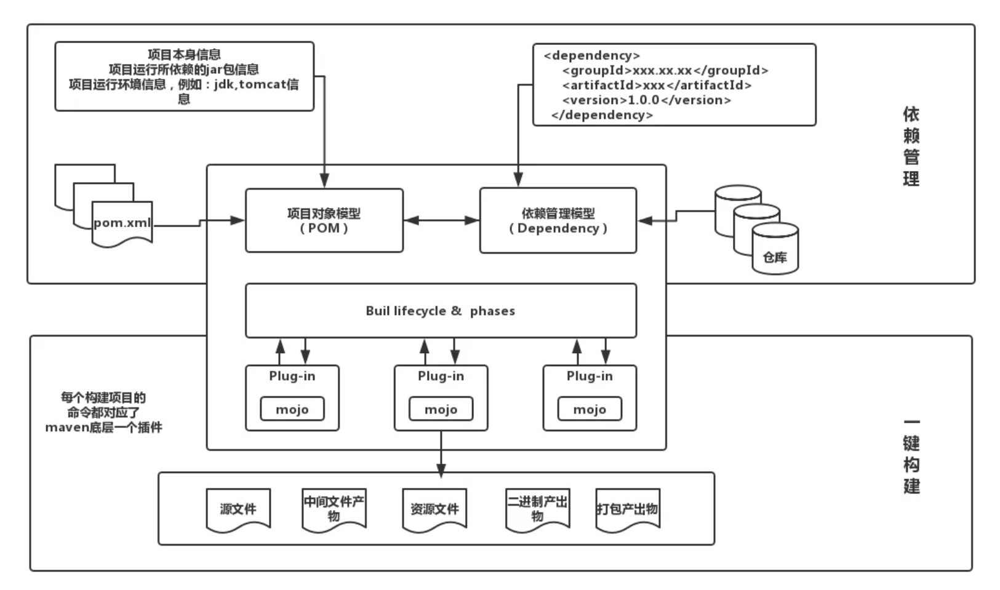
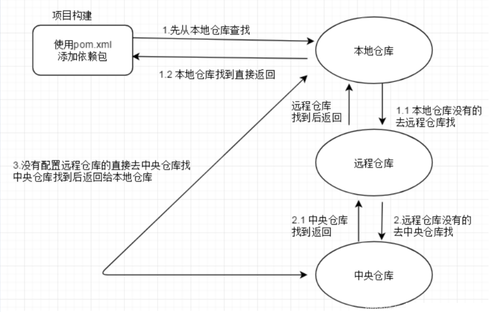

## 一、Maven概述

### 1、概述

- Maven 是用来构建和管理 Java 项目的工具；
- Maven 是 Apache开源基金组织旗下的开源产品；

### 2、使用 Maven 的好处

- 不需要手动下载包
- 一来管理更加便捷
- 不需要添加 jar

### 3、Maven 的作用

- 提供一套标准化的项目结构
- 提供一套标准化的构建流程：编译、测试、打包、发布
- 提供一套一来管理机制

## 二、Maven 模型

1、项目对象模型

- 提供了项目描述、项目坐标信息，方便其他 Maven 项目对该项目的引用

2、依赖管理模型

- 通过 Maven 坐标定位到具体的 jar，方便下载

3、插件

- 提供编译、打包、清除等功能



## 三、Maven 仓库

### 1、分类

1. 本地仓库
   - ~/.m2/repository
2. 中央仓库
   - 是 Maven 团队维护的一个仓库
   - https://mvnrepository.com
3. 公司远程私服
   - 有公司的团队搭建的私有仓库
   - 公司内部使用

### 2、构建过程



### 3、更换仓库地址

- config 目录下的 setting.xml

- 配置路径

  ```xml
  <localRepository>D:\Programs\apache-maven-3.9.2\repository</localRepository>
  ```

- 配置阿里私服（默认中央仓库在国外，下载慢）

  ```xml
  <mirror>
      <id>alimaven</id>
      <name>aliyun maven</name>
      <url>http://maven.aliyun.com/nexus/content/groups/public/</url>
      <mirrorOf>central</mirrorOf>        
  </mirror>
  ```

## 四、Maven 常用命令

### 1、compile：编译

- 下载需要的插件

- 生成 target 目录，包含字节码文件和插件

  ```sh
  mvn compile
  ```

### 2、clean：清理

- 下载需要的 clean 插件

- 删除 target 目录

  ```shell
  mvn clean
  ```

### 3、test：测试

- 编译执行 test

  ```shell
  mvn test
  ```

### 4、package：打包

- 打 jar 包

  ```shell
  mvn package
  ```

### 5、install：安装

- 把当前项目打成 jar 包并安装到本地仓库

  ```shell
  mvn install
  ```

## 五、Maven 生命周期

### 1、定义

- Maven 构建项目所经历的整个过程

### 2、执行命令的先后

- compile --> test --> package --> install

### 3、其他 Maven 命令

- 检验、初始化、验证、部署...

## 六、Maven 的具体操作

### 1、Maven 坐标

- Maven 坐标是资源的唯一标识
- 可以同坐标去定义或者创建项目的

### 2、坐标组成

- groupId：分组名，一般使用公司域名来表示
- artifactId：定义项目的名称
- version：当前项目的版本号，方便管理公司项目的迭代

### 3、依赖管理

- 使用坐标引入 jar

  ```xml
  代码
  ```

- 刷新依赖导入快捷键：Ctrl + Shift + O

- Maven 仓库找现成的坐标

- 依赖范围：通过 scope 来控制 jar 的作用范围

  - 编译环境

  - 运行环境

  - 测试环境

    | scope 取值 | 编译环境 | 运行环境 | 测试环境 | 例子       |
    | ---------- | -------- | -------- | -------- | ---------- |
    | compile    | √        | √        | √        | logback    |
    | runtime    |          | √        | √        | 数据库驱动 |
    | test       |          |          | √        | junit      |
    | system     | √        |          | √        | 存储本地包 |
    | provided   | √        |          | √        | servlet    |

  - 注意：不指定 scope 默认是：compile

## 七、Maven 分模块开发

### 1、场景介绍

- 实战开发中，一个项目是非常庞大的，会有很多模块：
  - 支付中心
  - 订单服务
  - 用户中心
  - ...
- 目前存在的问题：
  - 如果把所有的内容放到同一个项目中来管理，项目会很臃肿
  - 分工不明确，耦合太严重

### 2、分模块开发

1. 创建父模块

   删除 src ，修改 pom

   ```xml
   <?xml version="1.0" encoding="UTF-8"?>
   <project xmlns="http://maven.apache.org/POM/4.0.0"
            xmlns:xsi="http://www.w3.org/2001/XMLSchema-instance"
            xsi:schemaLocation="http://maven.apache.org/POM/4.0.0 http://maven.apache.org/xsd/maven-4.0.0.xsd">
       <modelVersion>4.0.0</modelVersion>
   
       <groupId>org.taiyi</groupId>
       <artifactId>maven-parent</artifactId>
       <version>1.0-SNAPSHOT</version>
       <packaging>pom</packaging>
   
   </project>
   ```

2. 创建子模块，指定父模块
   - 用户管理模块、订单管理模块、支付模块……

## 八、聚合和继承

### 1、聚合

#### 1.1 聚合概述

- 概述：将多个模块组织成一个整体，同时进行项目构建的过程（聚合用于管理整个项目）
- 聚合工程：一个不具有业务功能的“空”工程，有且仅有一个 pom 文件
- 作用：当工程中某个模块发生更新（变更）时，必须保证工程中与已更新模块关联的模块同步更新此时可以使用聚合工程来解决批量模块同步构建的问题

#### 1.2 实际开发应用

打包方式：

- jar 默认（表明这是一个java项目）
- war （表明这是一个web项目）
- pom（表明这是一个聚合或继承项目）

1. 创建公共服务模块
2. 在其他服务模块中引入公共服务

### 2、继承

#### 2.1 继承概述

- 概述：子工程可以继承父工程的配置信息，常见于依赖关系的继承
- 现存的问题：存在兄弟模块之间依赖重复问题
- 作用：简化配置；简化版本冲突

#### 2.2 实际开发应用

- 将相同依赖全部抽到父工程中
  - 子工程不需要显式引入，就可以直接使用
- 定义依赖管理
  - 通过 dependencyManagement 标签可以配置供子工程选用的标签
  - 子工程需要显式引入，才能使用

### 3、聚合和继承的区别（面试）

- 作用
  - 聚合：用于对项目进行分整体管理
  - 继承：配置子项目的依赖
- 异同：
  - 相同点：父工程均以 pom 打包
  - 不同点：
    - 聚合：通过父项目管理子项目，并且能够知道具体的子模块
    - 继承：通过父项目管理子项目的依赖，无法感知子模块需要哪些依赖

## 九、属性和版本管理

### 1、属性

#### 1.1 现存的问题

- 目前版本控制：版本分离控制，如果有更改会出现依赖，并且需要更改的地方很多
- 解决办法：抽取一个公共的版本属性

#### 1.2 properties 标签解决

```xml
<properties>
    <spring-version>5.2.17.RELEASE</spring-version>
</properties>

<dependencies>
    <dependency>
        <groupId>org.springframework</groupId>
        <artifactId>spring-webmvc</artifactId>
        <version>${spring-version}</version>
    </dependency>
    <dependency>
        <groupId>org.springframework</groupId>
        <artifactId>spring-jdbc</artifactId>
        <version>${spring-version}</version>
    </dependency>
    <dependency>
        <groupId>org.springframework</groupId>
        <artifactId>spring-test</artifactId>
        <version>${spring-version}</version>
    </dependency>
</dependencies>
```

### 2、版本信息

- **SNAPSHOT：快照版本**
  - 项目研发过程中的临时版本
  - 快照版本会不断更新
- **RELEASE：发布版本**
  - 项目研发成熟比较稳定的版本
  - 如果进行迭代升级，也不会改变当前版本的内容
- ALPHA：内测版本
  - 自己公司内部测试使用
  - 研发基本完成，可能存在 bug
- BETA：公测版
  - 公司内测没问题，需要广大用户进行测试，还存在 bug
- 纯数字版本：以数字表示

## 十、测试

### 1、操作普通打包

直接点击 Maven 生命周期中的 package ：

1. 清除
2. 验证
3. 编译
4. 测试
5. 打包

### 2、实际开发中场景

线上出现紧急 Bug ，需要紧急修复并且上线部署，这时 package 会打包可能会失败（test 无法通过）

### 3、解决办法

跳过测试：

- 通过 IDEA 的 Maven 工具实现跳过测试

- 通过命令行跳过测试

  ```shell
  mvn package -D stipTests=true
  ```

## 十一、私服（了解）

### 1、私服与中央仓库

#### 1.1 概述

> 公司内部搭建的用于存储 Maven 资源的服务器

#### 1.2 中央仓库

> Maven 开发团队维护的用于存储 Maven 资源的服务器

#### 1.3 目前开发现状

> 目前团队间共享 Jar 资源只能通过网络传输

> 有了私服之后，开发者可以首先向私服上传和下载 Jar 资源，没有的话，再去请求中央仓库

### 2、私服下载原装

1. 下载并解压 nexus

2. 启动私服

   ```shell
   nexus.exe \run nexus
   ```

3. 访问 nexus：`localhost:8081`

4. 登录 admin


- 注意：如果端口被占用，去 etc 目录的配置文件中修改即可

### 3、仓库分类

- 宿主仓库 hosted
  - 存放一些无法从中央仓库获取的 Jar
  - 公司内部开发的 Jar
  - 收费 Jar
- 代理仓库 Proxy
  - 代理访问远程仓库，比如访问阿里云镜像仓库
- 仓库组 group
  - 将多个仓库设置成一个组群，可以有效简化配置
  - 不去保存资源，只是做协调工作

### 4、私服配置仓库

- 新建仓库（hosted）
- 将创建的仓库交给组 group 管理（maven-public）

### 5、本地仓库与私服配置

> 本地拉取 jar 包是通过 Maven 操作的

- 配置本地对 neuxs 私服的访问信息

  - 配置访问信息

    ```xml
     <servers>
          <server>
              <id>sy-Release</id>
              <username>admin</username>
              <password>123456</password>
          </server>
          <server>
              <id>sy-Snapshot</id>
              <username>admin</username>
              <password>123456</password>
          </server>
          <server>
              <id>maven-public</id>
              <username>admin</username>
              <password>123456</password>
          </server>
      </servers>
    ```

  - 配置私服的镜像地址

    ```xml
    <mirror>
      <!-- 配置组名称 -->
      <id>maven-public</id>
      <!-- 所有内容都可以拉取-->
      <mirrorOf>*</mirrorOf>
      <!--仓库地址-->
      <url>http://localhost:8081/repository/maven-public/</url>
    </mirror>
    ```


### 6、私服资源的上传

#### 6.1 手动上传

操作 neuxs 页面

#### 6.2 自动上传与下载

在需要上传的 pom 文件中添加如下配置信息（和 setting.xml 中保持一致）

```xml
<distributionManagement>
    <repository>
        <id>sy-Release</id>
        <url>http://localhost:8081/repository/sy-Release/</url>
    </repository>
    <snapshotRepository>
        <id>sy-Snapshot</id>
        <url>http://localhost:8081/repository/sy-Snapshot/</url>
    </snapshotRepository>
</distributionManagement>
```

发布项目到 nexus ：`deploy`

#### 6.3 修改中央代理的仓库为阿里云

### 7、获取私服中的 Jar 包

在对应的 pom 中配置对一个的 Jar 地址即可
