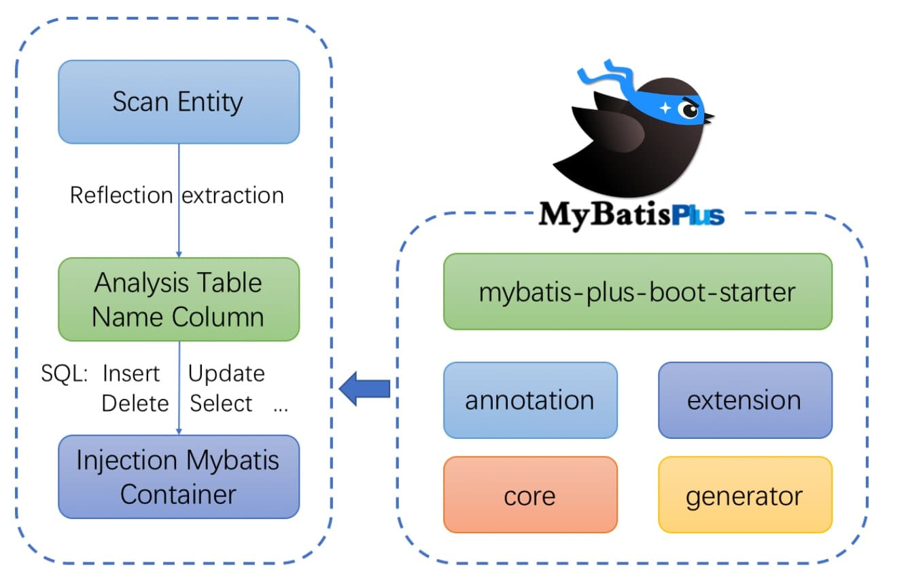
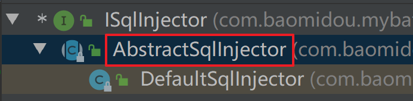

## 一、MyBatis Plus 简介

### 1、概述

> MyBatis-Plus（简称 MP）是一个 MyBatis 的增强工具，在 MyBatis 的基础上只做增强不做改变，为简化开发、提高效率而生

### 2、特性

- **无侵入**：只做增强不做改变，引入它不会对现有工程产生影响，如丝般顺滑
- **损耗小**：启动即会自动注入基本 CURD，性能基本无损耗，直接面向对象操作
- **强大的 CRUD 操作**：内置通用 Mapper、通用 Service，仅仅通过少量配置即可实现单表大部分 CRUD 操作，更有强大的条件构造器，满足各类使用需求
- **支持 Lambda 形式调用**：通过 Lambda 表达式，方便的编写各类查询条件，无需再担心字段写错
- **支持主键自动生成**：支持多达 4 种主键策略（内含分布式唯一 ID 生成器 - Sequence），可自由配置，完美解决主键问题
- **支持 ActiveRecord 模式**：支持 ActiveRecord 形式调用，实体类只需继承 Model 类即可进行强大的 CRUD 操作
- **支持自定义全局通用操作**：支持全局通用方法注入（ Write once, use anywhere ）
- **内置代码生成器**：采用代码或者 Maven 插件可快速生成 Mapper 、 Model 、 Service 、 Controller 层代码，支持模板引擎，更有超多自定义配置等您来使用
- **内置分页插件**：基于 MyBatis 物理分页，开发者无需关心具体操作，配置好插件之后，写分页等同于普通 List 查询
- **分页插件支持多种数据库**：支持 MySQL、MariaDB、Oracle、DB2、H2、HSQL、SQLite、Postgre、SQLServer 等多种数据库
- **内置性能分析插件**：可输出 SQL 语句以及其执行时间，建议开发测试时启用该功能，能快速揪出慢查询
- **内置全局拦截插件**：提供全表 delete 、 update 操作智能分析阻断，也可自定义拦截规则，预防误操作

### 3、架构



## 二、快速入门

### 1、创建数据库及表

```sql
DROP TABLE IF EXISTS `user`;

CREATE TABLE `user`
(
    id    BIGINT      NOT NULL COMMENT '主键ID',
    name  VARCHAR(30) NULL DEFAULT NULL COMMENT '姓名',
    age   INT         NULL DEFAULT NULL COMMENT '年龄',
    email VARCHAR(50) NULL DEFAULT NULL COMMENT '邮箱',
    PRIMARY KEY (id)
);
```

添加信息

```sql
DELETE FROM `user`;

INSERT INTO `user` (id, name, age, email)
VALUES (1, 'Jone', 18, 'test1@baomidou.com'),
       (2, 'Jack', 20, 'test2@baomidou.com'),
       (3, 'Tom', 28, 'test3@baomidou.com'),
       (4, 'Sandy', 21, 'test4@baomidou.com'),
       (5, 'Billie', 24, 'test5@baomidou.com');
```

### 2、初始化工程

### 3、添加依赖

SpringBoot parent 依赖

```xml
<parent>
    <groupId>org.springframework.boot</groupId>
    <artifactId>spring-boot-starter-parent</artifactId>
    <version>2.7.18</version>
    <relativePath/>
</parent>
```

引入 `spring-boot-starter`、`spring-boot-starter-test`、`mybatis-plus-boot-starter`、`mysql` 依赖：

```xml
<dependency>
    <groupId>org.springframework.boot</groupId>
    <artifactId>spring-boot-starter</artifactId>
</dependency>
<dependency>
    <groupId>org.springframework.boot</groupId>
    <artifactId>spring-boot-starter-test</artifactId>
    <scope>test</scope>
</dependency>
<dependency>
    <groupId>org.junit.platform</groupId>
    <artifactId>junit-platform-launcher</artifactId>
    <version>1.9.2</version>
    <scope>test</scope>
</dependency>
<dependency>
    <groupId>org.projectlombok</groupId>
    <artifactId>lombok</artifactId>
</dependency>
<dependency>
    <groupId>com.mysql</groupId>
    <artifactId>mysql-connector-j</artifactId>
</dependency>
<dependency>
    <groupId>com.baomidou</groupId>
    <artifactId>mybatis-plus-boot-starter</artifactId>
    <version>3.5.2</version>
</dependency>
```

### 4、配置

#### 4.1 添加 SpringBoot 启动类

```java
@SpringBootApplication
public class MyBatisPlusPracticeApplication {
    public static void main(String[] args) {
        SpringApplication.run(MyBatisPlusPracticeApplication.class, args);
    }
}
```

#### 4.2 application.yml

数据库配置

```yml
spring:
  datasource:
    driver-class-name: com.mysql.cj.jdbc.Driver
    url: jdbc:mysql://localhost:3306/mybatis_plus
    username: root
    password: 123456
```

开启日志打印

```yml
logging:
  level:
    org.taiyi.mapper: debug
```

#### 4.3 启动类添加 @MapperScan

作用：扫描 mapper 文件夹

```java
@SpringBootApplication
@MapperScan("org.taiyi.mapper")
public class MyBatisPlusPracticeApplication {
    public static void main(String[] args) {
        SpringApplication.run(MyBatisPlusPracticeApplication.class, args);
    }
}
```

### 5、编码实现

 domain

```java
@Data
public class User {
    private Long id;
    private String name;
    private Integer age;
    private String email;
}
```

mapper

```java
public interface UserMapper extends BaseMapper<User> {
}
```

### 6、测试

```java
@SpringBootTest
public class MybatisPlusTest {
    @Resource
    private UserMapper userMapper;
    
    @Test
    public void testSelectAll() {
        List<User> userList = userMapper.selectList(null);
        System.out.println(userList);
    }
}
```

## 三、Mapper 层 CRUD 接口

### 1、增添

#### 1.1 方法

```java
int insert(T entity);
```

#### 1.2 使用

```java
@Test
public void testInsert() {
    User user = new User();
    user.setName("test");
    user.setAge(18);
    user.setEmail("test@test.com");
    int count = userMapper.insert(user);
    System.out.println(user.getId());
}
```

结果

```shell
==>  Preparing: INSERT INTO user ( name, age, email ) VALUES ( ?, ?, ? )
==> Parameters: test(String), 18(Integer), test@test.com(String)
<==    Updates: 1
```

存在的问题：自增主键值太大，不符合 MySQL 的自增逻辑

#### 1.3 MyBatisPlus 支持的 ID 策略：

```java
public enum IdType {
    AUTO(0),			// 数据库自增 ID
    NONE(1),			// 没有主键，默认
    INPUT(2),			// 用户输入 ID
    ASSIGN_ID(3),	
    ASSIGN_UUID(4);		 // 随机字符串 

    private final int key;

    private IdType(int key) {
        this.key = key;
    }

    public int getKey() {
        return this.key;
    }
}
```

#### 1.4 @TableId 

修改 domain 实体

```java
@Data
public class User {
    @TableId(type = IdType.AUTO)
    private Long id;
    private String name;
    private Integer age;
    private String email;
}
```

#### 1.5 @TableField

问题：数据库字段与 Java 实体类字段不匹配

解决：使用 @TableField 映射

```java
@Data
public class User {
    @TableId(type = IdType.AUTO)
    private Long id;
    private String name;
    private Integer age;
    @TableField(value = "email")
    private String email;
}
```

设置查询时不查询该字段（注意：提供无参构造器）

```java
@TableField(select = false)
private Integer age;
```

### 2、删除

#### 2.1 根据 ID 删除

- 方法

  ```java
  int deleteById(Serializable id);
  int deleteById(T entity);
  ```

- 测试

  ```java
  @Test
  public void deleteById() {
      int count = userMapper.deleteById(7L);
      System.out.println(count);
  }
  ```

- 结果

  ```shell
  ==>  Preparing: DELETE FROM user WHERE id=?
  ==> Parameters: 7(Long)
  <==    Updates: 1
  ```

#### 2.2 根据列删除 —— Map

- 方法

  ```java
  int deleteByMap(@Param("cm") Map<String, Object> columnMap);
  ```

- 测试

  ```java
  @Test
  public void deleteByMap() {
      Map<String, Object> map = new HashMap<>();
      map.put("name", "Billie");
      int count = userMapper.deleteByMap(map);
      System.out.println(count);
  }
  ```

- 结果

  ```shell
  ==>  Preparing: DELETE FROM user WHERE name = ?
  ==> Parameters: Billie(String)
  <==    Updates: 1
  ```

#### 2.3 根据列删除 —— Wrapper

- 方法

  ```java
  int delete(@Param("ew") Wrapper<T> queryWrapper);
  ```

- 测试

  ```java
  @Test
  public void delete() {
      User user = new User();
      user.setName("Sandy");
      Wrapper<User> wrapper = new QueryWrapper<>(user);
      int count = userMapper.delete(wrapper);
      System.out.println(count);
  }
  ```

- 结果

  ```shell
  ==>  Preparing: DELETE FROM user WHERE name=?
  ==> Parameters: Sandy(String)
  <==    Updates: 1
  ```

#### 2.4 根据 ID 列删除

- 方法

  ```java
  int deleteBatchIds(@Param("coll") Collection<?> idList);
  ```

- 测试

  ```java
  @Test
  public void deleteBatchIds() {
      List<Long> idList = new ArrayList<>();
      idList.add(2L);
      idList.add(3L);
      int count = userMapper.deleteBatchIds(idList);
      System.out.println(count);
  }
  ```

- 结果

  ```shell
  ==>  Preparing: DELETE FROM user WHERE id IN ( ? , ? )
  ==> Parameters: 2(Long), 3(Long)
  <==    Updates: 2
  ```

### 3、更改

#### 3.1 更改 ID 修改

- 方法

  ```shell
  int updateById(@Param("et") T entity);
  ```

- 测试

  ```java
  @Test
  public void update() {
      User user = new User();
      user.setName("taiyi");
      user.setEmail("taiyi@test.com");
      user.setAge(18);
      user.setId(8L);
      userMapper.updateById(user);
  }
  ```

- 结果

  ```shell
  ==>  Preparing: UPDATE user SET name=?, age=?, email=? WHERE id=?
  ==> Parameters: taiyi(String), 18(Integer), taiyi@test.com(String), 8(Long)
  <==    Updates: 1
  ```

#### 3.2 根据条件修改 —— Wrapper

- 方法

  ```java
  int update(@Param("et") T entity, @Param("ew") Wrapper<T> updateWrapper);
  ```

- 测试

  ```java
  @Test
  public void updateWrapper() {
      User user = new User();
      user.setName("taiyi");
      user.setEmail("taiyi@taiyi.com");
      user.setAge(18);
      userMapper.update(user, new UpdateWrapper<User>().eq("name", "test"));
  }
  ```

- 结果

  ```shell
  ==>  Preparing: UPDATE user SET name=?, age=?, email=? WHERE (name = ?)
  ==> Parameters: taiyi(String), 18(Integer), taiyi@taiyi.com(String), test(String)
  <==    Updates: 1
  ```


### 4、查询

#### 4.1 select

- 方法

  ```java
  // 根据 ID 查询
  T selectById(Serializable id);
  // 根据 entity 条件，查询一条记录
  T selectOne(@Param(Constants.WRAPPER) Wrapper<T> queryWrapper);
  ```

- 测试

  ```java
  @Test
  public void testSelectById() {
      User user = userMapper.selectById(1L);
      System.out.println(user);
  }
  ```

  ```java
  @Test
      public void testSelectOne() {
          QueryWrapper<User> wrapper = new QueryWrapper<>();
          wrapper.eq("name", "Jone");
          User user = userMapper.selectOne(wrapper);
          System.out.println(user);
      }
  ```

- 结果

  ```shell
  ==>  Preparing: SELECT id,name,age,email FROM user WHERE id=?
  ==> Parameters: 1(Long)
  <==      Total: 1
  ```

  ```shell
  ==>  Preparing: SELECT id,name,age,email FROM user WHERE (name = ?)
  ==> Parameters: Jone(String)
  <==      Total: 1
  ```

#### 4.2 list

- 方法

  ```java
  // 查询（根据ID 批量查询）
  List<T> selectBatchIds(@Param(Constants.COLLECTION) Collection<? extends Serializable> idList);
  // 根据 entity 条件，查询全部记录
  List<T> selectList(@Param(Constants.WRAPPER) Wrapper<T> queryWrapper);
  // 查询（根据 columnMap 条件）
  List<T> selectByMap(@Param(Constants.COLUMN_MAP) Map<String, Object> columnMap);
  // 根据 Wrapper 条件，查询全部记录
  List<Map<String, Object>> selectMaps(@Param(Constants.WRAPPER) Wrapper<T> queryWrapper);
  // 根据 Wrapper 条件，查询全部记录。注意： 只返回第一个字段的值
  List<Object> selectObjs(@Param(Constants.WRAPPER) Wrapper<T> queryWrapper);
  ```

#### 4.3 page

- 方法

  ```java
  // 根据 entity 条件，查询全部记录（并翻页）
  IPage<T> selectPage(IPage<T> page, @Param(Constants.WRAPPER) Wrapper<T> queryWrapper);
  // 根据 Wrapper 条件，查询全部记录（并翻页）
  IPage<Map<String, Object>> selectMapsPage(IPage<T> page, @Param(Constants.WRAPPER) Wrapper<T> queryWrapper);
  // 根据 Wrapper 条件，查询总记录数
  Integer selectCount(@Param(Constants.WRAPPER) Wrapper<T> queryWrapper);
  ```

- 测试

- 结果

## 四、Service 层 CRUD 接口

### 1、Service 准备

Service

```java
public interface IUserService extends IService<User> {
}
```

ServiceImpl

```java
@Service
public class UserServiceImpl extends ServiceImpl<UserMapper, User> implements IUserService {
}
```

### 2、添加

```java
// 插入一条记录（选择字段，策略插入）
boolean save(T entity);
// 插入（批量）
boolean saveBatch(Collection<T> entityList);
// 插入（批量）
boolean saveBatch(Collection<T> entityList, int batchSize);
```

### 3、移除

```java
// 根据 queryWrapper 设置的条件，删除记录
boolean remove(Wrapper<T> queryWrapper);
// 根据 ID 删除
boolean removeById(Serializable id);
// 根据 columnMap 条件，删除记录
boolean removeByMap(Map<String, Object> columnMap);
// 删除（根据ID 批量删除）
boolean removeByIds(Collection<? extends Serializable> idList);
```

### 4、修改

```java
// 根据 UpdateWrapper 条件，更新记录 需要设置sqlset
boolean update(Wrapper<T> updateWrapper);
// 根据 whereWrapper 条件，更新记录
boolean update(T updateEntity, Wrapper<T> whereWrapper);
// 根据 ID 选择修改
boolean updateById(T entity);
// 根据ID 批量更新
boolean updateBatchById(Collection<T> entityList);
// 根据ID 批量更新
boolean updateBatchById(Collection<T> entityList, int batchSize);
```

```java
// TableId 注解存在更新记录，否插入一条记录
boolean saveOrUpdate(T entity);
// 根据updateWrapper尝试更新，否继续执行saveOrUpdate(T)方法
boolean saveOrUpdate(T entity, Wrapper<T> updateWrapper);
// 批量修改插入
boolean saveOrUpdateBatch(Collection<T> entityList);
// 批量修改插入
boolean saveOrUpdateBatch(Collection<T> entityList, int batchSize);
```

### 5、获取

Get

```java
// 根据 ID 查询
T getById(Serializable id);
// 根据 Wrapper，查询一条记录。结果集，如果是多个会抛出异常，随机取一条加上限制条件 wrapper.last("LIMIT 1")
T getOne(Wrapper<T> queryWrapper);
// 根据 Wrapper，查询一条记录
T getOne(Wrapper<T> queryWrapper, boolean throwEx);
// 根据 Wrapper，查询一条记录
Map<String, Object> getMap(Wrapper<T> queryWrapper);
// 根据 Wrapper，查询一条记录
<V> V getObj(Wrapper<T> queryWrapper, Function<? super Object, V> mapper);
```

List

```java
// 查询所有
List<T> list();
// 查询列表
List<T> list(Wrapper<T> queryWrapper);
// 查询（根据ID 批量查询）
Collection<T> listByIds(Collection<? extends Serializable> idList);
// 查询（根据 columnMap 条件）
Collection<T> listByMap(Map<String, Object> columnMap);
// 查询所有列表
List<Map<String, Object>> listMaps();
// 查询列表
List<Map<String, Object>> listMaps(Wrapper<T> queryWrapper);
// 查询全部记录
List<Object> listObjs();
// 查询全部记录
<V> List<V> listObjs(Function<? super Object, V> mapper);
// 根据 Wrapper 条件，查询全部记录
List<Object> listObjs(Wrapper<T> queryWrapper);
// 根据 Wrapper 条件，查询全部记录
<V> List<V> listObjs(Wrapper<T> queryWrapper, Function<? super Object, V> mapper);
```

Page

```java
// 无条件分页查询
IPage<T> page(IPage<T> page);
// 条件分页查询
IPage<T> page(IPage<T> page, Wrapper<T> queryWrapper);
// 无条件分页查询
IPage<Map<String, Object>> pageMaps(IPage<T> page);
// 条件分页查询
IPage<Map<String, Object>> pageMaps(IPage<T> page, Wrapper<T> queryWrapper);
```

## 五、条件构造器

### 1、allEq

常用方法

```java
allEq(Map<R, V> params)
allEq(Map<R, V> params, boolean null2IsNull)
allEq(boolean condition, Map<R, V> params, boolean null2IsNull)
```

带 Filter 的常用方法

```java
allEq(BiPredicate<R, V> filter, Map<R, V> params)
allEq(BiPredicate<R, V> filter, Map<R, V> params, boolean null2IsNull)
allEq(boolean condition, BiPredicate<R, V> filter, Map<R, V> params, boolean null2IsNull) 
```

### 2、比较操作

| 比较符     | 说明（SQL）                          |
| ---------- | ------------------------------------ |
| eq         | =                                    |
| ne         | !=                                   |
| gt         | >                                    |
| ge         | >=                                   |
| lt         | <                                    |
| le         | <=                                   |
| between    | between 值1 and 值2                  |
| notBetween | not between 值1 and 值2              |
| in         | 字段 in (value1, value2, ......)     |
| notIn      | 字段 not in (value1, value2, ......) |

- 测试

  ```java
  @Test
  public void testCompare() {
      QueryWrapper<User> wrapper = new QueryWrapper<>();
      wrapper.eq("name", "taiyi")
          .ge("age", 18)
          .in("email", "taiyi@taityi,com");
      List<User> userList = userMapper.selectList(wrapper);
      System.out.println(userList);
  }
  ```

- 结果

  ```shell
  ==>  Preparing: SELECT id,name,age,email FROM user WHERE (name = ? AND age >= ? AND email IN (?))
  ==> Parameters: taiyi(String), 18(Integer), taiyi@taityi,com(String)
  <==      Total: 0
  ```

### 3、模糊查询

| 符号      | 说明            |
| --------- | --------------- |
| like      | like '%值%'     |
| noLike    | not like '%值%' |
| likeLeft  | like '%值'      |
| likeRight | like '值%'      |

- like

  ```java
  @Test
  public void testLike() {
      QueryWrapper<User> wrapper = new QueryWrapper<>();
      wrapper.like("name", "iy");
      List<User> userList = userMapper.selectList(wrapper);
      System.out.println(userList);
  }
  ```

  ```shell
  ==>  Preparing: SELECT id,name,age,email FROM user WHERE (name LIKE ?)
  ==> Parameters: %iy%(String)
  <==      Total: 2
  ```

- likeLeft

  ```java
  @Test
  public void testLike() {
      QueryWrapper<User> wrapper = new QueryWrapper<>();
      wrapper.likeLeft("name", "yi");
      List<User> userList = userMapper.selectList(wrapper);
      System.out.println(userList);
  }
  ```

  ```shell
  ==>  Preparing: SELECT id,name,age,email FROM user WHERE (name LIKE ?)
  ==> Parameters: %yi(String)
  <==      Total: 2
  ```


### 4、分组和排序

| 方法        | 说明                          |
| ----------- | ----------------------------- |
| groupBy     | 分组：GROUP BY 字段, ...      |
| orderByAsc  | 排序：ORDER BY 字段, ... ASC  |
| orderByDesc | 排序：ORDER BY 字段, ... DESC |
| orderBy     | 排序：ORDER BY 字段, ...      |

### 5、逻辑查询

- or

  - 注意：

    - 主动调用 or 表示下一个方法不是用 and 连接
    - 可以嵌套

  - 测试

    ```java
    @Test
    public void testOr() {
        QueryWrapper<User> wrapper = new QueryWrapper<>();
        wrapper.eq("name", "taiyi").or().eq("age", 18);
        List<User> userList = userMapper.selectList(wrapper);
        System.out.println(userList);
    }
    ```

  - 结果

    ```shell
    ==>  Preparing: SELECT id,name,age,email FROM user WHERE (name = ? OR age = ?)
    ==> Parameters: taiyi(String), 18(Integer)
    <==      Total: 3
    ```

- and

  - 注意：可以嵌套

  - 测试

    ```java
    @Test
    public void testAnd() {
        QueryWrapper<User> wrapper = new QueryWrapper<>();
        wrapper.eq("name", "taiyi")
            .and(queryWrapper -> queryWrapper.eq("age", 18).or().eq("email", "test"));
        List<User> userList = userMapper.selectList(wrapper);
        System.out.println(userList);
    }
    ```

  - 结果

    ```shell
    ==>  Preparing: SELECT id,name,age,email FROM user WHERE (name = ? AND (age = ? OR email = ?))
    ==> Parameters: taiyi(String), 18(Integer), test(String)
    <==      Total: 2
    ```

### 6、select

测试

```java
@Test
public void testSelect() {
    QueryWrapper<User> wrapper = new QueryWrapper<>();
    wrapper.select("id", "name", "age");
    List<User> userList = userMapper.selectList(wrapper);
    System.out.println(userList);
}
```

结果

```shell
==>  Preparing: SELECT id,name,age FROM user
==> Parameters: 
<==      Total: 3
```

### 7、UpdateWrapper

- set
- setSql

## 六、逻辑删除

> 插入: 不作限制
>
> 查找: 追加 where 条件过滤掉已删除数据，如果使用 wrapper.entity 生成的 where 条件也会自动追加该字段
>
> 更新: 追加 where 条件防止更新到已删除数据，如果使用 wrapper.entity 生成的 where 条件也会自动追加该字段
>
> 删除: 转变为更新

### 1、修改表结构

增加 deleted 字段：0 代表未删除，1 代表已删除

```sql
ALTER TABLE user ADD COLUMN `deleted` int DEFAULT '0' COMMENT '删除与否';
```

### 2、开启配置支持

```yml
mybatis-plus:
  global-config:
    db-config:
      logic-delete-value: 1
      logic-not-delete-value: 0
```

### 3、实体类添加 `@TableLogic`

```java
@Data
public class User {
    @TableId(type = IdType.AUTO)
    private Long id;
    private String name;
    private Integer age;
    private String email;
    @TableLogic
    private Integer deleted;
}
```

### 4、测试

- 删除测试

  ```java
  @Test
  public void testLogicDelete() {
      int count = userMapper.deleteById(9L);
      System.out.println(count);
  }
  ```

  结果

  ```shell
  ==>  Preparing: UPDATE user SET deleted=1 WHERE id=? AND deleted=0
  ==> Parameters: 9(Long)
  <==    Updates: 1
  ```

- 查询测试

  ```java
  @Test
  public void testLogicSelect() {
      List<User> userList = userMapper.selectList(null);
      System.out.println(userList);
  }
  ```

  结果

  ```shell
  ==>  Preparing: SELECT id,name,age,email,deleted FROM user WHERE deleted=0
  ==> Parameters: 
  <==      Total: 2
  ```

## 七、通用枚举

### 1、修改表结构

```sql
ALTER TABLE `user` ADD COLUMN `sex` int(1) default 1 COMMENT '1-男 0-女';
```

### 2、声明通用枚举属性

```java
@AllArgsConstructor
public enum SexEnum implements IEnum<Integer> {
    MALE(1, "男"),
    FEMALE(0, "女");

    private final Integer value;
    private final String desc;

    @Override
    public Integer getValue() {
        return this.value;
    }

    @Override
    public String toString() {
        return this.desc;
    }
}
```

### 3、实体属性使用枚举

```java
@Data
public class User {
    @TableId(type = IdType.AUTO)
    private Long id;
    private String name;
    private Integer age;
    private String email;
    @TableLogic
    private Integer deleted;
    private SexEnum sex;
}
```

### 4、额外补充

- 配置扫描通用枚举

  注意：3.5.2+ 不需要该步骤

  ```yml
  mybatis-plus:
      # 支持统配符 * 或者 ; 分割
      typeEnumsPackage: org.taiyi.enums
  ```

- 序列化给前端

  1. 首先需要在枚举中重写 toString 方法

  2. 其次，更改序列化返回方式：

     - FastJson

       ```java
       @JSONField(serialzeFeatures= SerializerFeature.WriteEnumUsingToString)
       private UserStatus status;
       ```

     - Jackson

       ```java
       @JsonValue	//标记响应json值
       private final int code;
       ```

### 5、测试

```java
@Test
public void testEnum() {
    User user = new User();
    user.setName("张三");
    user.setAge(20);
    user.setEmail("zs@qq.com");
    user.setSex(SexEnum.FEMALE);
    int count = userMapper.insert(user);
    System.out.println(count);
}
```

结果

```shell
==>  Preparing: INSERT INTO user ( name, age, email, sex ) VALUES ( ?, ?, ?, ? )
==> Parameters: 张三(String), 20(Integer), zs@qq.com(String), 0(Integer)
<==    Updates: 1
```

## 八、自动填充功能

> 插入数据需要插入创建时间
>
> 更新数据需要添加更新时间

### 1、修改表结构

添加 `create_time` 和 `update_time`

### 2、@TableField

FieldFill

```java
public enum FieldFill {
    DEFAULT,				// 不处理
    INSERT,					// 插入处理
    UPDATE,					// 更新处理
    INSERT_UPDATE;			// 插入和更新处理

    private FieldFill() {
    }
}
```

添加字段

```java
@TableField(fill = FieldFill.INSERT)
private Date createTime;
@TableField(fill = FieldFill.UPDATE)
private Date updateTime;
```

### 3、自定义实现类 MyMetaObjectHandler

```java
@Component
public class MyMetaObjectHandler implements MetaObjectHandler {
    @Override
    public void insertFill(MetaObject metaObject) {
        this.setFieldValByName("createTime", new Date(), metaObject);
    }

    @Override
    public void updateFill(MetaObject metaObject) {
        this.setFieldValByName("updateTime", new Date(), metaObject);
    }
}
```

### 4、测试

- insert 测试

  ```java
  @Test
  public void testInsert() {
      User user = new User();
      user.setName("李四");
      user.setAge(20);
      user.setEmail("zs@qq.com");
      user.setSex(SexEnum.FEMALE);
      int count = userMapper.insert(user);
      System.out.println(count);
  }
  ```

  结果

  ```shell
  ==>  Preparing: INSERT INTO user ( name, age, email, sex, create_time ) VALUES ( ?, ?, ?, ?, ? )
  ==> Parameters: 李四(String), 20(Integer), zs@qq.com(String), 0(Integer), 2024-01-05 14:37:17.226(Timestamp)
  <==    Updates: 1
  ```

- update 测试

  ```java
  @Test
      public void testUpdate() {
          User user = new User();
          user.setId(9L);
          user.setName("test");
          user.setEmail("test@qq.com");
          user.setSex(SexEnum.MALE);
          int count = userMapper.updateById(user);
          System.out.println(count);
      }
  ```

  结果

  ```shell
  ==>  Preparing: UPDATE user SET name=?, email=?, sex=?, update_time=? WHERE id=? AND deleted=0
  ==> Parameters: test(String), test@qq.com(String), 1(Integer), 2024-01-05 14:43:51.929(Timestamp), 9(Long)
  <==    Updates: 1
  ```


## 九、SQL 注入

### 1、SQL 输入原理分析

> MyBatisPlus 是使用 ISqlInjector 接口负责 SQL 注入工作



### 2、扩充 BaseMapper 中的方法

#### 2.1 编写自己的 BaseMapper

MyBaseMapper

```java
public interface MyBaseMapper<T> extends BaseMapper<T> {
    List<T> listAll();
}
```

mapper 直接继承我们自定义的 MyBaseMapper

```java
public interface UserMapper extends MyBaseMapper<User> {
}
```

#### 2.2 编写注入器 MySqlInjector

```java
@Component
public class MySqlInjector extends DefaultSqlInjector {
    @Override
    public List<AbstractMethod> getMethodList(Class<?> mapperClass, TableInfo tableInfo) {
        // 1 默认的mybatis-plus 的 注入方法
        List<AbstractMethod> methodList = super.getMethodList(mapperClass, tableInfo);
        // 2 添加自己的 listAll 类
        methodList.add(new ListAll());
        // 3 返回
        return methodList;
    }
}
```

#### 2.3 创建 ListAll 类

```java
public class ListAll extends AbstractMethod {
    @Override
    public MappedStatement injectMappedStatement(Class<?> mapperClass, Class<?> modelClass, TableInfo tableInfo) {
        String sqlMethod = "listAll";
        String sql = "select * from " + tableInfo.getTableName();
        SqlSource sqlSource = this.languageDriver.createSqlSource(this.configuration, sql, modelClass);
        return this.addSelectMappedStatementForTable(mapperClass, sqlMethod, sqlSource, tableInfo);
    }
}
```

#### 2.4 测试验证

```java
@Test
public void testInjector() {
    List<User> userList = userMapper.listAll();
    System.out.println(userList);
}
```

## 十、插件

### 1、概述

MybatisPlusInterceptor：该插件是核心插件,目前代理了 `Executor#query` 和 `Executor#update` 和 `StatementHandler#prepare` 方法

自定义拦截器

```java
@Intercepts({@Signature(
    type = StatementHandler.class,
    method = "prepare",
    args = {Connection.class, Integer.class}
), @Signature(
    type = StatementHandler.class,
    method = "getBoundSql",
    args = {}
), @Signature(
    type = Executor.class,
    method = "update",
    args = {MappedStatement.class, Object.class}
), @Signature(
    type = Executor.class,
    method = "query",
    args = {MappedStatement.class, Object.class, RowBounds.class, ResultHandler.class}
), @Signature(
    type = Executor.class,
    method = "query",
    args = {MappedStatement.class, Object.class, RowBounds.class, ResultHandler.class, CacheKey.class, BoundSql.class}
)})
@Component
public class MyInterceptor implements Interceptor {
    @Override
    public Object intercept(Invocation invocation) throws Throwable {
        // 拦截操作
        return invocation.proceed();
    }

    @Override
    public Object plugin(Object target) {
        // 装配插件
        return Interceptor.super.plugin(target);
    }

    @Override
    public void setProperties(Properties properties) {
        // 属性设置
        Interceptor.super.setProperties(properties);
    }
}
```

### 2、分页插件

```java
@Configuration
public class MyBatisPlusConfig {
    @Bean
    public MybatisPlusInterceptor mybatisPlusInterceptor() {
        MybatisPlusInterceptor interceptor = new MybatisPlusInterceptor();
        interceptor.addInnerInterceptor(new PaginationInnerInterceptor(DbType.MYSQL));
        return interceptor;
    }
}
```

### 3、乐观锁插件（重要）

OptimisticLockerInnerInterceptor

- 当要更新一条记录的时候，希望这条记录没有被别人更新
- 乐观锁的实现方式：
  - 取出记录时，获取当前 version
  - 更新时，带上这个 version
  - 执行更新时， set version = newVersion where version = oldVersion
  - 如果 version 不对，就更新失败

#### 3.1 乐观锁补充

在数据库增加一个 version 字段来管理数据，假设没有其他人操作过这条数据。先读取本条数据的 version，在修改的时候，判断之前拿出来的 version 和现在的 version 是否一致，如果不一致，则表示被人操作过，更新失败

#### 3.2 配置乐观锁

```java
@Configuration
public class MyBatisPlusConfig {
    @Bean
    public MybatisPlusInterceptor paginationInterceptor() {
        MybatisPlusInterceptor interceptor = new MybatisPlusInterceptor();
        interceptor.addInnerInterceptor(new PaginationInnerInterceptor(DbType.MYSQL));
        interceptor.addInnerInterceptor(new OptimisticLockerInnerInterceptor());
        return interceptor;
    }
}
```

#### 3.3 实体类上添加 @Version 注解

```java
@Version
private Integer version;
```

####  3.4 测试验证

```java
@Test
public void testVersion(){
    User user = userMapper.selectById(16L);
    user.setName("太一666");
    int count = userMapper.updateById(user);
    System.out.println("受影响行数："+count);
}
```

结果

```shell
==>  Preparing: UPDATE user SET name=?, uemail=?, sex=?, create_time=?, update_time=?, version=? WHERE id=? AND version=? AND deleted=0
==> Parameters: 云哥666(String), sy@qq.com(String), 1(Integer), 2022-12-03 11:34:41.0(Timestamp), 2022-12-03 17:44:05.425(Timestamp), 3(Integer), 16(Long), 2(Integer)
<==    Updates: 1
```

### 4、防全表更新与删除插件

BlockAttackInnerInterceptor：针对 update 和 delete 语句 作用: 阻止恶意的全表更新删除

#### 4.1 配置拦截器

```java
@Configuration
public class MybatisPlusConfig {
  @Bean
  public MybatisPlusInterceptor mybatisPlusInterceptor() {
    MybatisPlusInterceptor interceptor = new MybatisPlusInterceptor();
    interceptor.addInnerInterceptor(new BlockAttackInnerInterceptor());
    return interceptor;
  }
}
```

#### 4.2 测试验证

```java
@Test
public void testDeleteAll(){
    QueryWrapper<User> wrapper = new QueryWrapper<>();
    int count = userMapper.delete(wrapper);
    System.out.println("受影响行数："+count);
}
```

## 问题

1、乐观锁造成的问题：是不可重复度吗？如果是的话，不是有隔离机制来控制吗？
