## 零：Docker 容器

拉取镜像

```shell
docker pull mysql:8.0.35
```

创建目录

```shell
mkdir mysql
mkdir mysql/log
mkdir mysql/data
mkdir mysql/conf
```

创建容器

```shell
docker run --name mysql8 \
	-v /home/taiyi/docker_data/mysql/log/:/var/log/mysql \
	-v /home/taiyi/docker_data/mysql/data/:/var/lib/mysql \
	-v /home/taiyi/docker_data/mysql/conf/:/etc/mysql/conf.d \
	-p 3306:3306 \
	-e MYSQL_ROOT_PASSWORD=123456 \
	-d mysql:8.0.35 \
	--init-connect="SET collation_connection=utf8mb4_0900_ai_ci" \
	--init-connect="SET NAMES utf8mb4" \
	--skip-character-set-client-handshake
```

## 一、MySQL 概述

### 1、数据库

- DataBse 简称DB
- 存储数据的“仓库”，其本质是一个文件系统，保存一系列有组织的数据

### 2、数据库管理系统

- Database Management System 简称 DBMS
- 操作个管理数据库的大型软件

### 3、SQL 概念

- Structured Query Language 简称 SQL
- 操作关系型数据库的编程语言，定义了一套操作关系型数据库的统一标准

### 4、关系型与非关系型

- 关系型数据库：把复杂的数据结构归结为简单的二维关系
- 非关系型数据库：Redis （key - value）

### 5、常见的数据库

- Oracle
- MySQL
- SQL Server

## 二、SQL 语言

### 1、通用语法

- SQL 语句可以单行或者多行来写，以分号结尾；

- SQL 语句可以使用空格或缩进来增强语句的可读性；

- MySQL 数据库的 SQL 语句不区分大小写，关键字建议使用大写；

- 注释

  ```sql
  -- 单行注释1
  # 单行注释2
  /*
   多行注释
  */
  ```

### 2、SQl 语言分类

根据其功能，主要分为四类：DDL、DML、DQL、DCL

| 分类 |            全称            | 说明                                                         |
| :--: | :------------------------: | ------------------------------------------------------------ |
| DDL  |  Data Definition Language  | 语句定义了不同的数据库、表、视图、索引等数据库对象，还可以用来创建、删除、修改数据库和数据库表结构 |
| DML  | Data Manipulation Language | 数据操作语言，用来对数据库表中的数据进行增删改               |
| DQL  |    Data Query Language     | 数据查询语言，用来查询数据库中表的记录                       |
| DCL  |   Data Control Language    | 数据控制语言，用来创建数据库用户，控制数据库访问权限         |

### 3、数据类型

1. 数值类型

   | **类型**     | 有符号(SIGNED)取值范围                                 | 无符号(UNSIGNED)取值范围                                   | 大小   | 描述            |
   | ------------ | ------------------------------------------------------ | ---------------------------------------------------------- | :----- | --------------- |
   | TINYINT      | (-128，127)                                            | (0，255)                                                   | 1byte  | 小整数值        |
   | SMALLINT     | (-32768，32767)                                        | (0，65535)                                                 | 2bytes | 大整数值        |
   | INT/INTEGER  | (-2147483648，2147483647)                              | (0，4294967295)                                            | 4bytes | 大整数值        |
   | BIGINT(Long) | (-2^63，2^63-1)                                        | (0，2^64-1)                                                | 8bytes | 极大整数值      |
   | FLOAT        | (-3.402823466 E+38，3.402823466351 E+38)               | 0 和 (1.175494351 E- 38，3.402823466 E+38)                 | 4bytes | 单精度浮点数值  |
   | DOUBLE       | (-1.7976931348623157 E+308， 1.7976931348623157 E+308) | 0 和 (2.2250738585072014 E-308， 1.7976931348623157 E+308) | 8bytes | 双精 度浮点数值 |
   | DECIMAL      |                                                        |                                                            |        | 小数值(精确)    |

2. 字符串类型

   | 类型     | 大小                  | 描述                     |
   | -------- | --------------------- | ------------------------ |
   | CHAR     | 0-255 bytes           | 定长字符串(需要指定长度) |
   | VARCHAR  | 0-65535 bytes         | 变长字符串(需要指定长度) |
   | BLOB     | 0-65 535 bytes        | 二进制形式的长文本数据   |
   | TEXT     | 0-65 535 bytes        | 长文本数据               |
   | LONGTEXT | 0-4 294 967 295 bytes | 极大文本数据             |

3. 日期时间类型

   | 类型      | 格式                | 范围                                      | 大小 | 描述                     |
   | --------- | ------------------- | ----------------------------------------- | :--: | ------------------------ |
   | DATE      | YYYY-MM-DD          | 1000-01-01 至 9999-12-31                  |  3   | 日期值                   |
   | TIME      | HH:MM:SS            | -838:59:59 至 838:59:59                   |  3   | 时间值或持续时间         |
   | YEAR      | YYYY                | 1901 至 2155                              |  1   | 年份值                   |
   | DATETIME  | YYYY-MM-DD HH:MM:SS | 1000-01-01 00:00:00 至9999-12-31 23:59:59 |  8   | 混合日期和时间值         |
   | TIMESTAMP | YYYY-MM-DD          | 1970-01-01 00:00:01 至2038-01-19 03:14:07 |  4   | 混合日期和时间值，时间戳 |


### 4、DCL

- % 代表通配符

- 查询用户

  ```sql
  SELECT * FROM mysql.user;
  ```

- 创建用户

  ```sql
  CREATE USER '用户名'@'主机名' IDENTIFIED BY '密码';
  CREATE USER 'taiyi'@'localhost' IDENTIFIED BY '123456';
  ```

- 修改用户

  ```sql
  ALTER USER '用户名'@'主机名' IDENTIFIED WITH mysql_native_password BY '新密码';
  ALTER USER 'taiyi'@'%' IDENTIFIED WITH mysql_native_password BY '111111';
  ```

- 删除用户

  ```sql
  DROP USER '用户名'@'主机名';
  DROP USER 'taiyi'@'localhost';
  ```

- 权限控制

  - 查询权限

    ```sql
    SHOW GRANTS FOR '用户名'@'主机名';
    SHOW GRANTS FOR 'taiyi'@'%';
    ```

  - 授予权限

    ```sql
    GRANT 权限列表 ON 数据库名.表名 TO '用户名'@'主机名';
    GRANT all ON mysql.* TO 'taiyi'@'%';
    ```

  - 撤销权限

    ```sql
    REVOKE 权限列表 ON 数据库名.表名 FROM '用户名'@'主机名';
    REVOKE all ON mysql.* FROM 'taiyi'@'主机名';
    ```

### 5、DDL

- 数据库操作

  - 查看数据库

    ```sql
    SHOW databases;
    ```

  - 查看当前数据库

    ```sql
    SHOW database();
    ```

  - 创建数据库

    ```sql
    CREATE DATABASE [if not exists] 数据库名 [default charset 字符集 ] [collate 排序 规则];
    
    CREATE DATABASE taiyi;
    
    CREATE DATABASE taiyi DEFAULT CHARSET UTF8;
    
    CREATE DATABASE taiyi IF NOT EXISTS DEFAULT CHARSET UTF8;
    ```

  - 删除数据库

    ```sql
    DROP DATABASE [IF EXISTS] 数据库名;
    
    DROP DATABASE taiyi;
    
    DROP DATABASE IF EXISTS taiyi;
    ```

  - 切换数据库

    ```sql
    USE 数据库名；
    
    USE taiyi;
    ```

- 表操作

  - 查看当前数据库所有表

    ```sql
    SHOW TABLES;
    ```

  - 查看指定表结构

    ```sql
    DESC TABLES;
    ```

  - 查询指定表的建表语句

    ```sql
    SHOW CREATE TABLE 表名;
    ```

  - 创建表结构

    ```sql
    CREATE TABLE 表名(
    	字段1 字段1类型 [COMMENT 字段1注释],
        字段2 字段2类型 [COMMENT 字段2注释],
        字段3 字段3类型 [COMMENT 字段3注释],
        ......
        字段n 字段n类型 [COMMENT 字段n注释],
    )[COMMENT 表注释];
    ```

  - 添加字段

    ```sql
    ALTER TABLE 表名 ADD 字段名 类型(长度) [COMMENT 注释] [约束];
    ALTER TABLE user ADD nickname varchar(10) COMMENT '昵称';
    ```

  - 修改数据类型

    ```sql
    ALTER TABLE 表名 MODIFY 字段名 新数据类型(长度);
    ALTER TABLE user MODIFY nickname int(5);
    ```

  - 修改字段名和字段类型

    ```sql
    ALTER TABLE 表名 CHANGE 旧字段名 新字段名 新数据类型(长度) [COMMENT 注释] [约束];
    ALTER TABLE user CHANGE nickname address varchar(64);
    ```

  - 删除字段

    ```sql
    DROP TABLE 表名 DROP 字段名;
    DROP TABLE user DROP address;
    ```

  - 修改表名

    ```sql
    ALTER TABLE 表名 RENAME TO 新表名;
    ```

  - 删除表

    ```sql
    DROP TABLE [IF EXISTS] 表名;
    ```

  - 删除指定表，并重新创建

    ```sql
    TRUNCATE TABLE 表名;
    ```

### 6、DML

- 添加数据（INSERT）

  - 给指定数据添加数据

    ```sql
    INSERT INTO 表名 (字段1, 字段2, ...) VALUES (值1, 值2, ...);
    ```

  - 给全部字段添加数据

    ```sql
    INSERT INTO 表名 VALUES (值1, 值2, ...);
    ```

  - 批量添加数据

    ```sql
    INSERT INTO 表名 (字段1, 字段2, ...) VALUES (值1, 值2, ...), (值1, 值2, ...), (值1, 值2, ...);
    
    INSERT INTO 表名 VALUES (值1, 值2, ...), (值1, 值2, ...), (值1, 值2, ...);
    ```

- 修改数据（UPDATE）

  ```sql
  UPDATE 表名 SET 字段1 = 值1, 字段2 = 值2, ... [where 条件];
  ```

- 删除数据（DELETE）

  ```sql
  DELETE FROM 表名 [where 条件];
  ```

### 7、DQL

#### 7.1、具体业务

- 分页、搜索、排序、条件

#### 7.2、基础查询

- 不带条件的查询，查询多个字段

  ```sql
  SELECT 字段1, 字段2, 字段3, ... FROM 表名;
  SELECT * FROM 表名;
  ```

- 查询字段设置别名

  ```sql
  SELECT 字段1 [AS 别名1], 字段2 [AS 别名2], 字段3 [AS 别名3], ... FROM 表名;
  SELECT 字段1 [别名1], 字段2 [别名2], 字段3 [别名3], ... FROM 表名;
  ```

- 去除重复记录

  ```sql
  SELECT DISTINCT 字段列表 FROM 表名;
  ```

#### 7.3、条件查询

- 语法

  ```sql
  SELECT 字段列表 FROM 表名 WHERE 条件列表;
  ```

#### 7.4、运算符

- 比较运算符

  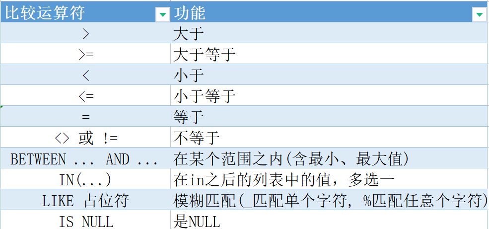

  - 注意
    - BETWEEN... AND... 范围包含最大值和最小值

    - IS NOT NULL 表示非空

- 逻辑运算符

  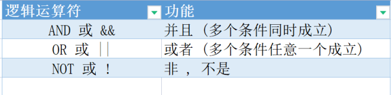

#### 7.5、聚合函数

- 语法

  ```sql
  SELECT 聚合函数(字段列表) FROM 表名;
  ```

- 常用聚合函数

  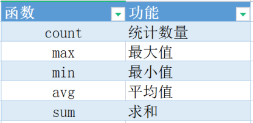


#### 7.6、分组查询

- 语法

  ```sql
  SELECT 字段列表 FROM 表名 [WHERE 条件] GROUP BY 分组字段名 [HAVING 分组后过滤条件];
  ```

- WHERE 和 HAVING 的区别

  - 执行时间不同：WHERE 在分组之前执行，不参与分组；HAVING 在分组之后执行
  - 判断条件不同：WHERE 不能对聚合函数做判断；HAVING 可以

- 注意：

  - 分组后，查询字段一般为聚合函数和分组字段，查询其他字段没有意义；
  - 执行顺序：WHERE > 聚合函数 > HAVING
  - 可以支持多字段分组：GROUP BY COLUME1, COLUME1, ...

- 案例

  ```sql
  # 查询年龄小于45的员工，并根据家庭地址分组，获取员工数量大于等于3的家庭地址
  SELECT address, COUNT(*) num FROM employee WHERE age < 45 GROUP BY address HAVING num >= 3;
  
  # 统计各个家庭地址上上班的男性和女性的员工数量
  SELECT address, gender, COUNT(*) "数量" FROM employee GROUP BY address, gender;
  ```

#### 7.7、排序查询

- 语法

  ```sql
  SELECT 字段列表 FROM 表名 ORDER BY 字段1 排序方式1, 字段 排序方式2, ... ; 
  ```

- 排序方式：

  - ASC 升序 默认
  - DESC 降序

#### 7.8、分页查询

- 语法

  ```sql
  SELECT 字段列表 FROM 表名 LIMIT 起始索引, 查询记录数;
  ```

- 注意

  - 起始索引从 0 开始
  - 起始索引 = （查询页码 - 1） * 每页记录数
  - LIMIT 是 MySQL 实现的
  - 如果只查第一页数据，起始索引可以省略

#### 7.9、执行优先级

```sql
SELECT 字段列表				# 4
FROM 表名					# 1
WHERE 条件列表				# 2
GROUP BY 分组字段			# 3
HAVING 分组后条件列表
ORDER BY 排序字段列表			# 5
LIMIT 分页参数				# 6
```

- 执行顺序

  ```sql
  FROM ... WHERE ... GROUP BY ... SELECT ... ORDER BY ... LIMIT ...
  ```

## 三、函数

### 1、数值函数

- 数值运算

  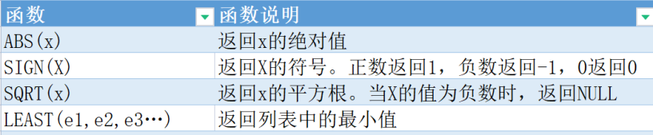

### 2、字符串函数

- 字符串处理（CONCAT 会用）

  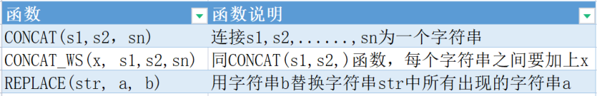

### 3、日期函数

- 处理日期相关（较少使用）

  

### 4、流程函数

- 控制 sql 执行顺序（很少使用）

  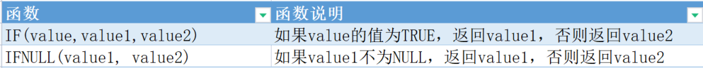

### 5、加密解密函数

- 做加密解密（不用）

  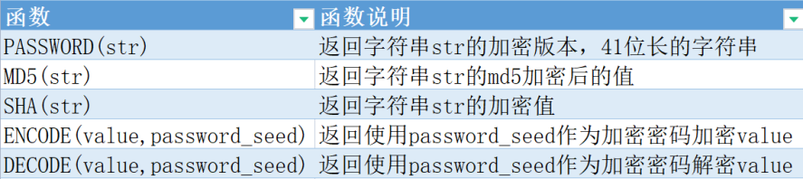

## 四、约束

### 1、概念

- 作用表中字段的规则，用于限制存储在表中的数据

### 2、目的

- 保证数据库中数据的正确性、有效性和完整性

### 3、MySQL 中的约束

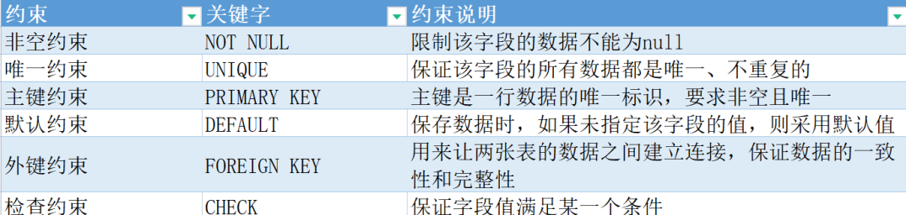

### 4、外键约束

- 用来建立两张表之间的联系，为了保证数据的一致性和完整性

- 添加外键

  ```sql
  # 方式一：建表时定义
    CREATE TABLE 表名(
        字段1 字段1类型 [COMMENT 字段1注释],
        ......
        字段n 字段n类型 [COMMENT 字段n注释],
        [CONSTRAINT] [外键名] FOREIGN KEY(外键字段名) REFERENCES 主表(主表列名)
    )[COMMENT 表注释];
    
  # 方式二：
  ALTER TABLE 表名 ADD CONSTRAINT 外键名 FOREIGN KEY(外键字段名) REFERENCES 主表(主表列名);
  ```

- 删除外键

  ```sql
  ALTER TABLE 表名 DROP FOREIGN KEY 外键名;
  ```

- 删除更新外键

  添加了外键之后，删除父表数据时产生约束行为，称为删除和更新行为；

  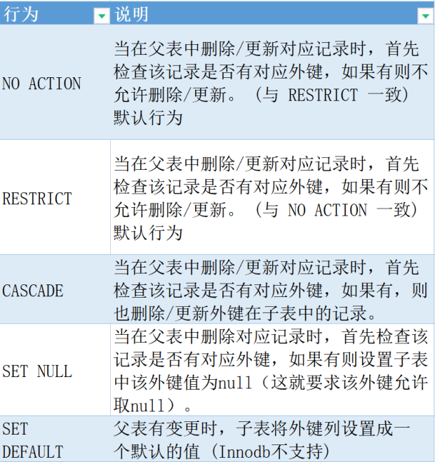

  ```sql
  ALTER TABLE 表名 ADD CONSTRAINT 外键名 FOREIGN KEY(外键字段名) REFERENCES 主表(主表列名) ON UPDATE CASCADE ON DELETE CASCADE;
  ```

  父表会删除或者更新子表中的外键数据；

## 五、多表关系

### 1、一对一关系

1. 用户和用户信息
2. 关系：一对一
3. 用途：用于单表拆分，将一张表的基础字段放在一张表中，其他字段放在另一张表中，可以提升查询效率
4. 实现：在一张表中添加外键，关联另一张表的主键

### 2、一对多关系

1. 部门和员工关系
2. 关系：一个部门对应多个员工，一个员工对应一个部门
3. 实现：在多的一方建立指向一的一方的主键

### 3、多对多关系

1. 角色和菜单关系，学生和老师
2. 关系：一个学生有多个老师，一个老师有多个学生
3. 实现：建立三方表，中间表包含两方表的主键

## 六、多表查询

### 1、笛卡尔积

- 在数学中表示集合A和集合B的所有组合

  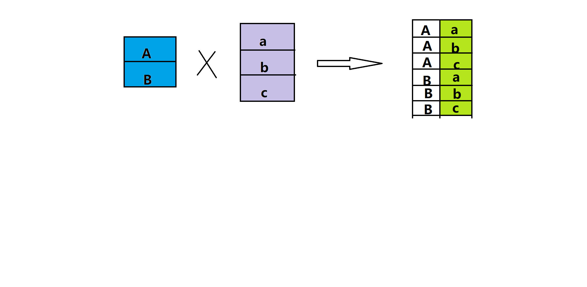

- 在 SQL 消除笛卡尔积？

  - 加上一定的条件

### 2、分类

1. 连接查询

   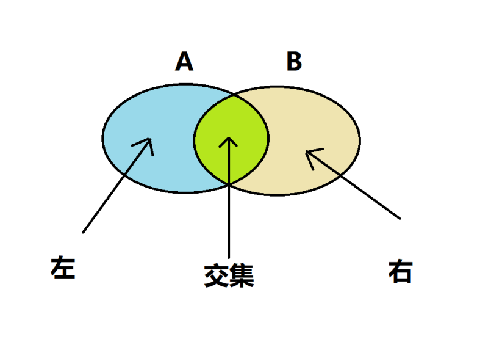

   1. 内连接（交集数据）

      - 隐式内连接

        - 语法

          ```sql
          SELECT 字段列表 FROM 表1, 表2 WHERE 条件 ... ;
          ```

      - 显示内连接

        - 语法

          ```sql
          SELECT 字段列表 FROM 表1 [INNER] JOIN 表2 ON 连接条件 ... ;
          ```

      - 注意：一旦起别名，就不能使用表名

   2. 外连接

      - 左外连接（左表数据，包含交集数据）

        - 语法

          ```sql
          SELECT 字段列表 FROM 表1 LEFT [OUTER] JOIN 表2 ON 连接条件 ... ;
          ```

      - 右外连接（右表数据，包含交集数据）

        - 语法

          ```sql
          SELECT 字段列表 FROM 表1 RIGHT [OUTER] JOIN 表2 ON 连接条件 ... ;
          ```

      - 注意：左外连接、右外连接可以相互替换

   3. 自连接

      - 自己连接自己，把一张表当成两张表来查询

      - 语法

        ```sql
        SELECT 字段列表 FROM 表A 别名A JOIN 表A 别名B ON 条件 ... ; 
        ```

      - 注意

        - 必须使用别名
        - 内外连接查询都可以

   4. 联合查询

      - union 查询

        - 把多次查询的结果合并起来，形成一个新的查询结果集，**会去重**

      - union all 查询

        - 将全部的数据合并到一起，不会去重

      - 语法

        ```sql
        SELECT 字段列表 FROM 表名 ...
        UNION [ALL]
        SELECT 字段列表 FROM 表名 ... ;
        ```

      - 要求

        - 必须保持查询的列长度一致，字段类型也需要保持一致

2. 子查询

   - 语法

     ```sql
     SELECT 字段列表 FROM t1 WHERE column1 = (SELECT column1 FROM t2)
     ```

   - 对于增删改都适用

   1. 标量子查询
      - 查询出来的结果是单个值
      - 常用一些操作符
        - =
        - !=
        - \>
        - <
        - \>=
        - <=
   2. 列子查询
      - 查询出来是个一列
      - 常用操作符：
        - IN
        - NOT IN
        - ANY 任意一个满足就行
        - SOME 同上，可以替换
        - ALL
   3. 行子查询
      - 查询出来是个一行
      - 常用操作符：
        - =
        - !=
        - IN
        - NOT IN
   4. 表子查询
      - 查询出来是个多行多列
      - 常用操作符：
        - IN

## 七、存储引擎

### 1、MySQL 体系结构

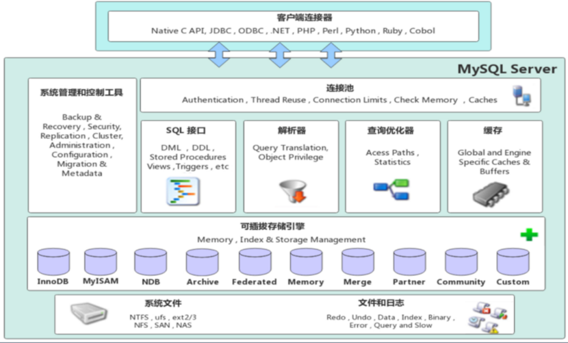

- 连接层
  - 包含 Socket 通信以及 TCP/IP 通信的客户端连接，主要去完成类似于连接处理，授权认证，包含线程池的概念，通过 SSL 保证和验证安全连接的权限
- 服务层
  - SQL 接口，缓存查询，SQL 的分析和优化，包含一些内置函数的执行，优化 sql 确定表的查询顺序，以及是否用索引也是在这里生成相应的执行操作；
  - 查询语句还会查询内部的缓存，提高查询效率
- 引擎层
  - 真正的负责 MySQL 中的数据的存储和查取，服务器通过 API 和存储引擎通信；
  - 不同的引擎具有不同的功能，根据业务需求选取引擎
- 存储层
  - 做数据库的存储和提取，数据、索引、二进制日志、错误日志、查询日志、慢查询日志等系统文件上，通过存储引擎进行交互

MySQL 默认使用 InnoDB 引擎：

- 查看创建表的语句

  ```sql
  SHOW CREATE TABLE emp;
  ```

- 查看当前数据库支持的引擎

- 默认的存储引擎可在 my.ini 配置文件中使用 default-storage-engine 选项指定

- 修改存储引擎

  ```sql
  ALTER TABLE tablename ENGINE = InnoDB;
  ```

- 如何在创建表的时候添加引擎

  ```sql
  CREATE TABLE 表名(
  	字段1 字段1类型 [COMMENT 字段1注释],
      字段2 字段2类型 [COMMENT 字段2注释],
      字段3 字段3类型 [COMMENT 字段3注释],
      ......
      字段n 字段n类型 [COMMENT 字段n注释],
  )ENGINE=InnoDB;
  ```

### 2、InnoDB

1. 概述

   - InnoDB 数据引擎是一种兼顾高可信和高性能的通用存储引擎，5.5 之后默认的存储引擎

2. 特点

   - 支持事务（DML 遵循 ACID 模型）
   - 支持外键 FOERIGN KEY 约束，保证数据的完整性和正确性
   - 支持行级锁，提高并发访问性能

3. 文件

   - tableName.idb
   - InnoDB 会为每张表生成一个对应的表空间文件，存储表的结构、数据、索引

4. 注意

   - MySQL 提供了打开idb 二进制文件的指令

     ```sql
     # 新版本
     idb2sdi
     # 旧版本
     idb2frm
     ```

5. 存储结构图

   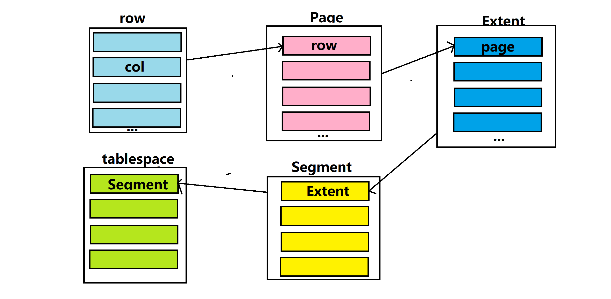

   - 表空间 tablespace
     - InnoDB 存储引擎逻辑结构的最高层，idb 文件就是表空间文件；
     - 表空间中包含多个 Segment （段）；
   - 段 Segment
     - 数据段、索引段、回滚段；
     - 一个段里面包含多个区；
   - 区 Extent
     - 表空间的单元结构，每个区大小为 1M ；
     - 一个区包含 64 页数据；
   - 页 Page
     - 页是最小的组成单元，它是 InnoDB 存储引擎磁盘管理的最小单元；
     - 大小默认是 16K ；
   - 行 row
   - 每一行定义存储字段，还有一些隐藏字段

### 3、MyISAM

1. 概述
   - 是 MySQL 早期的存储引擎；
2. 特点
   - 不支持事务，不支持外键；
   - 支持表锁，不支持行锁；
   - 访问速度快；
3. 文件
   - emp.sdi：存储表结构的信息；
   - emp.MYD：存储数据；
   - emp.MYI：存储索引；

### 4、Memory

1. 概述
   - 使用内存来进行操作，会受到断电影响，是能用来做临时表或缓存
2. 特点
   - 内存存放，支持 Hash 索引（默认），查询速度快；
3. 文件
   - sdi：存储表结构信息

### 5、存储引擎的选用

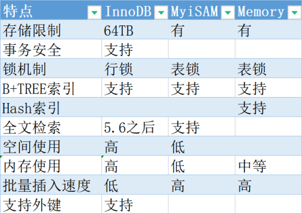

- InnoDB
  - 支持事务和外键；
  - 应用对于事务的完整性有比较高要求的时候选择InnoDB（更新、删除）；
- MyISAM
  - 应用在对插入比较多的地方（更新和删除少）并且对事务的完整性、并发性要求不高；
- Memory
  - 把数据保存到内存中，访问速度快，对于临时表缓存非常友好，对于表的大小有限制，不能去保证数据安全；

### 6、事务

#### 6.1、概述

- 一定要使用 InnoDB 存储引擎；
- 一组操作的集合，是不可分割的工作单元，会把一部分当成一个整体来处理，事务会把操作同时提交或者撤销；要么同时成功，要么同时失败；

#### 6.2、事务操作

- 案例：转账

- 控制事务方式1

  - 查看事务提交方式

    ```sql
    # 1:自动提交 0:手动提交
    SELECT @@autocommit;
    ```

  - 设置事务提交方式

    ```sql
    SET @@autocommit=0;
    ```

  - 提交事务‘

    ```sql
    commit;
    ```

  - 回滚事务

    ```sql
    rollback;
    ```

- 控制事务方式2

  - 开启事务

    ```sql
    start transaction 或者 begin;
    ```

  - 提交事务

    ```sql
    commit;
    ```

  - 回滚事务

    ```sql
    rollback;
    ```

#### 6.3、事务作用对象

- 只能回滚 insert、update、delete 语句
- 不能回滚 select 语句，没有意义
- 不能回滚 create、drop、alter 语句

#### 6.4、事务的四大特征（ACID）

- 原子性（Atomicity）：
  - 整个事务中的所有操作必须作为一个单元全部完成（或者全部取消）不可分割，要么全部成功，要么全部失败；
- 一致性（Consistency）：
  - 事务完成时，数据保持一致状态；
- 隔离性（Isolation）：
  - 数据库会提供隔离机制，并发不会相互影响和干扰；
  - 一个事务不会影响其他事务的运行
- 持久性（Durability）：
  - 在事务完成以后，对数据库所做的更改将持久的保存在数据库之中，并不会被回滚

#### 6.5、并发事务的问题（面试常问）

- 脏读
  - 一个事务读取到另一个事务还没提交的数据；
- 不可重复度
  - 一个事务先后读取同一条数据，但两次读取数据不同；
- 幻读
  - 一个事务按照条件查询数据时，没有对应的数据行，但在插入数据时，有发现这行数据已经存在，好像出现了“幻影”；

#### 6.6、事务的隔离级别

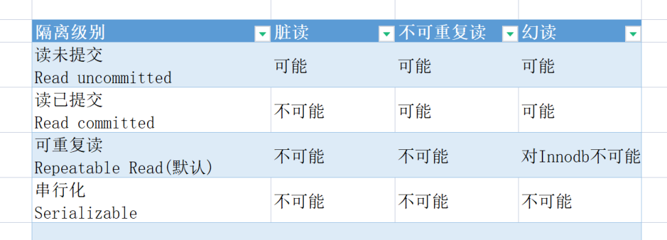

- 注意

  - 隔离级别越高，数据越安全，但性能越低；
  - 需要在性能和安全之间进行取舍；

- 查看隔离级别

  ```sql
  SELECT @@TRANSACTION_ISOALTION;
  
  # 默认使用可重复度
  REPEATABLE-READ
  ```

- 设置隔离级别

  ```sql
  SET [SESSION | GLOBAL] TRANSACTION ISOLATION LEVEL {READ UNCOMMITTED | READ COMMITTED | REPEATABLE READ | SERIALIZABLE};
  ```

- 隔离级别分为全局和会话级

  - 全局：对所有会话有效；
  - 会话级：只对当前会话有效；

- 四种隔离级别

  1. **读未提交**：指一个事务还没提交时，它做的变更就能被其他事务看到；
  2. **读已提交**：指一个事务提交之后，它做的变更才能被其他事务看到；
  3. **可重复度**：指一个事务执行过程中看到的数据，一直跟这个事务启动时看到的数据是一致的，MySQL InnoDB 引擎的默认隔离级别；
  4. **串行化**：会对记录加上读写锁，在多个事务对这条记录进行读写操作时，如果发生了读写冲突的时候，后访问的事务必须等前一个事务执行完成，才能继续执行；


#### 6.7、演示

- READ UNCOMMITTED

  | 会话1                                                     | 会话2                               |
  | --------------------------------------------------------- | ----------------------------------- |
  | use transaction;                                          | use transaction;                    |
  | set  global transaction isolation level read uncommitted; |                                     |
  | start transaction;                                        |                                     |
  |                                                           | start transaction;                  |
  | insert into account values(1, 'ty',100);                  |                                     |
  |                                                           | select * from account where id = 1; |
  | rollback;                                                 |                                     |
  |                                                           | select * from account where id = 1; |

- READ COMMITTED

  | 会话1                                                   | 会话2                                |
  | ------------------------------------------------------- | ------------------------------------ |
  | set  global transaction isolation level read committed; |                                      |
  | start transaction;                                      |                                      |
  |                                                         | start transaction;                   |
  | insert into account values(1, 'ty',100);                |                                      |
  | select * from account;                                  |                                      |
  |                                                         | select * from account;（查不出数据） |
  | commit;                                                 |                                      |
  |                                                         | select * from account;（查出数据）   |

- REPEATABLE READ

  | 会话1                                                    | 会话2                                |
  | -------------------------------------------------------- | ------------------------------------ |
  | set  global transaction isolation level repeatable read; |                                      |
  | start transaction;                                       |                                      |
  |                                                          | start transaction;                   |
  | insert into account values(1, 'ty',100);                 |                                      |
  |                                                          | select * from account;（查不出数据） |
  | commit;                                                  |                                      |
  |                                                          | select * from account;（查出数据）   |

## 八、索引

### 1、概述

- 索引（index）是帮助数据库高效获取数据的数据结构，数据库系统维护查找数据的特定数据结构，这些数据结构指向我们的数据，通过高效算法实现高效查找。

- 优缺点

  | 优点                                                  | 缺点                                   |
  | ----------------------------------------------------- | -------------------------------------- |
  | 提高查询速度，降低数据库 IO 成本                      | 索引也需要维护，需要占用存储空间       |
  | 通过索引列对数据进行排序，降低排序成本，降低 CPU 消耗 | 对于表的 INSERT UPDATE DELETE 效率降低 |

### 2、索引结构

#### 2.1、概述

- 存储引擎层支持索引，不同的存储引擎支持不同的索引

  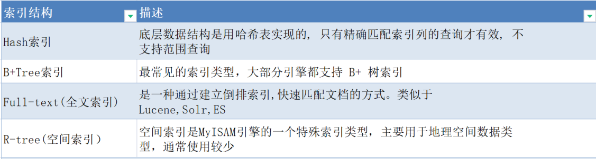

- 数据引擎和索引结构之间的关系

  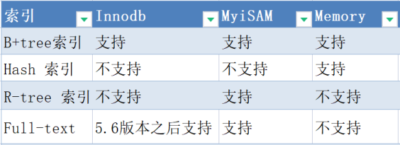

- 注意

  - 没有特别说明，提问的数据索引都是 B+ 树索引

#### 2.2、Hash 索引

- 使用 hash 算法，将键值换算成 hash 值，映射到对应的槽位上存储在 hash 表中
- 特点：
  - 查询非常快；
  - hash 只支持对等比较（= in），不支持范围查找（between > <）；
  - 不支持排序
  - 没有hash 冲突，查找一次就可以，比 B+ 树还快
- MySQL 支持 hash 索引的引擎是 Memory；InnoDB 后续支持 hash 索引是指定条件下自动构建的。

#### 2.3、二叉树

- 注意：加入 MySQL 构建二叉树数据结构索引，理想的是平衡的二叉树
- 问题：
  1. id 的插入的自增的，此时二叉树变成链表，查询性能低；
  2. 数据量很大，层级会变深，查询速度变慢；

#### 2.4、红黑树

- 问题：
  - 红黑树还是一颗二叉树，会存在层级较深，查询速度变慢；

#### 2.5、B-Tree

- 多叉路平衡查找树；

  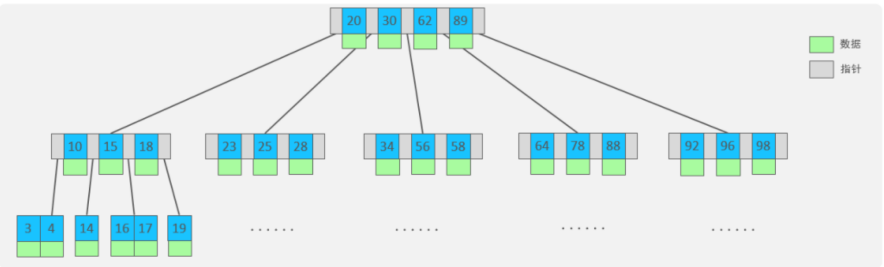

- 度数：一个节点的子节点数量；一棵树的最大度为n，那么每个节点最多可以存储 n-1 个值；

- 特点：

  - 5阶 B 树，每个节点最多有4 个 key ，5个指针；
  - 当存储元素达到 key 的数量时，中间元素向上分裂；
  - 叶子结点和非叶子节点都会存放数据；

#### 2.6、B+Tree

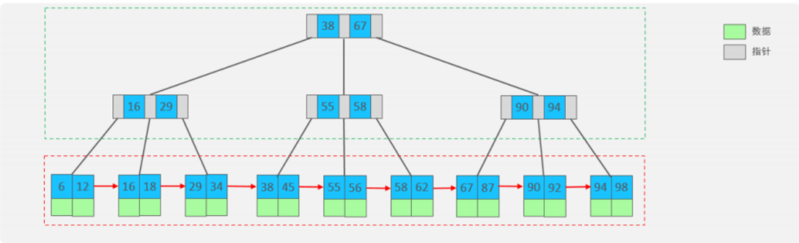

- 注意：
  - 叶子节点存放数据，非叶子节点存放索引；
  - 叶子节点通过指针进行关联，变成一个链表结构；
  - 当需要裂变时，非叶子节点的数据也会出现在叶子结点处；
  - MySQL 对 B+ Tree 进行优化：在原来 B+Tree 的基础上，增加了指向相邻叶子结点的链表指针；可以提高区间的访问性能；

### 3、索引的分类

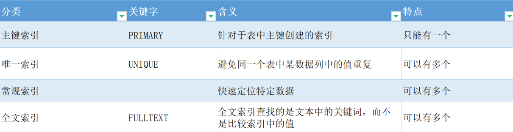

### 4、聚集索引与二级索引


- 注意：
  - 数据关联在聚集索引的子节点；
  - 二级索引只是关联聚集索引的 id ；
  - 非聚集索引的查询都是通过 **回表查询** 查询出的数据；
- 聚集索引选取规则：
  - 如果存在主键，选择主键作为聚集索引；
  - 不存在主键，选择第一个唯一索引（UNIQUE）作为聚集索引；
  - 以上都不满足，InnoDB 会默认生成一个 rowid 作为隐藏的聚集索引；

### 5、面试题

1. InnoDB 为什么选择 B+Tree 作为索引结构？

   - Hash 索引不支持范围查询，不支持排序；
   - 二叉树索引，层级加深后，查询效率降低；
   - B-Tree，叶子节点和非叶子结点都存放数据，每一页数据是 16K；如果非叶子节点存放数据，每一页存放的数据会变少，指针和键值会变少；
   - B树的非叶子结点既存索引又存数据，导致非叶子节点的存储的索引变少，不够矮胖；
   - B+树的叶子节点之间通过链表连接，对范围查找有利；B树则不是；

2. 分析 SQL ，判断查询效率高低？

   - id 是主键，name 建立了普通用索引

   ```sql
   # A
   select * from emp where id = 3;
   # B
   select * from emp name = "ez";
   ```

   - A > B；
   - A sql 使用聚集索引，直接返回行信息；
   - B sql 先使用二级索引，查找到 name = 'ez' 的 id，再通过 id 使用聚集索引查找到行信息；需要回表，效率低；

3. InnoDB 主键索引使用 B+Tree，能够存储多少数据？

   - 假设一行数据为 1K，一页可以存储16行数据；InnoDB 指针固定占用 6 个字节，主键bigint 8 int 4；
   - 高度为2：
     - 16 * 1024 = x * 8 + (x+1) * 6
   - 高度为3：
     - 1171 * 1171 * 16 = 千万级

### 6、索引语法

1. 查询索引

   ```sql
   SHOW INDEX FROM table_name;
   ```

2. 创建索引

   ```sql
   CREATE [UNIQUE | FULLTEXT] INDEX index_name ON table_name (index_col_name, ... );
   ```

3. 删除索引

   ```sql
   DROP INDEX index_name ON table_name;
   ```

### 7、SQL 性能分析

#### 7.1、SQL 执行频次

- 语法

  ```sql
  SHOW GLOBAL STATUS LIKE 'COM_+类型';
  # COM_INSERT: 插入次数
  # COM_UPDATE: 更新次数
  # COM_DELETE: 删除次数
  # COM_SELECT: 查询次数
  # COM_______: 所有
  ```

- 注意：

  - 通过语法，可以查询到数据库的实际状态，知道数据库是以增删改为主，还是以查询为主；
  - 如果数据库以查询为主，可以考虑 SQL 的索引优化；

#### 7.2、慢查询日志

- 记录超过指定时间的查询 SQL，指定参数（long_query_time=10，单位是秒，默认是10s）；

- 查看慢查询功能是否打开

  ```sql
  SHOW VARIABLES LIKE 'slow_query_log';
  ```

- my.ini 文件中可以设置

  - 参数 slow-query-log = 1：1 代表开启，0代表关闭；
  - 参数 long_query_time = 10：代表慢查询超过10s会被记录；
  - 参数 slow_query_log_file：慢查询的日志文件；

- 分析慢查询日志

  - 当 SQL 出现在慢查询日志中的时候，就可以考虑对这条 SQL 进行优化；

#### 7.3、Profile

- 概述

  - show profiles 能够用来做 SQL 优化，协助我们了解时间消耗去哪里

- 查看 Profile 是否开启

  ```sql
  SELECT @@Profiling;
  ```

- 设置 Profile 开启

  ```sql
  SET [SESSION | GLOBAL] profiling=1;
  ```

- 通过 profile 了解时间消耗

  ```sql
  #  每次执行 query_id 都会变
  SHOW profiles;
  
  # query_id 是使用 `SHOW profiles;` 查询出来的 query_id  查看详情
  SHOW profile FOR QUERY query_id;
  
  SHOW profile cpu FOR QUERY query_id;
  ```

#### 7.4、explain

- explain 或者 desc 后可以获取 MySQL 执行 select 语句的信息，包含索引选用、链接表等信息；

- 语法

  ```sql
  EXPLAIN 查询语句;
  ```

- 详细信息

  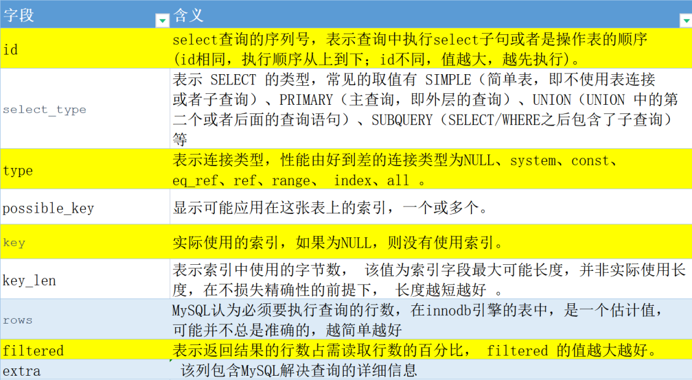

  - type：
    - const：使用主键索引或唯一索引时；
    - ref：普通索引；
    - range：查找范围；
    - all：全表查询；

#### 7.5、索引的使用

- 索引能提升查询速度，质的提升
- 最左前缀法则
  - 使用用联合索引；
  - 查询从索引最左列开始，不跳过其中的列；如果跳过，则索引失效（后面字段的索引失效）；
  - 最左前缀A+B+C：
    - ABC
    - AB
    - A
    - AC（A使用索引）
    - BC（不使用索引）
    - CBA（使用索引，查询优化器会优化成ABC）
- 索引失效
  1. 对索引使用函数运算；
  2. 字符串不加引号（MySQL 会自动把字符串转换成数字）；
  3. 模糊查询（左模糊匹配 或 左右模糊匹配）；
  4. 使用 or 连接（or 前后没有建立索引的时候不会被用到）；
  5. 联合索引中破坏最左匹配原则；
  6. 数据分布（MySQL 自己判断全表扫描比使用索引更优）；【性别】
  7. 比较时使用 >= 而不是 > ；

#### 7.6、索引的使用原则

1. 覆盖索引
   - SQL 中 query 的所有字段，在索引 B+Tree 的叶子节点上都能找得到的那些索引
   - 避免使用 select * from table_name;
   - 有可能避免回表查询（减少一次查询，提高效率；前提是查询的结果就在二级索引中）；

2. 前缀索引
   - 使用某个字段中字符串的前几个字符建立索引；
   - 减小索引字段大小，可以增加一个索引页中存储的索引值，有效提高索引的查询速度
   - 计算前缀长度（唯一索引的性能最高，唯一索引的前缀长度是1）
   - 不重复索引基数/数据表的总记录数；
   - 最短的前缀，同时前缀长度靠近1；
3. 单列索引和联合索引
   - 使用多个单列索引查询时，并不会全用索引，会根据 MySQL 优化器的指引进行选择

#### 7.7、索引的设计原则

1. 数据量大时，建立索引；
2. 针对经常查询的多列，建立联合索引；
3. 如果是字符串类型，而且数据量很大，尽量使用前缀索引；
4. 索引还需要控制数量，索引越多，增删改越慢；
5. 选择区分度高的列做索引，尽量建立唯一索引；
6. 设计列尽量不要存空数据；

## 九、SQL 优化

### 1、插入数据优化

1. 顺序插入代替乱序插入；

2. 批量插入代替单个数据插入；

3. 手动控制事务；

4. load 指令加载大数据量：

   1. 客户端连接服务端时，添加参数：--local-infile

      ```shell
      mysql --loacl-infile -u root -p
      ```

   2. 启动从本地加载文件开关

      ```sql
      SELECT @@local_infile;
      
      SET @@local_infile = 1;
      ```

   3. 执行 load 指令准备好的数据，加载到表结构中

      ```sql
      load data local infile '文件路径' into table `table_name` fields terminated by ',' lines terminated by '\n';
      ```

### 2、主键优化

1. 数据组织方式：
   - InnoDB 主键是按顺序存放的，乱序插入会导致页分裂（没有顺序插入导致）；
   - 页合并（删除）；
2. 设计主键原则
   1. 自动递增（auto_increament）：顺序插入，避免页分裂；
   2. 不要使用 UUID、电话号码作为主键；
   3. 不要修改主键；

### 3、order by 优化

1. MySQL 排序：

   - Using filesort：通过扫描索引或者全表，读取满足条件的行，在排序缓冲区 sort buffer 中排序，性能低；
   - **Using index**：通过有序索引顺序扫描之间返回有序结果，不需要额外排序，性能高；

2. 优化具体操作：

   - 不建立索引时，使用 filesort

   - 多字段 order by 排序时：需要建立联合索引；

   - 一个字段升序，一个字段降序：Using index，Using filesort

     ```sql
     # 解决办法：建立索引时指定字段时升序还是降序
     create index idx_p_a on user(phone, age desc); 
     ```

   - 两个字段都降序时：Backword index scan

3. 优化原则

   - 排序字段建立合适的索引，多字段排序，建立联合索引更快；
   - 一个升序一个降序时，创建索引时要指定排序规则；
   - 如果必须使用 filesort ，数据量比较大的时候，可以增大排序缓冲区的大小 sort_buffer_size(256K)；

### 4、group by 优化

1. 索引对分组的影响
   - Using temporary：没有建立索引的时候使用临时表，性能低；
   - Using index：使用到索引，性能高；
2. 优化
   - 分组时，建立相关索引；
   - 使用联合索引时，遵循最左原则；

### 5、limit 优化

1. 数据量很大的时候，limit 越往后，速度越慢，效率越低；
2. 优化：
   - 通过创建索引，覆盖索引，可以提升性能；
   - 连接查询，再把覆盖查询到的结果作为临时表再进行查询；

### 6、count 优化

1. 不同存储引擎：

   - InnoDB ：count(*) 需要一行一行从数据库读取数据，累加结果；
   - MyISAM ：存储的时候存放了一个总条数的值，直接获取，效率高；条件查询，性能低；

2. count 用法（面试）

   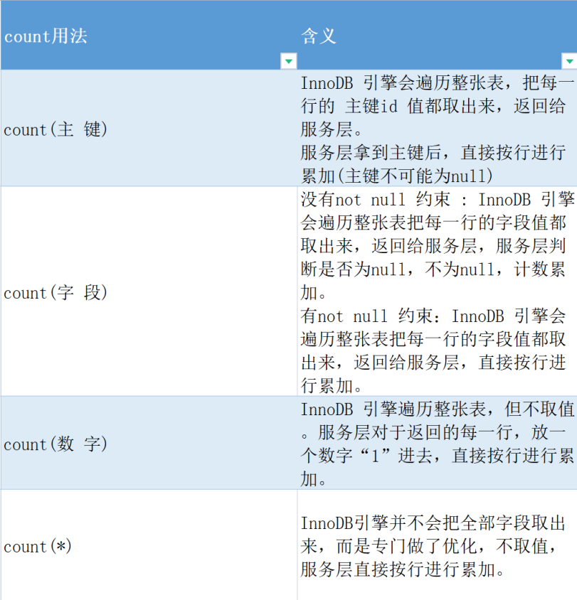

   1. count(主键)：遍历整张表，取 id；
   2. count(字段)：需要取值，并且需要判断是否为 null；
   3. count(*)：不需要取值
   4. count(数字)：不需要取值

3. 排序效率

   ```sql
   count(*) = count(1) > count(主键) > count(字段)
   ```

### 7、update 优化

1. InnoDB 引擎的三大特点：事务、外键、行级锁；

2. 行锁

   ```sql
   update user set name = 'xx' where id = 1;	# 成功
   update user set name = '3' where id = 3;	# 成功
   ```

3. 表锁

   ```sql
   update user set phone = '1' where name = "曹操";	# 表锁
   update user set phone = '1' where id = 4;		# 出现阻塞
   ```

4. 优化点

   - **InnoDB 的行锁是针对索引加的锁，并不是针对记录加的锁，如果没有索引或者索引失效将导致行锁升级为表锁；**

## 十、三范式

### 1、第一范式

- 每列都是不可再分的最小单元；

### 2、第二范式

- 每个表只能描述一件事情，其他非主键字段完全依赖于主键字段；
- 针对多对多关系；

### 3、第三范式

- 非主键不能传递依赖于主键字段（不要产生传递依赖）；

### 4、总结

- 第一范式：有主键，具有原子性，字段不可分割；
- 第二范式：完全依赖，没有部分依赖；非主键字段完全依赖于主键字段；
- 第三范式：没有传递依赖；非主键字段不能传递依赖于主键字段；
- 注意：实际快发中，不是完全遵循三范式，会经常使用冗余字段；

## 十一、视图

不是重点

### 1、概述

- 视图（View）是一种虚拟存在的表，视图中的数据并不是在数据库中实际存在的，行和列数据来自定义视图查询中使用的表，并且是是使用视图是动态生成式；
- 视图值保存查询的 SQL 逻辑，不保存保存查询结果，所以创建视图时，主要的工作落在创建这条 SQL 查询语句上；

### 2、创建

```sql
CREATE [OR REPLACE] VIEW 视图名称[列表名称] AS SELECT语句 [WITH [CASCADE | LOCAL] CHECK OPTION];
```

### 3、查询

```sql
SHOW CREATE VIEW 视图名称;

SELECT * FROM 视图名称;
```

### 4、修改

```sql
CREATE [OR REPLACE] VIEW 视图名称[列表名称] AS SELECT语句 [WITH [CASCADE | LOCAL] CHECK OPTION];

ALTER VIEW 视图名称[列表名称] AS SELECT语句 [WITH [CASCADE | LOCAL] CHECK OPTION];
```

### 5、删除

```sql
DROP VIEW [IF EXISTS] 视图名称 [, 视图名称] ...;
```

## 十二、存储过程

### 1、概述

- 经过实现编译并存储到数据库中的一段 SQL 的集合，类似于 Java 的方法；

### 2、语法

1. 创建

   ```sql
   CREATE PROCEDURE 存储过程名称 ([ 参数列表 ]) BEGIN
   	-- SQL语句 
   END ;
   ```

2. 查看

   ```sql
   -- 查询指定数据库的存储过程及状态信息
   SELECT * FROM INFORMATION_SCHEMA.ROUTINES WHERE ROUTINE_SCHEMA = 'xxx';
   
   -- 查询某个存储过程的定义
   SHOW CREATE PROCEDURE 存储过程名称 ; 
   ```

3. 调用

   ```sql
   CALL 名称 ([ 参数 ]);
   ```

4. 删除

   ```sql
   DROP PROCEDURE [ IF EXISTS ] 存储过程名称;
   ```

   ```sql
   drop tables if EXISTS test;
   create table test(id int, name varchar(255));
   
   -- 创建存储过程,定义存储方法
   create procedure batchInsert(in args int)
   begin
   declare i int default 1;
   -- 开启事务(重要!不开的话,100w数据需要论天算)
   start transaction;
   while i <= args do
   	insert into test(id,name) value(i,concat("软件工程-",i));
   set i = i+ 1;
   end while;
   commit;
   end
   
   #调用
   call batchInsert(100000);
   
   #查询指定数据库的名称的存储过程
   select * from INFORMATION_SCHEMA.ROUTINES WHERE ROUTINE_SCHEMA = 'index';
   #查询指定存储过程的详细信息
   show create PROCEDURE batchInsert;
   
   #删除指定的存储过程
   drop PROCEDURE if EXISTS batchInsert
   ```

### 3、变量

1. 系统变量

   - 查看系统变量

     ```sql
     show [session|global] variables; #所有变量
     select @@系统变量名 #查询指定变量
     select @@local_infile #查看导入开关是否打开
     ```

   - 设置系统变量值

     ```sql
     set [session|global] 变量名=值
     #设置事务自动提交
     set global autocommit=1;
     ```

2. 用户自定义变量

   - 赋值

     ```sql
     SET @var_name = expr [, @var_name = expr] ... ; SET @var_name := expr [, @var_name := expr] ... ;
     SELECT @var_name := expr [, @var_name := expr] ... ; SELECT 字段名 INTO @var_name FROM 表名;
     ```

   - 查询

     ```sql
     select @@var_name;
     ```

3. 局部变量

   - 声明

     ```sql
     DECLARE 变量名 变量类型 [DEFAULT ... ] ;
     ```

   - 赋值

     ```sql
     SET 变量名 = 值 ; 
     SET 变量名 := 值 ;
     SELECT 字段名 INTO 变量名 FROM 表名 ... ;
     ```

   - 演示

     ```sql
     create procedure select_sy()
     begin
     	declare user_count int default  0;
     	select count(*) into user_count from user;
     	select user_count;
     end;
     
     call select_sy();
     ```

## 十三、触发器

### 1、概述

- 在 insert \ update \ delete 之前或之后出发并执行触发器中的 SQL 语句的集合；

### 2、类型

- NEW OLD 是别名，用来引用触发器中发生变化的记录内容；

| 触发器 | NEW 或者 OLD                                                 |
| ------ | ------------------------------------------------------------ |
| INSERT | NEW 表示将要或者已经新增的数据                               |
| UPDATE | OLD 表示修改之前的数据；NEW 表示将要或者已经修改之后的数据； |
| DELETE | OLD 表示将要或者已经删除的数据                               |

### 3、创建

```sql
CREATE TRIGGER trigger_name 
BEFORE/AFTER INSERT/UPDATE/DELETE 
ON tbl_name FOR EACH ROW -- 行级触发器 BEGIN
	trigger_stmt ; 
END;
```

### 4、查看

```sql
SHOW TRIGGERS ;
```

### 5、删除

```sql
-- 如果没有指定 schema_name，默认为当前数 据库 
DROP TRIGGER [schema_name.]trigger_name ; 
```

### 6、演示

```sql
CREATE TRIGGER user_log_test1 
AFTER delete 
ON user FOR EACH ROW -- 行级触发器
BEGIN
	insert into user_log values(null,'delete',now());
END;

show triggers;

delete  from user where id = 2;

DROP TRIGGER user_log_test ;
```

## 面试问题

1、查询怎么优化

1. 通过慢查询日志来找到具体的 SQL 语句；
2. 没有所以就就建立索引；
3. 如果有索引，还是慢查询，就使用 explain 来查看是否是索引失效；

2、INSERT 如何优化

profile 来交接 SQL 的时间消耗都在哪里

`SHOW GLOBAL STATUS LIKE 'COM_+类型';` 查看增删改查的执行频次；