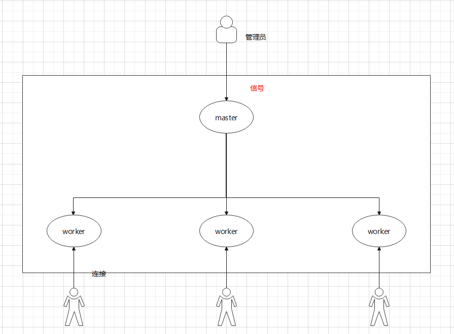

## 一、概述

### 1、背景介绍

Nginx（“engine x”）一个具有高性能的**HTTP**和**反向代理**的WEB服务器，同时也是一个**POP3/SMTP/IMAP**代理服务器。

Nginx是由伊戈尔·赛索耶夫为俄罗斯访问量第二的[http://Rambler.ru](./http://link.zhihu.com/?target=http%3A//Rambler.ru)站点（俄文：Рамблер）开发的，第一个公开版本0.1.0发布于2004年10月4日，另外值得一提的是伊戈尔·赛索耶夫将Nginx的源码进行了开源，这也为Nginx的发展提供了良好的保障。

其特点是占有内存少，并发能力强，事实上nginx的并发能力确实在同类型的网页服务器中表现较好，中国大陆使用nginx网站用户有：百度、京东、新浪、网易、腾讯、淘宝等。

### 2、反向代理

**正向代理**

- 正向代理需要主动设置代理服务器ip或者域名进行访问，由设置的服务器ip或者域名去访问内容并返回

- 正向代理是**代理客户端**，为客户端收发请求，使真实客户端对服务器不可见。

- 用途：

  突破访问显示：通过代理服务器，可以突破自身ip访问限制，访问国外网站等
  提高访问速度：通常代理服务器都设置一个较大的硬盘缓冲区，会将部分请求的响应保存到缓冲区中，当其他用户再访问相同的信息时，则直接由缓冲区中取出信息，传给用户，以提高访问速度
  隐藏客户端真实ip：上网者可以通过正向代理的方法隐藏自己的ip，免受攻击

  

**反向代理**

- 正向代理需要配置代理服务器，而反向代理不需要做任何设置。

- 反向代理是**代理服务器**，为服务器收发请求，使真实服务器对客户端不可见。

- 用途：

  隐藏服务器真实ip：使用反向代理，可以对客户端隐藏服务器的ip地址
  负载均衡：反向代理服务器可以做负载均衡，根据所有真实服务器的负载情况，将客户端请求分发到不同的真实服务器上
  提高访问速度：反向代理服务器可以对静态内容及短时间内有大量访问请求的动态内容提供缓存服务，提高访问速度
  提供安全保障：反向代理服务器可以作为应用层防火墙，为网站提供对基于web的攻击行为（例如DoS/DDoS）的防护，更容易排查恶意软件等。还可以为后端服务器统一提供加密和SSL加速（如SSL终端代理），提供HTTP访问认证等。

  

### 3、Nginx 优点

> 为什么选择 Nginx？Nginx 性能为王

- 速度更快、并发更高
- 高扩展性、跨平台
- 高可靠性：用于反向代理，宕机的概率微乎其微
- 低内存消耗
- 单机支持10万以上的并发连接
- 热部署
- 最自由的 BSD 许可协议

### 4、Nginx 的功能特性及常用功能

### 5、Nginx 安装

安装 Nginx

```shell
sudo nala install nginx
```

启动 Nginx

```shell
sudo nginx
```

查看

```shell
ps -ef | grep nginx
```

停止 Nginx 服务

```shell
nginx -s stop
```

### 6、Nginx 目录结构分析

```shell
tree /usr/local/nginx
# whereis nginx
```


- conf:nginx：所有配置文件目录
  - nginx.conf：是 Nginx 的核心配置文件，这个文件非常重要，也是我们即将要学习的重点
- html：存放 Nginx 自带的两个静态的 html 页面
  - 50x.html：访问失败后的失败页面
  - index.html：成功访问的默认首页
- logs：记录入门的文件，当 Nginx 服务器启动后，这里面会有 access.log error.log 和 nginx.pid三个文件出现。
- sbin：是存放执行程序文件 Nginx
  - nginx：是用来控制 Nginx 的启动和停止等相关的命令。

### 7、Nginx 服务的信号控制

通过 ps 命令查看 Nginx 进程：


Nginx 后台进程包括一个 master 进程和多个 worker 进程：

- master 进程：主要用来管理 worker 进程，包括接受外界的信息；并将接收到的信号发送给各个 worker 进程；监控 worker 进程状态，当worker进程出现异常退出后，会自动重新启动新的 worker 进程
- worker 进程：专门用来处理用户请求的，各个 worker 进程之间是平等的并且相互独立，处理请求的机会也是一样的



作为管理员，只需要通过给 master 进程发送信号就可以来控制 Nginx ，这个时候需要有两个前提条件：一个是要操作的 master 进程ID，一个是信号。

- 进程ID：

  ```shell
  ps -ef | grep nginx
  ```

- 信号

  | 信号     | 作用                                                         |
  | -------- | ------------------------------------------------------------ |
  | TERM/INT | 立即关闭整个服务                                             |
  | QUIT     | "优雅"地关闭整个服务                                         |
  | HUP      | 重读配置文件并使用服务对新配置项生效                         |
  | USR1     | 重新打开日志文件，可以用来进行日志切割                       |
  | USR2     | 平滑升级到最新版的 Nginx                                     |
  | WINCH    | 所有子进程不在接收处理新连接，相当于给 work 进程发送 QUIT 指令 |

调用命令为：`kill -signal PID`

signal：即为信号；PID：即为获取到的 master 进程 ID

### 8、Nginx 的命令行控制

- -? / -h：显示帮助信息
- -v：打印版本号信息并退出
- -V：打印版本号信息和配置信息并退出
- -t：测试 nginx 的配置文件语法是否正确并退出
- -T：测试nginx的配置文件语法是否正确并列出用到的配置文件信息然后退出
- -q：在配置测试期间禁止显示非错误消息
- -s：signal信号，后面可以跟：
  - stop：快速关闭，类似于TERM/INT信号的作用
  - quit：优雅的关闭，类似于QUIT信号的作用
  - reopen：重新打开日志文件类似于 USR1 信号的作用
  - reload：类似于 HUP 信号的作用
- -p prefix：指定Nginx的 prefix 路径（默认为：/usr/local/nginx/）
- -c filename：指定Nginx的配置文件路径（默认为：conf/nginx.conf）
- -g：用来补充 Nginx 配置文件，向 Nginx 服务指定启动时应用全局的配置

### 9、Nginx 核心配置文件

nginx.conf

```shell
# 1 全局块
worker_processes  1;

# 2 events 块：影响 Nginx 服务器性能
events {
    worker_connections  1024;
}

# 3 http 块：重要：反向代理、日志
http {
    include       mime.types;
    default_type  application/octet-stream;
    sendfile        on;
    keepalive_timeout  65;

	# Nginx 虚拟主机的相关配置
    server {
        listen       80;
        server_name  localhost;
        location / {
            root   html;
            index  index.html index.htm;
        }
        error_page   500 502 503 504  /50x.html;
        location = /50x.html {
            root   html;
        }
    }
}
```

```shell
指令名	指令值;  #全局块，主要设置Nginx服务器整体运行的配置指令

#events块,主要设置 Nginx 服务器与用户的网络连接,这一部分对Nginx服务器的性能影响较大
events {	 
    指令名	指令值;
}
#http块，是 Nginx 服务器配置中的重要部分，代理、缓存、日志记录、第三方模块配置...             
http {		
    指令名	指令值;
    server { #server块，是Nginx配置和虚拟主机相关的内容
        指令名	指令值;
        location / { 
        #location块，基于Nginx服务器接收请求字符串与location后面的值进行匹配，对特定请求进行处理
            指令名	指令值;
        }
    }
	...
}
```

小结：

- nginx.conf 配置文件中默认有三大块：全局块、events块、http块
- http块中可以配置多个 server 块，每个 server 块又可以配置多个 location 块

#### 9.1 全局块

- user 指令

  用于配置运行 Nginx 服务器的 worker 进程的用户和用户组

  | 语法   | user user [group] |
  | ------ | ----------------- |
  | 默认值 | nobody            |
  | 位置   | 全局块            |

  > 该属性也可以在编译的时候指定，语法如下`./configure --user=user --group=group`，如果两个地方都进行了设置，最终生效的是配置文件中的配置。
  >
  > 使用 user 指令可以指定启动运行工作进程的用户及用户组，这样对于系统的权限访问控制的更加精细，也更加安全（403 没有访问目录的权限）

- work process 指令

  master_process：用来指定是否开启工作进程。

  | 语法   | master_process on\|off; |
  | ------ | ----------------------- |
  | 默认值 | master_process on;      |
  | 位置   | 全局块                  |

  worker_processes：用于配置 Nginx 生成工作进程的数量，这个是Nginx服务器实现并发处理服务的关键所在。理论上来说 workder process 的值越大，可以支持的并发处理量也越多，但事实上这个值的设定是需要受到来自服务器自身的限制，建议将该值和服务器 CPU 的内核数保存一致。

  | 语法   | worker_processes     num/auto; |
  | ------ | ------------------------------ |
  | 默认值 | 1                              |
  | 位置   | 全局块                         |

- 其他指令

  （1）daemon：设定 Nginx 是否以守护进程的方式启动。

  > 守护式进程是linux后台执行的一种服务进程，特点是独立于控制终端，不会随着终端关闭而停止。

  | 语法   | daemon on\|off; |
  | ------ | --------------- |
  | 默认值 | daemon on;      |
  | 位置   | 全局块          |

  （2）pid：用来配置 Nginx 当前master进程的进程号ID存储的文件路径。

  | 语法   | pid file;                              |
  | ------ | -------------------------------------- |
  | 默认值 | 默认为:/usr/local/nginx/logs/nginx.pid |
  | 位置   | 全局块                                 |

  > 该属性可以通过`./configure --pid-path=PATH`来指定

  （3）error_log：用来配置 Nginx 的错误日志存放路径

  | 语法   | error_log  file [日志级别];     |
  | ------ | ------------------------------- |
  | 默认值 | error_log logs/error.log error; |
  | 位置   | 全局块、http、server、location  |

  > 该属性可以通过`./configure --error-log-path=PATH`来指定
  >
  > 其中日志级别的值有：debug|info|notice|warn|error|crit|alert|emerg，翻译过来为调试|信息|通知|警告|错误|临界|警报|紧急，这块建议大家设置的时候不要设置成info以下的等级，因为会带来大量的磁盘 I/O 消耗，影响 Nginx 的性能。

  （4）include：用来引入其他配置文件，使 Nginx 的配置更加灵活

  | 语法   | include file; |
  | ------ | ------------- |
  | 默认值 | 无            |
  | 位置   | any           |


#### 9.2 events块

1. accept_mutex：用来设置 Nginx 网络连接序列化

   | 语法   | accept_mutex on\|off; |
   | ------ | --------------------- |
   | 默认值 | accept_mutex on;      |
   | 位置   | events                |

   > 这个配置主要可以用来解决常说的"惊群"问题。大致意思是在某一个时刻，客户端发来一个请求连接，Nginx后台是以多进程的工作模式，也就是说有多个worker进程会被同时唤醒，但是最终只会有一个进程可以获取到连接，如果每次唤醒的进程数目太多，就会影响Nginx的整体性能。如果将上述值设置为on(开启状态)，将会对多个Nginx进程接收连接进行序列号，一个个来唤醒接收，就防止了多个进程对连接的争抢。

2. multi_accept：用来设置是否允许同时接收多个网络连接

   | 语法   | multi_accept on\|off; |
   | ------ | --------------------- |
   | 默认值 | multi_accept off;     |
   | 位置   | events                |

   > 如果 multi_accept 被禁止了，Nginx 一个工作进程只能同时接受一个新的连接。否则，一个工作进程可以同时接受所有的新连接

3. worker_connections：用来配置单个worker进程最大的连接数

   | 语法   | worker_connections number; |
   | ------ | -------------------------- |
   | 默认值 | worker_connections 512;    |
   | 位置   | events                     |

   > 这里的连接数不仅仅包括和前端用户建立的连接数，而是包括所有可能的连接数。另外，number值不能大于操作系统支持打开的最大文件句柄数量。

4. use：用来设置 Nginx 服务器选择哪种事件驱动来处理网络消息

   | 语法   | use  method;   |
   | ------ | -------------- |
   | 默认值 | 根据操作系统定 |
   | 位置   | events         |

   > 注意：此处所选择事件处理模型是 Nginx 优化部分的一个重要内容，method的可选值有 select/poll/epoll/kqueue 等，之前在准备 CentOS 环境的时候，我们强调过要使用 Linux 内核在2.6以上，就是为了能使用epoll函数来优化 Nginx。
   >
   > 另外这些值的选择，我们也可以在编译的时候使用
   >
   > `--with-select_module`、`--without-select_module`、
   >
   > ` --with-poll_module`、` --without-poll_module`来设置是否需要将对应的事件驱动模块编译到Nginx的内核。

5. events指令配置实例

   ```shell
   events{
   	accept_mutex on;
   	multi_accept on;
   	worker_commections 1024;
   	use epoll;
   }
   ```

   启动测试

   ```shell
   nginx -t
   nginx -s reload
   ```

#### 9.3 http 块

**（1）定义 MIME-TYPE**

> 浏览器中可以显示的内容有HTML、XML、GIF等种类繁多的文件、媒体等资源，浏览器为了区分这些资源，就需要使用MIME Type。所以说MIME Type是网络资源的媒体类型。Nginx 作为 Web 服务器，也需要能够识别前端请求的资源类型。

在 Nginx 的配置文件中，默认有两行配置

```
include mime.types;
default_type application/octet-stream;
```

default_type：用来配置 Nginx 响应前端请求默认的 MIME 类型。

| 语法   | default_type mime-type;   |
| ------ | ------------------------- |
| 默认值 | default_type text/plain； |
| 位置   | http、server、location    |

> 在default_type之前还有一句`include mime.types`，相当于把 mime.types 文件中MIMT类型与相关类型文件的文件后缀名的对应关系加入到当前的配置文件中。

MIME 实战案例

```json
location /text {
	default_type text/plain;
    return 200 "response text";
}
```

```json
location /json {
    default_type application/json;
    return 200 '{"name":"zhangsan","age":18}';
}
```

**（2）自定义日志服务**

 Nginx中日志的类型分 access.log、error.log：

- access.log：用来记录用户所有的访问请求
- error.log：记录 Nginx 本身运行时的错误信息，不会记录用户的访问请求

Nginx 服务器支持对服务日志的格式、大小、输出等进行设置，需要使用到两个指令，分别是 access_log 和 log_format 指令：

- access_log：用来设置用户访问日志的相关属性

  | 语法   | access_log path[format[buffer=size]] |
  | ------ | ------------------------------------ |
  | 默认值 | access_log logs/access.log combined; |
  | 位置   | `http`, `server`, `location`         |

- log_format：用来指定日志的输出格式

  | 语法   | log_format name [escape=default\|json\|none] string....; |
  | ------ | -------------------------------------------------------- |
  | 默认值 | log_format combined "...";                               |
  | 位置   | http                                                     |

**（3）其他配置指令**

- sendfile：用来设置 Nginx 服务器是否使用sendfile()传输文件，该属性可以大大提高 Nginx 处理静态资源的性能

  | 语法   | sendfile on\|off；     |
  | ------ | ---------------------- |
  | 默认值 | sendfile off;          |
  | 位置   | http、server、location |

- keepalive_timeout：用来设置长连接的超时时间

  | 语法   | keepalive_timeout time; |
  | ------ | ----------------------- |
  | 默认值 | keepalive_timeout 75s;  |
  | 位置   | http、server、location  |

  > 为什么要使用keepalive?
  >
  > 我们都知道HTTP是一种无状态协议，客户端向服务端发送一个TCP请求，服务端响应完毕后断开连接。
  > 如何客户端向服务端发送多个请求，每个请求都需要重新创建一次连接，效率相对来说比较多，使用keepalive模式，可以告诉服务器端在处理完一个请求后保持这个TCP连接的打开状态，若接收到来自这个客户端的其他请求，服务端就会利用这个未被关闭的连接，而不需要重新创建一个新连接，提升效率，但是这个连接也不能一直保持，这样的话，连接如果过多，也会是服务端的性能下降，这个时候就需要我们进行设置其的超时时间。

- keepalive_requests：用来设置一个keep-alive连接使用的次数

  | 语法   | keepalive_requests number; |
  | ------ | -------------------------- |
  | 默认值 | keepalive_requests 100;    |
  | 位置   | http、server、location     |

**（4）server块和location块**

```shell
server {
    listen       80;				   # 端口号
    server_name  localhost;			    # IP 地址
    location / {
        root   html;				   # 根目录所在位置
        index  index.html index.htm;	# 首页文件资源
    }

    error_page   500 502 503 504 404  /50x.html;
    location = /50x.html {
        root   html;
    }
}
```

## 二、Nginx 服务与系统

### 1、Nginx 配置成系统服务

把Nginx应用服务设置成为系统服务，方便对Nginx服务的启动和停止等相关操作，具体实现步骤:

（1）在`/usr/lib/systemd/system`目录下添加nginx.service,内容如下:

```
vim /usr/lib/systemd/system/nginx.service
```

```
[Unit]
Description=nginx web service
Documentation=http://nginx.org/en/docs/
After=network.target

[Service]
Type=forking
PIDFile=/usr/local/nginx/logs/nginx.pid
ExecStartPre=/usr/local/nginx/sbin/nginx -t -c /usr/local/nginx/conf/nginx.conf
ExecStart=/usr/local/nginx/sbin/nginx
ExecReload=/usr/local/nginx/sbin/nginx -s reload
ExecStop=/usr/local/nginx/sbin/nginx -s stop
PrivateTmp=true

[Install]
WantedBy=default.target
```

（2）添加完成后如果权限有问题需要进行权限设置

```
chmod 755 /usr/lib/systemd/system/nginx.service
```

（3）使用系统命令来操作Nginx服务

```
启动: systemctl start nginx
停止: systemctl stop nginx
重启: systemctl restart nginx
重新加载配置文件: systemctl reload nginx
查看nginx状态: systemctl status nginx
开机启动: systemctl enable nginx
```

### 2、Nginx 命令配置到系统环境

前面介绍过Nginx安装目录下的二级制可执行文件`nginx`的很多命令，要想使用这些命令前提是需要进入sbin目录下才能使用，很不方便；

可以将该二进制可执行文件加入到系统的环境变量，这样的话在任何目录都可以使用 nginx 对应的相关命令。具体实现步骤如下:

（1）修改`/etc/profile`文件

```
vim /etc/profile
在最后一行添加
export PATH=$PATH:/usr/local/nginx/sbin
```

（2）使之立即生效

```
source /etc/profile
```

（3）执行nginx命令

```
nginx -V
```

## 三、Nginx 静态资源部署

### 1、Nginx 静态资源概述

通过浏览器发送一个HTTP请求实现从客户端发送请求到服务器端获取所需要内容后并把内容回显展示在页面的一个过程。这个时候，所请求的内容就分为两种类型，一类是静态资源、一类是动态资源：

- 静态资源即指在服务器端真实存在并且能直接拿来展示的一些文件，比如常见的html页面、css文件、js文件、图 片、视频等资源；
- 动态资源即指在服务器端真实存在但是要想获取需要经过一定的业务逻辑处理，根据不同的条件展示在页面不同这 一部分内容，比如说报表数据展示、根据当前登录用户展示相关具体数据等资源；

### 2、Nginx 静态资源配置指令

#### 2.1 listen 指令

listen：用来配置监听端口。

| 语法   | listen address[:port] [default_server]...;<br/>listen port [default_server]...; |
| ------ | ------------------------------------------------------------ |
| 默认值 | listen *:80 \| *:8000                                        |
| 位置   | server                                                       |

常用的设置方式如下：

```shell
listen 127.0.0.1:8000; # listen localhost:8000 监听指定的IP和端口
listen 127.0.0.1;	# 监听指定IP的所有端口
listen 8000;	# 监听指定端口上的连接
listen *:8000;	# 监听指定端口上的连接
```

default_server属性是标识符，用来将此虚拟主机设置成默认主机。所谓的默认主机指的是如果没有匹配到对应的address:port，则会默认执行的。如果不指定默认使用的是第一个server：

```shell
server{
	listen 8080;
	server_name 127.0.0.1;
	location /{
		root html;
		index index.html;
	}
}
server{
	listen 8080 default_server;
	server_name localhost;
	default_type text/plain;
	return 200 'Hello World';
}
```

#### 2.2 server_name 指令

server_name：用来设置虚拟主机服务名称。

| 语法   | server_name  name ...;<br/>name可以提供多个中间用空格分隔 |
| ------ | --------------------------------------------------------- |
| 默认值 | server_name  "";                                          |
| 位置   | server                                                    |

关于 server_name 的配置方式有三种，分别是：精确匹配、通配符匹配、正则表达式匹配

**配置方式一：精确匹配**

```shell
server {
	listen 80;
	server_name www.baidu.com www.jd.com;
	...
}
```

> hosts是一个没有扩展名的系统文件，可以用记事本等工具打开，其作用就是将一些常用的网址域名与其对应的IP地址建立一个关联“数据库”，当用户在浏览器中输入一个需要登录的网址时，系统会首先自动从hosts文件中寻找对应的IP地址，一旦找到，系统会立即打开对应网页，如果没有找到，则系统会再将网址提交DNS域名解析服务器进行IP地址的解析。
>
> - Windows：C:\Windows\System32\drivers\etc
> - CentOS：/etc/hosts

因为域名是要收取一定的费用，所以我们可以使用修改hosts文件来制作一些虚拟域名来使用。需要修改 `/etc/hosts`文件来添加：

```shell
vim /etc/hosts
127.0.0.1 www.baidu.com
127.0.0.1 www.jd.com
127.0.0.0 www.taiyi.org
```

**配置方式二：使用通配符配置**

server_name 中支持通配符"*",但需要注意的是通配符不能出现在域名的中间，只能出现在首段或尾段，如：

```shell
server {
	listen 80;
	server_name  *.baidu.com	www.baidu.*;
	#www.baidu.com abc.baidu.com www.baidu.cn
	...
}
```

**配置三：使用正则表达式配置**

server_name 中可以使用正则表达式，并且使用`~`作为正则表达式字符串的开始标记。

常见的正则表达式

| 代码  | 说明                                                       |
| ----- | ---------------------------------------------------------- |
| ^     | 匹配搜索字符串开始位置                                     |
| $     | 匹配搜索字符串结束位置                                     |
| .     | 匹配除换行符\n之外的任何单个字符                           |
| \     | 转义字符，将下一个字符标记为特殊字符                       |
| [xyz] | 字符集，与任意一个指定字符匹配                             |
| [a-z] | 字符范围，匹配指定范围内的任何字符                         |
| \w    | 与以下任意字符匹配 A-Z a-z 0-9 和下划线,等效于[A-Za-z0-9_] |
| \d    | 数字字符匹配，等效于[0-9]                                  |
| {n}   | 正好匹配n次                                                |
| {n,}  | 至少匹配n次                                                |
| {n,m} | 匹配至少n次至多m次                                         |
| *     | 零次或多次，等效于{0,}                                     |
| +     | 一次或多次，等效于{1,}                                     |
| ?     | 零次或一次，等效于{0,1}                                    |

配置如下：

```shell
server{
        listen 80;
        server_name ~^www\.\(w+)\.com$;
        default_type text/plain;
        return 200 $1  $2 ..;
}
# 注意 ~后面不能加空格，括号可以取值
```

**server_name 匹配执行顺序**：

由于 server_name 指令支持通配符和正则表达式，因此在包含多个虚拟主机的配置文件中，可能会出现一个名称被多个虚拟主机的 server_name 匹配成功，当遇到这种情况，当前的请求交给谁来处理呢？

```shell
server{
	listen 80;
	server_name ~^www\.\w+\.com$;
	default_type text/plain;
	return 200 'regex_success';
}

server{
	listen 80;
	server_name www.baidu.*;
	default_type text/plain;
	return 200 'wildcard_after_success';
}

server{
	listen 80;
	server_name *.baidu.com;
	default_type text/plain;
	return 200 'wildcard_before_success';
}

server{
	listen 80;
	server_name www.baidu.com;
	default_type text/plain;
	return 200 'exact_success';
}

server{
	listen 80 default_server;
	server_name _;
	default_type text/plain;
	return 444 'default_server not found server';
}
```

结论：

精准匹配 > 前置通配符 > 后置通配符 > 正则匹配 > 默认

#### 2.3 location 指令

location：用来设置请求的URI

| 语法   | location [  =  \|   ~  \|  ~*   \|   ^~   \|@ ] uri{...} |
| ------ | -------------------------------------------------------- |
| 默认值 | —                                                        |
| 位置   | server,location                                          |

uri变量是待匹配的请求字符串，可以不包含正则表达式，也可以包含正则表达式，那么 Nginx 服务器在搜索匹配 location 的时候，是先使用不包含正则表达式进行匹配，找到一个匹配度最高的一个，然后在通过包含正则表达式的进行匹配，如果能匹配到直接访问，匹配不到，就使用刚才匹配度最高的那个 location 来处理请求。

属性介绍：

**不带符号，要求必须以指定模式开始**

```shell
server {
	listen 80;
	server_name 127.0.0.1;
	location /abc {
		default_type text/plain;
		return 200 "access success";
	}
}
# 以下访问都是正确的
# http://192.168.200.133/abc
# http://192.168.200.133/abc?p1=TOM
# http://192.168.200.133/abc/
# http://192.168.200.133/abcdef
```

**= :  用于不包含正则表达式的uri前，必须与指定的模式精确匹配**

```shell
server {
	listen 80;
	server_name 127.0.0.1;
	location =/abc{
		default_type text/plain;
		return 200 "access success";
	}
}
# 可以匹配到
# http://192.168.200.133/abc
# http://192.168.200.133/abc?p1=TOM
# 匹配不到
# http://192.168.200.133/abc/
# http://192.168.200.133/abcdef
```

**~ ： 用于表示当前uri中包含了正则表达式，并且区分大小写**
**~*:  用于表示当前uri中包含了正则表达式，并且不区分大小写**

换句话说，如果uri包含了正则表达式，需要用上述两个符合来标识

```shell
server {
	listen 80;
	server_name 127.0.0.1;
	location ~^/abc\w${
		default_type text/plain;
		return 200 "access success";
	}
}
server {
	listen 80;
	server_name 127.0.0.1;
	location ~*^/abc\w${
		default_type text/plain;
		return 200 "access success";
	}
}
```

**^~: 用于不包含正则表达式的uri前，功能和不加符号的一致，唯一不同的是，如果模式匹配，那么就停止搜索其他模式了**

```shell
server {
	listen 80;
	server_name 127.0.0.1;
	location ^~/abc{
		default_type text/plain;
		return 200 "access success";
	}
}
```

#### 2.4 设置请求资源目录 root | alias

**root：设置请求的根目录**

| 语法   | root path;             |
| ------ | ---------------------- |
| 默认值 | root html;             |
| 位置   | http、server、location |

> path：Nginx服务器接收到请求以后查找资源的根目录路径。

**alias：用来更改location的URI**

| 语法   | alias path; |
| ------ | ----------- |
| 默认值 | —           |
| 位置   | location    |

> path为修改后的根路径

以上两个指令都可以来指定访问资源的路径，那么这两者之间的区别是什么?

举例说明：

（1）在`/usr/local/nginx/html`目录下创建一个 images目录,并在目录下放入一张图片`mv.png`图片

```shell
location /images {
	root /usr/local/nginx/html;
}
```

访问图片的路径为:

```shell
http://106.13.209.121/images/mv.png
```

（2）如果把root改为alias

```shell
location /images {
	alias /usr/local/nginx/html;
}
```

再次访问上述地址，页面会出现404的错误，查看错误日志会发现是因为地址不对，所以验证了：

```shell
root的处理结果是: root路径+location路径
/usr/local/nginx/html/images/mv.png
alias的处理结果是:使用alias路径替换location路径
/usr/local/nginx/html/images
```

需要在alias后面路径改为

```shell
location /images {
	alias /usr/local/nginx/html/images;
}
```

（3）如果location路径是以 / 结尾，则alias也必须是以 / 结尾，root 没有要求

将上述配置修改为

```
location /images/ {
	alias /usr/local/nginx/html/images;
}
```

访问就会出问题，查看错误日志还是路径不对，所以需要把alias后面加上 / 

> 小结：
>
> - root的处理结果是：root路径+location路径
> - alias的处理结果是：使用alias路径替换location路径
> - alias是一个目录别名的定义，root则是最上层目录的含义
> - 如果 location 路径是以 / 结尾，则 alias 也必须是以 / 结尾，root 没有要求

#### 2.5 index 指令

**index：设置网站的默认首页**

| 语法   | index file ...;        |
| ------ | ---------------------- |
| 默认值 | index index.html;      |
| 位置   | http、server、location |

> index 后面可以跟多个设置，如果访问的时候没有指定具体访问的资源，则会依次进行查找，找到第一个为止。

举例说明：

```shell
location / {
	root /usr/local/nginx/html;
	index index.html index.htm;
}
# 访问该location的时候，可以通过 http://ip:port/，地址后面如果不添加任何内容，则默认依次访问index.html和index.htm，找到第一个来进行返回
```

#### 2.6 error_page 指令

error_page：设置网站的错误页面

| 语法   | error_page code ... [=[response]] uri; |
| ------ | -------------------------------------- |
| 默认值 | —                                      |
| 位置   | http、server、location......           |

> 当出现对应的响应code后，如何来处理。

举例说明：

（1）可以指定具体跳转的地址

```shell
server {
	error_page 404 http://www.baidu.com;
}
```

（2）可以指定重定向地址

```shell
server{
	error_page 404 /50x.html;
	error_page 500 502 503 504 /50x.html;
	location =/50x.html {
		root html;
	}
}
```

（3）使用location的@符合完成错误信息展示

```shell
server{
	error_page 404 @jump_to_error;
	location @jump_to_error {
		default_type text/plain;
		return 404 'Not Found Page...';
	}
}
```

可选项`=[response]`的作用是用来将相应代码更改为另外一个

```shell
server{
	error_page 404 =200 /50x.html;
	location =/50x.html{
		root html;
	}
}
# 这样的话，当返回404找不到对应的资源的时候，在浏览器上可以看到，最终返回的状态码是200，这块需要注意下，编写error_page后面的内容，404后面需要加空格，200前面不能加空格
```

### 3、Nginx 静态资源优化配置

> Nginx对静态资源如何进行优化配置？
>
> 从三个属性配置进行优化：
>
> - sendfile on;
> - tcp_nopush on;
> - tcp_nodeplay on;

#### 3.1 sendfile

用来开启高效的文件传输模式。

| 语法   | sendfile on \|off;          |
| ------ | ------------------------- |
| 默认值 | sendfile off;               |
| 位置   | http、server、location... |

> 请求静态资源的过程：客户端通过网络接口向服务端发送请求，操作系统将这些客户端的请求传递给服务器端应用程序，服务器端应用程序会处理这些请求，请求处理完成以后，操作系统还需要将处理得到的结果通过网络适配器传递回去。

```shell
server {
	listen 80;
	server_name localhost；
	location / {
		root html;
		index index.html;
	}
}
# 在html目录下有一个welcome.html页面，访问地址 http://106.13.209.121/welcome.html
```


#### 3.2 tcp_nopush

该指令必须在 sendfile 打开的状态下才会生效，主要是用来提升网络包的传输效率

| 语法   | tcp_nopush on\|off;    |
| ------ | ---------------------- |
| 默认值 | tcp_nopush off;         |
| 位置   | http、server、location |

#### 3.3 tcp_nodelay

该指令必须在 keep-alive 连接开启的情况下才生效，来提高网络包传输的实时性

| 语法   | tcp_nodelay on\|off;   |
| ------ | ---------------------- |
| 默认值 | tcp_nodelay on;        |
| 位置   | http、server、location |


- **TCP_NOPUSH** 是 FreeBSD 的一个 socket 选项，对应 Linux 的 TCP_CORK，Nginx 里统一用 `tcp_nopush` 来控制它，并且只有在启用了 sendfile 之后才生效。启用它之后，数据包会累计到一定大小之后才会发送，减小了额外开销，提高网络效率。
- **TCP_NODELAY** 也是一个 socket 选项，启用后会禁用 Nagle 算法，尽快发送数据，某些情况下可以节约  200ms（Nagle 算法原理是：在发出去的数据还未被确认之前，新生成的小数据先存起来，凑满一个 MSS  或者等到收到确认后再发送）。Nginx 只会针对处于 keep-alive 状态的 TCP 连接才会启用 `tcp_nodelay`。

> 可以看到 TCP_NOPUSH 是要等数据包累积到一定大小才发送，TCP_NODELAY 是要尽快发送，二者相互矛盾。实际上，它们确实可以一起用，最终的效果是先填满包，再尽快发送。

### 4、Nginx 静态资源压缩

#### 4.1 概述

为什么要压缩？

传输内容越小，传输速度越快。那么同样的内容，我们就可以通过压缩，提升效率。

在 Nginx 的配置文件中可以通过配置gzip来对静态资源进行压缩，相关的指令可以配置在http块、server块和location块中，Nginx可以通过

```
ngx_http_gzip_module模块
ngx_http_gzip_static_module模块
ngx_http_gunzip_module模块
```

#### 4.2 Gzip 各模块支持的配置指令

接下来所学习的指令都来自ngx_http_gzip_module模块，该模块会在nginx安装的时候内置到nginx的安装环境中，也就是说我们可以直接使用这些指令。

（1）**gzip 指令**：该指令用于开启或者关闭gzip功能

| 语法   | gzip on\|off;             |
| ------ | ------------------------- |
| 默认值 | gzip off;                 |
| 位置   | http、server、location... |

> 注意只有该指令为打开状态，下面的指令才有效果

```shell
http{
   gzip on;
}
```

（2）**gzip_types 指令**：该指令可以根据响应页的MIME类型选择性地开启Gzip压缩功能

| 语法   | gzip_types mime-type ...; |
| ------ | ------------------------- |
| 默认值 | gzip_types text/html;     |
| 位置   | http、server、location    |

> 所选择的值可以从mime.types文件中进行查找，也可以使用"*"代表所有。

```shell
http{
	gzip_types application/javascript;
}
```

（3）**gzip_comp_level 指令**：该指令用于设置Gzip压缩程度，级别从1-9,1表示要是程度最低，要是效率最高，9刚好相反，压缩程度最高，但是效率最低最费时间。

| 语法   | gzip_comp_level level; |
| ------ | ---------------------- |
| 默认值 | gzip_comp_level 1;     |
| 位置   | http、server、location |

```shell
http{
	gzip_comp_level 6;
}
```

（4）**gzip_vary 指令**：该指令用于设置使用Gzip进行压缩发送是否携带“Vary:Accept-Encoding”头域的响应头部。主要是告诉接收方，所发送的数据经过了Gzip压缩处理

| 语法   | gzip_vary on\|off;     |
| ------ | ---------------------- |
| 默认值 | gzip_vary off;         |
| 位置   | http、server、location |

（5）**gzip_buffers 指令**：该指令用于处理请求压缩的缓冲区数量和大小。

| 语法   | gzip_buffers number size;  |
| ------ | -------------------------- |
| 默认值 | gzip_buffers 32 4k\|16 8k; |
| 位置   | http、server、location     |

> number：指定Nginx服务器向系统申请缓存空间个数，size：指的是每个缓存空间的大小。
>
> 主要实现的是申请number个每个大小为size的内存空间。这个值的设定一般会和服务器的操作系统有关，所以建议此项不设置，使用默认值即可。

```shell
gzip_buffers 4 16K;	  #缓存空间大小
```

（6）**gzip_disable 指令**：针对不同种类客户端发起的请求，可以选择性地开启和关闭Gzip功能。

| 语法   | gzip_disable regex ...; |
| ------ | ----------------------- |
| 默认值 | —                       |
| 位置   | http、server、location  |

> regex：根据客户端的浏览器标志(user-agent)来设置，支持使用正则表达式。指定的浏览器标志不使用Gzip.该指令一般是用来排除一些明显不支持Gzip的浏览器。

```shell
gzip_disable "MSIE [1-6]\.";
```

（7）**gzip_http_version 指令**：针对不同的HTTP协议版本，可以选择性地开启和关闭Gzip功能。

| 语法   | gzip_http_version 1.0\|1.1; |
| ------ | --------------------------- |
| 默认值 | gzip_http_version 1.1;      |
| 位置   | http、server、location      |

该指令是指定使用Gzip的HTTP最低版本，该指令一般采用默认值即可。

（8）**gzip_min_length 指令**：该指令针对传输数据的大小，可以选择性地开启和关闭Gzip功能

| 语法   | gzip_min_length length; |
| ------ | ----------------------- |
| 默认值 | gzip_min_length 20;     |
| 位置   | http、server、location  |

> nignx计量大小的单位：bytes[字节] / kb[千字节] / M[兆]
> 例如: 1024 / 10k|K / 10m|M
>
> Gzip压缩功能对大数据的压缩效果明显，但是如果要压缩的数据比较小的话，可能出现越压缩数据量越大的情况，因此我们需要根据响应内容的大小来决定是否使用Gzip功能，响应页面的大小可以通过头信息中的`Content-Length`来获取。但是如何使用了Chunk编码动态压缩，该指令将被忽略。建议设置为1K或以上。

（9）**gzip_proxied 指令**：该指令设置是否对服务端返回的结果进行Gzip压缩。

| 语法   | gzip_proxied  off\|expired\|no-cache\|<br/>no-store\|private\|no_last_modified\|no_etag\|auth\|any; |
| ------ | ------------------------------------------------------------ |
| 默认值 | gzip_proxied off;                                            |
| 位置   | http、server、location                                       |

> off - 关闭Nginx服务器对后台服务器返回结果的Gzip压缩
> expired - 启用压缩，如果header头中包含 "Expires" 头信息
> no-cache - 启用压缩，如果header头中包含 "Cache-Control:no-cache" 头信息
> no-store - 启用压缩，如果header头中包含 "Cache-Control:no-store" 头信息
> private - 启用压缩，如果header头中包含 "Cache-Control:private" 头信息
> no_last_modified - 启用压缩,如果header头中不包含 "Last-Modified" 头信息
> no_etag - 启用压缩 ,如果header头中不包含 "ETag" 头信息
> auth - 启用压缩 , 如果header头中包含 "Authorization" 头信息
> any - 无条件启用压缩

#### 4.3 Gzip 压缩功能配置

Gzip 配置在很多地方可能都会用到，可以将这些内容抽取到一个配置文件中，然后通过 include 指令把配置文件再次加载到 nginx.conf 配置文件中，方便使用：

```shell
gzip on;  			  #开启gzip功能
gzip_types *;		  #压缩源文件类型,根据具体的访问资源类型设定
gzip_comp_level 6;	  #gzip压缩级别
gzip_min_length 1024; #进行压缩响应页面的最小长度,content-length
gzip_buffers 4 16K;	  #缓存空间大小
gzip_http_version 1.1; #指定压缩响应所需要的最低HTTP请求版本
gzip_vary  on;		  #往头信息中添加压缩标识
gzip_disable "MSIE [1-6]\."; #对IE6以下的版本都不进行压缩
gzip_proxied  off； #nginx作为反向代理压缩服务端返回数据的条件
```

nginx_gzip.conf

```shell
gzip on;
gzip_types *;
gzip_comp_level 6;
gzip_min_length 1024;
gzip_buffers 4 16K;
gzip_http_version 1.1;
gzip_vary  on;
gzip_disable "MSIE [1-6]\.";
gzip_proxied  off;
```

nginx.conf

```shell
include nginx_gzip.conf
```

#### 4.4 Gzip 和 sendfile 的冲突解决

前面在讲解sendfile的时候，提到过，开启sendfile以后，在读取磁盘上的静态资源文件的时候，可以减少拷贝的次数，可以不经过用户进程将静态文件通过网络设备发送出去，但是Gzip要想对资源压缩，是需要经过用户进程进行操作的。所以如何解决两个设置的共存问题。

可以使用 ngx_http_gzip_static_module 模块的 gzip_static 指令来解决。

**gzip_static**：检查与访问资源同名的.gz文件时，response 中以 gzip 相关的 header 返回 .gz 文件的内容。

| 语法   | **gzip_static** on \| off \| always; |
| ------ | ------------------------------------ |
| 默认值 | gzip_static off;                     |
| 位置   | http、server、location               |

### 5、Nginx 静态资源的缓存处理

#### 5.1 什么是缓存

缓存（cache），原始意义是指访问速度比一般随机存取存储器（RAM）快的一种高速存储器，通常它不像系统主存那样使用DRAM技术，而使用昂贵但较快速的SRAM技术。缓存的设置是所有现代计算机系统发挥高性能的重要因素之一。

#### 5.2 什么是 Web 缓存

Web缓存是指一个Web资源（如html页面，图片，js，数据等）存在于Web服务器和客户端（浏览器）之间的副本。缓存会根据进来的请求保存输出内容的副本；当下一个请求来到的时候，如果是相同的URL，缓存会根据缓存机制决定是直接使用副本响应访问请求，还是向源服务器再次发送请求。比较常见的就是浏览器会缓存访问过网站的网页，当再次访问这个URL地址的时候，如果网页没有更新，就不会再次下载网页，而是直接使用本地缓存的网页。只有当网站明确标识资源已经更新，浏览器才会再次下载网页。

#### 5.3 Web 缓存的种类

客户端缓存

- 浏览器缓存

服务端缓存

- Nginx / Redis / Memcached等

#### 5.4 浏览器缓存

是为了节约网络的资源加速浏览，浏览器在用户磁盘上对最近请求过的文档进行存储，当访问者再次请求这个页面时，浏览器就可以从本地磁盘显示文档，这样就可以加速页面的阅览。

#### 5.5 为什么要用浏览器缓存

- 成本最低的一种缓存实现
- 减少网络带宽消耗
- 降低服务器压力
- 减少网络延迟，加快页面打开速度

#### 5.6 浏览器缓存的执行流程

HTTP协议中和页面缓存相关的字段，我们先来认识下：

| header        | 说明                                        |
| ------------- | ------------------------------------------- |
| Expires       | 缓存过期的日期和时间                        |
| Cache-Control | 设置和缓存相关的配置信息                    |
| Last-Modified | 请求资源最后修改时间                        |
| ETag          | 请求变量的实体标签的当前值，比如文件的MD5值 |


（1）用户首次通过浏览器发送请求到服务端获取数据，客户端是没有对应的缓存，所以需要发送request请求来获取数据；

（2）服务端接收到请求后，获取服务端的数据及服务端缓存的允许后，返回200的成功状态码并且在响应头上附上对应资源以及缓存信息；

（3）当用户再次访问相同资源的时候，客户端会在浏览器的缓存目录中查找是否存在响应的缓存文件

（4）如果没有找到对应的缓存文件，则走(2)步

（5）如果有缓存文件，接下来对缓存文件是否过期进行判断，过期的判断标准是(Expires),

（6）如果没有过期，则直接从本地缓存中返回数据进行展示

（7）如果Expires过期，接下来需要判断缓存文件是否发生过变化

（8）判断的标准有两个，一个是ETag(Entity Tag)，一个是Last-Modified

（9）判断结果是未发生变化，则服务端返回304，直接从缓存文件中获取数据

（10）如果判断是发生了变化，重新从服务端获取数据，并根据缓存协商(服务端所设置的是否需要进行缓存数据的设置)来进行数据缓存。

> 304 状态码：表示待返回资源未做修改，使用缓存即可。

#### 5.7 浏览器缓存相关指令

##### expires 指令

> 该指令用来控制页面缓存的作用。可以通过该指令控制HTTP应答中的“Expires"和”Cache-Control"

| 语法   | expires   [modified] time<br/>expires epoch\|max\|off; |
| ------ | ------------------------------------------------------ |
| 默认值 | expires off;                                           |
| 位置   | http、server、location                                 |

> - time：可以整数也可以是负数，指定过期时间，如果是负数，Cache-Control则为no-cache，如果为整数或0，则Cache-Control的值为max-age=time;
> - epoch：指定Expires的值为'1 January,1970,00:00:01 GMT'(1970-01-01 00:00:00)，Cache-Control的值no-cache
> - max：指定Expires的值为'31 December2037 23:59:59GMT' (2037-12-31 23:59:59) ，Cache-Control的值为10年
> - off：默认不缓存

##### add_header 指令

> 用来添加指定的响应头和响应值

| 语法   | add_header name value [always]; |
| ------ | ------------------------------- |
| 默认值 | —                               |
| 位置   | http、server、location...       |

Cache-Control作为响应头信息，可以设置如下值：

缓存响应指令：

```
Cache-control: must-revalidate
Cache-control: no-cache
Cache-control: no-store
Cache-control: no-transform
Cache-control: public
Cache-control: private
Cache-control: proxy-revalidate
Cache-Control: max-age=<seconds>
Cache-control: s-maxage=<seconds>
```

| 指令             | 说明                                           |
| ---------------- | ---------------------------------------------- |
| must-revalidate  | 可缓存但必须再向源服务器进行确认               |
| no-cache         | 缓存前必须确认其有效性                         |
| no-store         | 不缓存请求或响应的任何内容                     |
| no-transform     | 代理不可更改媒体类型                           |
| public           | 可向任意方提供响应的缓存                       |
| private          | 仅向特定用户返回响应                           |
| proxy-revalidate | 要求中间缓存服务器对缓存的响应有效性再进行确认 |
| max-age=<秒>     | 响应最大Age值                                  |
| s-maxage=<秒>    | 公共缓存服务器响应的最大Age值                  |

### 6、Nginx 跨域问题解决

#### 6.1 同源策略

浏览器的同源策略：是一种约定，是浏览器最核心也是最基本的安全功能，如果浏览器少了同源策略，则浏览器的正常功能可能都会受到影响。

> 同源：协议、域名(IP)、端口相同即为同源

#### 6.2 跨域问题

有两台服务器分别为A、B，如果从服务器A的页面发送异步请求到服务器B获取数据，如果服务器A和服务器B不满足同源策略，则就会出现跨域问题。

#### 6.3 解决方案

使用add_header指令，该指令可以用来添加一些头信息

| 语法   | add_header name  value... |
| ------ | ------------------------- |
| 默认值 | —                         |
| 位置   | http、server、location    |

> 此处用来解决跨域问题，需要添加两个头信息，一个是`Access-Control-Allow-Origin`,`Access-Control-Allow-Methods`
>
> - Access-Control-Allow-Origin：直译过来是允许跨域访问的源地址信息，可以配置多个(多个用逗号分隔)，也可以使用`*`代表所有源
> - Access-Control-Allow-Methods：直译过来是允许跨域访问的请求方式，值可以为 GET POST PUT DELETE...,可以全部设置，也可以根据需要设置，多个用逗号分

具体配置如下：

```shell
location /getUser{
    add_header Access-Control-Allow-Origin *;
    add_header Access-Control-Allow-Methods GET,POST,PUT,DELETE;
    default_type application/json;
    return 200 '{"id":1,"name":"TOM","age":18}';
}
```

### 7、Nginx 静态资源防盗链

#### 7.1 什么是资源盗链

**资源盗链** 指的是此内容不在自己服务器上，而是通过技术手段，绕过别人的限制将别人的内容放到自己页面上最终展示给用户。以此来盗取大网站的空间和流量。简而言之就是用别人的东西成就自己的网站。

#### 7.2 Nginx 防盗链的实现原理

了解防盗链的原理之前，先学习一个HTTP的头信息 Referer，当浏览器向web服务器发送请求的时候，一般都会带上Referer，来告诉浏览器该网页是从哪个页面链接过来的。

后台服务器可以根据获取到的这个 Referer 信息来判断是否为自己信任的网站地址，如果是则放行继续访问，如果不是则可以返回403(服务端拒绝访问)的状态信息。


#### 7.3 Nginx 防盗链的具体实现

valid_referers：Nginx 会通过查看 referer 自动和 valid_referers 后面的内容进行匹配，如果匹配到了就将$invalid_referer变量置0，如果没有匹配到，则将\$invalid_referer变量置为1，匹配的过程中不区分大小写。

| 语法   | valid_referers none\|blocked\|server_names\|string... |
| ------ | ----------------------------------------------------- |
| 默认值 | —                                                     |
| 位置   | server、location                                      |

> - none: 如果Header中的Referer为空，允许访问
> - blocked:在Header中的Referer不为空，但是该值被防火墙或代理进行伪装过，如不带"http://" 、"https://"等协议头的资源允许访问。
> - server_names:指定具体的域名或者IP
> - string: 可以支持正则表达式和*的字符串，如果是正则表达式，需要以`~`开头表示

```
location ~*\.(png|jpg|gif){
           valid_referers none blocked www.baidu.com 192.168.200.222 *.example.com example.*  www.example.org  ~\.google\.;
           if ($invalid_referer){
                return 403;
           }
           root /usr/local/nginx/html;
}
```

**遇到的问题：图片有很多，该如何批量进行防盗链？**

对目录进行防盗链，配置如下：

```
location /images {
           valid_referers none blocked www.baidu.com 192.168.200.222 *.example.com example.*  www.example.org  ~\.google\.;
           if ($invalid_referer){
                return 403;
           }
           root /usr/local/nginx/html;
}
```

这样我们可以对一个目录下的所有资源进行防盗链操作。

**遇到的问题：Referer的限制比较粗，比如随意加一个Referer，上面的方式是无法进行限制的。那么这个问题改如何解决？**

需要用到 Nginx 的第三方模块`ngx_http_accesskey_module`，第三方模块如何实现盗链，如果在Nginx中使用第三方模块的功能，这些我们在后面的Nginx的模块篇再进行详细的讲解。

## 四、Rewrite 功能介绍

Rewrite 是 Nginx 服务器提供的一个重要基本功能，是 Web 服务器产品中几乎必备的功能。主要的作用是用来实现 URL 的重写。

>
> 注意：Nginx 服务器的 Rewrite 功能的实现依赖于 PCRE 的支持，因此在编译安装 Nginx 服务器之前，需要安装 PCRE 库。Nginx使用的是ngx_http_rewrite_module 模块来解析和处理 Rewrite 功能的相关配置。

### 1、Rewrite 相关指令

#### 1.1 Rewrite 常用全局变量

| 变量               | 说明                                                         |
| ------------------ | ------------------------------------------------------------ |
| $args              | 变量中存放了请求URL中的请求参数。比如http://192.168.200.133/server?arg1=value1&args2=value2中的"arg1=value1&arg2=value2"，功能和$query_string一样 |
| $http_user_agent   | 变量存储的是用户访问服务的代理信息(如果通过浏览器访问，记录的是浏览器的相关版本信息) |
| $host              | 变量存储的是访问服务器的server_name值                        |
| $document_uri      | 变量存储的是当前访问地址的URI。比如http://192.168.200.133/server?id=10&name=zhangsan中的"/server"，功能和$uri一样 |
| $document_root     | 变量存储的是当前请求对应location的root值，如果未设置，默认指向Nginx自带html目录所在位置 |
| $content_length    | 变量存储的是请求头中的Content-Length的值                     |
| $content_type      | 变量存储的是请求头中的Content-Type的值                       |
| $http_cookie       | 变量存储的是客户端的cookie信息，可以通过add_header Set-Cookie 'cookieName=cookieValue'来添加cookie数据 |
| $limit_rate        | 变量中存储的是Nginx服务器对网络连接速率的限制，也就是Nginx配置中对limit_rate指令设置的值，默认是0，不限制。 |
| $remote_addr       | 变量中存储的是客户端的IP地址                                 |
| $remote_port       | 变量中存储了客户端与服务端建立连接的端口号                   |
| $remote_user       | 变量中存储了客户端的用户名，需要有认证模块才能获取           |
| $scheme            | 变量中存储了访问协议                                         |
| $server_addr       | 变量中存储了服务端的地址                                     |
| $server_name       | 变量中存储了客户端请求到达的服务器的名称                     |
| $server_port       | 变量中存储了客户端请求到达服务器的端口号                     |
| $server_protocol   | 变量中存储了客户端请求协议的版本，比如"HTTP/1.1"             |
| $request_body_file | 变量中存储了发给后端服务器的本地文件资源的名称               |
| $request_method    | 变量中存储了客户端的请求方式，比如"GET","POST"等             |
| $request_filename  | 变量中存储了当前请求的资源文件的路径名                       |
| $request_uri       | 变量中存储了当前请求的URI，并且携带请求参数，比如http://192.168.200.133/server?id=10&name=zhangsan中的"/server?id=10&name=zhangsan" |

上述参数还可以在日志文件中使用，这个就要用到前面我们介绍的`log_format`指令：

```shell
log_format main '$remote_addr - $request - $status-$request_uri  $http_user_agent';

access_log logs/access.log main;
```

#### 1.2 set 指令

该指令用来设置一个新的变量。

| 语法   | set $variable value; |
| ------ | -------------------- |
| 默认值 | —                    |
| 位置   | server、location、if |

> - variable：变量的名称，该变量名称要用"$"作为变量的第一个字符，且不要与Nginx服务器预设的全局变量同名
> - value：变量的值，可以是字符串、其他变量或者变量的组合等

#### 1.3 if 指令

该指令用来支持条件判断，并根据条件判断结果选择不同的Nginx配置。

| 语法   | if  (condition){...} |
| ------ | -------------------- |
| 默认值 | —                    |
| 位置   | server、location     |

condition为判定条件，可以支持以下写法：

1. 变量名。如果变量名对应的值为空字符串或"0"，if都判断为false,其他条件为true。

```shell
if ($param){
	
}
```

2. 使用"="和"!="比较变量和字符串是否相等，满足条件为true，不满足为false

```shell
if ($request_method = POST){
	return 405;
}
```

> 注意：此处和Java不太一样的地方是字符串不需要添加引号，并且等号和不等号前后到需要加空格

3. 使用正则表达式对变量进行匹配，匹配成功返回true，否则返回false。变量与正则表达式之间使用"~","~*","!~","!~\*"来连接。
   - "~"代表匹配正则表达式过程中区分大小写
   - "~\*"代表匹配正则表达式过程中不区分大小写
   - "!~"和"!~\*"刚好和上面取相反值，如果匹配上返回false，匹配不上返回true

```shell
if ($http_user_agent ~ MSIE){
	# $http_user_agent的值中是否包含MSIE字符串，如果包含返回true
}
```

> 注意：正则表达式字符串一般不需要加引号，但是如果字符串中包含"}"或者是";"等字符时，就需要把引号加上。

4. 判断请求的文件是否存在使用"-f"和"!-f",


```shell
if (-f $request_filename){
	# 判断请求的文件是否存在
}
if (!-f $request_filename){
	# 判断请求的文件是否不存在
}
```

5. 判断请求的目录是否存在使用"-d"和"!-d"

6. 判断请求的目录或者文件是否存在使用"-e"和"!-e"

7. 判断请求的文件是否可执行使用"-x"和"!-x"

#### 1.4 break 指令

该指令用于中断当前相同作用域中的其他 Nginx 配置。与该指令处于同一作用域的 Nginx 配置中，位于它前面的指令配置生效，位于后面的指令配置无效。并且break还有另外一个功能就是终止当前的匹配并把当前的 URI 在本 location 进行重定向访问处理。

| 语法   | break;               |
| ------ | -------------------- |
| 默认值 | —                    |
| 位置   | server、location、if |

例子:

```shell
location /testbreak {
	default_type text/plain;
	set $username TOM;
	if ($args){
		set $username JERRY;
         break;
		set $username ROSE;
	}
	add_header username $username;
	return 200 $username;
}
```

> 301 状态码：永久重定向

#### 1.5 return 指令

该指令用于完成对请求的处理，直接向客户端返回。在 return 后的所有 Nginx 配置都是无效的。

| 语法   | return code [text];<br/>return code URL;<br/>return URL; |
| ------ | -------------------------------------------------------- |
| 默认值 | —                                                        |
| 位置   | server、location、if                                     |

> - code：为返回给客户端的HTTP状态代理。可以返回的状态代码为0~999的任意HTTP状态代理
> - text：为返回给客户端的响应体内容，支持变量的使用
> - URL：为返回给客户端的URL地址

```shell
location /testreturn {
	return 200 success;
}

location /testreturn {
	return https://www.bilibili.com; 	# 302重定向到百度
}

location /testreturn {
	return 302 https://www.bilibili.com;
}

location /testreturn {
	return 302 www.bilibili.com;	# 不允许这么写
}
```

> 302 状态码：临时重定向

#### 1.6 rewrite 指令

该指令通过正则表达式的使用来改变 URI。可以同时存在一个或者多个指令，按照顺序依次对URL进行匹配和处理。

| 语法   | rewrite regex replacement [flag]; |
| ------ | --------------------------------- |
| 默认值 | —                                 |
| 位置   | server、location、if              |

> - regex：用来匹配URI的正则表达式
> - replacement：匹配成功后，用于替换URI中被截取内容的字符串。如果该字符串是以"http://"或者"https://"开头的，则不会继续向下对URI进行其他处理，而是直接返回重写后的 URI 给客户端

```shell
location rewrite {
	rewrite ^/rewrite/url\w*$ https://www.baidu.com;
	rewrite ^/rewrite/(test)\w*$ /$1;
	rewrite ^/rewrite/(demo)\w*$ /$1;
}
location /test{
	default_type text/plain;
	return 200 test_success;
}
location /demo{
	default_type text/plain;
	return 200 demo_success;
}
```

flag：用来设置 rewrite 对URI的处理行为，可选值有如下：

> last：终止继续在本 location 块中处理接收到的 URI，并将此处重写的 URI 作为一个新的URI，使用各location块进行处理。
>
> 该标志将重写后的 URI 重写在 server 块中执行，为重写后的 URI 提供了转入到其他 location 块的机会。 

```shell
location rewrite {
	rewrite ^/rewrite/(test)\w*$ /$1 last;
	rewrite ^/rewrite/(demo)\w*$ /$1 last;
}
location /test {
	default_type text/plain;
	return 200 test_success;
}
location /demo {
	default_type text/plain;
	return 200 demo_success;
}
```

> break：将此处重写的 URI 作为一个新的 URI，在本块中继续进行处理。
>
> 该标志将重写后的地址在当前的 location 块中执行，不会将新的 URI 转向其他的 location 块。

```shell
location rewrite {
    #/test   /usr/local/nginx/html/test/index.html
	rewrite ^/rewrite/(test)\w*$ /$1 break;
	rewrite ^/rewrite/(demo)\w*$ /$1 break;
}
location /test{
	default_type text/plain;
	return 200 test_success;
}
location /demo{
	default_type text/plain;
	return 200 demo_success;
}
```

访问 `http://192.168.200.133:8081/rewrite/demoabc`，页面报 404 错误

> redirect：将重写后的URI返回给客户端，状态码为302，指明是临时重定向 URI，主要用在 replacement 变量不是以"http://"或者"https://"开头的情况

```shell
location rewrite {
	rewrite ^/rewrite/(test)\w*$ /$1 redirect;
	rewrite ^/rewrite/(demo)\w*$ /$1 redirect;
}
location /test{
	default_type text/plain;
	return 200 test_success;
}
location /demo{
	default_type text/plain;
	return 200 demo_success;
}
```

访问`http://192.168.200.133:8081/rewrite/testabc`请求会被临时重定向，浏览器地址也会发生改变

> permanent：将重写后的 URI 返回给客户端，状态码为301，指明是永久重定向 URI，主要用在replacement变量不是以"http://"或者"https://"开头的情况

```shell
location rewrite {
	rewrite ^/rewrite/(test)\w*$ /$1 permanent;
	rewrite ^/rewrite/(demo)\w*$ /$1 permanent;
}
location /test{
	default_type text/plain;
	return 200 test_success;
}
location /demo{
	default_type text/plain;
	return 200 demo_success;
}
```

访问`http://192.168.200.133:8081/rewrite/testabc`请求会被永久重定向，浏览器地址也会发生改变

#### 1.6 rewrite_log 指令

该指令配置是否开启 URL 重写日志的输出功能。

| 语法   | rewrite_log on\|off;       |
| ------ | -------------------------- |
| 默认值 | rewrite_log off;           |
| 位置   | http、server、location、if |

开启后，URL 重写的相关日志将以 notice 级别输出到 error_log 指令配置的日志文件汇总。

```
rewrite_log on;
error_log  logs/error.log notice;
```

### 2、Rewrite 案例

#### 2.1 域名跳转

问题分析

先来看一个效果，如果我们想访问京东网站，大家都知道我们可以输入`www.jd.com`,但是同样的我们也可以输入`www.360buy.com`同样也都能访问到京东网站。这个其实是因为京东刚开始的时候域名就是www.360buy.com，后面由于各种原因把自己的域名换成了www.jd.com, 虽然说域名变了，但是对于以前只记住了www.360buy.com的用户来说，我们如何把这部分用户也迁移到我们新域名的访问上来，针对于这个问题，我们就可以使用Nginx中Rewrite的域名跳转来解决。

环境准备

- 准备三个域名：

```
vim /etc/hosts
```

```
127.0.0.1   www.nginx001.com
127.0.0.1   www.nginx002.com
127.0.0.1   www.nginx003.com
```

- 通过Nginx实现访问www.nginx001.com

```shell
server {
	listen 80;
	server_name www.nginx001.com;
	location /{
		default_type text/html;
		return 200 '<h1>welcome to nginx001</h1>';
	}
}
```

- 通过Rewrite完成将www.nginx002.com和www.nginx003.com的请求跳转到www.nginx001.com


```shell
server {
	listen 80;
	server_name www.nginx002.com www.nginx003.com;
	rewrite ^/ http://www.nginx001.com;
}
```

问题描述：如何在域名跳转的过程中携带请求的URI？

修改配置信息

```shell
server {
	listen 80;
	server_name www.nginx002.com www.nginx003.com;
	rewrite ^(.*) http://www.nginx001.com$1；
}
```

#### 2.2 域名镜像

**镜像网站**指定是将一个完全相同的网站分别放置到几台服务器上，并分别使用独立的URL进行访问。其中一台服务器上的网站叫主站，其他的为镜像网站。镜像网站和主站没有太大的区别，可以把镜像网站理解为主站的一个备份节点。可以通过镜像网站提供网站在不同地区的响应速度。镜像网站可以平衡网站的流量负载、可以解决网络宽带限制、封锁等。

而我们所说的**域名镜像**和网站镜像比较类似，上述案例中，将www.nginx002.com和 www.nginx003.com都能跳转到www.nginx001.com，那么www.nginx001.com我们就可以把它起名叫主域名，其他两个就是我们所说的镜像域名，当然如果我们不想把整个网站做镜像，只想为其中某一个子目录下的资源做镜像，我们可以在location块中配置rewrite功能，比如：

```shell
server {
    listen          80;
    server_name     www.nginx002.com www.nginx003.com;
    location /user {
    	rewrite ^/user(.*)$ http://www.nginx001.com$1;
    }
    location /emp{
        default_type text/html;
        return 200 '<h1>emp_success</h1>';
    }
}
```

#### 2.3 防盗链

防盗链之前我们已经介绍过了相关的知识，在rewrite中的防盗链和之前将的原理其实都是一样的，只不过通过rewrite可以将防盗链的功能进行完善下，当出现防盗链的情况，我们可以使用rewrite将请求转发到自定义的一张图片和页面，给用户比较好的提示信息。下面我们就通过根据文件类型实现防盗链的一个配置实例：

```shell
location /images {
    root html;
    valid_referers none blocked www.bilibili.com;
    if ($invalid_referer){
        # return 403;
        rewrite ^/    /images/forbidden.png break;
    }
}
```

## 五、Nginx 反向代理

### 1、概述

关于正向代理和反向代理，简而言之就是正向代理代理的对象是客户端，反向代理代理的是服务端，这是两者之间最大的区别。

Nginx 即可以实现正向代理，也可以实现反向代理。

### 2、Nginx 反向代理配置语法

Nginx反向代理模块的指令是由`ngx_http_proxy_module`模块进行解析，该模块在安装 Nginx 的时候已经自己加装到 Nginx 中了，接下来我们把反向代理中的常用指令一一介绍下：

#### 2.1 proxy_pass

该指令用来设置被代理服务器地址，可以是主机名称、IP地址加端口号形式。

| 语法   | proxy_pass URL; |
| ------ | --------------- |
| 默认值 | —               |
| 位置   | location        |

URL：为要设置的被代理服务器地址，包含传输协议(`http`,`https://`)、主机名称或IP地址加端口号、URI等要素。

举例：

```shell
proxy_pass http://www.baidu.com;
location /server{}

proxy_pass http://123.57.177.94;	# http://123.57.177.94/server/index.html
proxy_pass http://123.57.177.94/;	# http://123.57.177.94/index.html
```

> 在编写proxy_pass的时候，后面的值要不要加"/"?

```shell
server {
	listen 80;
	server_name localhost;
	location / {
		#proxy_pass http://123.57.177.94;
		proxy_pass http://123.57.177.94/;
	}
}
# 当客户端访问 http://localhost/index.html,效果是一样的
server{
	listen 80;
	server_name localhost;
	location /server {
		#proxy_pass http://123.57.177.94;
		proxy_pass http://123.57.177.94/;
	}
}
# 当客户端访问 http://localhost/server/index.html
# 这个时候，第一个proxy_pass就变成了http://localhost/server/index.html
# 第二个proxy_pass就变成了http://localhost/index.html效果就不一样了
```

#### 2.2 proxy_set_header

指令可以更改 Nginx 服务器接收到的客户端请求的请求头信息，然后将新的请求头发送给代理的服务器

| 语法   | proxy_set_header field value;                                |
| ------ | ------------------------------------------------------------ |
| 默认值 | proxy_set_header Host $proxy_host;<br/>proxy_set_header Connection close; |
| 位置   | http、server、location                                       |

注意：如果想要看到结果，必须在被代理的服务器上来获取添加的头信息。

被代理服务器：阿里云

```shell
server {
        listen  8080;
        server_name localhost;
        default_type text/plain;
        return 200 $http_username;
}
```

代理服务器：百度云

```shell
server {
        listen  8080;
        server_name localhost;
        location /server {
                proxy_pass http://123.57.177.94/;
                proxy_set_header username TOM;
        }
    }
```

#### 2.3 proxy_redirect

该指令是用来重置头信息中的"Location"和"Refresh"的值。

| 语法   | proxy_redirect redirect replacement;<br/>proxy_redirect default;<br/>proxy_redirect off; |
| ------ | ------------------------------------------------------------ |
| 默认值 | proxy_redirect default;                                      |
| 位置   | http、server、location                                       |

> 为什么要用该指令?

服务端：阿里云

```shell
server {
    listen  8081;
    server_name localhost;
    if (!-f $request_filename){
    	return 302 http://123.57.177.94;
    }
}

```

代理服务端：百度云

```shell
server {
	listen  8081;
	server_name localhost;
	location / {
		proxy_pass http://123.57.177.94:8081/;
		proxy_redirect http://106.13.209.121 http://123.57.177.94;
	}
}
```

> 该指令的几组选项

`proxy_redirect redirect replacement;`

```shell
redirect:目标,Location的值
# replacement:要替换的值
```

`proxy_redirect default;`

```shell
default;
# 将location块的uri变量作为replacement,
# 将proxy_pass变量作为redirect进行替换
```

`proxy_redirect off;`

```shell
# 关闭proxy_redirect的功能
```

### 3、Nginx 反向代理实战


情况一：三台服务器内容不一样

```shell
# 代理服务器
server {
        listen          8082;
        server_name     localhost;
        location /server1 {
                proxy_pass http://123.57.177.94:9001/;
        }
        location /server2 {
                proxy_pass http://123.57.177.94:9002/;
        }
        location /server3 {
                proxy_pass http://123.57.177.94:9003/;
        }
}

# 服务端
# server1
server {
        listen          9001;
        server_name     localhost;
        default_type text/plain;
        return 200 'this is 9001'
}
# server2
server {
        listen          9002;
        server_name     localhost;
        default_type text/plain;
        return 200 'this is 9002'
}
# server3
server {
        listen          9003;
        server_name     localhost;
        default_type text/plain;
        return 200 'this is 9003'
}
```

### 4、Nginx 安全控制

Nginx 反向代理是如何来提升 Web 服务器的安全的呢？

答：安全隔离，通过代理分开了客户端到应用程序服务器端的连接，实现了安全措施。在反向代理之前设置防火墙，仅留一个入口供代理服务器访问。


#### 4.1 使用 SSL 对流量进行加密

翻译成熟悉的说法就是将常用的 http 请求转变成 https 请求，那么这两个之间的区别简单的来说两个都是HTTP协议，只不过https是身披SSL外壳的http。

HTTPS是一种通过计算机网络进行安全通信的传输协议。它经由HTTP进行通信，利用SSL/TLS建立全通信，加密数据包，确保数据的安全性。

- SSL（Secure Sockets Layer）安全套接层
- TLS（Transport Layer Security）传输层安全

上述这两个是为网络通信提供安全及数据完整性的一种安全协议，TLS和SSL在传输层和应用层对网络连接进行加密。

> 总结来说为什么要使用https?
>
> http 协议是明文传输数据，存在安全问题，而 https 是加密传输，相当于 http+ssl，并且可以防止流量劫持。

#### 4.2 Nginx 添加 SSL 支持

`--with-http_ssl_module` 模块的添加，可以通过 `Nginx -V` 查看（通过 apt yum 安装的 Nginx 都已经添加了）

#### 4.3 Nginx 的 SSL 相关指令

##### ssl

该指令用来在指定的服务器开启HTTPS，可以使用 listen 443 ssl。后面这种方式更通用些。

| 语法   | ssl on \| off; |
| ------ | -------------- |
| 默认值 | ssl off;       |
| 位置   | http、server   |

```shell
server {
	listen 443 ssl;
}
```

##### ssl_certificate

为当前这个虚拟主机指定一个带有PEM格式证书的证书。

| 语法   | ssl_certificate file; |
| ------ | --------------------- |
| 默认值 | —                     |
| 位置   | http、server          |

##### ssl_certificate_key

该指令用来指定PEM secret key文件的路径

| 语法   | ssl_ceritificate_key file; |
| ------ | -------------------------- |
| 默认值 | —                          |
| 位置   | http、server               |

##### ssl_session_cache

该指令用来配置用于SSL会话的缓存

| 语法   | ssl_sesion_cache off\|none\|[builtin[:size]] [shared:name:size] |
| ------ | ------------------------------------------------------------ |
| 默认值 | ssl_session_cache none;                                      |
| 位置   | http、server                                                 |

> - off：禁用会话缓存，客户端不得重复使用会话
> - none：禁止使用会话缓存，客户端可以重复使用，但是并没有在缓存中存储会话参数
> - builtin：内置OpenSSL缓存，仅在一个工作进程中使用
> - shared：所有工作进程之间共享缓存，缓存的相关信息用name和size来指定

##### ssl_session_timeout

开启SSL会话功能后，设置客户端能够反复使用储存在缓存中的会话参数时间。

| 语法   | ssl_session_timeout time; |
| ------ | ------------------------- |
| 默认值 | ssl_session_timeout 5m;   |
| 位置   | http、server              |

##### ssl_ciphers

指出允许的密码，密码指定为OpenSSL支持的格式

| 语法   | ssl_ciphers ciphers;          |
| ------ | ----------------------------- |
| 默认值 | ssl_ciphers HIGH:!aNULL:!MD5; |
| 位置   | http、server                  |

> 可以使用`openssl ciphers`查看openssl支持的格式。

##### ssl_prefer_server_ciphers

该指令指定是否服务器密码优先客户端密码

| 语法   | ssl_perfer_server_ciphers on\|off; |
| ------ | ---------------------------------- |
| 默认值 | ssl_perfer_server_ciphers off;     |
| 位置   | http、server                       |

#### 4.4 使用 openssl 生成证书

方式一：阿里云、百度云购买证书

方式二：使用 openssl 生成证书

```shell
openssl version
mkdir /root/cert
cd /root/cert
openssl genrsa -des3 -out server.key 1024
openssl req -new -key server.key -out server.csr
cp server.key server.key.org
openssl rsa -in server.key.org -out server.key
openssl x509 -req -days 365 -in server.csr -signkey server.key -out server.crt
```

#### 4.5 开启 openssl 实例

```shell
server {
    listen       443 ssl;
    server_name  localhost;

    ssl_certificate      server.cert;
    ssl_certificate_key  server.key;

    ssl_session_cache    shared:SSL:1m;
    ssl_session_timeout  5m;

    ssl_ciphers  HIGH:!aNULL:!MD5;
    ssl_prefer_server_ciphers  on;

    location / {
        root   html;
        index  index.html index.htm;
    }
}
```

### 5、Nginx 反向代理系统调优

反向代理值 Buffer（缓冲） 和 Cache（缓存）

相同点：

- 提升 IO 吞吐效率，提升 Nginx 代理性能

不同点：

- 缓冲主要用来解决不同设备之间数据传递速度不一致导致的性能低的问题，缓冲中的数据一旦此次操作完成后，就可以删除
- 缓存主要是备份，将被代理服务器的数据缓存一份到代理服务器，这样的话，客户端再次获取相同数据的时候，就只需要从代理服务器上获取，效率较高，缓存中的数据可以重复使用，只有满足特定条件才会删除

Proxy Buffer相关指令：

#### 5.1 proxy_buffering

该指令用来开启或者关闭代理服务器的缓冲区；

| 语法   | proxy_buffering on\|off; |
| ------ | ------------------------ |
| 默认值 | proxy_buffering on;      |
| 位置   | http、server、location   |

#### 5.2 proxy_buffers

该指令用来指定单个连接从代理服务器读取响应的缓存区的个数和大小。

| 语法   | proxy_buffers number size;                |
| ------ | ----------------------------------------- |
| 默认值 | proxy_buffers 8 4k \| 8K;(与系统平台有关) |
| 位置   | http、server、location                    |

> - number：缓冲区的个数
> - size：每个缓冲区的大小，缓冲区的总大小就是number*size

#### 5.3 proxy_buffer_size

该指令用来设置从被代理服务器获取的第一部分响应数据的大小。保持与proxy_buffers中的size一致即可，当然也可以更小。

| 语法   | proxy_buffer_size size;                     |
| ------ | ------------------------------------------- |
| 默认值 | proxy_buffer_size 4k \| 8k;(与系统平台有关) |
| 位置   | http、server、location                      |

#### 5.4 proxy_busy_buffers_size

该指令用来限制同时处于BUSY状态的缓冲总大小。

| 语法   | proxy_busy_buffers_size size;    |
| ------ | -------------------------------- |
| 默认值 | proxy_busy_buffers_size 8k\|16K; |
| 位置   | http、server、location           |

#### 5.5 proxy_temp_path

当缓冲区存满后，仍未被Nginx服务器完全接受，响应数据就会被临时存放在磁盘文件上，该指令设置文件路径

| 语法   | proxy_temp_path  path;      |
| ------ | --------------------------- |
| 默认值 | proxy_temp_path proxy_temp; |
| 位置   | http、server、location      |

> 注意：path 最多设置三层

#### 5.6 proxy_temp_file_write_size

该指令用来设置磁盘上缓冲文件的大小。

| 语法   | proxy_temp_file_write_size size;    |
| ------ | ----------------------------------- |
| 默认值 | proxy_temp_file_write_size 8K\|16K; |
| 位置   | http、server、location              |

#### 5.7 通用网站的配置

```shell
proxy_buffering on;
proxy_buffer_size 4 32k;
proxy_busy_buffers_size 64k;
proxy_temp_file_write_size 64k;
```

> 根据项目的具体内容进行相应的调节

## 六、Nginx 负载均衡

### 1、概述

**面临的问题：**

客户端发送多个请求到服务器，服务器处理请求，有一些可能要与数据库进行交互，服务器处理完毕后，再将结果返回给客户端。这种架构模式对于早期的系统相对单一，并发请求相对较少的情况下是比较适合的，成本也低。但是随着信息数量的不断增长，访问量和数据量的飞速增长，以及系统业务的复杂度增加，这种架构会造成服务器相应客户端的请求日益缓慢，并发量特别大的时候，还容易造成服务器直接崩溃。很明显这是由于服务器性能的瓶颈造成的问题，那么如何解决这种情况呢？ 

**纵向扩展：**

首先想到的可能是升级服务器的配置，比如提高CPU执行频率，加大内存等提高机器的物理性能来解决此问题，但是我们知道[摩尔定律](./https://www.cnblogs.com/ysocean/p/7641540.html)的日益失效，硬件的性能提升已经不能满足日益提升的需求了。最明显的一个例子，天猫双十一当天，某个热销商品的瞬时访问量是极其庞大的，那么类似上面的系统架构，将机器都增加到现有的顶级物理配置，都是不能够满足需求的。那么怎么办呢？

**横向扩展：**

那么横向增加服务器的数量呢？这时候集群的概念产生了，单个服务器解决不了，增加服务器的数量，然后将请求分发到各个服务器上，将原先请求集中到单个服务器上的情况改为将请求分发到多个服务器上，将负载分发到不同的服务器，也就是我们所说的**负载均衡**。


> 这里面涉及到两个重要的角色分别是"应用集群"和"负载均衡器"：
>
> - 应用集群：将同一应用部署到多台机器上，组成处理集群，接收负载均衡设备分发的请求，进行处理并返回响应的数据
> - 负载均衡器：将用户访问的请求根据对应的负载均衡算法，分发到集群中的一台服务器进行处理。

### 2、Nginx 负载均衡的作用

- 解决服务器的高并发压力，提高应用程序的处理性能
- 提供故障转移，实现高可用
- 通过添加或减少服务器数量，增强网站的可扩展性
- 在负载均衡器上进行过滤，可以提高系统的安全性。

### 3、Nginx 负载均衡指令

Nginx 要实现负载均衡需要用到 proxy_pass 代理模块配置。Nginx默认安装支持这个模块，我们不需要再做任何处理。

Nginx的负载均衡是在Nginx的反向代理基础上把用户的请求根据指定的算法分发到一组【upstream虚拟服务池】。

#### 3.1 upstream 指令

该指令是用来定义一组服务器，它们可以是监听不同端口的服务器，并且也可以是同时监听TCP和Unix socket的服务器。服务器可以指定不同的权重，默认为1。

| 语法   | upstream name {...} |
| ------ | ------------------- |
| 默认值 | —                   |
| 位置   | http                |

#### 3.2 server指令

该指令用来指定后端服务器的名称和一些参数，可以使用域名、IP、端口或者unix socket

| 语法   | server name [paramerters] |
| ------ | ------------------------- |
| 默认值 | —                         |
| 位置   | upstream                  |

### 4、Nginx 负载均衡实现流程


服务端设置

```shell
server {
    listen   9001;
    server_name localhost;
    default_type text/html;
    location /{
    	return 200 'this is 9001';
    }
}
server {
    listen   9002;
    server_name localhost;
    default_type text/html;
    location /{
    	return 200 'this is 9002';
    }
}
server {
    listen   9003;
    server_name localhost;
    default_type text/html;
    location /{
    	return 200 'this is 9003';
    }
}
```

负载均衡器设置

```shell
upstream backend{
	server 123.57.177.94:9091;
	server 123.57.177.94:9092;
	server 123.57.177.94:9093;
}
server {
	listen 8083;
	server_name localhost;
	location /{
		proxy_pass http://backend;
	}
}
```

### 5、Nginx 负载均衡状态

代理服务器在负责均衡调度中的状态有以下几个：

| 状态         | 概述                              |
| ------------ | --------------------------------- |
| down         | 当前的server暂时不参与负载均衡    |
| backup       | 预留的备份服务器                  |
| max_fails    | 允许请求失败的次数                |
| fail_timeout | 经过max_fails失败后, 服务暂停时间 |
| max_conns    | 限制最大的接收连接数              |

#### 5.1 down

down：将该服务器标记为永久不可用，那么该代理服务器将不参与负载均衡

```shell
upstream backend{
	server 123.57.177.94:9001 down;
	server 123.57.177.94:9002;
	server 123.57.177.94:9003;
}
server {
	listen 8083;
	server_name localhost;
	location /{
		proxy_pass http://backend;
	}
}
```

> 该状态一般会对需要停机维护的服务器进行设置

#### 5.2 backup

backup：将该服务器标记为备份服务器，当主服务器不可用时，将用来传递请求。

```
upstream backend{
	server 123.57.177.94:9001 down;
	server 123.57.177.94:9002 backup;
	server 123.57.177.94:9003;
}
server {
	listen 8083;
	server_name localhost;
	location /{
		proxy_pass http://backend;
	}
}
```

此时需要将9003端口的访问禁止掉来模拟下唯一能对外提供访问的服务宕机以后，backup的备份服务器就要开始对外提供服务，此时为了测试验证，我们需要使用防火墙来进行拦截。

> 503 状态码：Bad Gateway 端口（port）为开放

> **firewall-cmd**：
>
> - 查询防火墙中指定的端口是否开放
>
>   ```shell
>   firewall-cmd --query-port=9001/tcp
>   ```
>
> - 如何开放一个指定的端口
>
>   ```shell
>   firewall-cmd --permanent --add-port=9002/tcp
>   ```
>
> - 批量添加开发端口
>
>   ```shell
>   firewall-cmd --permanent --add-port=9001-9003/tcp
>   ```
>
> - 如何移除一个指定的端口
>
>   ```shell
>   firewall-cmd --permanent --remove-port=9003/tcp
>   ```
>
> - 重新加载
>
>   ```shell
>   firewall-cmd --reload
>   ```
>
> - 参数说明：
>
>   - --permanent：表示设置为持久
>   - --add-port：表示添加指定端口
>   - --remove-port：表示移除指定端口

#### 5.3 max_conns

max_conns=number：用来设置代理服务器同时活动链接的最大数量，默认为0，表示不限制，使用该配置可以根据后端服务器处理请求的并发量来进行设置，防止后端服务器被压垮。

#### 5.4 max_fails 和 fail_timeout

max_fails=number：设置允许请求代理服务器失败的次数，默认为1。

fail_timeout=time：设置经过max_fails失败后，服务暂停的时间，默认是10秒。

```shell
upstream backend{
	server 123.57.177.94:9001 down;
	server 123.57.177.94:9002 backup;
	server 123.57.177.94:9003 max_fails=3 fail_timeout=15;
}
server {
	listen 8083;
	server_name localhost;
	location /{
		proxy_pass http://backend;
	}
}
```

### 6、Nginx 负载均衡策略

介绍完Nginx负载均衡的相关指令后，我们已经能实现将用户的请求分发到不同的服务器上，那么除了采用默认的分配方式以外，我们还能采用什么样的负载算法?

Nginx 的 upstream 支持如下六种方式的分配算法，分别是：

| 算法名称   | 说明             |
| ---------- | ---------------- |
| 轮询       | 默认方式         |
| weight     | 权重方式         |
| ip_hash    | 依据ip分配方式   |
| least_conn | 依据最少连接方式 |
| url_hash   | 依据URL分配方式  |
| fair       | 依据响应时间方式 |

#### 6.1 轮询

是upstream模块负载均衡默认的策略。每个请求会按时间顺序逐个分配到不同的后端服务器。轮询不需要额外的配置。

```shell
upstream backend{
	server 123.57.177.94:9001 weight=1;
	server 123.57.177.94:9002 weight=1;
	server 123.57.177.94:9003 weight=1;
}
server {
	listen 8083;
	server_name localhost;
	location /{
		proxy_pass http://backend;
	}
}
```

#### 6.2 weight加权【加权轮询】

weight=number：用来设置服务器的权重，默认为1，权重数据越大，被分配到请求的几率越大；

> 该权重值，主要是针对实际工作环境中不同的后端服务器硬件配置进行调整的，所有此策略比较适合服务器的硬件配置差别比较大的情况。

```shell
upstream backend{
	server 123.57.177.94:9001 weight=10;
	server 123.57.177.94:9002 weight=5;
	server 123.57.177.94:9003 weight=5;
}
server {
	listen 8083;
	server_name localhost;
	location /{
		proxy_pass http://backend;
	}
}
```

#### 6.3 ip_hash

当对后端的多台动态应用服务器做负载均衡时，ip_hash指令能够将某个客户端IP的请求通过哈希算法定位到同一台后端服务器上。

> 这样，当来自某一个IP的用户在后端Web服务器A上登录后，在访问该站点的其他URL，能保证其访问的还是后端web服务器A。
>
> Session 存储登录状态

| 语法   | ip_hash; |
| ------ | -------- |
| 默认值 | —        |
| 位置   | upstream |

```shell
upstream backend{
	ip_hash;
	server 123.57.177.94:9001;
	server 123.57.177.94:9002;
	server 123.57.177.94:9003;
}
server {
	listen 8083;
	server_name localhost;
	location /{
		proxy_pass http://backend;
	}
}
```

需要额外多说一点的是使用ip_hash指令无法保证后端服务器的负载均衡，可能导致有些后端服务器接收到的请求多，有些后端服务器接收的请求少，而且设置后端服务器权重等方法将不起作用。

#### 6.4 least_conn

最少连接，把请求转发给连接数较少的后端服务器。轮询算法是把请求平均的转发给各个后端，使它们的负载大致相同；但是，有些请求占用的时间很长，会导致其所在的后端负载较高。这种情况下，least_conn这种方式就可以达到更好的负载均衡效果。

```shell
upstream backend{
	least_conn;
	server 123.57.177.94:9001;
	server 123.57.177.94:9002;
	server 123.57.177.94:9003;
}
server {
	listen 8083;
	server_name localhost;
	location /{
		proxy_pass http://backend;
	}
}
```

> 此负载均衡策略适合请求处理时间长短不一造成服务器过载的情况。

#### 6.5 url_hash

按访问url的hash结果来分配请求，使每个url定向到同一个后端服务器，要配合缓存命中来使用。

> 同一个资源多次请求，可能会到达不同的服务器上，导致不必要的多次下载，缓存命中率不高，以及一些资源时间的浪费。
>
> 而使用url_hash，可以使得同一个url（也就是同一个资源请求）会到达同一台服务器，一旦缓存住了资源，再此收到请求，就可以从缓存中读取。

```shell
upstream backend{
	hash &request_uri;
	server 123.57.177.94:9001;
	server 123.57.177.94:9002;
	server 123.57.177.94:9003;
}
server {
	listen 8083;
	server_name localhost;
	location /{
		proxy_pass http://backend;
	}
}
```

#### 6.6 fair

fair：采用的不是内建负载均衡使用的轮换的均衡算法，而是可以根据页面大小、加载时间长短智能的进行负载均衡。那么如何使用第三方模块的fair负载均衡策略。

```
upstream backend{
	fair;
	server 123.57.177.94:9001;
	server 123.57.177.94:9002;
	server 123.57.177.94:9003;
}
server {
	listen 8083;
	server_name localhost;
	location /{
		proxy_pass http://backend;
	}
}
```

> 但是如何直接使用会报错，因为fair属于第三方模块实现的负载均衡。需要添加`nginx-upstream-fair`,如何添加对应的模块:
>
> 1. 下载nginx-upstream-fair模块
>
> ```shell
> # 下载地址为:
> https://github.com/gnosek/nginx-upstream-fair
> ```
>
> 2. 将下载的文件上传到服务器并进行解压缩
>
> ```shell
> unzip nginx-upstream-fair-master.zip
> ```
>
> 3. 重命名资源
>
> ```shell
> mv nginx-upstream-fair-master fair
> ```
>
> 4. 使用./configure命令将资源添加到Nginx模块中
>
> ```shell
> ./configure --add-module=/root/fair
> ```
>
> 5. 编译
>
> ```shell
> make
> ```
>
> 编译可能会出现如下错误，ngx_http_upstream_srv_conf_t结构中缺少default_port
>
> 
>
> 解决方案：
>
> 在Nginx的源码中 src/http/ngx_http_upstream.h,找到`ngx_http_upstream_srv_conf_s`，在模块中添加添加default_port属性
>
> ```shell
> in_port_t	   default_port
> ```
>
> 
>
> 然后再进行make
>
> 6. 更新Nginx
>
>
> ​	 6.1 将sbin目录下的nginx进行备份
>
> ```
> mv /usr/local/nginx/sbin/nginx /usr/local/nginx/sbin/nginxold
> ```
>
> ​	6.2 将安装目录下的objs中的nginx拷贝到sbin目录
>
> ```
> cd objs
> cp nginx /usr/local/nginx/sbin
> ```
>
> ​	 6.3 更新Nginx
>
> ```
> cd ../
> make upgrade
> ```
>
> 7. 编译测试使用Nginx
>
> 上面介绍了Nginx常用的负载均衡的策略，有人说是5种，是把轮询和加权轮询归为一种，也有人说是6种。那么在咱们以后的开发中到底使用哪种，这个需要根据实际项目的应用场景来决定的。

### 7、Nginx 负载均衡案例

#### 7.1 对所有请求实现一般轮询规则的负载均衡

```shell
upstream backend{
	server 123.57.177.94:9001;
	server 123.57.177.94:9002;
	server 123.57.177.94:9003;
}
server {
	listen 8083;
	server_name localhost;
	location /{
		proxy_pass http://backend;
	}
}
```

#### 7.2 对所有请求实现加权轮询规则的负载均衡

```shell
upstream backend{
	server 123.57.177.94:9001 weight=7;
	server 123.57.177.94:9002 weight=5;
	server 123.57.177.94:9003 weight=3;
}
server {
	listen 8083;
	server_name localhost;
	location /{
		proxy_pass http://backend;
	}
}
```

#### 7.3 对特定资源实现负载均衡

```shell
upstream videobackend{
	server 123.57.177.94:9001;
	server 123.57.177.94:9002;
}
upstream filebackend{
	server 123.57.177.94:9003;
	server 123.57.177.94:9004;
}
server {
	listen 8084;
	server_name localhost;
	location /video/ {
		proxy_pass http://videobackend;
	}
	location /file/ {
		proxy_pass http://filebackend;
	}
}
```

#### 7.4 对不同域名实现负载均衡

```shell
upstream itcastbackend{
	server 123.57.177.94:9001;
	server 123.57.177.94:9002;
}
upstream itheimabackend{
	server 123.57.177.94:9003;
	server 123.57.177.94:9004;
}
server {
	listen	8085;
	server_name www.itszb.com;
	location / {
		proxy_pass http://itszbbackend;
	}
}
server {
	listen	8086;
	server_name www.bilibili.com;
	location / {
		proxy_pass http://bilibilibackend;
	}
}
```

#### 7.5 实现带有URL重写的负载均衡

```shell
upstream backend{
	server 123.57.177.94:9001;
	server 123.57.177.94:9002;
	server 123.57.177.94:9003;
}
server {
	listen	80;
	server_name localhost;
	location /file/ {
		rewrite ^(/file/.*) /server/$1 last;
	}
	location / {
		proxy_pass http://backend;
	}
}
```

