##  一、MQ 介绍

### 1、MQ 基本概念

> 概述：MQ（Message Queue）：消息队列，FIFO 数据结构
>
> 应用：流量削峰、应用解耦、异步处理等，实现高性能、高可用，可伸缩和最终一致性架构

总结：

- MQ：消息队列，用于消息传递的中间件
- 生产者：消息发送方
- 消费者：消息接收方

### 2、优缺点

MQ 优点：

- 流量削峰
- 应用解耦
- 异步处理

MQ 缺点：

- 提高了系统的复杂度，降低了系统的稳定性和可用性
  - 引入第三方技术，增加了宕机的风险
  - 如何保证系统的高可用？
- 带来了数据一致性问题
  - 各系统之间的调用增加了不确定性，如何保证最终一致性？
  - 怎么处理消息丢失情况？

### 3、常见的 MQ

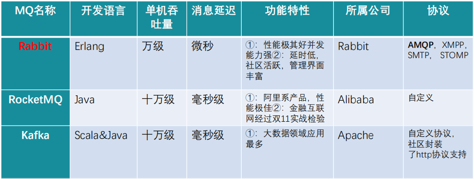

**AMQP**，即 Advanced Message Queuing Protocol (高级消息队列协议) ，是一个网络协议，是应用层协议的一个开放标准，为面向消息的中间件设计。2006年，AMQP 规范发布。

### 4、RabbitMQ 概述

> RabbitMQ 是实现了高级消息队列协议的开源消息代理软件

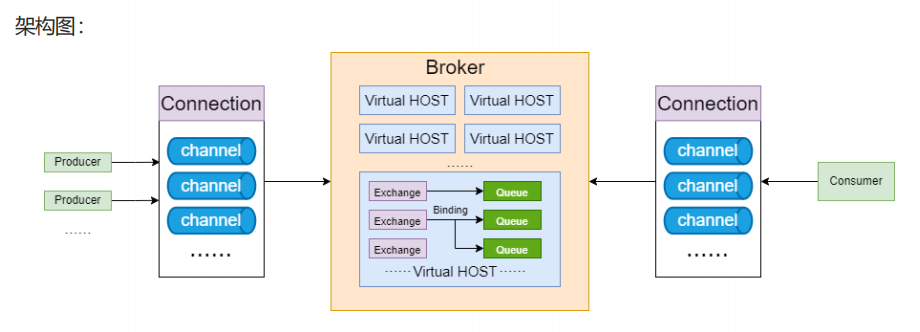

### 5、RabbitMQ 名词介绍

- Producer：生产者，发送消息的程序 
- Consumer：消费者，接收消息的程序
- Broker：接收和分发消息的应用，RabbitMQ Server 就是 Message Broker
- Connection：生产者、消费者、Broker 之间的 TCP 连接
- Channel：通信连接信道，降低 TCP 连接开销
- Virtual host：虚拟主机
- Exchange：交换机，message 到达 Broker 先存放到交换机
- Queue：队列，消费者从这里获取消息
- Binding：交换机与队列之间的虚拟链接，用于消息分发 

### 6、RabbitMQ 工作模式

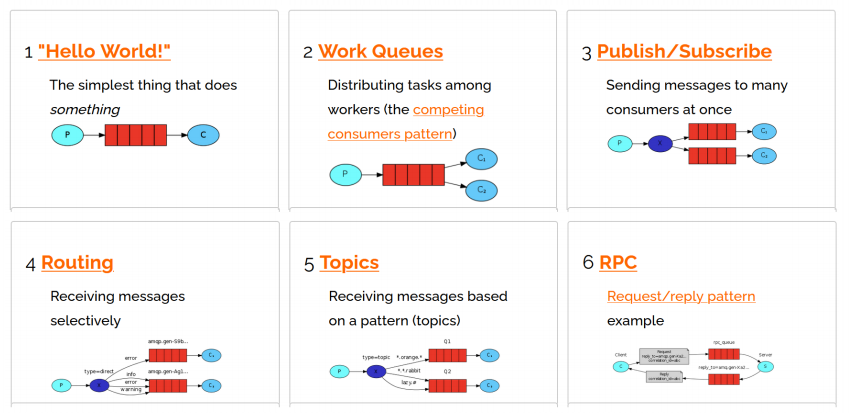

### 7、RabbitMQ 安装

1、安装 socat

```shell
sudo yum install socat -y
```

2、安装 erlang 环境

```shell
sudo rpm -ivh erlang-23.3.4.5-1.el7.x86_64.rpm 
```

3、安装 RabbitMQ

```shell
sudo rpm -ivh rabbitmq-server-3.8.34-1.suse.noarch.rpm 
```

4、开启管理界面

```shell
rabbitmq-plugins enable rabbitmq_management
```

5、启动 RabbitMQ 服务

```shell
sudo systemctl start rabbitmq-server.service
```

7、防火墙开放端口

```shell
sudo firewall-cmd --zone=public --add-port=15672/tcp --permanent
sudo firewall-cmd --reload
```

8、添加新用户

```shell
sudo rabbitmqctl add_user taiyi 123456
```

9、设置用户角色

```shell
sudo rabbitmqctl set_user_tags taiyi administrator
```

10、设置权限

```shell
 sudo rabbitmqctl set_permissions -p "/" taiyi ".*" ".*" ".*"
```

11、查看用户和角色

```shell
sudo rabbitmqctl list_users
```

12、本机访问

```shell
ipv4:15672
```

13、停止服务

```shell
rabbitctl stop_app
```

14、启动服务

```shell
rabbitctl start_app
```

15、重置服务

```shell
rabbitctl reset
```

## 二、RabbitMQ 快速入门

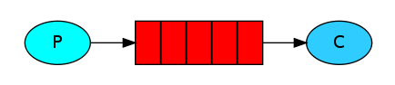

1、添加依赖

```xml
<dependency>
    <groupId>com.rabbitmq</groupId>
    <artifactId>amqp-client</artifactId>
    <version>5.9.0</version>
</dependency>
```

2、创建生产者

```java
public class Producer {
    private final static String QUEUE_NAME = "hello";

    public static void main(String[] args) {
        // 建立连接工厂
        ConnectionFactory factory = new ConnectionFactory();
        // 设置主机 IP、 用户、密码
        factory.setHost("192.168.81.128");
        factory.setUsername("taiyi");
        factory.setPassword("123456");
        //
        try (Connection connection = factory.newConnection();
             Channel channel = connection.createChannel()) {
            // 通道 和 队列 的连接
            /*
            queueDeclare(String queue, boolean durable, boolean exclusive, boolean autoDelete, Map<String, Object> arguments) throws IOException;
            参数说明：
                queue：队列名称
                durable：是否持久化
                exclusive：是否独占，是否只有一个消费者监听一个队列
                autoDelete：是否自动删除，如果没有消费者，自动删除队列
                arguments：参数
             */
            channel.queueDeclare(QUEUE_NAME, false, false, false, null);
            // 待发送的消息
            String message = "Hello World! RabbitMQ!";
            // 通过最基础的发布
            /*
             basicPublish(String exchange, String routingKey, BasicProperties props, byte[] body) throws IOException;
             参数说明：
                exchange：指定交换机，如果使用默认模式，就是用“”
                routingKey：路由名称
                props：配置信息
                body：发送的消息（要求字节数组）
             */
            channel.basicPublish("", QUEUE_NAME, null, message.getBytes());
            // 发送成功后打印
            System.out.println(" [x] Sent '" + message + "'");
        } catch (IOException | TimeoutException e) {
            e.printStackTrace();
        }
    }
}
```

3、消费者

```java
public class Consumer {
    private final static String QUEUE_NAME = "hello";

    public static void main(String[] args) throws IOException, TimeoutException {
        // 建立连接工厂
        ConnectionFactory factory = new ConnectionFactory();
        // 设置主机 IP、 用户、密码
        factory.setHost("192.168.81.128");
        factory.setUsername("taiyi");
        factory.setPassword("123456");
        // 建立连接 获取通道
        Connection connection = factory.newConnection();
        Channel channel = connection.createChannel();
        /*
        queueDeclare(String queue, boolean durable, boolean exclusive, boolean autoDelete, Map<String, Object> arguments)
        参数说明：
            queue：队列名称（消费的队列名称）
            durable：是否持久化
            exclusive：是否独占，是否只有一个消费者监听一个队列
            autoDelete：是否自动删除，如果没有消费者，自动删除队列
            arguments：参数
         */
        channel.queueDeclare(QUEUE_NAME, false, false, false, null);
        System.out.println(" [*] Waiting for messages. To exit press CTRL+C");

        /*
        basicConsume(String queue, boolean autoAck, DeliverCallback deliverCallback, ConsumerShutdownSignalCallback shutdownSignalCallback)
         */
        DeliverCallback deliverCallback = (consumerTag, delivery) -> {
            String message = new String(delivery.getBody(), "UTF-8");
            System.out.println(" [x] Received '" + message + "'");
        };
        /*
        basicConsume(String queue, boolean autoAck, DeliverCallback deliverCallback, CancelCallback cancelCallback)
        参数说明：
            queue：队列名称
            autoAck：是否自动确认
            deliverCallback：消费回调对消
            cancelCallback：取消回调
         */
        channel.basicConsume(QUEUE_NAME, true, deliverCallback, consumerTag -> {
        });
    }
}
```

## 三、RabbitMQ 工作模式

### 1、工作队列 Work queues

#### 1.2 概述

- 工作队列与简单模式相比，多了一些消费端：多个消费端共同消费同一个队列中的消息

  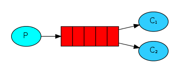

- 使用场景：对于消息生产速度大于消费速度的场景，可以增加消费者减少消费者压力

#### 1.2 总结

- 分发机制：轮询分发机制
- 应用场景：同一条消息，在多个消费者之间只能有一个消息，应用于只需要单节点消费的场景（发送验证码，发送生日提醒）

### 2、订阅模式 Pub/Sub

#### 2.1 概述

- 在订阅模型中，多了一个 Exchange 角色

- Exchange：交换机（X），接收生产者放发送的消息，处理投递消息，例如递交给某个特别队列，递交给所有队列、或是将消息丢弃

- 交换机类型：

  - Fanout：广播，将消息交给所有绑定到交换机的队列

  - Direct：定向，把消息交给符合指定 routing key 的队列

  - Topic：通配符，把消息交给符合 routing pattern（路由模式）的队列

    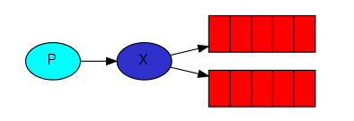

- 注意：交换机并不具备存储消息的能力，如果没有队列绑定，则消息会丢失

#### 2.2 总结：

- 交换机与队列进行绑定，绑定之后；一个消息可以被多个队列都接收到
- PubSub 模式与 WorkQueues 模式的区别（面试）：
  - WorkQueues 模式不用定义交换机，而 PubSub 模式需要定义交换机
  - PubSub 模式的生产方是面向交换机发送消息，WorkQueue 模式的生产方是面向队列发送消息
  - PubSub 模式需要手动设置队列和交换机的绑定

### 3、路由模式 Routing

#### 3.1 概述

- RoutingKey 编写规则：有一个或多个单词组成，多个单词用 `.` 分割，比如 order.save

- 路由模型：

  - 队列与交换机的绑定需要指定路由 RoutingKey

  - 生产者在向 Exchange 发送消息时，也必须指定消息的 RoutingKey

  - 交换机分发的规则根据 RoutingKey 来分发给相应的队列

    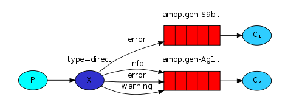

#### 3.2 总结

- 生产者发送消息时要指定 RoutingKey
- 队列与交换机绑定也需要指定 RoutingKey

### 4、通配符模式 Topics

#### 4.1 概述

- Topics 模式可以通过通配符配置 RoutingKey，会更加灵活

- 通配符规则：

  - `#`：匹配一个或多个词。比如 order.# 可以匹配 order.save，order.product.update ...

  - `*`：匹配一个单词。比如 order.* 可以匹配 order.save

    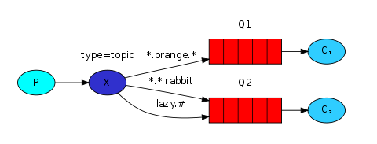

#### 4.2 总结

- Topic 模式可以实现 Pub/Sub 模式和 Routing 模式的功能
- Topic 模式在配置 RoutingKey 的时候可以使用通配符，更加灵活好用

### 5、工作模式总结

1. 简单模式 HelloWorld：一个生产者、一个消费者，不需要设置交换机，使用默认的交换机
2. 工作队列模式 Work Queue ：一个生产者、多个消费者(排它关系) ，不需要设置交换机，使用默认的交换机
3. 发布订阅模式 Publish/Subscribe：设置类型为 fanout 的交换机，同时让交换机和队列绑定，交换机会将消息发送到绑定的队列
4. 路由模式 Routing：设置 direct 交换机，并且指定 routing key，交换机根据 routing key 将消息发送到对应的队列
5. 通配符模式 Topic：设置类型为 topic 的交换机，交换机和队列进行绑定，并且指定通配符方式的 routing key，交换机根据通配符分发消息到队列

## 四、SpringBoot 整合 RabbitMQ

### 1、添加相关依赖

```xml
<dependency>
    <groupId>org.springframework.boot</groupId>
    <artifactId>spring-boot-starter-amqp</artifactId>
</dependency>
<dependency>
    <groupId>org.springframework.amqp</groupId>
    <artifactId>spring-rabbit-test</artifactId>
    <scope>test</scope>
</dependency>
```

### 2、简单模式

配置队列

```java
@Configuration
@EnableRabbit
public class RabbitMqConfig {
    /**
     * 创建队列
     *
     * @return 队列
     */
    @Bean
    public Queue helloQueue() {
        return new Queue("springboot-queue", true);
    }
}
```

发送消息

```java
@Resource
private RabbitTemplate rabbitTemplate;

@Resource
private Queue helloQueue;

@Test
public void send2Hello() {
    rabbitTemplate.convertAndSend(helloQueue.getName(), "hello spring boot rabbitmq");
}
```

接收消息

```java
@Slf4j
@Service
public class MessageReceive {
    @RabbitListener(queues = {"springboot-queue"})
    public void receive(String message) {
        log.info("接收消息：" + message);
    }
}
```

### 3、Topic 模式

配置交换机和队列

```java
@Configuration
@EnableRabbit
public class RabbitMqConfig {
    /**
     * 创建topic队列
     *
     * @return 队列
     */
    @Bean
    public Queue topicQueue() {
        return new Queue("springboot-topic-queue", true);
    }

    /**
     * 创建topic交换机
     *
     * @return 交换机
     */
    @Bean
    public TopicExchange topicExchange() {
        return new TopicExchange("springboot-topic-exchange", true, false);
    }

    @Bean
    public Binding topicBinding() {
        return BindingBuilder
                .bind(topicQueue())     // 绑定队列
                .to(topicExchange())    // 绑定交换机
                .with("taiyi.*");      // 指定路由
    }
}
```

发送消息

```java
@Resource
private RabbitTemplate rabbitTemplate;

@Resource
private Exchange topicExchange;

@Test
public void send2Topic() {
    rabbitTemplate.convertAndSend(topicExchange.getName(), "taiyi.order", "hello topic rabbitmq");
}
```

接收消息

```java
@Slf4j
@Service
public class MessageReceive {
    @RabbitListener(queues = {"springboot-topic-queue"})
    public void receive(String message) {
        log.info("接收消息：" + message);
    }
}
```

## 五、确认机制

### 1、发布确认机制

#### 1.1 生产者投递丢失问题

如果生产者 P 投递消息到交换机 X 的过程中，出现了网络延迟，导致消息丢失，怎么保证消息安全？

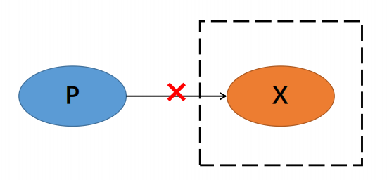

#### 1.2 通过发布确认机制解决

生产者 P 投递消息到交换机 X 的过程中，交换机会给生产者 P 一个 ACK 确认回调，生产者可以根据收到的 ACK 值知道是否投递成功。

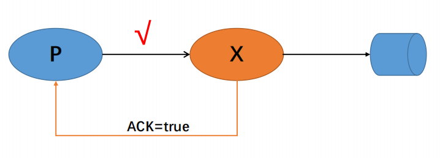

#### 1.3 实操

application.yml

```yml
spring:
  rabbitmq:
    host: 192.168.81.128
    port: 5672
    username: taiyi
    password: 123456
    publisher-confirm-type: correlated  # 确认消息发送到交换机
```

RabbitMqConfig

```java
@Configuration
@EnableRabbit
public class RabbitMqConfig {

    private static final String CONFIRM_EXCHANGE_NAME = "confirm-exchange";
    private static final String CONFIRM_QUEUE_NAME = "confirm-queue";

    @Bean
    public RabbitTemplate rabbitTemplate(CachingConnectionFactory connectionFactory, AckCallback ackCallback) {
        RabbitTemplate rabbitTemplate = new RabbitTemplate(connectionFactory);
        rabbitTemplate.setConfirmCallback(ackCallback);
        return rabbitTemplate;
    }

    // 新建交换机
    @Bean
    public DirectExchange confirmExchange() {
        return ExchangeBuilder.directExchange(CONFIRM_EXCHANGE_NAME).durable(true).build();
    }

    // 队列
    @Bean
    public Queue confirmQueue() {
        return QueueBuilder.durable(CONFIRM_QUEUE_NAME).build();
    }

    // 绑定交换机和队列
    @Bean
    public Binding confirmBinding() {
        return BindingBuilder.bind(confirmQueue()).to(confirmExchange()).with("ack");
    }
}
```

AckCallback

```java
@Slf4j
@Component
public class AckCallback implements RabbitTemplate.ConfirmCallback {
    @Override
    public void confirm(CorrelationData correlationData, boolean ack, String cause) {
        String id = correlationData != null ? correlationData.getId() : "";
        if (ack) {
            log.info("交换机已经收到消息 id：{}", id);
        } else {
            log.info("交换机没有收到消息 id：{}, 原因是：{}", id, cause);
        }
    }
}
```

测试验证

```java
@Resource
private RabbitTemplate rabbitTemplate;

@Test
public void testConfirm() {
CorrelationData correlationData = new CorrelationData("1");
rabbitTemplate.convertAndSend("confirm-exchange", "ack", "你好", correlationData);
}
```

### 2、回退机制与备份交换机

#### 2.1 交换机无法路由问题

生产者 P 投递消息到交换机 X 的过程中，消息确定收到了，但是路由配置错误，或者没有绑定队列，此时如何保证消息的安全性？

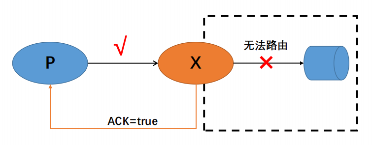

#### 2.2 回退机制让生产者自行处理

可以通过回退机制，通知消费者此条消息无法处理，让消费者自行处理消息

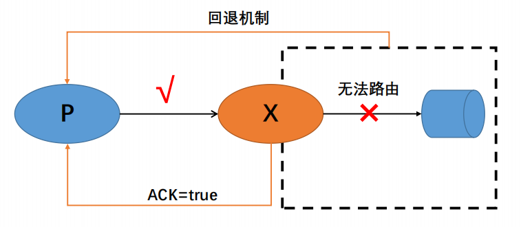

#### 2.3 回退机制实操

ReturnCallback

```java
@Component
@Slf4j
public class ReturnCallback implements RabbitTemplate.ReturnsCallback {
    @Override
    public void returnedMessage(ReturnedMessage returnedMessage) {
        log.info("{} 消息返回，退回原因：{}， 退回码：{}",
                returnedMessage.getMessage().getBody(),
                returnedMessage.getReplyText(),
                returnedMessage.getReplyCode());
        /*
        处理方式：
            1、尝试重新调用
            2、落库处理，存入 MySQL 数据库中
        */
    }
}
```

RabbitMqConfig

```java
@Configuration
@EnableRabbit
public class RabbitMqConfig {
    @Bean
    public RabbitTemplate rabbitTemplate(CachingConnectionFactory connectionFactory, AckCallback ackCallback, ReturnCallback returnCallback) {
        RabbitTemplate rabbitTemplate = new RabbitTemplate(connectionFactory);
        rabbitTemplate.setConfirmCallback(ackCallback);
        rabbitTemplate.setMandatory(true);
        rabbitTemplate.setReturnsCallback(returnCallback);
        return rabbitTemplate;
    }
}
```

#### 2.4 备份交换机解决无法路由问题

备份交换机设置 Fanout 类型，可以添加备份队列，还可以添加告警队列，还可以添加入库队列

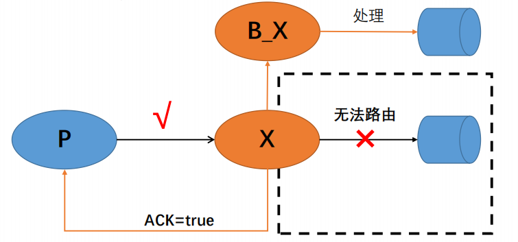

注意：添加备份交换机之后，回退机制将不会触发

#### 2.5 备份交换机实操

```java
@Configuration
@EnableRabbit
public class RabbitMqConfig {

    private static final String CONFIRM_EXCHANGE_NAME = "confirm-exchange";
    private static final String BACK_EXCHANGE_NAME = "back-exchange";
    private static final String CONFIRM_QUEUE_NAME = "confirm-queue";
    private static final String BACK_QUEUE_NAME = "back-queue";


    @Bean
    public RabbitTemplate rabbitTemplate(CachingConnectionFactory connectionFactory, AckCallback ackCallback, ReturnCallback returnCallback) {
        RabbitTemplate rabbitTemplate = new RabbitTemplate(connectionFactory);
        rabbitTemplate.setConfirmCallback(ackCallback);
        rabbitTemplate.setMandatory(true);  // 回退机制开启
        rabbitTemplate.setReturnsCallback(returnCallback);
        return rabbitTemplate;
    }

    // 声明确认交换机
    @Bean("confirmExchange")
    public DirectExchange confirmExchange() {
        return ExchangeBuilder
                .directExchange(CONFIRM_EXCHANGE_NAME)
                .durable(true)
                .withArgument("alternate-exchange", BACK_EXCHANGE_NAME)
                .build();
    }

    // 声明确认队列
    @Bean("confirmQueue")
    public Queue confirmQueue() {
        return QueueBuilder.durable(CONFIRM_QUEUE_NAME).build();
    }

    // 绑定确认队列和确认交换机
    @Bean
    public Binding confirmBinding() {
        return BindingBuilder.bind(confirmQueue()).to(confirmExchange()).with("ack");
    }

    // 声明备份交换机
    @Bean("backExchange")
    public FanoutExchange backExchange() {
        return new FanoutExchange(BACK_EXCHANGE_NAME);
    }

    // 声明备份队列
    @Bean("backQueue")
    public Queue backQueue() {
        return QueueBuilder.durable(BACK_QUEUE_NAME).build();
    }

    // 绑定备份交换机和备份队列
    @Bean
    public Binding backBinding() {
        return BindingBuilder.bind(backQueue()).to(backExchange());
    }
}
```

### 3、消费者确认机制

#### 3.1 消费者异常导致数据丢失

如果消费者处理过程中发生异常，导致消息丢失怎么办？

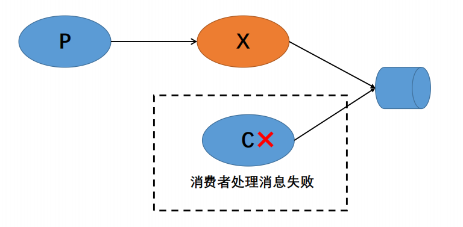

#### 3.2 消费者确认机制

三种确认方式：

1. 自动确认：`ackonwledge=none`
2. 手动确认：`ackonwledge=manual`（主要研究）
3. 根据异常情况确认：`ackonwledge=auto`（复杂，不去研究）

- 手动确认图解：

  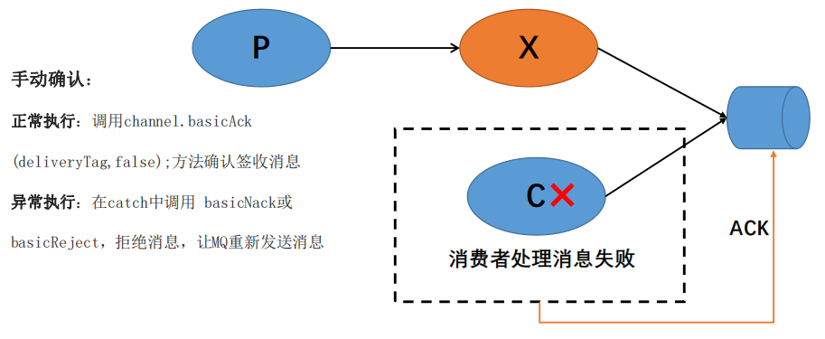

- 手动确认程序：

  application.yml

  ```yml
  spring:
    rabbitmq:
      host: 192.168.81.128
      port: 5672
      username: taiyi
      password: 123456
      listener:
        simple:
          retry:
            enabled: true
          acknowledge-mode: manual  # 手动 ack
  ```

  service

  ```java
  @Slf4j
  @Service
  public class MessageReceive {
      @RabbitListener(queues = {"back-queue"})
      public void receive(String body, Channel channel, Message message) throws IOException {
          try {
              log.info("receive message:{}", body);
              // 开始处理业务
              int res = 1 / 0;
              // 业务处理结束
              // 正常签收，参数：multiple
              channel.basicAck(message.getMessageProperties().getDeliveryTag(), false);
          } catch (Exception e) {
              if (message.getMessageProperties().getRedelivered()) {// 消息是否重复处理过
                  // 拒绝签收,丢弃；参数：requeue
                  log.info("message重复处理之后");
                  channel.basicReject(message.getMessageProperties().getDeliveryTag(), false);
              } else {
                  // 返回队列，重新发送；参数：multiple,requeue
                  log.info("message没有重复处理");
                  channel.basicNack(message.getMessageProperties().getDeliveryTag(), false, true);
              }
          }
      }
  }
  ```

## 六、死信队列

### 1、死信队列概述

- **死信**（Dead Letter）是 RabbitMQ 的一种消息机制，如果出现以下情况消息将变成死信：
  1. 消息在队列的存活时间超过设置的生存时间（TTL）时间
  2. 消息队列的消息数量已经超过最大队列长度
  3. 消息被否定确认，使用basicNack或basicReject并且 requeue=false
- **死信队列**（Dead Letter Queue）用来存放死信消息的队列
- **死信交换机**（Dead Letter Exchange）用来路由死信消息的交换机

### 2、死信队列架构图

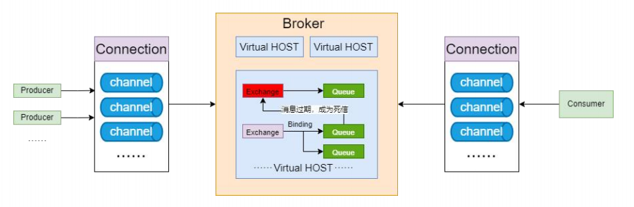

### 3、TTL

- TTL 概述：用来控制消息或者队列的最大存活时间，单位是毫秒

- 设置 TTL 的两种方式：

  1. 给消息设置 TTL
  2. 给队列设置 TTL

- 注意：如果同时配置消息 TTL 和队列 TTL，那么较小的那个值将会被使用

- 区别（面试）：

  1. 消息设置 TTL 的方式是在消费时做消息过期判断，如果是顶端的，到期直接移除

     RabbitMQ 只会判断队列最前端的消息是否过期，如果过期，移除；如果没有过期，保留（哪怕第二条消息已经过期也不去管理）

  2. 队列设置过期是直接丢弃或者丢到死信队列（并不是使用轮训机制判断消息过期的，还是只判断队列头部的消息，因为最先过期的消息一定是最先进入队列的，也就处于队列的最开始）

### 4、死信队列实操

- 案例：

  1. 达到最大长度进入死信队列
  2. 达到过期时间进入死信队列
  3. 拒收进入死信队列

- 代码：

  RabbitMqConfig

  ```java
  @Configuration
  @EnableRabbit
  public class RabbitMqConfig {
  
      private static final String TEST_EXCHANGE_NAME = "test-exchange";
      private static final String TEST_QUEUE_NAME = "test-queue";
      private static final String DEAD_EXCHANGE_NAME = "dead-test-exchange";
      private static final String DEAD_QUEUE_NAME = "dead_queue-queue";
  
  
      @Bean
      public RabbitTemplate rabbitTemplate(CachingConnectionFactory connectionFactory, AckCallback ackCallback, ReturnCallback returnCallback) {
          RabbitTemplate rabbitTemplate = new RabbitTemplate(connectionFactory);
          rabbitTemplate.setConfirmCallback(ackCallback);
          rabbitTemplate.setMandatory(true);  // 回退机制开启
          rabbitTemplate.setReturnsCallback(returnCallback);
          return rabbitTemplate;
      }
  
      // 声明交换机
      @Bean("testExchange")
      public DirectExchange testExchange() {
          return ExchangeBuilder
                  .directExchange(TEST_EXCHANGE_NAME)
                  .durable(true)
                  .build();
      }
  
      // 声明队列
      @Bean("testQueue")
      public Queue testQueue() {
          // return QueueBuilder.durable(TEST_QUEUE_NAME).build(); // 普通队列
          Map<String, Object> map = new HashMap<>();
          // 绑定死信交换机
          map.put("x-dead-letter-exchange", DEAD_EXCHANGE_NAME);
          // 案例1：达到最大长度进入死信队列。限制队列最大长度
          // map.put("x-max-length", 10);
          // 案例2：达到过期时间进入死信队列。设置队列的消息TTL
          map.put("x-message-ttl", 5000);
          return QueueBuilder.durable(TEST_QUEUE_NAME).withArguments(map).build();   // 过期队列
      }
  
      // 绑定确认队列和确认交换机
      @Bean
      public Binding testBinding() {
          return BindingBuilder.bind(testQueue()).to(testExchange()).with("ack");
      }
  
      // 声明死信交换机
      @Bean("deadExchange")
      public DirectExchange deadExchange() {
          return new DirectExchange(DEAD_EXCHANGE_NAME);
      }
  
      // 声明备份队列
      @Bean("deadQueue")
      public Queue deadQueue() {
          return QueueBuilder.durable(DEAD_QUEUE_NAME).build();
      }
  
      // 绑定死信交换机和死信队列
      @Bean
      public Binding deadBinding() {
          return BindingBuilder.bind(deadQueue()).to(deadExchange()).with("ack");
      }
  }
  ```

  ApiTest

  ```java
  @SpringBootTest
  public class ApiTest {
      @Resource
      private RabbitTemplate rabbitTemplate;
  
      @Test
      public void testDeadQueue() {
          for (int i = 0; i < 11; i++) {
              rabbitTemplate.convertAndSend("test-exchange", "ack", "你好，死信机制" + i);
          }
      }
  }
  ```

- 案例三部分接收代码：

  ```java
  @Slf4j
  @Service
  public class MessageReceive {
      @RabbitListener(queues = {"test-queue"})
      public void receive(String body, Channel channel, Message message) throws IOException {
          try {
              // 开始处理业务
              if ("3".equals(body)) {
                  log.info("收到异常队列信息:{}", body);
                  int res = 1 / 0;
              }
              log.info("收到队列信息:{}", body);
              // 业务处理结束
              // 正常签收，参数：multiple
              channel.basicAck(message.getMessageProperties().getDeliveryTag(), false);
          } catch (Exception e) {
              if (message.getMessageProperties().getRedelivered()) {// 消息是否重复处理过
                  // 拒绝签收,丢弃；参数：requeue
                  channel.basicReject(message.getMessageProperties().getDeliveryTag(), false);
              } else {
                  // 返回队列，重新发送；参数：multiple,requeue
                  channel.basicNack(message.getMessageProperties().getDeliveryTag(), false, true);
              }
          }
      }
  }
  ```

### 5、总结

1. 死信交换机和死信队列和普通交换机和普通队列没有区别
2. 当消息成为死信后，如果该队列绑定了死信交换机，则消息会被死信交换机重新路由到死信队列
3. 消息成为死信的3中情况（面试）：
   1. 消息在队列的存活时间超过了设置的 TTL
   2. 消息队列的消息数量超过了最大队列长度
   3. 消息被否定确认，使用 basicNack 或 basicReject 并且 requeue=false

## 七、延迟队列

### 1、延时队列概述

- 延时队列：消息进入队列后，不会立即被消费，只有达到指定时间后，才会消费，最重要的特征就是延迟上

- 应用场景：

  1. 12306 购票 30min 内不支付自动取消订单，回滚库存
  2. 会议设置，15min 前通知参会人员

- 流程图示：

  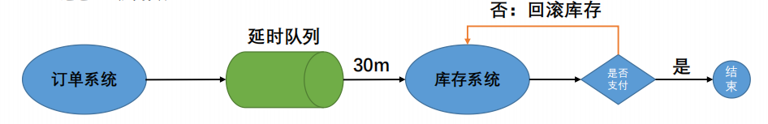

### 2、延时队列实现

RabbitMQ 为提供延时队列功能，可以通过 TTL + 死信队列的方式设计出延时队列

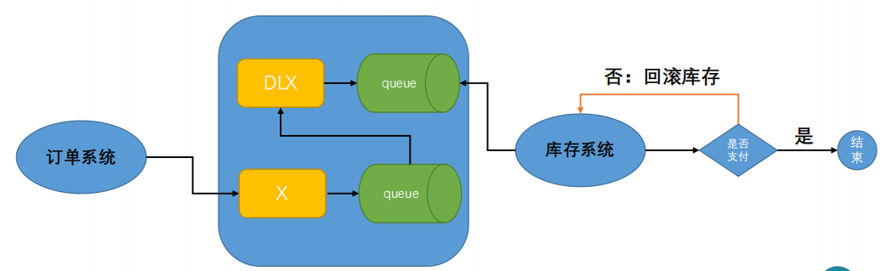

代码实现：

RabbitMqConfig

```java
@Configuration
@EnableRabbit
public class RabbitMqConfig {

    private static final String EXCHANGE_NAME = "delay-exchange";
    private static final String QUEUE_NAME = "delay-queue";
    private static final String DEAD_EXCHANGE_NAME = "dead-delay-exchange";
    private static final String DEAD_QUEUE_NAME = "dead-delay-queue";


    @Bean
    public RabbitTemplate rabbitTemplate(CachingConnectionFactory connectionFactory, AckCallback ackCallback, ReturnCallback returnCallback) {
        RabbitTemplate rabbitTemplate = new RabbitTemplate(connectionFactory);
        rabbitTemplate.setConfirmCallback(ackCallback);
        rabbitTemplate.setMandatory(true);  // 回退机制开启
        rabbitTemplate.setReturnsCallback(returnCallback);
        return rabbitTemplate;
    }

    // 声明交换机
    @Bean("testExchange")
    public DirectExchange testExchange() {
        return ExchangeBuilder
                .directExchange(EXCHANGE_NAME)
                .durable(true)
                .build();
    }

    // 声明队列
    @Bean("testQueue")
    public Queue testQueue() {
        Map<String, Object> map = new HashMap<>();
        // 绑定死信交换机
        map.put("x-dead-letter-exchange", DEAD_EXCHANGE_NAME);
        return QueueBuilder.durable(QUEUE_NAME).withArguments(map).build();   // 过期队列
    }

    // 绑定确认队列和确认交换机
    @Bean
    public Binding testBinding() {
        return BindingBuilder.bind(testQueue()).to(testExchange()).with("ack");
    }

    // 声明死信交换机
    @Bean("deadExchange")
    public DirectExchange deadExchange() {
        return new DirectExchange(DEAD_EXCHANGE_NAME);
    }

    // 声明备份队列
    @Bean("deadQueue")
    public Queue deadQueue() {
        return QueueBuilder.durable(DEAD_QUEUE_NAME).build();
    }

    // 绑定死信交换机和死信队列
    @Bean
    public Binding deadBinding() {
        return BindingBuilder.bind(deadQueue()).to(deadExchange()).with("ack");
    }
}
```

发送

```java
@Test
    public void testDelay() {
        MessagePostProcessor processor = message -> {
            MessageProperties messageProperties = message.getMessageProperties();
            messageProperties.setExpiration("5000");
            return message;
        };
        rabbitTemplate.convertAndSend("delay-exchange", "ack", "你好，延迟队列", processor);
    }
```

代码实现存在的问题：

- 发现消息不能按最近过期时间消费
- 原因：设置了消息 TTL，延迟队列只判断队列开头信息是否过期，只要它不过期，后续信息就不会判断过期时间（哪怕它们已经过期，也不会进入延迟队列中等待被消费）

### 3、延迟队列插件

- 启用延迟插件服务：

  1. 插件安装位置

     `/usr/lib/rabbitmq/lib/rabbitmq_server-3.8.34/plugins`

  2. 启用插件

     ```shell
     rabbitmq-plugins enable rabbitmq_delayed_message_exchange
     ```

  3. 重启服务

     ```shell
     rabbitmqctl start_app
     ```

- 代码实现：

  RabbitMqPluginConfig

  ```java
  @Configuration
  @EnableRabbit
  public class RabbitMqPluginConfig {
      private static final String EXCHANGE_NAME = "plugin-delay-exchange";
      private static final String QUEUE_NAME = "plugin-delay-queue";
  
      @Bean
      public RabbitTemplate rabbitTemplate(CachingConnectionFactory connectionFactory, AckCallback ackCallback, ReturnCallback returnCallback) {
          RabbitTemplate rabbitTemplate = new RabbitTemplate(connectionFactory);
          rabbitTemplate.setConfirmCallback(ackCallback);
          rabbitTemplate.setMandatory(true);  // 回退机制开启
          rabbitTemplate.setReturnsCallback(returnCallback);
          return rabbitTemplate;
      }
  
      // 声明交换机
      @Bean
      public CustomExchange pluginDelayExchange() {
          HashMap<String, Object> args = new HashMap<>();
          // 自定义交换机的类型
          args.put("x-delayed-type", "direct");
          return new CustomExchange(EXCHANGE_NAME, "x-delayed-message", true, false, args);
      }
  
      // 声明队列
      @Bean
      public Queue pluginDelayQueue() {
          return QueueBuilder.durable(QUEUE_NAME).build();
      }
  
      // 绑定队列和交换机
      @Bean
      public Binding testBinding() {
          return BindingBuilder.bind(pluginDelayQueue()).to(pluginDelayExchange()).with("ack").noargs();
      }
  
  }
  ```

  发送消息

  ```java
  @SpringBootTest
  public class ApiTest {
      @Resource
      private RabbitTemplate rabbitTemplate;
      @Test
      public void testPluginDelay() {
          MessagePostProcessor processor = message -> {
              MessageProperties messageProperties = message.getMessageProperties();
              messageProperties.setDelay(5000);
              return message;
          };
          rabbitTemplate.convertAndSend("plugin-delay-exchange", "ack", "5s 的延迟消息", processor);
      }
  }
  ```

### 4、案例实现

- 案例说明：12306 实现 30min 内未付款自动取消订单回滚库存

- 代码实现
  1. 创建订单系统：发送订单进延迟队列
  1. 创建库存系统：接受延迟队列中的数据做业务处理，如果已经支付不做任何操作，如果没有支付则取消订单回滚库存

- 代码实现

  消息发送方

  ```java
  @RestController
  @RequestMapping("/order")
  public class OrderController {
      @Resource
      private RabbitTemplate rabbitTemplate;
      @PostMapping
      public String saveOrder(@RequestParam Long id) {
          CorrelationData data = new CorrelationData(id.toString());
          MessagePostProcessor processor = message -> {
              MessageProperties messageProperties = message.getMessageProperties();
              messageProperties.setDelay(10 * 1000);
              return message;
          };
          rabbitTemplate.convertAndSend("plugin-delay-exchange", "ack", id, processor, data);
          return "ok";
      }
  }
  ```

  消息接收方

  ```java
  @Slf4j
  @Service
  public class MessageReceive {
      Map<String, Inventory> inventoryMap = new HashMap<>();
      /**
       * 模拟数据相关操作
       */
      @PostConstruct
      public void init() {
          inventoryMap.put("1", new Inventory("1", 0, 10));
          inventoryMap.put("2", new Inventory("2", 1, 20));
      }
  
      @RabbitListener(queues = {"plugin-delay-queue"})
      public void receivePluginDelayMessage(String body) {
          if ("1".equals(body) || "2".equals(body)) {
              Inventory inventory = inventoryMap.get(body);
              log.info("当前订单信息:{}", inventory);
              if (inventory.getStatus() == 0) {
                  // 未支付，回滚库存
                  inventory.setCount(inventory.getCount() + 1);
              }
          }
      }
  
      @Data
      @AllArgsConstructor
      @NoArgsConstructor
      public class Inventory {
          private String key;
          private int status;     // 0 代表未支付，1代表已支付
          private int count;
      }
  }
  ```

### 5、延迟队列总结

1. 延迟队列：指消息进入队列后需要一定时间才消费
2. RabbitMQ 本身是没有提供延迟队列功能，可以通过 **死信队列 + 过期时间** 来实现延迟队列
3. 自己实现的延迟队列不能按时消费，可能存在滞后问题，安装延迟队列插件使用

## 八、RabbitMQ 实战场景

### 1、日志与可视化监控查看

- 日志文件：`/var/log/rabbitmq/rabbit@localhost.log`

- 观察日志操作：

  1. 停止服务

     ```shell
     /sbin/service rabbitmq-server stop
     ```

  2. 重新启动

     ```shell
     rabbitmqctl start_app
     ```

  3. 开启服务

     ```shell
     systemctl start rabbitmq-server.service
     ```

### 2、消息追踪

#### 2.1 Firehose

> 生产者给交换机发送消息时，会按照指定格式发送到 amp.rabbitmq.trace（Topic）交换机上

开启 Firehose 命令：`rabbitmqctl trace_on`

关闭 Firehose 命令：`rabbitmqctl trace_off`

注意：开启 Firehose 会影响性能，不建议一直打开

#### 2.2 rabbitmq_tracing

> 开启插件来实现可视化查看

查看插件：`rabbitmq-plugins list`

启用插件：`rabbitmq-plugins enable rabbitmq_tracing`

### 3、幂等性保证

> **幂等性：**是分布式中比较重要的一个概念，是指在多作业操作时候避免造成重复影响，其实就是保证同一个消息不被消费者重复消费两次。但是实际开发中可能存在网络波动等问题，生产者无法接受消费者发送的ack信息，因此这条消息将会被重复发送给其他消费者进行消费，实际上这条消息已经被消费过了，这就是重复消费的问题。

如何避免重复消费问题？

1. 数据库乐观锁机制

   ```sql
   update items set count=count-1 where count= #{count} and id = #{id}
   ```

   ```sql
   update items set count=count-1,version=version+1 where version= #{version} and id = #{id}
   ```

2. 生成全局唯一 id + Redis 锁机制

   操作之前先判断是否抢占了分布式锁 setNx 命名

## 九、RabbitMQ 集群

### 1、目前存在的问题

- 存在问题：

  - 单节点的RabbitMQ如果内存崩溃、机器掉电或者主板故障，会影响整个业务线正常使用

  - 单机吞吐性能会受内存、带宽大小限制

    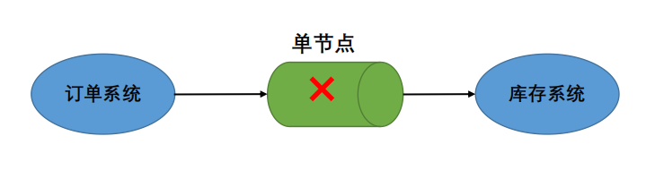

- 解决方案：使用集群模式来解决

### 2、搭建 RabbitMQ 集群

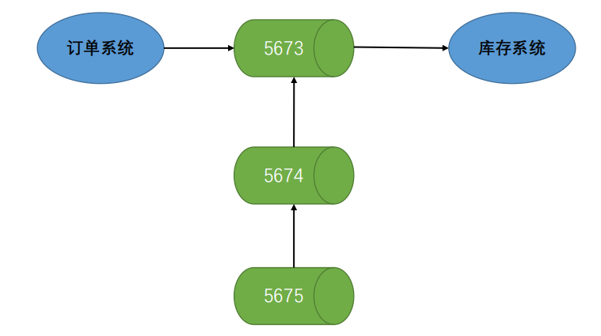

1. 停止服务

   ```shell
   systemctl stop rabbitmq-server.service
   ```

2. 分别启动节点

   启动节点1

   ```shell
   RABBITMQ_NODE_PORT=5673 RABBITMQ_NODENAME=rabbit-1 rabbitmq-server start
   ```

   启动节点2

   ```shell
   RABBITMQ_NODE_PORT=5674 RABBITMQ_SERVER_START_ARGS="-rabbitmq_management listener [{port,15674}]" RABBITMQ_NODENAME=rabbit-2 rabbitmq-server start
   ```

   开放端口

   ```shell
   firewall-cmd --zone=public --add-port=15673/tcp --permanent
   firewall-cmd --zone=public --add-port=15674/tcp --permanent
   firewall-cmd --reload
   ```

3. 设置主从节点

   - 设置节点1为主节点

     停止节点1

     ```shell
     rabbitmqctl -n rabbit-1 stop_app
     ```

     重置节点1

     ```shell
     rabbitmqctl -n rabbit-1 reset
     ```

     启动节点1

     ```shell
     rabbitmqctl -n rabbit-1 start_app
     ```

   - 设置节点2为从节点

     停止节点2

     ```shell
     rabbitmqctl -n rabbit-2 stop_app
     ```

     重置节点2

     ```shell
     rabbitmqctl -n rabbit-2 reset
     ```

     设置从节点2

     ```shell
     rabbitmqctl -n rabbit-2 join_cluster rabbit-1@'localhost'
     ```

     启动节点2

     ```shell
     rabbitmqctl -n rabbit-2 start_app
     ```

   - 查看集群状态

     ```shell
     rabbitmqctl cluster_status -n rabbit-1
     ```

4. 添加用户

   - 添加节点1用户

     添加用户

     ```shell
     rabbitmqctl -n rabbit-1 add_user taiyi1 123456
     ```

     添加角色

     ```shell
     rabbitmqctl -n rabbit-1 set_user_tags taiyi1 administrator
     ```

     添加权限

     ```shell
     rabbitmqctl -n rabbit-1 set_permissions -p "/" taiyi1 ".*" ".*" ".*"
     ```

   - 添加节点2用户

     添加用户

     ```shell
     rabbitmqctl -n rabbit-2 add_user taiyi2 123456
     ```

     添加角色

     ```shell
     rabbitmqctl -n rabbit-2 set_user_tags taiyi2 administrator
     ```

     添加权限

     ```shell
     rabbitmqctl -n rabbit-2 set_permissions -p "/" taiyi2 ".*" ".*" ".*"
     ```

5. 集群数据同步配置

   

### 3、RabbitMQ 集群存在的问题

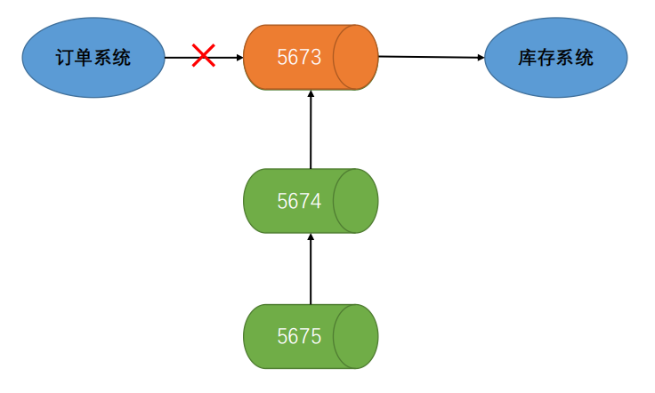

HAProxy 安装和使用

> **HAProxy**是一个使用C语言编写的[自由及开放源代码软件](./https://baike.baidu.com/item/自由及开放源代码软件?fromModule=lemma_inlink)，其提供[高可用性](./https://baike.baidu.com/item/高可用性/909038?fromModule=lemma_inlink)、[负载均衡](./https://baike.baidu.com/item/负载均衡/932451?fromModule=lemma_inlink)，以及基于[TCP](./https://baike.baidu.com/item/TCP?fromModule=lemma_inlink)和[HTTP](./https://baike.baidu.com/item/HTTP?fromModule=lemma_inlink)的应用程序[代理](./https://baike.baidu.com/item/代理/3242667?fromModule=lemma_inlink)。
>
> 下载地址：https://www.haproxy.org/download/

- 安装

  解压

  ```shell
  tar -zxvf haproxy-2.3.21.tar.gz -C /usr/local
  ```

  编译安装

  ```shell
  cd /usr/local/haproxy-2.3.21
  make TARGET=linux31 PREFIX=/usr/local/haproxy
  make install PREFIX=/usr/local/haproxy
  ```

  赋权

  ```shell
  groupadd -r -g 149 haproxy
  useradd -g haproxy -r -s /sbin/nologin -u 149 haproxy
  ```

- 添加配置文件

  创建haproxy配置文件

  ```shell
  mkdir /etc/haproxy
  vim /etc/haproxy/haproxy.cfg
  ```

  haproxy.cfg

  ```shell
  #logging options
  global
  	log 127.0.0.1 local0 info
  	maxconn 5120
  	chroot /usr/local/haproxy
  	uid 99
  	gid 99
  	daemon
  	quiet
  	nbproc 20
  	pidfile /var/run/haproxy.pid
  
  defaults
  	log global
  	
  	mode tcp
  
  	option dontlognull
  	retries 3
  	option redispatch
  	maxconn 2000
  	timeout connect 5s
     
      timeout client 60s
  
      timeout server 15s	
  #front-end IP for consumers and producters
  
  listen rabbitmq_cluster
  	bind 0.0.0.0:5672
  	
  	mode tcp
  	#balance url_param userid
  	#balance url_param session_id check_post 64
  	#balance hdr(User-Agent)
  	#balance hdr(host)
  	#balance hdr(Host) use_domain_only
  	#balance rdp-cookie
  	#balance leastconn
  	#balance source //ip
  	
  	balance roundrobin
  	
          server node1 127.0.0.1:5673 check inter 5000 rise 2 fall 2
          server node2 127.0.0.1:5674 check inter 5000 rise 2 fall 2
  
  listen stats
  	bind 192.168.81.128:8100
  	mode http
  	option httplog
  	stats enable
  	stats uri /rabbitmq-stats
  	stats refresh 5s
  ```

- 启动 haproxy

  ```shell
  /usr/local/haproxy/sbin/haproxy -f /etc/haproxy/haproxy.cfg
  ```

- 查看监控页面

  ```shell
  http://192.168.81.128:8100/rabbitmq-stats
  ```

### 4、RabbitMQ 集群解决

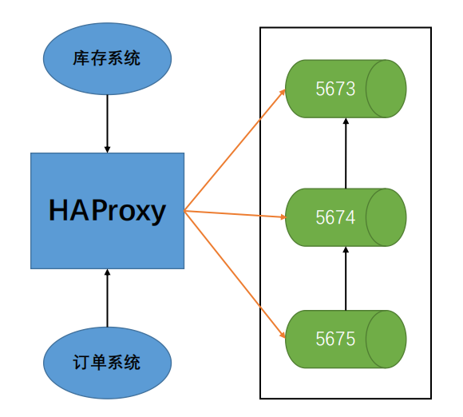

