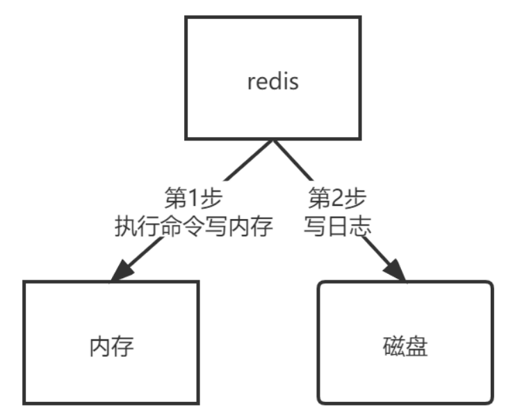
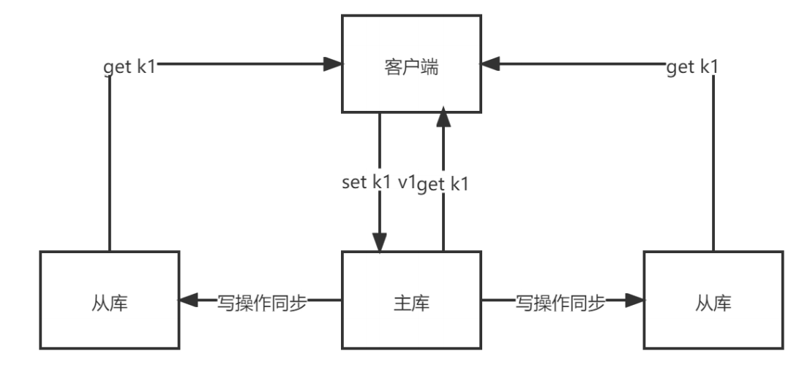
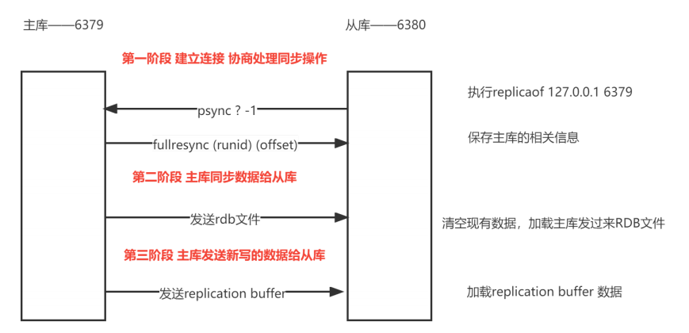
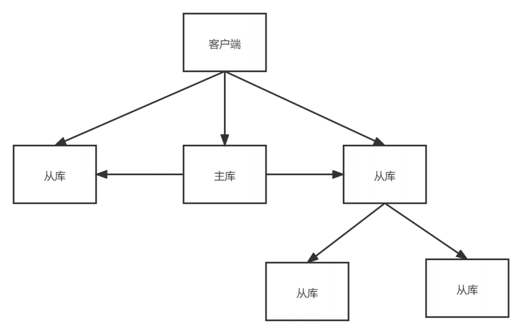
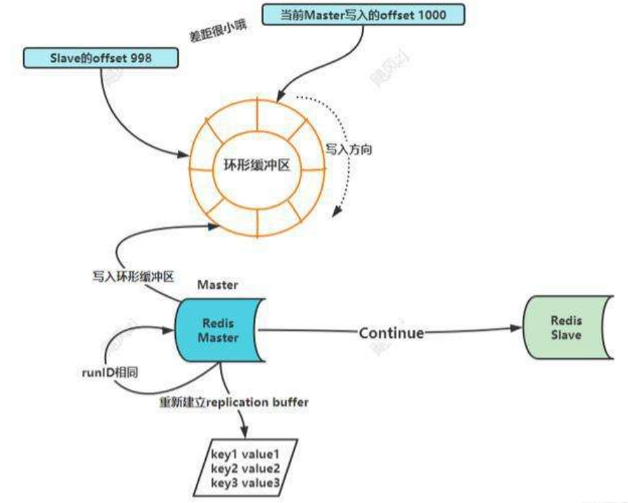
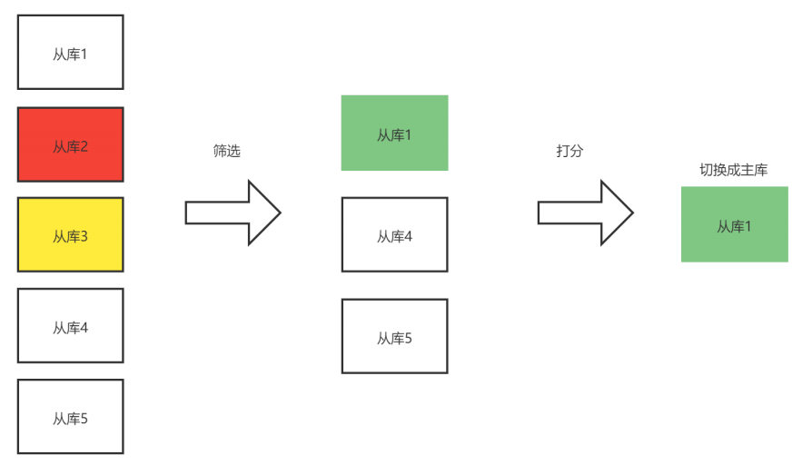
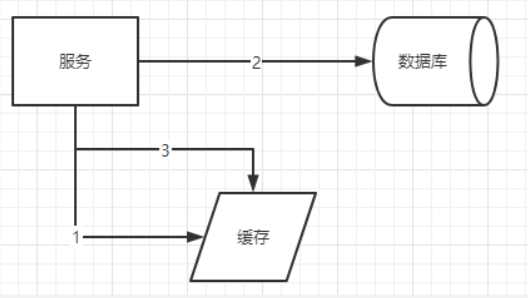
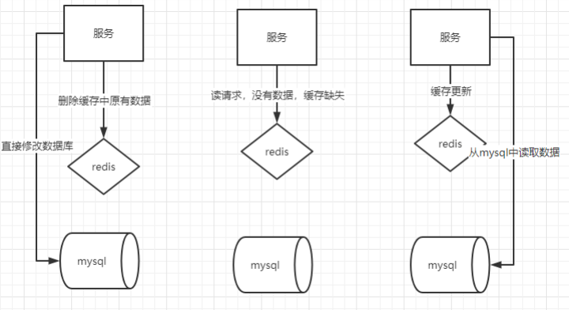
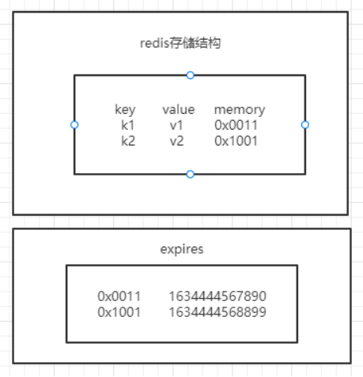
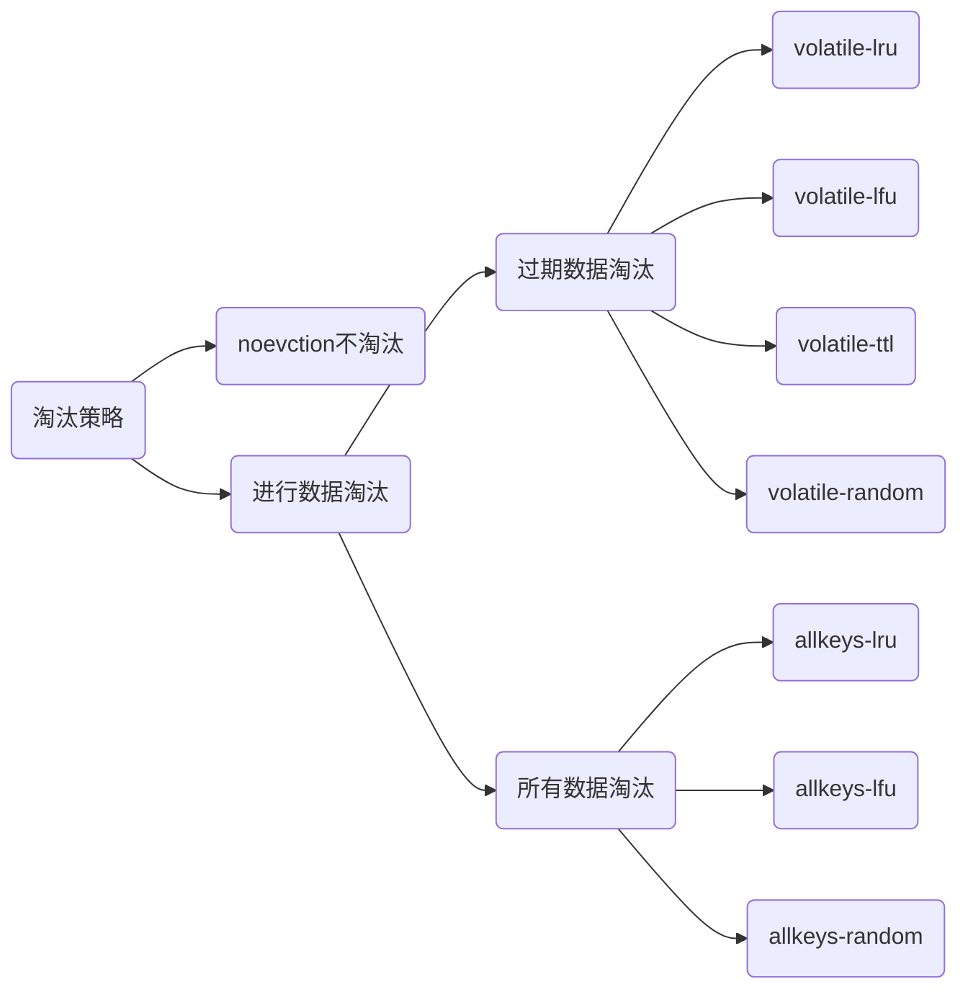

```markdown
# Redis
## Redis 概述
### 简介
### 应用场景
## Redis 安装使用
### 安装
### 文件概述
### 启动
### Redis 基本命令
## Redis 常用的5种数据类型
### String
### List
### Hash
### Set
### Zset
## AOF
### AOF 概述
### 配置
### 日志如何实现
### 潜在风险
### 三种写回策略
### AOF 重写机制
## RDB
### 概述
### 快照频率
### 混合使用 AOF 和 RDB
### Redis 持久化建议
## 主从复制
### 概述
### 主从复制步骤
### 服务器宕机
### 主从同步原理
### 主从从模式
### 网路连接异常
## 哨兵模式
### 概述
### 哨兵机制基本流程
#### 监控
#### 选主
#### 通知
### 哨兵模式配置
### 新主库选定
#### 筛选 + 打分
### 哨兵集群
#### 判断主节点的主客观下线
#### 选举一个哨兵作为 leader
#### 主从故障转移
## 分片集群
### 概述
### 搭建集群
### Hash Slot
### 集群中的数据操作
### 常用命令
### 故障演示
## 亿级访问量数据处理
### 场景描述
### 集合统计模式
#### 聚合统计
#### 排序统计
#### 二值统计
#### 基数统计
### 总结
## GeoSpatial
### 概述
### Geo 底层结构
### Geo 操作指令
#### geoadd
#### geopos
#### geodist
#### georadius
### 案例：查找附近的人
## Redis 事务处理
### 事务概述
### Redis 事务
### Redis 处理事务机制
#### 原子性
#### 一致性
#### 隔离性
#### 持久性
## Redis 缓存
### 概述
### 缓存的特征
### 缓存数据的删除和替换
#### 过期数据
#### 删除策略
##### 定时删除
##### 惰性删除
##### 定期删除
#### 逐出算法
### 缓存异常
#### 数据不一致
#### 缓存雪崩
#### 缓存击穿
#### 缓存穿透
## Jedis 操作 Redis
```

## 零：Docker 容器

拉取镜像：

```shell
docker pull redis:7.2
```

创建目录：

```shell
 mkdir -p redis/data redis/conf
 touch redis/conf/redis.conf
```

创建镜像：

```shell
docker run -p 6379:6379 --name myredis \
		  -v /home/taiyi/docker_data/redis/data/:/data \
		  -v /home/taiyi/docker_data/redis/conf/redis.conf:/etc/redis/redis.conf \
		  -d redis:7.2 \
		  redis-server /etc/redis/redis.conf
```

简化命令：

```shell
docker run -it -d --name redis7 -p 6379:6379 redis:7.0 --bind 0.0.0.0 --protected-mode no
```

## 一、Redis 概述

### 1、简介

- Redis（Remote Dictionary Server）：一个开源的  Key-Value 的存储系统；
- 支持存储的 Value 类型：String（字符串）、list（链表）、set（集合）、zset（sorted set 有序集合）、hash（哈希）；都支持使用 push/pop、add/remove、获取并集、交集、差集等一些相关操作，操作是原子性的；
- Redis 支持各种不同方式的排序；
- Redis （与 Memcached 相同） 存储在内存中；
- Redis 会周期性的把更新的数据写入磁盘，或者把修改的操作追加到记录文件；
- Redis 支持集群，实现 Master-Slave（主从）同步操作；

### 2、应用场景 

- 缓存：配合关系型数据库做高速缓存
- 计数器：进行自增自减运算
- 时效性数据：利用 expire 过期，例如：手机验证码
- 海量数据统计：利用位图，统计用户是否是会员、日活统计、文章已读统计、是否参加过某次活动
- 会话缓存：使用 Redis 统一存储多台服务器用到的 Session 信息
- 分布式队列/阻塞队列：通过 List 双向链表实现读取和阻塞队列
- 分布式锁：Redis 自带的 setNx 命令实现分布式锁
- 热点数据存储：最新文章、最新评论，可以只用 Redis 的 List 存储，ltrim 去除热点数据，文章推荐
- 社交系统：通过 Set 功能实现，交集、并集实现获取共同好友，差集实现好友推荐，文章推荐
- 排行榜：利用 sorted-set 的有序性，实现排行榜功能，取 top n
- 延迟队列：利用消费者和生产者模式实现延迟队列
- 去重复数据：利用 Set 集合，去除大量重复数据
- 发布订阅模式：pub/sub 模式

## 二、Redis 安装使用

### 1、安装

```shell
tar -zxvf redis-xxx.tar.gz
```

```shell
cd redis-xxx
```

```shell
make
```

```shell
make install
```

### 2、文件概述

Redis 会被安装到 /usr/local/bin 目录下：

- redis-benchmark：性能测试工具
- redis-check-aof：修复 aof 持久化文件
- redis-check-rdb：修复 rdb 持久化文件
- redis-cli：Redis 命令行工具
- redis-sentinel：Redis 集群哨兵使用
- redis-server：启动 Redis

### 3、启动

- 前台启动（不推荐）

  ```shell
  redis-server
  ```

- 后台启动（推荐）

  ```shell
  vim /opt/redis-x.x.x/redis.conf
  # 更改如下设置：no --> yes，允许后台启动
  daemonize yes
  ```

  ```shell
  redis-server redis.conf
  ```

- 启动命令行

  ```shell
  redis-cli
  ```

  测试

  ```shell
  ping
  ```

  退出（Redis 服务和 cli 共同退出）

  ```shell
  shutdown
  exit
  ```

  退出（只退 cli）

  ```shell
  exit
  ```

### 4、Redis 基本命令

1. 默认 16 个数据库，从 0 开始，初始默认使用 0 号库，使用 select 命令切换数据库：`select 1`
2. 统一密码管理，所有数据库使用同样的密码
3. `dbsize`：查看当前数据库 key 的数量
4. `flushdb`：清空当前数据库
5. `flushall`：情况所有数据库
6. `keys *`：查看当前数据库所有 key
7. `exists <key>`：判断指定的 key 是否存在
8. `type <key>`：查看 key 的类型
9. `object encoding <key>`：查看底层数据类型
10. `del <key>`：删除指定的 key 数据
11. `unlink <key>`：非阻塞删除，仅仅是将  key 从 keyspace 元数据中删除，真正的删除会在后续中做异步操作
12. `expire <key> <second>`：给指定的 key 设置过期时间，以秒为单位
13. `ttl <key>`：查看 key 的过期时间；-1：表示永不过期，-2：表示已过期

##  三、Redis 常用的五种数据类型

### 1、String 字符串

#### 1.1 简介

- String 类型是 Redis 中最常见的一种类型
- String 类型是二进制安全的，可以存放字符串、数值、JSON、图像数据
- value 存储最大数据量是 512M

#### 1.2 常用命令

- 添加键值对

  ```shell
  set <key> <value>
  ```

  nx：当数据库 key 不存在时，将 key-value 添加至数据库

  xx：当数据库 key 存在时，可以将 key-value 添加至数据库，与 nx 参数互斥

  ex：设置 key-value 添加到数据库，并设置 key 的超时时间（以秒为单位）

  px：设置 key-value 添加到数据库，并设置 key 的超时时间（以毫秒为单位），与 ex 互斥

- 查询对应键值

  ```shell
  get <key>
  ```

- 将给定的值追加到 key 的末尾

  ```shell
  append <key>
  ```

- 获取值的长度

  ```shell
  strlen <key>
  ```

- 只有 key 不存在时，设置 key-value 加入到数据库

  ```shell
  setnx <key> <value>
  ```

- 添加键值对，同时设置过期时间（以秒为单位）

  ```shell
  setex <key> <seconds> <value>
  ```

- 将 key 中存储的数字 +1 处理，只能对数字值操作。如果是空，值为 1

  ```shell
  incr <key>
  ```

- 将 key 中存储的数字 -1 处理，只能对数字值操作。如果是空，值为 1

  ```shell
  decr <key>
  ```

- 将 key 中存储的数字值增加指定步长的数值，如果是空，值为步长。(具有原子性)

  ```shell
  incrby <key> <increnment>
  ```

- 将 key 中存储的数字值减少指定步长的数值，如果是空，值为步长。(具有原子性)

  ```shell
  decrby <key> <decrenment>
  ```

- 同时设置一个或多个 key-value 值

  ```shell
  mset <key1> <value1> [<key2> <value2> ...]
  ```

- 同时获取一个或多个 value 值

  ```shell
  mget <key1> [<key2>...]
  ```

- 当所有给定的 key 都不存在时，同时设置一个或多个 key-value 值（具有原子性）

  ```shell
  msetnx <key1> <value1> [<key2> <value2>...] 
  ```

- 将给定的 key，获取从 start（包含）到 end（包含）的值

  ```shell
  getrange/substr <key> <start> <end>
  ```

- 从偏移量 offset 开始，用 value 去覆盖 key 中存储的字符串值

  ```shell
  setrange <key> <offset> <value>
  ```

- 对给定的 key 设置新值，同时返回旧值。如果 key 不存在，则添加一个 key-value 值

  ```shell
  getset <key> <value>
  ```

#### 1.3 应用场景

- 单值缓存

  ```shell
  set key value
  get key
  ```

- 对象缓存

  ```shell
  set stu:001 value(json)
  mset stu:001:name 张三 stu:001:age 18 stu:001:gender 男
  mget stu:001:name stu:001:age
  ```

- 分布式锁

  ```shell
  setnx key:001 true	# 返回 1 代表枷锁成功
  setnx key:001 true	# 返回 0 代表加锁失败
  # ... 业务操作
  del key:001			# 执行完业务释放锁
  set key:001 true ex 20 nx	# 防止程序意外终止导致死锁
  ```

- 计数器

  ```shell
  incr article:read:1001		# 统计文章阅读数量
  ```

- 分布式系统全局序列号

  ```shell
  incrby orderid 100			# 批量生成序列号
  ```

### 2、List 列表

#### 2.1 简介

- Redis 列表是简单的字符串列表，单值多键，按照插入顺序排序；可以添加一个元素到列表的头部（左）或者尾部（右）
- 一个列表最多可以包含 2^32 -1 个元素
- 底层是一个双向链表，对两端的操作性能很高，通过索引下标的操作中间的节点性能会较差

#### 2.2 常用命令

- 从左侧插入一个或多个值

  ```shell
  lpush <key> <value1> [<value2>...]
  ```

- 将一个或多个值插入到 **已存在** 的列表头部

  ```shell
  lpushx <key> <value1> [<value2>...]
  ```

- 获取列表指定范围内的元素，0：左边第一位；-1：右边第一位，0~-1：取出所有

  ```shell
  lrange <key> <start> <stop>
  ```

- 从右侧插入一个或多个值

  ```shell
  rpush <key> <value1> [<value2>...]
  ```

- 将一个或多个值插入到已存在的列表尾部

  ```shell
  rpushx <key> <value1> [<value2>...]
  ```

- 移除并获取列表中左边第1个元素，count 表明获取的总数量，返回的为移除的元素

  ```shell
  lpop <key> [count]
  ```

- 移除并获取列表中右边第1个元素，count 表明获取的总数量，返回的为移除的元素

  ```shell
  rpop <key> [count]
  ```

- 移除源列表的尾部元素（右1），将该元素添加到目标列表头部（左1），并返回

  ```shell
  rpoplpush <source> <destination>
  ```

- 通过索引获取列表中的元素

  ```shell
  lindex <key> <index>
  ```

- 获取列表长度

  ```shell
  llen <key>
  ```

- 在 pivot 基准元素前（后）插入 element ，如果 key 不存在，返回 0；如果 pivot 不存在，返回 -1；操作成功，返回列表长度；

  ```shell
  linsert <key> before | after <pivot> <element>
  ```

- 根据 count 值，移除列表中 与 element 相等的值；

  ```shell
  lrem <key> <count> <element>
  ```

  count = 0：移除表中所有与参数相等的值

  count > 0：表头到表尾，移除等数量的元素

  count < 0：表尾到表头，移除等数量的元素

- 设置给定索引位置的值

  ```shell
  lset <key> <index> <element>
  ```

- 对列表进行修剪，只保留给定区间的元素，不在指定区间的被删除

  ```shell
  ltrim <key> <start> <stop>
  ```

- 阻塞式移除指定 key 的元素，如果 key 中没有元素，就等待，直到有元素或超时，执行结束

  ```shell
  brpop <key> timeout
  ```

#### 2.3 应用场景

- 数据队列

  - 堆栈 stack = lpush + lpop
  - 队列 queue = lpush + rpop
  - 阻塞式消息队列 blocking mq = lpush + brpop

- 订阅号时间线

  lrange key start stop

### 3、Hash 哈希

#### 3.1 简介

Hash 是 String 类型的 kay-value，特别适合存储对象，类似于 Java 中的 Map；

假设场景：需要在 Redis 中存储学生对象（id，name，age，gender），有以下集中处理方式：

- 方式一：用 key 存储 id，用 value 存储序列化后的用户对象（如果用户属性需要修改，操作复杂，开销较大）
- 方式二：用 key 存储学生 id + 属性名，value 存储属性值（用户 id 数据冗余）
- 方式三：用 key 存储学生 id，用 value 存储 field+value 的 hash。通过 key（id）+ field（属性）可以操作对象的数据

#### 3.2 常用命令

- 为 hash 表的字段赋值，如果字段在 hash 表中存在，则会被覆盖

  ```shell
  hset <key> <field1> <value1> [<field2> <value2>...]
  ```

- Redis 4.0.0 中被弃用

  ```shell
  hmset
  ```

- 字段不存在时，设置 hash 表中的字段值

  ```shell
  hsetnx <key> <field> <value>
  ```

- 返回 hash 表中给定的字段值

  ```shell
  hget <key> <field>
  ```

- 返回 hash 表中所有给定的字段值

  ```shell
  hmget <key> <field1> [<field2>...]
  ```

- 获取 hash 表中指定 key 的所有字段和值

  ```shell
  hgetall <key>
  ```

- 判断 hash 表中指定的字段是否存在，存在：1，否则：0

  ```shell
  hexists <key> <field>
  ```

- 获取 hash 表中的所有字段

  ```shell
  hkeys <key>
  ```

- 获取 hash 表中的所有值

  ```shell
  hvals <key>
  ```

- 获取 hash 表中的 field 数量

  ```shell
  hlen <key>
  ```

- 删除一个或多个 hash 表字段

  ```shell
  hdel <key> <field1> [<field2>...]
  ```

- 为哈希表 key 中指定的 field 字段的 **整数** 值加上增加 increment

  ```shell
  hincrby <key> <field> <increment>
  ```

- 为哈希表 key 中指定的 field 字段的 **浮点数** 值加上增加 increment

  ```shell
  hincrbyfloat <key> <field> <increment>
  ```

#### 3.3 应用场景

- 对象缓存

  ```shell
  hset stu:001 name zhangsan age 20 gender man
  ```

- 电商购物车操作

  - 用户 id 作为 key，商品 id 作为 field，商品数量作为 value

  - 添加商品：

    ```shell
    hset user:001 s:001 1
    hset user:001 s:005 5
    ```

  - 增减商品数量：

    ```shell
    hincrby user:001 s:001 3
    ```

  - 查看购物车商品数量：

    ```shell
    hlen user:001
    ```

  - 删除商品：

    ```shell
    hdel user:001 s:001
    ```

  - 获取所有商品：

    ```shell
    hgetall user:001
    ```

### 4、Set 集合

#### 4.1 简介

Set 是 String 类型元素的无序集合。对外提供功能和 List 相似，是一个 列表功能。集合成员是唯一的。

#### 4.2 常用命令

- 将一个或多个元素加入到集合中；如果集合中已包含该成员元素，则忽略；

  ```shell
  sadd <key> <member1> [<member2>...]
  ```

- 返回集合中所有成员

  ```shell
  smembers <key>
  ```

- 判断给定的成员元素是否是集合中的成员，如果是，返回 1 ；否则返回 0

  ```shell
  sismember <key> <member>
  ```

- 返回集合中元素数

  ```shell
  scard <key>
  ```

- 移除集合中一个或多个元素

  ```shell
  srem <key> <member> [<member>...]
  ```

- 移除并返回集合中一个或 count 个随机元素

  ```shell
  spop <key> [<count>]
  ```

- 与 spop 类似，返回随机元素，不做移除

  ```shell
  srandmember <key> [<count>]
  ```

- 将 member 元素从 source 源移动到 destination 目标

  ```shell
  smove <source> <destination> <member>
  ```

- 返回给定集合的交集（共同包含）元素

  ```shell
  sinter <key1> [<key2>...]
  ```

- 返回给定所以集合的交集，并存储到 destination 目标中

  ```shell
  sinterstore <destination> <key1> [<key2>...]
  ```

- 返回给定集合的并集（所有）元素

  ```shell
  sunion <key1> [<key2>...]
  ```

- 返回给定所以集合的并集，并存储到 destination 目标中

  ```shell
  sunionstore <destination> <key1> [<key2>...]
  ```

- 返回给定集合的差集（key1 中不包含 key2 的元素）

  ```shell
  sdiff <key1> [<key2> ...]
  ```

- 返回给定所有集合的差集，并存储到 destination 目标中

  ```shell
  sdiffstore <destination> <key1> [<key2>...]
  ```

#### 4.3 应用场景

- 抽奖

  - 参与抽奖

    ```shell
    sadd cj001 user:18400001111 user:13000001111 user:16600001111
    ```

  - 查看所有参与用户

    ```shell
    smembers cj001
    ```

  - 实现抽奖

    ```shell
    spop cj001 3	# 中奖后不得参与后续抽奖
    ```

    ```shell
    srandmember cj001 3		# 中奖后可以参与后续抽奖
    ```

- 快手/抖音短视频点赞

  - 点赞

    ```shell
    sadd like:friend001 user:001
    sadd like:friend001 user:002
    ```

  - 取消点赞

    ```shell
    srem like:friend001 user:001
    ```

  - 判断用户是否点赞

    ```shell
    sismember like:friend001 user:001
    ```

  - 显示点赞用户

    ```shell
    smembers like:friend001
    ```

  - 获取点赞次数

    ```shell
    scard like:frind:001
    ```

- 关注模型：sinter 交集  sunion 并集  sdiff 差集

  - 微博 共同关注

    ```shell
    sadd g:list:u001 1001
    sadd g:list:u002 1001
    sinter 
    ```

  - QQ 共同好友：sinter 交集

  - 快手 可能认识的人：sdiff 差集

### 5、Zset 有序集合

#### 5.1 简介

- 有序集合是 String 类型元素的集合，不允许出现重复成员
- 每个元素会关联一个 double 类型的分数，Redis 是通过分数为集合中的成员进行从小到大的排序
- 有序集合的成员是唯一的，但分数可以重复
- 成员因为有序，可以根据分数或者次序来快速获取一个范围内的元素

#### 5.2 常用命令

- 将一个或多个元素及其分数加入到有序集合中

  ```shell
  zadd <key> <score> <member> [<score> <member>...]
  ```

- 返回有序集合指定区间的成员（byscore 按分数区间，bylex 按字典区间，rev 反向排序（ `<max> <min>` ），limit 分页（offset 偏移量，count 返回总数），withscores 返回时带有对应的分数）

  ```shell
  zrange <key> <min> <max> [byscore|bylex] [rev] [limit offset count] [withscores]
  ```

- 返回集合反转后的成员

  ```shell
  zrevrange <key> <start> <stop> [limit offset count]
  ```

- 参考 zrange 用法

  ```shell
  zrangebyscore <key> <min> <max> [withscores] [ limit offset count]
  ```

- 参考 zrange 用法

  ```shell
  zrevrangebyscore <key> <max> <min> [withscores] [ limit offset count]
  ```

- 通过字典区间返回有序集合的成员

  ```shell
  zrangebylex <key> <min> <max>] [limit offset count]
  ```

- 减号最小值，加号最大值；[ 表示包含指定值，(表示不包含指定值

  ```shell
  zrangebylex <key> - +
  zrangebylex <key> [aa (ac
  ```

- 获取集合中成员数量

  ```shell
  zcard <key>
  ```

- 为集合中指定成员分数加上增量 increnment

  ```shell
  zincrby <key> <increnment> <member>
  ```

- 移除集合的一个或多个成员

  ```shell
  zrem <key> <member> [<member>...]
  ```

- 统计集合中指定区间分数（包含）的成员数量

  ```shell
  zcount <key> <min> <max>
  ```

- 获取集合中成员的索引位置

  ``` shell
  zrank <key> <member>
  ```

- 获取集合中成员的分数值

  ```shell
  zscore <key> <member>
  ```

#### 5.3 应用场景

- 按时间先后顺序排序：朋友圈点赞

  ```shell
  zadd  1656667779666
  ```

- 热搜、微博、今日头条、快手

  获取 topK

  ```shell
  zrevrange <key> 300 10 limit 0 10
  ```

## 四、AOF

### 1、AOF 概述

Redis 的持久化主要应用 AOF（Append Only File）和 RDB 两大机制；

AOF 以日志形式来记录每个写操作（增量保存），将 Redis 执行过的所有写指令全部记录下来（读操作不记录）。只许追加文件，但不可以改写文件，Redis 启动之初会读取该文件，重新构建数据。

### 2、AOF 配置

AOF 默认不开启，默认使用 RDB 持久化，在 redis.conf 中开启：

```shell
appendonly yes
```

默认文件名：appendonly.aof

默认是启动后的相对路径：Redis 在哪里启动，appendonly.aof 文件就在哪里生成

### 3、AOF 日志如何实现

数据库写前日志（Write Ahead Log，WAL）：在实际写数据库前，先把修改的数据记录到日志文件中，以便发生故障时，恢复；

AOF 日志是写后日志：Redis 先执行命令，把数据写入内存中，然后才去记录日志；



查看 AOF 文件

```shell
*2				# 接下来的命令由2个指令构成
$6				# 第1个指令有3个字节
SELECT			# 第一个指令
$1				# 第2个指令有1个字节
0				# 第2哥指令
*3				# 接下来的命令由3个指令构成
$3				# 第1个指令有3个字节
set				# 第1个指令
$2				# 第2个指令有2个字节
k1				# 第2个指令
$2				# 第3个指令有2个字节
v1				# 第3个指令
*3
$3
set
$2
k2
$2
v2
```

为什么使用写后日志？

1. Redis 为了避免检查开销，向 AOF 中记录日志，不做检查。如果写前执行，有可能会将错误指令记录在日志中，在使用 Redis 恢复日志时，可能会出现错误；
2. 不会阻塞当前的写操作；

### 4、AOF 潜在风险

1. AOF 可能由于异常原因被损坏。可以使用 Redis 自带的命令 redis-check-aof --fix appendonly.aof ，修复成功，可以正确启动；
2. 执行完写操作，还没写入日志，系统宕机，导致数据永久丢失（Redis 做为数据库存储的情况）；
3. AOF 避免了对当前指令的阻塞，但可能会由于磁盘写入压力较大，对下一个操作带来阻塞风险；

### 5、AOF 三种写回策略

redis.conf 配置文件：appendfsync

| 选项             | 写日志时机       | 描述                                                         | 优点                       | 缺点                            |
| ---------------- | ---------------- | ------------------------------------------------------------ | -------------------------- | ------------------------------- |
| always           | 同步写回         | 每个写指令执行完，立即同步将指令写入磁盘日志文件             | 数据可靠性高，基本不会丢失 | 对性能影响较大                  |
| everysec（默认） | 每秒写回         | 每个写指令执行完，先把日志写到 AOF 文件的内存缓冲区，每隔1秒把缓冲区内容写入磁盘 | 性能适中                   | 服务器宕机是，会丢失上1秒的数据 |
| no               | 操作系统控制写回 | 每个写指令执行完，先把日志写到 AOF 文件的内存缓冲区，由操作系统决定何时把缓冲区的内容写入磁盘 | 性能最高                   | 服务器宕机时，丢失数据较多      |

### 6、AOF 重写机制

#### 6.1 概述

为什么？AOF 文件变得越来越大，带来性能问题：Redis 重启恢复数据时会很耗时。怎么解决？想办法对 AOF 文件进行瘦身？

键值对被很多条写操作修改过，实际上我们只需要记录最后的键值对即可，其余都是冗余的；

Redis 根据数据库现有数据，创建一个新的 AOF 文件，读取数据库中所有键值对，重新对应一条命令写入；

命令：`bgrewriteaof`

#### 6.2 AOF 重写相关配置

```properties
auto-aof-rewrite-percentage 100
auto-aof-rewrite-min-size 64mb
```

如果 AOF 文件超过 64MB，且比上次重写后的大小增加了 100%，自动触发重写。

#### 6.3 AOF 重写流程

1. `bgrewriteaof` 子进程（不是线程）触发重写，判断当前是否有重写正在运行，如果有，则等待重写结束后再执行
2. 主进程 fork 出一个子进程，执行重写操作，保证主进程不阻塞，可以继续执行命令
3. 子进程循环遍历 Redis 内存中的所有数据到临时文件，客户端的写请求同时写入 aof 缓冲区 和 aof 重写缓冲区。保证原 AOF 文件完整以及新的 AOF 文件生成期间的新数据修改操作不会丢失
4. 子进程完成新 AOF 文件以后，向主进程发送信号，主进程更新统计信息
5. 主进程把 AOF 重写缓冲区中的数据写入到新的 AOF 文件
6. 用新 AOF 文件覆盖掉旧 AOF 文件，完成 AOF 重写

## 五、RDB

### 1、概述

- RDB：Redis DataBase，内存快照，记录内存中某一时刻数据的状态（全量快照）
- 与 AOF 相比，RDB 记录的是数据，不是操作指令，所以恢复快（优点）
- Redis 提供两种命令生成 RDB 文件：
  - save：在主线程中执行，会导致阻塞
  - bgsave：创建一个子进程，专门用来写 RDB，避免主线程阻塞，默认配置
- 案例：6GB 内存，磁盘写入 0.3GB/s ，需要 20S，完成 RDB 文件的生成，这期间的写操作怎么办？
  - 处理技术：写时复制技术（Copy-On-Write）：在执行快照处理时，仍然继续执行写操作

### 2、快照频率

redis.conf 配置文件中设置

```shell
#   * After 3600 seconds (an hour) if at least 1 change was performed
#   * After 300 seconds (5 minutes) if at least 100 changes were performed
#   * After 60 seconds if at least 10000 changes were performed
#
# You can set these explicitly by uncommenting the following line.
#
# save 3600 1 300 100 60 10000
```

主进程 fork bgsave 进程时，是阻塞的，频率太快，主进程频繁 fork 子进程被阻塞。

### 3、混合使用 AOF 和 RDB

通过 redis.conf 配置文件打开 aof 和混合配置

```properties
appendonly yes

aof-use-rdb-preamble yes
```

混合过程：

```shell
set k1 v1
set k2 v2
set k3 v3
bgrewriteaof
set k4 v4
set k5 v5
```

在 AOF 文件中前半部分是 RDB 文件内容，rewrite 之后，是 AOF 文件内容

### 4、对 Redis 持久化处理的建议

- 如果服务器使用 Redis 做缓冲，可以不使用任何持久化方式
- 数据不能丢失，AOF+RDB 混合使用是一个好选择
- 数据不要求非常严格，允许分钟级别的丢失，可以使用 RDB
- 如果只使用 AOF，建议配置策略 everysec，在可靠性和性能之间做折中
- 如果磁盘允许，尽量避免 AOF 重写的频率，将默认值 64mb 修改

## 六、主从复制

### 1、概述

为什么？单点故障和数据一致性。

主从库之间采用读写分离的方式：

- 读操作：主库、从库都可以处理
- 写操作：只能写到主库执行，然后再将主库同步给从库

实现读写分离，性能扩展，容灾快速恢复



### 2、主从复制步骤

1. 关闭 AOF，开启后台启动

2. 编辑三个redis 的配置文件

   ```properties
   include /usr/local/redis/redis.conf
   pidfile /var/run/reids_6379.pid
   port 6379
   dbfilename dump6379.rdb
   ```

3. 分别启动三个服务

   ```shell
   redis-server redis_6379.conf
   redis-server redis_6380.conf
   redis-server redis_6381.conf
   ```

4. 在三个客户端，分别模拟连接三个不同的服务器

   ```shell
   redis-cli -p 6379
   redis-cli -p 6380
   redis-cli -p 6381
   ```

5. 查看服务器状态

   ```shell
   info replication
   ```

6. 在 6380 和 6381 上调用 replicaof ，将其从属于 6379

   ```shell
   replicaof 127.0.0.1 6379
   ```

7. 在主库上可以写入数据，从库不能写入数据

8. 主库和从库都可以读数据

### 3、服务器宕机演示

1. 从服务器宕机
   - 6381 宕机：shutdown
   - 在主服务器可以正常写入数据
   - 6379 重新连上主服务器，可以同步主服务器数据，自己的数据丢失（如果有独属于自己的数据）
2. 主服务器宕机
   - 6379 宕机：shutdown
   - 从服务器上正常读取数据
   - 从服务显示主服务：down
   - 主服务器重启启动，从服务器上显示主服务器状态：up

### 4、主从同步原理



1. 第一阶段：

   主从建立连接，协商同步。从库和主库建立连接，告诉主库即将进行同步操作。主库需要确认并回复，主从就可以开始进行同步处理了。

   从库想主库发送 psync 指令，包含两个参数：一个是主库的 runID，另一个是复制进度 offset

   - runID：是每个 Redis 实例启动是生成的一个随机 ID，唯一标识。第一次复制时，从库不知道主库的 runID。所以设为一个 "?"
   - offset：-1表示第一次复制

   主库收到指令后，会发送给从库 fullresync 指令去响应，带着主库的 runID 和目前复制进度 offset；

   从库会记录下这两个参数。fullresync 表示全量复制。主库把所有内容复制给从库。

2. 第二阶段：

   主库将所有数据发送给从库进行同步；

   从库收到 rdb 文件后，在本地把原有的数据清除，同步从主库接收到的 rdb 文件；

   如果在主库把数据跟从库同步过程中，主库还有数据写入，为了保证从数据的一致性，主库会在内存空间 replcation buffer ，专门记录 rdb 文件生成后收到的写操作。

3. 第三阶段：

   主库把第二阶段执行过程中新收到的操作，再发送给从库，从库再加载执行，就实现同步处理了。

### 5、主-从-从模式

为什么？主从同步中，生成 rdb 与传输 rdb 占用资源和带宽。

采用主-从-从模式，可以将主库生成和传输 rdb 文件的压力，以级联的方式分散到从库上。



### 6、网络连接异常情况

在 Redis2.8 之前，如果网络异常，再次连接后，需要做全量复制

从 Redis2.8 之后，采用增量复制的方式。repl_backlog_buffer 缓冲区，当主从网络断开后，主库把收到的写操作，写入 replication_buffer 的同时，也写入到repl_backlog_buffer 缓冲区（环形）。

repl_backlog_size 参数：

- 缓冲区大小 = 主库写入速度 * 操作大小 - 主从库网络传输速度 * 操作大小
- repl_backlog_size  = 缓冲区大小 * 2



## 七、哨兵模式

为什么？主服务器宕机，写操作怎么办，主从同步怎么办？

### 1、概述

当主库宕机，在从库中选择一个，切换为主库。

问题：

1. 主库是否真的宕机？
2. 哪一个从库可以作为主库使用？
3. 如何实现将新的主库的信息通知给从库和客户端？

### 2、哨兵机制基本流程

哨兵主要任务：

- 监控
- 选择主库
- 通知

### 3、哨兵模式配置

1. 创建编辑哨兵配置文件 sentinel.conf

   ```shell
   # 端口号
   port 26379
   # sentinel monitor <自定义 redis 主节点名称> <IP> <port> <数量>
   sentinel monitor mymaster 127.0.0.1 6379 1
   # 指定多少毫秒后，主节点没有应答哨兵，就认为下线了
   sentinel down-after-milliseconds mymaster 30000
   ```

2. 启动三个 redis 实例，配置成一主二从模式

3. 启动哨兵

   ```shell
   redis-sentinel sentinel.conf
   ```

4. 主服务器宕机，观察哨兵日志

   将 6380 切换成 主库，从原主库6379， 从库6381 从属于 6380，记录 6379 宕机

5. 原主库 6379 重启后从属于现主库 6380

### 4、新主库的选定

筛选+打分，来实现新主库的选定



三轮打分：

1. 第一轮，优先级：

   通过 replica-priority 配置项，给不同的从库设置优先级。可以将内存大、网络好，配置高的从库优先级设置更高

2. 第二轮，和原主库的同步程度：

   选择和原主库 repl_backlog_buffer 中的位置最接近的，作为分数最高

3. 第三轮，ID 号小的从库得分高

   每个 Redis 实例都有一个 id

### 5、哨兵集群 

#### 5.1 概述

采用多个哨兵（奇数），组成一个集群，以少数服从多数的原则，来判断主库是否已客观下线。

如果集群中有哨兵实例掉线，其它哨兵还可以继续协作，来完成主库监控和切换工作。

#### 5.2 部署

1. 编辑配置三个哨兵配置文件 sentinel_26379.conf sentinel_26380.conf sentinel_26381.conf

   ```properties
   port 26379
   sentinel monitor mymaster 127.0.0.1 6379 2
   ```

   ```properties
   port 26380
   sentinel monitor mymaster 127.0.0.1 6379 2
   ```

   ```properties
   port 26381
   sentinel monitor mymaster 127.0.0.1 6379 2
   ```

2. 配置一主二从的 Redis 实例（同上）：6379 为主库

3. 启动三个哨兵实例，主库宕机，发现主库下线后，选举出从库作为新的主库

| 哨兵集群命令         | 说明                                 |
| -------------------- | ------------------------------------ |
| +sdown               | 进入主观下线状态                     |
| -sdown               | 退出主观下线状态                     |
| +odown               | 进入客观下线状态                     |
| -odown               | 退出客观下线状态                     |
| +switch-master       | 主库地址发生变化切换                 |
| +slave-reconf-inprog | 从库配置了新主库，但尚未进行同步     |
| +slave-reconf-done   | 从库配置了新主库，病我已经完成了同步 |
| +slave-reconf-sent   | 哨兵发送 replicaof 命令配置了从库    |

#### 5.3 运行机制

基于 pub/sub（发布订阅）机制实现哨兵集群组成

基于 info 命令对哨兵监控从库

哨兵有自身的 pub/sub 机制，实现客户端和哨兵之间的通信

```shell
subscribe 频道 [频道 ...]
publish 频道 内容
subscribe +odown
```

哨兵集群这里应该配置成一致的，不然各个哨兵对于主库的判断无法达成一致

```shell
sentinel down-after-milliseconds mymaster 30000
```

## 八、分片集群

为什么？单个服务器无法支撑庞大的数据量。纵向扩展：增加内存、硬盘、CPU；横向扩展：增加 Redis 实例个数，将数据保存到多台服务器上。

### 1、概述

业务场景：需要 50G 的数据，对于内存和硬盘配置不足，选用两种方式：

- 纵向扩展：加内存、硬盘，提高 CPU；优：简单、直接；缺：成本高，RDB 存储效率考虑
- 横向扩展：加 Redis 实例；

### 2、搭建集群

1. 编辑 redis6379.conf 配置文件

   ```properties
   include /usr/local/redis/redis.conf
   pidfile /var/run/reids_6379.pid
   port 6379
   dbfilename dump6379.rdb
   
   # 打开集群模式
   cluster-enable yes
   # 设定节点集群模式
   cluster-config-file nodes-6379.conf
   # 设定节点失联时间，超时，会自动进行主从切换
   cluster-node-timeout 15000
   ```

2. 配置6份 redis 配置文件

   ```shell
   # :%s/原内容/修改后内容
   :%s/6379/6380
   ```

3. 修改 redis.conf 内容，bind IP 地址加入：打开 bind 127.0.0.1，添加本机 IP：192.168.44.4

   ```properties
   bind 127.0.0.1 ::1 192.168.81.128
   ```

4. 启动6个 Redis 实例

5. 将6个服务合成一个集群

   ```shell
   redis-cli --cluster create --cluster-replicas 1 <IP> <port> [<IP> <port> <IP> <port> ...]
   ```

### 3、Hash Slot

> 在使用 redis cluster 方案中，一个分片集群有 16384 个 Hash Slot，搭建集群会均分哈希槽
>
> 存储 key-value：key--> 16bit --> 16bit%16384 --> slot
> 根据 key ，按照 CRC16 算法计算一个 16bit 的值，再用这个值对16384取模运算，得到的数代表对应编号的 hash slot

`cluster create` 命令创建集群时，Redis 会自动把这些 Hash Slot 平均分布在集群实例上。如果集群中有 N 个 实例（主库），每个实例上分配到的 Hash Slot就是：16384/N

使用 `cluster addslots` 手工分配 Hash Slot

### 4、集群中的数据操作

1. 使用集群方式启动 Redis 命令行，添加 -c 参数

   ```shell
   redis-cli -c -p 7379
   ```

2. 向 Redis 中设置一个键值对，key 经过运算后，得到相应的 hash slot 进行存储

   ```shell
   set k1 v1
   set k2 v2
   get k1
   get k2
   ```

3. 向集群中插入多个 key-value，由于 key 在多个 hash slot 下，会报错

   ```shell
   mset k1 v1 k2 v2 k3 v3
   ```

   可以通过 {} 的方式来定义组的概念，{} 内容相同的 key-value 存储在一个 hash slot 中：

   ```shell
   mset name{user:001} zhangsan age{user:001} 18 gender{user:001} male
   ```

4. 获取 key 值

   ```shell
   get k1
   get name{user:001}
   ```

### 5、常用命令

- 显示集群节点的配置信息

  ```shell
  cluster nodes
  ```

- 获取 key 的 hash slot

  ```shell
  cluster keyslot <key>
  ```

- 返回当前 hash slot 中 key 的数量（仅能查询当前 redis 实例中 slot 的数量）

  ```shell
  cluster countkeysinslot <slot>
  ```

- 返回当前 slot 中指定 count 数量的 key

  ```shell
  cluster getkeysinslot <slot> <count>
  ```


### 6、故障演示

挂掉一个主机

1. 将主库（6379）宕机
2. 宕机主库（6379）的从库（6581）升级为主库
3. 将宕机的 Redis 实例（6379）重启启动，发现变成新主库（6581）的从库了

挂掉一个主从

如果一段 hash  slot 的主从同时挂掉，Redis 如何工作？

通过下面的配置，默认是 yes：如果主从都宕机，则集群宕机

如果为 no：该段 hash slot 将无法使用，也无法存储

```properties
cluster-require-full-coverage yes
```

## 九、亿级访问量数据处理

### 1、场景描述

- 手机 APP 用户登录信息，一天用户登录 ID 或者设备号
- 电商或者美团平台，一个商品对应的评论
- 文章对应的评论
- APP 上的打卡信息
- 网站上的访问量统计
- 统计新增用户第二天还留存
- 月活统计
- 统计独立访客量（Unique Visitor UV）

### 2、集合统计模式

四种统计模式：聚合统计、排序统计、二值统计、基数统计

#### 2.1 聚合统计

多个集合的交集、差集、并集

统计 2021年12月22日登录的用户

```shell
sadd user:id:20211222 1001 1002 1003 1004 1005
```

统计总用户量

```shell
sunionstore user:id user:id user:id:20211222
```

统计2021年12月23日登录的用户

```shell
sadd user:id:20211223 1001 1003 1006 1007
```

统计当日新增用户

```shell
sdiffstore user:new user:id:20211223 user:id
```

统计22日登录，23日还留存的用户

```shell
sinterstore user:save user:id:20211222 user:id:20211223
```

统计第一天登录，第二天流失的用户

```shell
sdiffstore user:rem user:id:20211222 user:id:20211223
```

#### 2.2 排序统计

List、Set、HashSet、Zset 四种集合中，List 和 Zset 是有序集合

一种使用 List，lpush 加入数据（分页存在问题）

一种使用 Zset，按分数权重处理

#### 2.3 二值状态统计

统计疫苗接种人数（接种1 没有接种0）、打卡签到（签到1 没有签到0）

bit 位

Redis 提供一种扩展数据类型：bitmap，可以看成 bit 数组形式

常用命令：

- setbit、getbit、bitcount

- 统计 2022年1月份的上班打卡情况：

  ```shell
  setbit user:sign:202201 0 1
  setbit user:sign:202201 2 1
  setbit user:sign:202201 3 1
  
  getbit user:sign:202201 0 # 1
  getbit user:sign:202201 1 # 0
  getbit user:sign:202201 2 # 1
  
  bitcount user:sign:202201 # 3
  ```

- 统计1亿用户10天的签到情况

  ```shell
  setbit user:sign:1222 0 1
  ......
  bitop and signmap user:sign:1222 user:sign:1223 user:sign:1224
  ```

#### 2.4 基数统计

统计一个集合中不重复的元素个数，例如统计网页的UV

- 第一种，使用 set 或者 hash 来完成统计

  ```shell
  sadd page1:uv u1001 u1002 u1003
  
  scard page1:uv
  ```

  存在的问题：如果数据量非常大，且页面多，访问人数非常多，造成内存紧张

- 第二种，Redis 提供了 HyperLogLog（hll）：用于统计基数的一种数据集合类型。

  优点：在于当集合元素非常多，使用 hll 所需要的空间是固定且很小，使用12kb内存，可以存储2^64个元素的基数。

  缺点在于统计规则是基于概率完成的。会有 0.81% 左右的误差。

  ```shell
  pfadd page1:uv u1001 u1002 u1003
  pfcount page1:uv
  pfadd page2:uv u1001 u1004
  pfmerge page:uv page1:uv page2:uv
  pfcount page:uv
  ```

### 3、总结

| 数据类型    | 聚合统计             | 排序统计 | 二值统计 | 基数统计                                               |
| ----------- | -------------------- | -------- | -------- | ------------------------------------------------------ |
| set         | 支持差集、交集、并集 | ×        | ×        | 支持精确统计（大数据量时占用内存较大）                 |
| zset        | 支持差集、交集、并集 | 支持     | ×        | 支持精确统计（大数据量时占用内存较大）                 |
| hash        | ×                    | ×        | ×        | 支持精确统计（大数据量时占用内存较大）                 |
| list        | ×                    | 支持     | ×        | 不支持                                                 |
| bitmap      | 与、或、异或运算     | ×        | 支持     | 支持精确统计（大数据量时占用内存较大）                 |
| hyperloglog | ×                    | ×        | ×        | 支持（采用概率算法，大数据量时，节省内存，但存在误差） |

## 十、Geospatial

### 1、概述

基于位置信息服务（Location-Based Service，LBS）的应用。Redis3.2 版本后增加了对 GEO 类型的支持。主要来维护元素的经纬度。

Redis 基于这种类型，提供了经纬度设置、查询、范围查询、距离查询、经纬度 hash 等一些相关操作

### 2、Geo 底层结构

场景描述：

1. 约车系统，针对每一辆车，有一个唯一编号,车辆有行驶的经纬度
2. 呼叫车辆，会暴露用户的经纬度，根据经纬度进行范围查找，进行匹配
3. 把附近车辆找到后，车辆信息获取，将信息反馈给用户

解决方式：

- 第一种：可以使用 hash 来存储，但 hash 没有排序功能
- 第二种：geo 底层基于 zset 来实现。需要将经纬度放在一起，生成一个权重的分数，按这个分数进行排序

GEOHash 编码：

经度-180,180之间，按给定位数做N次二分区操作；维度-90,90之间，按给定位数做N次二分区操作。

举例：经纬度坐标（116.4，39.96）

经度进行编码：

| 次数 | 最小  | 中间   | 最大 | 区间            | 编码 |
| ---- | ----- | ------ | ---- | --------------- | ---- |
| 1    | -180  | 0      | 180  | [0，180]        | 1    |
| 2    | 0     | 90     | 180  | [90，180]       | 1    |
| 3    | 90    | 135    | 180  | [90，135]       | 0    |
| 4    | 90    | 112.5  | 135  | [112.5，135]    | 1    |
| 5    | 112.5 | 123.75 | 135  | [112.5，123.75] | 0    |

纬度进行编码：

| 次数 | 最小  | 中间   | 最大 | 区间         | 编码 |
| ---- | ----- | ------ | ---- | ------------ | ---- |
| 1    | -90   | 0      | 90   | [0，90       | 1    |
| 2    | 0     | 45     | 90   | [0，45]      | 0    |
| 3    | 0     | 22.5   | 45   | [22.5，45]   | 1    |
| 4    | 22.5  | 33.75  | 45   | [33.75，45]  | 1    |
| 5    | 33.75 | 39.375 | 45   | [39.375，45] | 1    |

经度：11010

维度：10111

合成编码：1110011101

### 3、Geo 操作指令

- 添加地理位置（经纬度）

  ```shell
  geoadd <key> <longitude> <latitude> <member> [<longitude> <latitude> <member> ...]
  ```

- 获取指定位置坐标

  ```shell
  geopos <key> <member> [<member>...]
  ```

- 获取两个位置之间的直线距离

  ```shell
  geodist <key> <member1> <member2>
  ```

- 以给定的经纬度作为中心，找出给定半径内的位置

  ```shell
  georadius <key> <longitude> <latitude> <radius> [m|km|fm|mi]
  ```

### 4、案例：查找附近的人

1. 添加用户

   ```shell
   geoadd nearby 116.511023 39.945711 person1 116.508257 39.946735 person2
   geoadd nearby 116.513395 39.948035 person3 116.51415 39.945131 person4 116.508724 39.943194 person5 116.511526 39.943775 person6 116.509802 39.94419 person7 116.512317 39.946928 person8 116.505166 39.946265 person9 116.506316 39.946375 person10
   ```

2. 查看最有一个用户周围附近的人

   ```shell
   georadius nearby 116.506316 39.946375 100 m
   georadius nearby 116.506316 39.946375 500 m asc count 5
   georadius nearby 116.506316 39.946375 500 m desc count 5
   ```

## 十一、Redis 事务处理

### 1、事务概述

ACID：原子性（Atomicity）、一致性（Consistency）、隔离性（Isolation）、持久性（Durability）

### 2、Redis 事务

Redis 提供了 multi、exec 命令来完成

1. 客户端使用 multi 命令显示地开启事务；
2. 客户端把事务中要执行的指令发送给服务器端，例如 set、get、lpush，这些指令不会自己执行，而是进入一个队列中；
3. 客户端向服务器发送一个命令 exec 来完成事务提交，当服务器收到指令后，实际去执行上一步中的命令队列；

```shell
multi
set k1 v1
set k1 v2 
set k3 v3 
exec

multi
set k4 v4
set k5 v5
diacard # 取消
```

### 3、Redis 处理事务的机制

#### 3.1 原子性

- 第一种情况：在执行exec 前，客户端发送错误的指令

  Redis 会报错并记录这个错误。此时还可以发送命令操作，在执行 exec 命令后，Redis 会拒绝执行所有提交的指令，返回事务失败的结果。（保证原子性）

  ```shell
  nulti
  set k1 v1
  # 错误的指令
  get k1 v2
  set k1 v2
  exec
  ```

- 第二种情况：向服务器发送指令，其中有指令和操作的数据类型不匹配，放入队列时没有报错

  使用 lpop 操作失败，但之后的 set（get）成功了（不保证原子性）

  ```shell
  multi
  # 错误指令
  lpop k1			# 失败
  set k2 v2		# 成功
  exec
  ```

- 第三种情况：在执行事务的 exec 时，Redis 实例发生故障，导致事务执行失败

  如果 Redis 开启了 AOF 日志，可能会有一部分指令被记录到 AOF 日志中，需要使用 redis-check-aof 去检查 aof 文件，将未完成的事务操作从 aof 清除（从而保证原子性）

#### 3.2 一致性

- 第一种情况：指令进入队列时就报错，整个事务被放弃执行，可以保证数据的一致性

- 第二种情况：进入队列时没报错，实际执行时报错，有错误的指令不会执行，正确执行可以正常执行，可以保证数据的一致性

- 第三种情况：exec 执行时 Redis 实例发生故障，根据 RDB 和 AOF 情况来做判断：

  没有开启 RDB 和 AOF，数据在重启后都没有，一致的

  使用了 RDB 的方式，RDB 不会在事务执行的时候去保存数据，可以保证一致性

  使用了 AOF 日志，如果事务队列操作记录没有进入 AOF，可以保证一致性；如果已加入一部分，使用 redis-check-aof 清楚事务中已完成的操作，保证事务一致性

#### 3.3 隔离性

提交 exec 指令去执行事务，分成 exec 之前和之后两种情况

并发操作在执行指令前，要实现隔离性的保证，需要使用 watch 机制，否则不能保证隔离性

在事务执行前，相当于有一个监控器，在监控 key 是否已经被修改过；如果已修改，则挂起事务执行，避免了事务的隔离性被破坏；如果客户端再次执行，此时没有其他客户端去修改数据，则执行成功

类似于 Java 中的乐观锁机制

> Java 中的乐观锁和悲观锁机制：
>
> - 悲观锁：synchronized
> - 乐观锁：Atomic 原子操作

使用 `unwatch` 取消所有 `watch` 命令对所有 key 的监控。

#### 3.4 持久性

Redis 是一个 内存数据库，取决于持久化的配置模式

- 第一种情况：不开启 RDB 和 AOF ，只当缓存使用，不能保证持久性
- 第二种情况：使用 rdb，如果在一个事务执行后，下一次 rdb 快照还未执行前， Redis 实例发生故障，不保证持久性
- 第三种情况：使用 aof，配置选项 everysec、always、no，也不能保证持久性

总结：不管 Redis 采用什么配置模式，都不能保证事务的持久性。

## 十二、Redis 缓存

### 1、概述

- 穿透型缓存：

  

  缓存与后端数据库交互在一起，对服务端的调用隐藏细节。

  如果从缓存中读取到数据，就直接返回，读不到，就到数据库中去读取，先更新缓存，再返回给服务端；

  向数据库中写入数据，先写入缓存中，再同步给数据库；

- 旁路型缓存：

  

  1. 服务先到缓存中读取数据，如果数据存在，直接返回
  2. 如果缓存中没有数据，就到数据库中读取
  3. 服务再将从数据库中读到的数据同步给缓存

Redis 是旁路型缓存。

### 2、缓存的特征

- 效率高
- 容量小

### 3、Redis 缓存处理的两种情况

- 缓存命中：Redis 中有相应的数据，直接从 Redis 中读取，性能很高
- 缓存缺失：Redis 中没有响应的数据，从后端关系型数据库中读取数据，性能低。如果发生缓存缺失，为了后续程序请求中可以从缓存中读取数据，要将缺失的数据写入 Redis，也称作缓存更新

Java 代码模拟

```java
String cache_key = "user1001";
String cache_value = redis.get(cache_key);
if (cache_value != null) {
    // 相关业务逻辑处理
} else {
    cache_value = mysql.getUserById(cache_key);
    redis.set(cache_key, cache_value);
    // 相关业务逻辑处理
}
```

Redis 不适用于无法获取源码的应用。

### 4、缓存的类型

- 只读缓存

  只用读取数据的缓存；

  如果有写的请求，直接发送到后端的 MySQL 或者 Oracle 数据库，在数据库中完成增删改；

  对于删除和修改数据，会导致 Redis 中缓存的数据过时，需要将旧的数据删除，下一次读取时，Redis 缓存缺失，就从数据库中读数据，并更新到 Redis 缓存中。

  

  缓存图片、视频、手机的通讯记录、银行的以往账单（不变的数据）

- 读写缓存

  读写缓存，不止完成对数据读取任务，数据的增加、删除、修改操作，也是在 Redis 缓存中完成，由于 Redis 内存数据库效率很高，所以可以快速响应给服务端调用；

  Redis 内存数据，在 Redis 实例出现问题时，导致数据丢失：

  - 同步直写：有限保证数据的可靠性
  - 异步写回：执行效率高

场景选择：

- 对写的请求操作进行高效处理，选择读写缓存
- 如果写的操作很少，需要提升读取效率，选择只读缓存

### 5、缓存数据的删除和替换

#### 5.1 过期数据

可以使用 ttl 来查看 key 的状态。已过期的数据，Redis 并未马上删除。优先执行读写数据操作，删除操作延后执行。

#### 5.2 删除策略

Redis 中每个 value 对应一个内存地址；在 expires，一个内存地址，对应一个时间戳；如果达到指定时间，就完成删除处理。



三种删除策略：

- 定时删除：创建一个定时器，当 key 设置过期时间已达到，删除 key，同时 expires 中也删除

  优点：节约内存

  缺点：CPU 实时处理压力影响，对 Redis 执行的效率有影响

- 惰性删除：数据达到过期时间，不做删除，直到下次访问该数据时，再做删除

  执行流程：在 get 数据时，限制性 Redis 中一个内部函数 expireIfNeeded() ，如果没过期，就返回，如果已过期，就删除，返回 -1

  优点：节约 CPU 资源

  缺点：内存占用过大

- 定期删除：Redis 启动服务时，读取 server.hz 的值，默认为 10，可以通过 info server 指令查看；

  每秒钟执行 server.hz 次定时轮训，调用 serverCron() 函数，函数中油脂性 databaseCron() ，对 16 个数据库进行轮训，执行 activeExpireCycle()，检测其中元素的过期情况。每轮轮训都执行 250ms/server.hz 时长。随机从对应的库中抽取 20（默认）key 进行检测：

  如果 key 已过期，则删除；

  如果一轮中删除的 key 数量 > w*25%，则再次循环刚才的过程；

  如果一轮中删除的 key 数量 <= w*25%，则开始 检查下一个库；

  Redis 使用惰性删除 + 定期删除的策略。

#### 5.3 逐出算法

通过配置文件 `maxmemory <bytes>` 来设置最大缓存容量。一般情况，建议设置为总数据的 15%~30%，在实际上产环境下，可以设置 50%（Redis 专用服务器）。如果不设置，默认全部使用。

Redis 缓存淘汰策略：



1. Redis 默认情况下，不进行数据淘汰 noevction，一旦缓存被写满了，再有写请求，Redis 直接返回错误。
2. 过期数据淘汰，先限定数据都是在过期范围：
   - valotile-ttl：在进行筛选时，根据过期时间先后顺序进行一个删除，越早过期的越先被发现；
   - valotile-random：在设置了过期时间的键值对中，进行随机删除
   - valotile-lru：会使用 LRU 算法删选设置了过期的键值对
   - valotile-lfu：会使用 LFU 算法删选设置了过期的键值对
3. 所有数据淘汰策略：
   - allkeys-random：从所有键值对中随机筛选并删除
   - allkeys-lru：从所有键值对采用 LRU 算法进行筛选并删除
   - allkeys-lfu：从所有键值对采用 LFU 算法进行筛选并删除

**LRU 算法**

Least Recently Used，最近最少使用原则，最近不用的数据会被筛选出来，最近频繁使用的数据会被保留；

使用链表管理所有的缓存数据，带来内开销，有数据被访问时，需要执行链表数据的移动，会降低 Redis 的性能；

改进（简化）：记录数据最有一次访问的时间戳，第一次会随机放选出 N 个数据作为一个候选集合，排序，再使用 LRU 删除；N 的配置 `maxmemory-sample 5`；

**LFU 算法**

Least Frequently Used，最不常用原则。根据数据使用的历史访问频率来淘汰数据。

每个数据块都有一个引用计数，按引用计数来排序；如果引用计数相同，按照时间排序。

- 新加入的数据排在队尾，引用计数为1；
- 当数据被访问，引用计数+1，队列重排；
- 当需要淘汰数据时，将队列尾部数据淘汰；

**逐出算法选择**

配置：`maxmemory-policy noeviction`

优先使用 allkeys-lru 策略；

如果业务中数据访问频率差别不大，使用 allkeys-random 策略；

首推的新闻，置顶视频，不设置过期时间，使用 volatile-lru 策略；

### 6、缓存异常

四个方面：缓存中数据和数据库不一致、缓存雪崩、缓存击穿、缓存穿透

#### 6.1 数据不一致

> 数据一致性的两种情况：
>
> - 缓存中有数据，需要和数据库一致
> - 缓存中没有数据，数据库中的数据是最新的

如果不符合以上两种情况，则出现数据不一致的问题。

**读写缓存**：同步直写和异步写回

**只读缓存**

- 新增数据：数据直接写到数据库中，缓存不做操作。满足一致性两种情况的第二种

- 删改数据：

  先删除缓存，后更新数据库：可能会导致，缓存删除成功，数据库更新失败；业务逻辑访问数据时，缓存中查不到数据，缓存缺失，到数据库查询，只能拿到旧值。

  先更新数据库，后删除缓存：可能会导致，数据库更新成功，缓存删除失败；业务逻辑访问数据时，从缓存中读取，但是是旧值；

- 重试机制：把删除的缓存值或者要更新的数据库值先存储到消息队列中（kafka消息队列）。

**多线程访问**

先删除缓存，再更新数据库。T1先删除缓存，还没有更新数据库时，T2线程读取缓存，没有，读取数据库（旧值），更新缓存（旧值），此时T1线程更新数据库（新值），读取缓存（旧值），发现缓存中是旧值。

解决办法：让T1线程先执行休眠（不好控制），T2现成执行结束，T1现成再做一次缓存删除。“延迟双删”。

```java
redis.delCache();
db.update();
Thraed.sleep(2000);
redis.delCache();
```

先更新数据库，再删除缓存（推荐使用）。

T1线程先更新数据库值（新值），还没来得及删除缓存（旧值），T2线程读取数据，命中缓存（旧值），T2拿到旧值。直到T1删除缓存，其他线程才会拿到新值。

可能会出现一小段时间数据不一致，但可以接受。

**总结**

| 并发操作 | 顺序                 | 可能出现的问题                     | 问题描述                                                     | 解决方案           |
| -------- | -------------------- | ---------------------------------- | ------------------------------------------------------------ | ------------------ |
| 没       | 先删缓存，后更数据库 | 删缓存成功，更数据库失败           | 从数据库读到旧值                                             | 重试（消息队列）   |
| 有       | 先删缓存，后更数据库 | 缓存删除，未更数据库，其他线程访问 | 并发线程从数据库读到旧值，并更新缓存，其他线程都命中缓存，读到旧值 | 延迟双删           |
| 没       | 先更数据库，后删缓存 | 更数据库成功，删缓存失败           | 缓存中读到旧值                                               | 重试（消息队列）   |
| 有       | 先更数据库，后删缓存 | 更数据库，未删缓存，其他线程访问   | 缓存中读到旧值                                               | 短暂存在数据不一致 |

#### 6.2 缓存雪崩

大量的应用请求无法在 Redis 中完成处理。缓存中读取不到数据，进入到数据库服务器，数据库压力激增，数据库崩溃，请求堆积在 Redis，导致 Redis 服务器崩溃，导致 Redis 集群崩溃，进而导致应用服务器崩溃。

**原因**

原因1：大量缓存同时过期

解决方案：

- 页面静态化处理：对于不经常更换的数据，生成静态页
- 避免大量数据同时过期：为商品过期时间追加一个随机数（1~3min）
- 构建多级缓存架构：Redis 缓存 + Nginx 缓存 + ehcache 缓存
- 延长或取消热度超高数据过期时间
- 服务降级：不同的数据采取不同的处理方式

原因2：Redis 实例故障

解决方案：

- 服务熔断或请求限流机制
- 提前预警（灾难预警）：监控 Redis 服务器性能指标，包括数据库服务器性能指标、CPU、内存、平均响应时间、线程数等
- 集群：有节点出故障，主从切换

#### 6.3 缓存击穿

对某个访问频繁热点数据的请求。主要发生在热点数据失效。

解决方案：

- 预先设定：双11，设定几款主打商品，延长过期时间
- 实时监控：监控访问量，避免访问激增
- 定时任务：启动任务调度，后台刷新数据的有效期
- 分布式锁（不推荐）：带来性能问题

#### 6.4 缓存穿透

要访问的数据在 Redis 中不存在，在数据库中也不存在。

**原因**

原因1：业务层误操作

原因2（多）：恶意攻击

**解决方案**

方案1：缓存空值或缺省值，避免大量请求访问数据库

方案2：使用布隆过滤器，快速判断数据是否存在

方案3：在请求入口前端进行请求检测

方案4：实时监控，监控 Redis 命中率

方案5：key 加密

## 十三、使用 Jedis 操作

### 1、使用 Jedis 连接 Redis

1. Redis 服务相关配置文件设置

   ```properties
   # 添加虚拟机 IP 地址修改
   bind 127.0.0.1 -::1 192.168.81.128
   # 将文件保护模式修改，原有默认值是yes，改成no
   bind 192.168.44.4 127.0.0.1 -::1
   ```

2. 防火墙打开 6379 端口

3. 启动 Redis 服务

4. pom.xml 中引入 jedis 依赖

   ```xml
   <dependency>
       <groupId>redis.clients</groupId>
       <artifactId>jedis</artifactId>
       <version>4.0.1</version>
   </dependency>
   ```

5. Java 代码测试连接

   ```java
   @Slf4j(topic = "c.TestConnection")
   public class TestConnection {
       public static void main(String[] args) {
           Jedis jedis = new Jedis("192.168.81.128", 6379);
           String pong = jedis.ping();
           log.debug(pong);
       }
   }
   ```

### 2、操作 String

```java
public class TestString {
    public static void main(String[] args) {
        Jedis jedis = new Jedis("192.168.81.128", 6379);
        // set(jedis, "k1", "v1");  // 设置
        // System.out.println(get(jedis, "k1"));    // 获取
        // mset(jedis, "k3", "v3", "k4", "v4"); // mset
        // mget(jedis, "k3", "k4");    // mget

        // set_ex(jedis, "k5", 30, "v5");       // set ex
        ttl(jedis, "k5");       // ttl
    }


    public static void set(Jedis jedis, String key, String value) {
        String res = jedis.set(key, value);
        System.out.println(res);
    }

    public static String get(Jedis jedis, String key) {
        return jedis.get(key);
    }

    public static void mset(Jedis jedis, String... keyValues) {
        jedis.mset(keyValues);
    }

    public static void mget(Jedis jedis, String... keys) {
        List<String> values = jedis.mget(keys);
        values.forEach(System.out::println);
    }

    public static void set_ex(Jedis jedis, String key, long seconds, String value) {
        jedis.setex(key, seconds, value);
    }

    public static void ttl(Jedis jedis, String key) {
        System.out.println(jedis.ttl(key));
    }
}
```

### 3、操作 List

```java
public class TestList {
    public static void main(String[] args) {
        Jedis jedis = new Jedis("192.168.81.128", 6379);
        // lpush(jedis, "k1", "a", "b", "c");          // lpush
        // lrange(jedis, "k1", 0, -1);                 // lrange
        // lpop(jedis, "k1", 2);                       // lpop
        lrem(jedis, "k1", 1, "a");    // lrem
    }

    public static void lpush(Jedis jedis, String key, String... values) {
        jedis.lpush(key, values);
    }

    public static void lrange(Jedis jedis, String key, long start, long end) {
        List<String> values = jedis.lrange(key, start, end);
        values.forEach(System.out::println);
    }

    public static void lpop(Jedis jedis, String key, int count) {
        List<String> values = jedis.lpop(key, count);
        values.forEach(System.out::println);
    }

    public static void lrem(Jedis jedis, String key, long count, String value) {
        long lrem = jedis.lrem(key, count, value);
        System.out.println(lrem);
    }
}
```

### 4、操作 hash

```java
public class TestHash {
    public static void main(String[] args) {
        Jedis jedis = new Jedis("192.168.81.128", 6379);
        // hset(jedis, "user:1001", "name", "张三");      // hset
        // hset(jedis, "user:1001", "age", "18");       // hget
        // hget(jedis, "user:1001", "name");   // hget
        /* Map<String, String> hash = new HashMap<>();
        hash.put("name", "lisi");
        hash.put("age", "18");
        hash.put("gender", "male");
        hset(jedis, "user:1002", hash); */
        // hgetAll(jedis, "user:1002");        // hgetall
        hkeys(jedis, "user:1002");          // hkeys
    }

    public static void hset(Jedis jedis, String key, String field, String value) {
        jedis.hset(key, field, value);
    }

    public static void hset(Jedis jedis, String key, Map<String, String> hash) {
        jedis.hset(key, hash);
    }

    public static void hget(Jedis jedis, String key, String field) {
        String value = jedis.hget(key, field);
        System.out.println(value);
    }

    public static void hgetAll(Jedis jedis, String key) {
        Map<String, String> hash = jedis.hgetAll(key);
        hash.forEach((k, v) -> System.out.println(k + " : " + v));
    }

    public static void hkeys(Jedis jedis, String key) {
        Set<String> fields = jedis.hkeys(key);
        fields.forEach(System.out::println);
    }
}
```

### 5、操作 set

```java
public class TestSet {
    public static void main(String[] args) {
        Jedis jedis = new Jedis("192.168.81.128", 6379);
        // sadd(jedis, "k2", "aaa", "bbb", "ccc", "ddd"); // sadd
        // smembers(jedis, "k1");          // smembers
        // sismember(jedis, "k1", "aaa");  // sismember
        // scard(jedis, "k1");     // scard
        // srem(jedis, "k1", "ccc", "ddd"); // srem
        sdiff(jedis, "k2", "k1");       // sdiff
    }

    public static void sadd(Jedis jedis, String key, String... members) {
        jedis.sadd(key, members);
    }

    public static void smembers(Jedis jedis, String key) {
        Set<String> members = jedis.smembers(key);
        members.forEach(System.out::println);
    }

    public static void sismember(Jedis jedis, String key, String member) {
        boolean isMember = jedis.sismember(key, member);
        System.out.println(isMember);
    }

    public static void scard(Jedis jedis, String key) {
        long scard = jedis.scard(key);
        System.out.println(scard);
    }

    public static void srem(Jedis jedis, String key, String... members) {
        long srem = jedis.srem(key, members);
        System.out.println(srem);
    }

    public static void sdiff(Jedis jedis, String... keys) {
        Set<String> sdiff = jedis.sdiff(keys);
        sdiff.forEach(System.out::println);
    }
}
```

### 6、操作 zset

```shell
public class TestZset {
    public static void main(String[] args) {
        Jedis jedis = new Jedis("192.168.81.128", 6379);
        // zadd(jedis, "k1", 100, "元旦假期");      // zadd
        // zadd(jedis, "k1", 110, "清明假期");
        // zadd(jedis, "k1", 120, "五一假期");
        // zrange(jedis, "k2", 0, -1);      // zrange
        /* Map<String, Double> members = new HashMap<>();
        members.put("元旦", 100.0);
        members.put("清明", 110.0);
        members.put("劳动节", 120.0);
        zadd(jedis, "k2", members); */
        // zrevrange(jedis, "k2", 0, -1);  // zrevrange
        // zrank(jedis, "k2", "清明");        // zrank
        zcard(jedis, "k2");         // zcard
    }

    public static void zadd(Jedis jedis, String key, double score, String member) {
        jedis.zadd(key, score, member);
    }

    public static void zadd(Jedis jedis, String key, Map<String, Double> members) {
        jedis.zadd(key, members);
    }

    public static void zrange(Jedis jedis, String key, long start, long stop) {
        List<String> members = jedis.zrange(key, start, stop);
        members.forEach(System.out::println);
    }

    public static void zrevrange(Jedis jedis, String key, long start, long stop) {
        List<String> members = jedis.zrevrange(key, start, stop);
        members.forEach(System.out::println);
    }

    public static void zrank(Jedis jedis, String key, String member) {
        Long rank = jedis.zrank(key, member);
        System.out.println(rank);
    }

    public static void zcard(Jedis jedis, String key) {
        long count = jedis.zcard(key);
        System.out.println(count);
    }
}
```

### 7、操作 geo

```java
public class TestGeo {
    public static void main(String[] args) {
        Jedis jedis = new Jedis("192.168.81.128", 6379);
        // geoadd(jedis, "nearby", 116.511023, 39.945711, "person1");   // geoadd
        // geoadd(jedis, "nearby", 116.508257, 39.946735, "person2");         // geoadd
        // geodist(jedis, "nearby", "person1", "person2"); // geodist
        // georadius(jedis, "nearby", 116.511023, 39.945711, 500); // georadius
        geopos(jedis, "nearby", "person1", "person2");
    }

    public static void geoadd(Jedis jedis, String key, double longitude, double latitude, String member) {
        jedis.geoadd(key, longitude, latitude, member);
    }

    public static void geodist(Jedis jedis, String key, String member1, String member2) {
        Double dist = jedis.geodist(key, member1, member2);
        System.out.println(dist);
    }

    public static void geopos(Jedis jedis, String key, String... members) {
        List<GeoCoordinate> geopos = jedis.geopos(key, members);
        geopos.forEach(g -> System.out.println(g.getLongitude() + "\t" + g.getLatitude()));
    }

    public static void georadius(Jedis jedis, String key, double longitude, double latitude, double radius) {
        List<GeoRadiusResponse> list = jedis.georadius(key, longitude, latitude, radius, GeoUnit.M);
        list.forEach(g -> System.out.println(g.getMemberByString()));
    }
}
```

### 8、应用案例

需求：影虎使用银行 APP 登录转账，要求动态发送手机验证码，验证码设定 5 min 有效，1 天内最多发送 3 次；

```java
public class TestApp {
    public static void main(String[] args) {
        // System.out.println(getCode());
        Jedis jedis = new Jedis("192.168.81.128", 6379);
        // send(jedis, "13512345678");
        verifyCode(jedis, "13512345678", "457061");
    }

    public static String getCode() {
        return new DecimalFormat("000000").format(new Random().nextInt(1000000));
    }

    public static void send(Jedis jedis, String phoneNumber) {
        String countKey = "v:" + phoneNumber + ":count";   // 当前手机号已发送次数的 key
        String codeKey = "v:" + phoneNumber + ":code";      // 当前手机号已发送的验证码的 key
        String count = jedis.get(countKey);
        if (count == null) {
            // 没有获取，表明该 key 不存在，第一次设置，有效时间为一天
            jedis.setex(countKey, 24 * 60 * 60, "1");
            System.out.println("发送成功");
        } else if (Integer.parseInt(count) < 3) {
            // 如果不到 3 次，没法一次，计数 + 1
            jedis.incr(countKey);
            System.out.println("发送成功");
        } else {
            System.out.println("今日尝试三次，24h 之后再试");
            jedis.close();
            return;
        }
        jedis.setex(codeKey, 5 * 60, getCode()); // 发送验证码进行保存
        jedis.close();
    }

    public static void verifyCode(Jedis jedis, String phoneNumber, String code) {
        String codeKey = "v:" + phoneNumber + ":code";
        if (code.equals(jedis.get(codeKey))) {
            System.out.println("验证成功");
        } else {
            System.out.println("验证失败");
        }
    }
}
```


