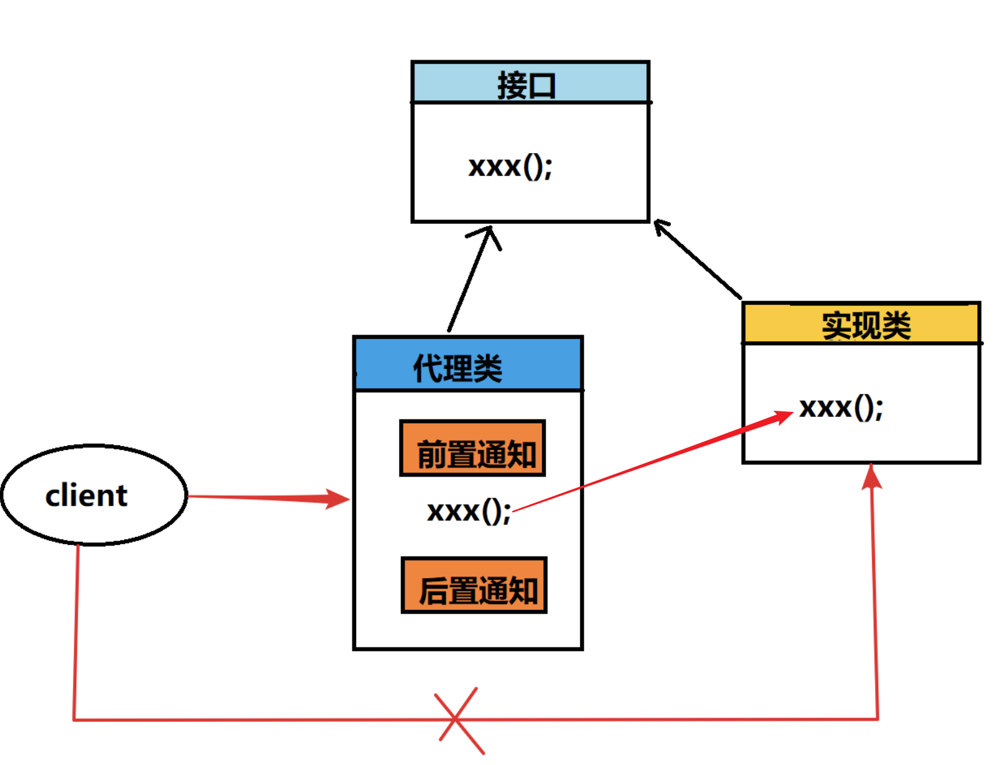

## 一、Spring 简介

### 1、简介

- **Spring framework** 是 Spring 基础框架
- 学习Spring 家族产品
  - Spring Framework
  - Spring Boot
  - Spring Cloud
- Spring 能用来做什么
  - 开发 WEB 项目
  - 微服务
  - 分布式系统
- Spring Framework 是 Spring 最基础的框架，是其它框架技术的基础
- SpringBoot 是用来做简化开发的，单一项目
- SpringCloud 做分布式微服务相关的，拆分大单体项目为小模块项目

### 2、概述

Spring Framework 介绍

- 概述：Spring 提供了基础框架，你不必关心框架细节，只需要专注于代码业务逻辑
- 优点：
  - 组件化模块化的：通过很多模块与组件组合成 Spring 应用，以后可以通过 Xml 或者注解的方式去操作
  - 控制反转（ Inversion of Control (IoC) ）：传统创建对象都是通过认为的 new 对象的方式，把控制创建对象的权利转交给 Spring
  - 依赖注入（Dependency Injection）：自动化的注入属性

### 3、Spring 模块


- 模块介绍

  - **Core Container**：核心容器，是Spring 最核心的模块，以后用到的都依赖该模块实现
  - **Aop**：面向切面编程，目的是不改变原有代码的前提下对功能进行增强
    - Aspects：是 AOP 具体实现
  - **Data Access/Integration**：数据层
    - Data Access：数据访问的
    - Data Integration：数据集成
    - Transactios：支持事务操作，通过 AOP 来实现，释放我们的双手
  - **Web**：WEB 层，SpringMVC 框架的
    - Servlet
    - Web
  - **Test**：做集成测试
    - 整合 Junit 做单元测试

## 二、IoC

### 1、概述

- IoC：Inversion of Control 控制反转
- 让容器负责对象的创建以及销毁操作，对象在容器中叫 Bean

### 2、Bean 配置

1. 添加相关依赖

   ```xml
   <dependency>
       <groupId>org.springframework</groupId>
       <artifactId>spring-context</artifactId>
       <version>5.2.10.RELEASE</version>
   </dependency>
   ```

2. 创建 Spring 配置文件：beans.xml

   ```xml
   <?xml version="1.0" encoding="UTF-8"?>
   <beans xmlns="http://www.springframework.org/schema/beans"
          xmlns:xsi="http://www.w3.org/2001/XMLSchema-instance"
          xsi:schemaLocation="http://www.springframework.org/schema/beans http://www.springframework.org/schema/beans/spring-beans.xsd">
       <bean id="student" name="stu" class="org.taiyi.domain.Student"></bean>
   </beans>
   ```

3. 属性介绍

   | 属性  | 说明           |
   | ----- | -------------- |
   | id    | 给 bean 起名字 |
   | name  | 给 bean 起别名 |
   | class | 全限定类名     |

### 3、容器创建

1. ClassPathXmlApplicationContext

   ```java
   ClassPathXmlApplicationContext context = new ClassPathXmlApplicationContext("beans.xml");
   System.out.println(context);
   ```

2. FileSystemXmlApplicationContext

   ```java
   FileSystemXmlApplicationContext context = new FileSystemXmlApplicationContext("beans.xml绝对路径");
   System.out.println(context);
   ```


### 4、从容器中获取 Bean

1. 根据 id 获取

   ```java
   ClassPathXmlApplicationContext context = new ClassPathXmlApplicationContext("beans.xml");
   Student student = (Student) context.getBean("student");
   ```

   - 注意：id 必须唯一

2. 根据 id 和类型

   ```java
   ClassPathXmlApplicationContext context = new ClassPathXmlApplicationContext("beans.xml");
   Student student = context.getBean("student", Student.class);
   ```

3. 根据类型

   ```java
   ClassPathXmlApplicationContext context = new ClassPathXmlApplicationContext("beans.xml");
   Student student = context.getBean(Student.class);
   ```

   - 注意：使用类型获取的时候，一定要保证容器中只有一个 JavaBean 对象

- 注意：必须提供无参构造器（反射调用对象的无参构造器实现从容器中获取 Bean）

### 5、设计模式

#### 5.1 单例模式

- 概述：属于创建型模式，提供了创建对象的最佳方式。单例模式只能有一个单例的实例。

- 懒汉式单例模式

  ```java
  public class SingleObject {
  
      private static SingleObject instance;
  
      private SingleObject(){
      }
  
      public static SingleObject getInstance(){
          if (instance == null){
              instance = new SingleObject();
          }
          return instance;
      }
  }
  ```
  
- 饿汉式单例模式

  ```java
  public class SingleObject {
  
      private static SingleObject instance = new SingleObject();
  
      private SingleObject(){
      }
  
      public static SingleObject getInstance(){
          return instance;
      }
  }
  ```

#### 5.2 工厂模式

- 概述：属于创建型模式，目的式提供创建对象的最佳方式；

- 静态工厂

  ```java
  public class BeanStaticFactory {
  
      public static Student getBean() {
          return new Student();
      }
  
      public static Object getBean(String name) {
          if ("Student".equals(name)) {
              return new Student();
          } else if ("SingleObject".equals(name)) {
              return SingleObject.getInstance();
          } else {
              return new Object();
          }
      }
  }
  ```

- 实例工厂

  ```java
  public class BeanFactory {
      public Object getBean(){
          return new Student();
      }
  }
  ```


#### 5.3 通过反射获取 xml 配置创建对象

1. 引入相关依赖

   ```xml
   <dependency>
       <groupId>org.dom4j</groupId>
       <artifactId>dom4j</artifactId>
       <version>2.1.3</version>
   </dependency>
   <dependency>
       <groupId>jaxen</groupId>
       <artifactId>jaxen</artifactId>
       <version>1.2.0 </version>
   </dependency>
   ```

2. Java 代码实现

   ```java
   public class XmlCreateBean {
       /**
        * 模拟 Spring 容器创建 JavaBean
        *
        * @param configName beans.xml
        * @param id         bean id
        * @return 对象
        */
       public static Object getBean(String configName, String id) {
           SAXReader saxReader = new SAXReader();
           try {
               Document dom = saxReader.read(configName);
               Element element = dom.getRootElement();
               List<Element> beans = element.elements("bean");
               for (Element bean : beans) {
                   if (id.equals(bean.attributeValue("id"))) {
                       String aClass = bean.attributeValue("class");
                       Class<?> clz = Class.forName(aClass);
                       return clz.newInstance();
                   }
               }
           } catch (DocumentException | ClassNotFoundException | InstantiationException | IllegalAccessException e) {
               e.printStackTrace();
           }
           return null;
       }
   }
   ```

### 6、Bean 的实例化

#### 6.1 构造器（常用）

```java
public class Person {
    public Person() {
    }
}
```

```xml
<bean id="person" class="org.taiyi.domain.Person"></bean>
```

```java
ClassPathXmlApplicationContext context = new ClassPathXmlApplicationContext("beans.xml");
Person person = (Person) context.getBean("person");
```

- 通过无参构造器，使用反射的方式创建对象

#### 6.2 静态工厂方法（了解）

```java
public class ClientService {

    private static ClientService clientService = new ClientService();

    private ClientService() {
    }

    public static ClientService createInstance() {
        return clientService;
    }
}
```

```xml
<bean id="clientService" class="org.taiyi.service.ClientService" factory-method="createInstance"></bean>
```

```java
ClassPathXmlApplicationContext context = new ClassPathXmlApplicationContext("beans.xml");
ClientService clientService = context.getBean(ClientService.class);
```

#### 6.3 实例工厂方法（了解）

```java
public class ClientService {
}
```

```java
public class ClientServiceFactory {
    private static ClientService clientService = new ClientService();

    private ClientServiceFactory() {
    }

    public ClientService getInstance() {
        return clientService;
    }
}
```

```xml
<bean id="clientServiceFactory" class="org.taiyi.service.ClientServiceFactory" ></bean>
<bean id="clientService" factory-bean="clientServiceFactory" factory-method="getInstance"></bean>
```

```java
ClassPathXmlApplicationContext context = new ClassPathXmlApplicationContext("beans.xml");
ClientService clientService = context.getBean(ClientService.class)
```

#### 6.4 FactoryBean（常用）

```java
public class Employee {
}
```

```java
public class EmployeeFactory implements FactoryBean<Employee> {
    @Override
    public Employee getObject() throws Exception {
        System.out.println("获取 employee 对象");
        return new Employee();
    }

    @Override
    public Class<?> getObjectType() {
        return Employee.class;
    }

    @Override
    public boolean isSingleton() {
        return false;
    }
}
```

配置工厂类（没有配置 Employee 类）

```xml
<bean id="employee" class="org.taiyi.service.EmployeeFactory"></bean>
```

获取 Bean

```java
ClassPathXmlApplicationContext context = new ClassPathXmlApplicationContext("beans.xml");
Employee employee = context.getBean(Employee.class);
```

| 方法          | 作用                   |
| ------------- | ---------------------- |
| isSingleton() | 是否以单例模式返回对象 |
| getObject()   | 对象创建               |

## 三、DI

### 1、概述

- DI：Dependency Injection 依赖注入，给对象设置属性
- 曾经需要创建 mapper 对象，才能调用，现在交给 Spring 创建，并且使用 DI 注入，直接拿来用，程序员更加关注业务，而不是对象创建。
- 给对象设置属性的方法
  - 构造器
  - setter 方法

### 2、构造器注入

1. domain

   ```java
   public class Student {
   }
   ```

2. mapper

   ```java
   public interface IStudentMapper {
       void insert(Student student);
       int delete(Long id);
   }
   ```
   
   ```java
   public class StudentMapper implements IStudentMapper {
       @Override
       public void insert(Student student) {
           System.out.println("插入一条学生记录");
       }
   
       @Override
       public int delete(Long id) {
           System.out.println("删除一条学生记录");
           return 0;
       }
   }
   ```
   
   ```xml
   <bean id="iStudentMapper" class="org.taiyi.di.mapper.impl.StudentMapper"></bean>
   ```
   
3. service

   ```java
   public interface IStudentService {
       void save(Student student);
   
       int remove(Long id);
   }
   ```

   ```java
   public class StudentServiceImpl implements IStudentService {
   
       private IStudentMapper studentMapper;
   
       public StudentServiceImpl(IStudentMapper studentMapper) {
           this.studentMapper = studentMapper;
       }
   
       @Override
       public void save(Student student) {
           studentMapper.insert(student);
       }
   
       @Override
       public int remove(Long id) {
           return studentMapper.delete(id);
       }
   }
   ```

   ```xml
   <bean id="iStudentService" class="org.taiyi.di.service.impl.StudentServiceImpl"></bean>
   ```

4. 测试

   ```java
   ClassPathXmlApplicationContext context = new ClassPathXmlApplicationContext("di_beans.xml");
   IStudentService studentService = context.getBean(IStudentService.class);
   System.out.println(studentService);
   int remove = studentService.remove(1L);
   System.out.println(remove);
   ```

   会出现空指针异常，service 中的 mapper 对象没有为 null；

5. 配置构造器注入属性

   ```xml
   <bean id="iStudentMapper" class="org.taiyi.di.mapper.impl.StudentMapper"></bean>
   <bean id="iStudentService" class="org.taiyi.di.service.impl.StudentServiceImpl">
       <constructor-arg name="studentMapper" ref="iStudentMapper"></constructor-arg>
   </bean>
   ```

   - 注意：

     - name：构造器的参数名称
     - ref：配置文件中其他 bean 的名称

   - 基本数据类型按如下方式注入

     ```xml
     <bean id="iStudentService" class="org.taiyi.di.service.impl.StudentServiceImpl">
         <constructor-arg name="studentMapper" ref="iStudentMapper"></constructor-arg>
         <constructor-arg type="int" value="18"></constructor-arg>
     </bean>
     ```

   - 出现两个 int 类型，会出现覆盖问题，解决方式：删除 type 属性，添加 index 属性


### 3、setter 依赖注入

1. domain

   ```java
   public class Employee {
   }
   
   ```

2. mapper

   ```java
   public interface IEmployeeMapper {
       int delete(Long id);
   }
   ```

   ```java
   public class EmployeeMapperImpl implements IEmployeeMapper {
       @Override
       public int delete(Long id) {
           System.out.println("删除 id = " + id + "的员工");
           return 0;
       }
   }
   ```

3. service

   ```java
   public interface IEmployeeService {
       int remove(Long id);
   }
   ```

   ```java
   public class EmployeeServiceImpl implements IEmployeeService {
   
       private IEmployeeMapper employeeMapper;
   
       public void setEmployeeMapper(IEmployeeMapper employeeMapper) {
           this.employeeMapper = employeeMapper;
       }
   
       // 提供 set 方法，藏能注入成功
       @Override
       public int remove(Long id) {
           return employeeMapper.delete(id);
       }
   }
   ```

4. beam.xml

   ```xml
   <?xml version="1.0" encoding="UTF-8"?>
   <beans xmlns="http://www.springframework.org/schema/beans"
          xmlns:xsi="http://www.w3.org/2001/XMLSchema-instance"
          xsi:schemaLocation="http://www.springframework.org/schema/beans http://www.springframework.org/schema/beans/spring-beans.xsd">
   
       <bean id="employeeMapper" class="org.taiyi.di.setter.mapper.impl.EmployeeMapperImpl"></bean>
       <bean id="employeeService" class="org.taiyi.di.setter.service.impl.EmployeeServiceImpl">
           <property name="employeeMapper" ref="employeeMapper"></property>
       </bean>
   </beans>
   ```

   - name：set 的方法名，去掉 set 后首字母小写
   - ref：其他 bean 的 id 的引用
   - value：直接赋值 

5. 测试验证

   ```java
   @Test
   public void setterDI() {
       ClassPathXmlApplicationContext context = new ClassPathXmlApplicationContext("di_setter_beans.xml");
       IEmployeeService employeeService = context.getBean(IEmployeeService.class);
       System.out.println(employeeService);
       int count = employeeService.remove(1L);
       System.out.println(count);
   }
   ```

6. 注意

   setter 注入简单类型

   ```xml
   <bean id="employeeService" class="org.taiyi.di.setter.service.impl.EmployeeServiceImpl">
       <property name="employeeMapper" ref="employeeMapper"></property>
       <property name="name" value="taiyi"></property>
       <property name="age" value="18"></property>
   </bean>
   ```

7. setter 注入总结

   - 对于引用数据类型：`<property name="" ref=""></property>`
   - 对于简单数据类型：`<property name="" value=""></property>`

### 4、Collections 注入

类别：

- List
- Map
- Set
- Properties
- Array

1. demo

   ```java
   public class CollectionsDemo {
       private List<Integer> list;
   
       private Map<String, String> map;
   
       private Set<String> set;
   
       private Properties properties;
   
       private int[] arr;
   
       public void setList(List<Integer> list) {
           this.list = list;
       }
   
       public void setMap(Map<String, String> map) {
           this.map = map;
       }
   
       public void setSet(Set<String> set) {
           this.set = set;
       }
   
       public void setProperties(Properties properties) {
           this.properties = properties;
       }
   
       public void setArr(int[] arr) {
           this.arr = arr;
       }
   
       @Override
       public String toString() {
           return "CollectionsDemo{" +
                   "list=" + list +
                   ", map=" + map +
                   ", set=" + set +
                   ", properties=" + properties +
                   ", arr=" + Arrays.toString(arr) +
                   '}';
       }
   }
   ```

2. beans.xml

   ```xml
   <?xml version="1.0" encoding="UTF-8"?>
   <beans xmlns="http://www.springframework.org/schema/beans"
          xmlns:xsi="http://www.w3.org/2001/XMLSchema-instance"
          xsi:schemaLocation="http://www.springframework.org/schema/beans http://www.springframework.org/schema/beans/spring-beans.xsd">
   
       <bean id="collectionsDemo" class="org.taiyi.di.collections.CollectionsDemo">
           <property name="list">
               <list>
                   <value>1</value>
                   <value>1</value>
                   <value>1</value>
               </list>
           </property>
           <property name="map">
               <map>
                   <entry key="name" value="taiyi"></entry>
                   <entry key="age" value="18"></entry>
               </map>
           </property>
           <property name="set">
               <set>
                   <value>set1</value>
                   <value>set2</value>
               </set>
           </property>
           <property name="properties">
               <props>
                   <prop key="username">root</prop>
                   <prop key="password">123456</prop>
               </props>
           </property>
           <property name="arr">
               <list>
                   <value>2</value>
                   <value>2</value>
                   <value>2</value>
               </list>
           </property>
       </bean>
   </beans>
   ```

3. 测试验证

   ```java
   @Test
   public void collectionsDI() {
       ClassPathXmlApplicationContext context = new ClassPathXmlApplicationContext("di_collection_beans.xml");
       CollectionsDemo collectionsDemo = context.getBean(CollectionsDemo.class);
       System.out.println(collectionsDemo.toString());
   }
   ```

4. 如何注入空值

   ```xml
   <property name="email">
       <null/>
   </property>
   ```

### 5、自动装配

1. 概述：IoC 容器根据 Bean 所依赖的属性，自动查找并进行自动装配

2. 分类

   - 不启用自动装配
   - byName：通过名称
   - byType：通过类型
   - constructor：通过构造器

3. 案例

   beans.xml

   ```xml
   <?xml version="1.0" encoding="UTF-8"?>
   <beans xmlns="http://www.springframework.org/schema/beans"
          xmlns:xsi="http://www.w3.org/2001/XMLSchema-instance"
          xsi:schemaLocation="http://www.springframework.org/schema/beans http://www.springframework.org/schema/beans/spring-beans.xsd">
   
       <bean id="employeeMapper" class="org.taiyi.di.setter.mapper.impl.EmployeeMapperImpl"></bean>
       <bean id="employeeService" class="org.taiyi.di.setter.service.impl.EmployeeServiceImpl" autowire="byName"></bean>
   </beans>
   ```

   测试验证

   ```java
   @Test
   public void autowiredDI() {
       ClassPathXmlApplicationContext context = new ClassPathXmlApplicationContext("di_autowired_beans.xml");
       IEmployeeService employeeService = context.getBean(IEmployeeService.class);
       System.out.println(employeeService);
       int count = employeeService.remove(1L);
       System.out.println(count);
   }
   ```

4. byName 和 byType

   - byName：使用 set 的方法名与 bean 的 id 或者 name 属性进行匹配
   - byType：需要保证容器中只有一个 bean 对象，因为是根据 class 属性的类型来进行匹配的

5. 注意：

   - 自动注入的优先级低于 setter 和 构造器注入
   - 自动注入只能用于引用数据类型，不能用于基本数据类型
   - 推荐使用 byType

### 6、Bean Scops

- 常见作用域

  | scop      | 说明 |
  | --------- | ---- |
  | singleton | 单例 |
  | prototype | 多例 |
  | request   | 请求 |
  | session   | 会话 |

- 单例 singleton（默认）

- 多例 prototype

  ```xml
  <bean id="employeeMapper" class="org.taiyi.di.setter.mapper.impl.EmployeeMapperImpl" scope="prototype"></bean>
  ```

- 注意：

  - 容器默认以单例模式创建对象，如果需要修改成非单例，使用 scop 属性进行修改
  - 开发中适合交给 Spring 容器进行管理的 Bean：
    - 持久层：mapper
    - 业务层：service
    - 控制层：controller
  - 单例 Bean 是否会出现线程安全？
    - 判断 Bean 对象是否存储数据，如果用来存储数据，会出现线程安全问题；
    - 使用局部变量做存储，方法调用结束就销毁，不存在线程安全问题；

### 7、Bean 生命周期（面试）

- 概述：一个对象从创建到销毁的过程

- 观察生命周期案例

  ```java
  public class User {
      private String name;
  
      public User() {
          System.out.println("User 构造器");
      }
  
      public void setName(String name) {
          System.out.println("调用 setName() 方法");
          this.name = name;
      }
  
      public void init() {
          System.out.println("调用 init 方法");
      }
  
      public void destroy() {
          System.out.println("调用 destroy 方法");
      }
  
      @Override
      public String toString() {
          return "User{" +
                  "name='" + name + '\'' +
                  '}';
      }
  }
  ```

  ```xml
  <?xml version="1.0" encoding="UTF-8"?>
  <beans xmlns="http://www.springframework.org/schema/beans"
         xmlns:xsi="http://www.w3.org/2001/XMLSchema-instance"
         xsi:schemaLocation="http://www.springframework.org/schema/beans http://www.springframework.org/schema/beans/spring-beans.xsd">
      <bean id="user" class="org.taiyi.lifecycle.User" init-method="init" destroy-method="destroy">
          <property name="name" value="taiyi"></property>
      </bean>
  </beans>
  ```

  测试验证

  ```java
  @Test
  public void lifecycleTest(){
      ClassPathXmlApplicationContext context = new ClassPathXmlApplicationContext("lifecycle.xml");
      User user = context.getBean(User.class);
      System.out.println(user);
      context.destroy();
  }
  ```

  结果

  ```shell
  User 构造器
  调用 setName() 方法
  调用 init 方法
  User{name='taiyi'}
  调用 destroy 方法
  ```

  没有打印销毁方法的原因：

  - Spring IoC 是运行在 JVM 虚拟机中的
  - 执行 test 方法后，虚拟机开启，Spring 加载配置文件创建 Bean 对象，调用构造器以及 init 方法；
  - test 执行完毕的时候，JVM 退出，Spring IoC 容器来不及关闭销毁 bean，所以没有调用销毁方法，可以手动关闭容器；

- BeanPostProcessor

  自定义 Bean 处理器

  ```java
  public class MyBeanPostProcessor implements BeanPostProcessor {
      @Override
      public Object postProcessBeforeInitialization(Object bean, String beanName) throws BeansException {
          // Bean 前置处理器
          System.out.println("Bean 前置处理器");
          return bean;
      }
  
      @Override
      public Object postProcessAfterInitialization(Object bean, String beanName) throws BeansException {
          // Bean 后置处理器
          System.out.println("Bean 后置处理器");
          return bean;
      }
  }
  ```

  配置 xml

  ```xml
  <bean class="org.taiyi.lifecycle.MyBeanPostProcessor"/>
  ```

  结果

  ```shell
  User 构造器
  调用 setName() 方法
  Bean 前置处理器
  调用 init 方法
  Bean 后置处理器
  User{name='taiyi'}
  调用 destroy 方法
  ```

- 图示

  

- 总结

  1. Bean 对象创建（反射，无参构造器）
  2. 属性依赖注入（setter依赖注入）
  3. Bean 前置处理器：before
  4. init
  5. Bean 后置处理器：after
  6. 对象的正常使用
  7. destroy
  8. IoC 容器关闭
  9. JVM 虚拟机退出

## 四、容器执行点

### 1、整合 Druid 连接池

#### 1.1 引入 Druid 依赖

```xml
<dependency>
    <groupId>com.alibaba</groupId>
    <artifactId>druid</artifactId>
    <version>1.2.20</version>
</dependency>
```

#### 1.2 硬编码方式整合

```xml
<?xml version="1.0" encoding="UTF-8"?>
<beans xmlns="http://www.springframework.org/schema/beans"
       xmlns:xsi="http://www.w3.org/2001/XMLSchema-instance"
       xsi:schemaLocation="http://www.springframework.org/schema/beans http://www.springframework.org/schema/beans/spring-beans.xsd">
    <bean id="druidDataSource" class="com.alibaba.druid.pool.DruidDataSource">
        <property name="driverClassName" value="com.mysql.cj.jdbc.Driver"/>
        <property name="username" value="root"/>
        <property name="password" value="123456"/>
        <property name="url" value="jdbc:mysql://localhost:3306:mybatis"/>
    </bean>
</beans>
```

注意：属性是通过 set 方法注入的

#### 1.3 通过配置文件动态获取连接数据

db.properties

```properties
username=root
password=123456
driverClassName=com.mysql.cj.jdbc.Driver
url=jdbc:mysql://localhost:3306/mybatis
```

xml

```xml
<?xml version="1.0" encoding="UTF-8"?>
<beans xmlns="http://www.springframework.org/schema/beans"
       xmlns:xsi="http://www.w3.org/2001/XMLSchema-instance"
       xsi:schemaLocation="http://www.springframework.org/schema/beans http://www.springframework.org/schema/beans/spring-beans.xsd">
    <bean id="druidDataSource" class="com.alibaba.druid.pool.DruidDataSource">
        <property name="driverClassName" value="${driverClassName}"/>
        <property name="url" value="${url}"/>
        <property name="username" value="${username}"/>
        <property name="password" value="${password}"/>
    </bean>
    <bean class="org.springframework.beans.factory.config.PropertyPlaceholderConfigurer">
        <property name="location" value="db.properties"/>
    </bean>
</beans>
```

简化 xml

```xml
<?xml version="1.0" encoding="UTF-8"?>
<beans xmlns="http://www.springframework.org/schema/beans"
       xmlns:xsi="http://www.w3.org/2001/XMLSchema-instance"
       xmlns:context="http://www.springframework.org/schema/context"
       xsi:schemaLocation="http://www.springframework.org/schema/beans http://www.springframework.org/schema/beans/spring-beans.xsd http://www.springframework.org/schema/context https://www.springframework.org/schema/context/spring-context.xsd">
    <bean id="druidDataSource" class="com.alibaba.druid.pool.DruidDataSource">
        <property name="driverClassName" value="${driverClassName}"/>
        <property name="url" value="${url}"/>
        <property name="username" value="${username}"/>
        <property name="password" value="${password}"/>
    </bean>
    <context:property-placeholder location="db.properties"/>
</beans>
```

#### 1.4 注意事项

- 问题：简化 xml 加载配置会加载到电脑系统的配置

- 解决办法

  - 给配置文件添加前缀变量

    ```properties
    jdbc.username=root
    jdbc.password=123456
    jdbc.driverClassName=com.mysql.cj.jdbc.Driver
    jdbc.url=jdbc:mysql://localhost:3306/mybatis
    ```
    
  - 添加属性
  
    ```xml
    <context:property-placeholder system-properties-mode="NEVER" location="db.properties"/>
    ```
  

### 2、容器总结

#### 2.1 BeanFactory 继承结构


#### 2.2 创建容器

- BeanFactory：容器顶层接口
- ApplicationContext：核心接口
- AbstractApplicationContext：抽象类，提供了获取 bean 以及加载资源的功能
- ClassPathXmlApplicationContext：装载 bean ，做初始化

#### 2.3 Bean 配置

```xml
<bean id="user" class="org.taiyi.lifecycle.User" scope="singleton" 
      init-method="init" destroy-method="destroy" autowire="byType" lazy-init="true">
    <property name="name" value="taiyi"/>
</bean>
```

- id：代表名称，必须唯一
- class：全限定类名
- scope：作用域：单例，原型
- init-method：初始化方法
- destroy-method：销毁方法
- autowire：自动注入
- lazy-init：如果开启懒加载，默认调用时才创建 Bean

#### 2.4 DI 注入

- constructor-arg：构造器注入
- property：setter 注入
- 集合注入

## 五、XML Bean 配置存在问题

### 1、存在的问题

- 需要写 xml 配置文件，麻烦
- 注入属性也比较麻烦：构造器、setter

### 2、解决办法

- 通过注解配置 bean，以及注解操作 DI 注入
- 优点：简洁、方便

## 六、IoC 注解开发

### 1、XML & 注解配置 Bean

#### 1.1 案例

domain

```java
public class User {
    private String name;
    private int age;

    public void setName(String name) {
        this.name = name;
    }

    public void setAge(int age) {
        this.age = age;
    }

    @Override
    public String toString() {
        return "User{" +
                "name='" + name + '\'' +
                ", age=" + age +
                '}';
    }
}
```

mapper

```java
public interface UserMapper {
    void insert(User user);
}
```

```java
@Component
public class UserMapperImpl implements UserMapper {
    @Override
    public void insert(User user) {
        System.out.println("用户保存成功");
    }
}
```

xml

```xml
<?xml version="1.0" encoding="UTF-8"?>
<beans xmlns="http://www.springframework.org/schema/beans"
       xmlns:xsi="http://www.w3.org/2001/XMLSchema-instance"
       xmlns:context="http://www.springframework.org/schema/context"
       xsi:schemaLocation="http://www.springframework.org/schema/beans http://www.springframework.org/schema/beans/spring-beans.xsd http://www.springframework.org/schema/context https://www.springframework.org/schema/context/spring-context.xsd">
    <context:component-scan base-package="org.taiyi.iocAnnotation.mapper"/>
</beans>
```

测试验证

```java
@Test
public void mapperTest(){
    ApplicationContext context = new ClassPathXmlApplicationContext("ioc_annotation_beans.xml");
    UserMapper userMapper = context.getBean(UserMapper.class);
    User user = new User();
    user.setName("太一");
    user.setAge(19);
    userMapper.insert(user);
}
```

#### 1.2 @Component 详解

- 默认不传参：bean 的名称是类名首字母小写

- 可以通过传参指定 bean 名称：`@Component("userMapperImpl")`

- 使用位置：实现类上方，不能使用到接口上

- 作用：将 bean 交给 Spring IoC 容器管理

- 延伸注解：和 @Component 一模一样，用于给程序员区分业务组件

  - @Controller：控制层

    ```java
    @Controller
    public class UserController {
    }
    ```

  - @Service：业务层

    ```java
    @Service
    public class UserService implements IUserService {
        @Override
        public void save(User user){
            System.out.println("service 用户保存成功");
        }
    }
    ```

  - @Repository：持久层

    ```java
    @Repository
    public class UserMapperImpl implements UserMapper {
        @Override
        public void insert(User user) {
            System.out.println("用户保存成功");
        }
    }
    ```

- 继承图示

  

### 2、纯注解配置 Bean

#### 2.1 案例

mapper

```java
public interface StudentMapper {
    int delete(Long id);
}
```

```java
@Repository
public class StudentMapperImpl implements StudentMapper {
    @Override
    public int delete(Long id) {
        System.out.println("删除 id = " + id + "的学生");
        return 0;
    }
}
```

配置类

```java
@ComponentScan("org.taiyi.day02.annotationIoC")
@Configuration
public class SpringConfig {
}
```

测试验证

```java
@Test
public void annotationTest(){
    ApplicationContext context = new AnnotationConfigApplicationContext(SpringConfig.class);
    StudentMapper studentMapper = context.getBean(StudentMapper.class);
    int count = studentMapper.delete(1L);
    System.out.println(count);
}
```

#### 2.2 @Configuration 详解

- 将 SpringConfig 类变成 Spring 的配置类，替换 xml 配置文件
- 作用：标识该类是 Spring 的配置类
- 配置名称，默认类名首字母小写
- 使用在类上

#### 2.3 @ComponentScan 详解

- 配置扫描包路径
- 作用：配置扫描包路径，当前包及其子包都会被扫描
- value：指定包路径，用于扫描并注册 Bean

### 3、注解开发梳理

- 使用 @Component 代替 xml 的过程梳理

  

- 使用 @Configuration @ComponentScan 与 xml 配置过程梳理

  

### 4、@Scope

- 不配置 Scope 默认 Bean 都是单例的

- 通过注解 @Scope 修改作用域

  ```java
  @Component
  @Scope("prototype")
  public class ScopeBean {
  }
  ```

- 位置：定义到类上

- 作用：修改对象创建的作用域

- 属性：默认是 singleton（单例），可以修改成 prototype（非单例）

### 5、Bean 生命周期

```java
@Component
public class LifeBean {
    public LifeBean() {
        System.out.println("执行构造器");
    }

    @PostConstruct
    public void init() {
        System.out.println("初始化Bean");
    }

    @PreDestroy
    public void destroy() {
        System.out.println("销毁Bean");
    }
}
```

#### 5.1 @PostConstruct 详解

- 位置：方法上
- 作用：设置该方法为 Bean 的初始化方法

#### 5.2 @PreDestroy 详解

- 位置：方法上
- 作用：设置该方法为 Bean 的销毁方法

#### 5.3 @PostConstruct @PreDestroy @Scope 与 xml 配置梳理


## 七、DI 注解开发

### 1、目前存在的问题

- 不使用 xml 进行的配置的话，无法解决注入问题，会出现空指针异常

### 2、按照类型注入

- 使用案例

  通过构造器

  ```java
  @Service
  public class EmployeeServiceImpl implements EmployeeService {
  
      private EmployeeMapper employeeMapper;
  
      @Autowired
      public EmployeeServiceImpl(EmployeeMapper employeeMapper) {
          this.employeeMapper = employeeMapper;
      }
  
      public void setEmployeeMapper(EmployeeMapper employeeMapper) {
          this.employeeMapper = employeeMapper;
      }
  
      @Override
      public int remove(Long id) {
          return employeeMapper.delete(id);
      }
  }
  ```

  通过 setter 注入

  ```java
  @Service
  public class EmployeeServiceImpl implements EmployeeService {
  
      private EmployeeMapper employeeMapper;
  
      public EmployeeServiceImpl(EmployeeMapper employeeMapper) {
          this.employeeMapper = employeeMapper;
      }
  
      @Autowired
      public void setEmployeeMapper(EmployeeMapper employeeMapper) {
          this.employeeMapper = employeeMapper;
      }
  
      @Override
      public int remove(Long id) {
          return employeeMapper.delete(id);
      }
  }
  ```

  使用字段注入（反射）

  ```java
  @Service
  public class EmployeeServiceImpl implements EmployeeService {
  
      @Autowired
      private EmployeeMapper employeeMapper;
  
      @Override
      public int remove(Long id) {
          return employeeMapper.delete(id);
      }
  }
  ```

- @Autowired：根据类型注入 byType

- byType 要求：只能有一个实现类

- 属性：required，设置为 false--> 找不到不会报错

### 3、按照名称注入

- @Autowired & @Qualifier：解决两个实现类无法注入的问题

- 使用案例

  ```java
  @Service
  public class EmployeeServiceImpl implements EmployeeService {
  
      @Autowired
      @Qualifier("employeeMapperImpl")
      private EmployeeMapper employeeMapper;
  
      @Override
      public int remove(Long id) {
          return employeeMapper.delete(id);
      }
  }
  ```

### 4、简单数据类型注入

@Value

```java
@Component
public class DbProperties {

    @Value("root")
    private String username;

    @Value("123456")
    private String password;
}
```

问题：硬编码，不便利

### 5、通过注解读取配置文件获取参数

- @PropertySource 使用案例

  配置类

  ```java
  @Configuration
  @ComponentScan("org.taiyi.day02.annotationDI")
  @PropertySource("db.properties")
  public class DiConfig {
  }
  ```

  使用

  ```java
  @Component
  public class DbProperties {
  
      @Value("${username}")
      private String username;
  
      @Value("${password}")
      private String password;
  
      @Override
      public String toString() {
          return "DbProperties{" +
                  "username='" + username + '\'' +
                  ", password='" + password + '\'' +
                  '}';
      }
  }
  ```

- 位置：配置类上

- 作用：导入配置文件

- 多个配置文件可以通过字符串数组传参

  ```java
  @Configuration
  @ComponentScan("org.taiyi.day02.annotationDI")
  @PropertySource({"db.properties", "xx.properties"})
  public class DiConfig {
  }
  ```

### 6、注解配置第三方 Bean —— Druid

- 引入 Druid 依赖

  ```xml
  <dependency>
      <groupId>com.alibaba</groupId>
      <artifactId>druid</artifactId>
      <version>1.2.20</version>
  </dependency>
  ```

- 方式1：@Bean

  ```java
  @Configuration
  @PropertySource("db.properties")
  public class SpringConfig {
  
      @Value("${jdbc.driver}")
      private String driver;
      @Value("${jdbc.url}")
      private String url;
      @Value("${jdbc.username}")
      private String username;
      @Value("${jdbc.password}")
      private String password;
  
      @Bean
      public DataSource getDuridDataSource(){
          DruidDataSource dataSource = new DruidDataSource();
          dataSource.setDriverClassName(driver);
          dataSource.setUrl(url);
          dataSource.setUsername(username);
          dataSource.setPassword(password);
          return dataSource;
      }
  }
  ```

- 方式2：使用 @Component 抽取

  ```java
  @Component
  @PropertySource("db.properties")
  public class DruidConfig {
      @Value("{jdbc.driver}")
      private String driver;
      @Value("{jdbc.url}")
      private String url;
      @Value("{jdbc.username}")
      private String username;
      @Value("{jdbc..password}")
      private String password;
  
      @Bean
      public DataSource getDuridDataSource(){
          DruidDataSource dataSource = new DruidDataSource();
          dataSource.setDriverClassName(driver);
          dataSource.setUrl(url);
          dataSource.setUsername(username);
          dataSource.setPassword(password);
          return dataSource;
      }
  }
  ```

  ```java
  @Configuration
  @ComponentScan("org.taiyi.day02.druid")
  public class SpringConfig {
  }
  ```

- 方式3：@Import 导入配置类

  ```java
  @Configuration
  @PropertySource("db.properties")
  public class DruidConfig {
      @Value("{jdbc.driver}")
      private String driver;
      @Value("{jdbc.url}")
      private String url;
      @Value("{jdbc.username}")
      private String username;
      @Value("{jdbc..password}")
      private String password;
  
      @Bean
      public DataSource getDuridDataSource(){
          DruidDataSource dataSource = new DruidDataSource();
          dataSource.setDriverClassName(driver);
          dataSource.setUrl(url);
          dataSource.setUsername(username);
          dataSource.setPassword(password);
          return dataSource;
      }
  }
  ```

  ```java
  @Configuration
  @Import(DruidConfig.class)
  public class SpringConfig {
  }
  ```

### 7、注解开发总结

| 注解配置                                                | xml 配置                                                     | 功能说明         |
| ------------------------------------------------------- | ------------------------------------------------------------ | ---------------- |
| @Component<br/>@Controller<br/>@Service<br/>@Repository | bean 标签（id,class）                                        | 定义bean         |
| @ComponentScan                                          | <context:component-scan base-package="cn.sycoder.ioc.xmlAnnotationBean"/> | 扫描包加载bean   |
| @Autowired<br/>@Qualifier<br/>@Value                    | setter 注入<br/>构造器注入<br/>自动装配                      | 依赖注入         |
| @Bean                                                   | bean 标签，静态工厂模式，实例工厂模式，FactoryBean           | 配置第三方bean   |
| @Scope                                                  | bean 标签中的 scope 属性                                     | 设置作用域       |
| @PostConstructor<br/>@PreDestroy                        | bean 标签中的 init-method / destroy-method                   | 生命周期相关     |
| @Import                                                 |                                                              | 导入其它的配置类 |
| @PropertySource({"db.properties","xx.properties"})      | <context:property-placeholder system-properties-mode="NEVER" location="*.properties"/> | 导入配置文件     |

## 八、Spring 整合

### 1、Spring 整合 Junit

#### 1.1 添加 Junit 依赖

```xml
<dependency>
    <groupId>org.springframework</groupId>
    <artifactId>spring-context</artifactId>
    <version>5.2.10.RELEASE</version>
</dependency>
<dependency>
    <groupId>junit</groupId>
    <artifactId>junit</artifactId>
    <version>4.13.1</version>
    <scope>test</scope>
</dependency>
<dependency>
    <groupId>org.springframework</groupId>
    <artifactId>spring-test</artifactId>
    <version>5.2.10.RELEASE</version>
</dependency>
```

#### 1.2 正常的业务代码

mapper

```java
public interface StudentMapper {
    void insert();
}
```

```java
@Repository
public class StudentMapperImpl implements StudentMapper {
    @Override
    public void insert() {
        System.out.println("插入成功");
    }
}
```

Spring 配置类

```java
@Configuration
@ComponentScan("org.taiyi.day02.junit")
public class SpringConfig {
}
```

#### 1.3 通过测试类获取 Bean

```java
@RunWith(SpringJUnit4ClassRunner.class)
@ContextConfiguration(classes = {SpringConfig.class})
public class JunitTest {

    @Autowired
    private StudentMapper studentMapper;

    @Test
    public void studentMapperTest(){
        studentMapper.insert();
    }
}
```

#### 1.4 @RunWith 详解

| 说明 | @RunWith                      |
| ---- | ----------------------------- |
| 位置 | 测试类上                      |
| 作用 | 测试类注解，设置 Junit 运行器 |
| 属性 | 测试使用运行的环境            |

#### 1.5 @ContextConfiguration

| 说明 | @ContextConfiguration                                        |
| ---- | ------------------------------------------------------------ |
| 位置 | 测试类上                                                     |
| 作用 | 设置 Junit 加载 Spring 配置类                                |
| 属性 | classes：核心配置类可以传入多个<br />locations：配置文件的路径 |

### 2、Spring 整合 JdbcTemplate

#### 2.1 JdbcTemplate 概述

是 Spring 对于 JDBC 的封装

#### 2.2 添加 orm 相关依赖

```xml
<dependency>
    <groupId>org.springframework</groupId>
    <artifactId>spring-orm</artifactId>
    <version>5.2.11.RELEASE</version>
</dependency>
<dependency>
    <groupId>mysql</groupId>
    <artifactId>mysql-connector-java</artifactId>
    <version>8.0.30</version>
</dependency>
```

#### 2.3 创建 jdbc.properties

```properties
jdbc.username=root
jdbc.password=123456
jdbc.driver=com.mysql.cj.jdbc.Driver
jdbc.url=jdbc:mysql://localhost:3306/mybatis
```

#### 2.4 配置 Druid 连接池和 JdbcTemplate

```java
@Configuration
@PropertySource("db.properties")
public class DruidConfig {
    @Value("${jdbc.driverClassName}")
    private String driver;
    @Value("${jdbc.url}")
    private String url;
    @Value("${jdbc.username}")
    private String username;
    @Value("${jdbc..password}")
    private String password;

    @Bean
    public DataSource dataSource() {
        DruidDataSource dataSource = new DruidDataSource();
        dataSource.setDriverClassName(driver);
        dataSource.setUrl(url);
        dataSource.setUsername(username);
        dataSource.setPassword(password);
        return dataSource;
    }

    @Bean
    public JdbcTemplate jdbcTemplate(DataSource dataSource) {
        return new JdbcTemplate(dataSource);
    }
}
```

#### 2.5 mapper 类中使用 JdbcTemplate

```java
public interface StudentMapper {
    void insert();

    Student getById(Long id);
}
```

```java
@Repository
public class StudentMapperImpl implements StudentMapper {
    @Autowired
    private JdbcTemplate jdbcTemplate;
    
    @Override
    public void insert() {
        String sql = "insert into student value(null, ?, ?)";
        jdbcTemplate.update(sql, "taiyi", 22);
    }

    @Override
    public Student getById(Long id) {
        String sql = "select * from student where id = ?";
        return jdbcTemplate.queryForObject(sql,
                new BeanPropertyRowMapper<>(Student.class), id);
    }
}
```

## 九、代理模式

### 1、代理模式概述

#### 1.1 生活中的代理

- 房屋中介代理
- 商品代购

#### 1.2 为什么要使用代理

对于消费者而言，可以减少成本，值只关心自己只需要的商品，不需要去寻找渠道或者找房源

#### 1.3 代理模式在 Java 中的应用

- 统一异常处理
- MyBatis 中使用了代理
- Spring AOP 实现原理
- 日志框架

#### 1.4 概述

- 代理模式（Proxy Pattern）：23中设计模式中的一种，属于结构性模式，指一个对象本身不做实际操作，而是通过其他对象来得到自己想得到的结果
- 意义：目标对象只需要关心自己的视线细节，通过代理对象实现功能的增强，可以扩展目标对象的功能。
- 编程思想：开闭原则

### 2、Java 代理示例



元素组成：

- 接口：定义行为和规范
- 被代理类：目标对象
- 代理类：做功能增强

### 3、静态代理

#### 3.1 案例

通过代理模式实现事务操作

domain

```java
@Data
@AllArgsConstructor
@NoArgsConstructor
public class Student {
    private String name;
    private Integer age;
}
```

service 被代理类

```java
public interface IStudentService {
    int save(Student student);
    Student queryById(Integer id);
}
```

```java
public class StudentService implements IStudentService {
    @Override
    public int save(Student student) {
        System.out.println("保存学生信息");
        return 1;
    }

    @Override
    public Student queryById(Integer id) {
        return new Student("太一", 18);
    }
}
```

事务类对象

```java
public class DaoTransaction {
    public void before() {
        System.out.println("事务开始");
    }

    public void after() {
        System.out.println("事务结束");
    }
}
```

代理类对象

```java
public class ProxyStudent implements IStudentService {

    private StudentService studentService;
    private DaoTransaction daoTransaction;

    public ProxyStudent(StudentService studentService, DaoTransaction daoTransaction) {
        this.studentService = studentService;
        this.daoTransaction = daoTransaction;
    }

    @Override
    public int save(Student student) {
        // 开启事务
        daoTransaction.before();
        // 目标方法执行
        int count = studentService.save(student);
        // 关闭事务
        daoTransaction.after();
        return count;
    }

    @Override
    public Student queryById(Integer id) {
        return studentService.queryById(id);
    }
}
```

测试验证

```java
@Test
public void test() {
    IStudentService proxyStudentService = new ProxyStudent(new StudentService(), new DaoTransaction());
    proxyStudentService.save(new Student("张三", 18));
    System.out.println(proxyStudentService.queryById(1).toString());
}
```

#### 3.2 存在的问题

- 不利于代码的拓展，接口中添加一个抽象方法时，相关实现类都需要修改
- 代理对象需要创建很多，这种设计不方便

### 4、动态代理

#### 4.1 概述

在不改变原有功能代码的前提下，能够动态实现方法的增强

#### 4.2 JDK 动态代理

- 实现 InvocationHandler 接口

  ```java
  public class TransactionHandler implements InvocationHandler {
      private DaoTransaction daoTransaction;
      private Object object;
  
      public TransactionHandler(DaoTransaction daoTransaction, Object object){
          this.daoTransaction = daoTransaction;
          this.object = object;
      }
  
      @Override
      public Object invoke(Object proxy, Method method, Object[] args) throws Throwable {
          Object obj;
          if ("save".equals(method.getName())){
              daoTransaction.before();
              obj = method.invoke(object, args);
              daoTransaction.after();
          }else {
              obj = method.invoke(object, args);
          }
          return obj;
      }
  }
  ```

- InvocationHandler 接口：方法拦截

- 参数介绍：

  - proxy：代理实例，可以通过 newProxyInstance 创建代理实例

    ```java
    public static Object newProxyInstance(ClassLoader loader,
                                              Class<?>[] interfaces,
                                              InvocationHandler h)
    ```

    - ClassLoader：类加载器，直接通过需要代理的类
    - Class<?>[]：目标类实现的所有接口
    - InnocationHandler：方法拦截处理器，实现方法的增强

  - Method：执行目标方法，invoke 方法执行

  - args：参数数组

- 测试验证

  ```java
  @Test
  public void handlerProxyTest() {
      TransactionHandler transactionHandler = new TransactionHandler(new DaoTransaction(), new StudentService());
      // 获取代理类实例
      IStudentService proxyStudentService = (IStudentService)Proxy.newProxyInstance(
          StudentService.class.getClassLoader(), StudentService.class.getInterfaces(), transactionHandler);
      proxyStudentService.save(new Student());
      Student student = proxyStudentService.queryById(1);
      System.out.println(student);
  }
  ```

- JDK 动态代理的原理

  生成代理类字节码

  ```java
  private void saveProxyClass(String  path){
          byte[] $Proxy1s = ProxyGenerator.generateProxyClass("$Proxy1", StudentService.class.getInterfaces());
          FileOutputStream out = null;
          try {
              out = new FileOutputStream(new File(path + "$Proxy1.class"));
              out.write($Proxy1s);
          } catch (IOException e) {
              e.printStackTrace();
          }finally {
              if (out != null){
                  try {
                      out.flush();
                      out.close();
                  } catch (IOException e) {
                      e.printStackTrace();
                  }
              }
          }
      }
  ```

  字节码反编译结果

  ```java
  public final class $Proxy1 extends Proxy implements IStudentService {
      private static Method m1;
      private static Method m2;
      private static Method m4;
      private static Method m3;
      private static Method m0;
  
      public $Proxy1(InvocationHandler var1) throws  {
          super(var1);
      }
  
      public final boolean equals(Object var1) throws  {
          try {
              return (Boolean)super.h.invoke(this, m1, new Object[]{var1});
          } catch (RuntimeException | Error var3) {
              throw var3;
          } catch (Throwable var4) {
              throw new UndeclaredThrowableException(var4);
          }
      }
  
      public final String toString() throws  {
          try {
              return (String)super.h.invoke(this, m2, (Object[])null);
          } catch (RuntimeException | Error var2) {
              throw var2;
          } catch (Throwable var3) {
              throw new UndeclaredThrowableException(var3);
          }
      }
  
      public final Student queryById(Integer var1) throws  {
          try {
              return (Student)super.h.invoke(this, m4, new Object[]{var1});
          } catch (RuntimeException | Error var3) {
              throw var3;
          } catch (Throwable var4) {
              throw new UndeclaredThrowableException(var4);
          }
      }
  
      public final int save(Student var1) throws  {
          try {
              return (Integer)super.h.invoke(this, m3, new Object[]{var1});
          } catch (RuntimeException | Error var3) {
              throw var3;
          } catch (Throwable var4) {
              throw new UndeclaredThrowableException(var4);
          }
      }
  
      public final int hashCode() throws  {
          try {
              return (Integer)super.h.invoke(this, m0, (Object[])null);
          } catch (RuntimeException | Error var2) {
              throw var2;
          } catch (Throwable var3) {
              throw new UndeclaredThrowableException(var3);
          }
      }
  
      static {
          try {
              m1 = Class.forName("java.lang.Object").getMethod("equals", Class.forName("java.lang.Object"));
              m2 = Class.forName("java.lang.Object").getMethod("toString");
              m4 = Class.forName("org.taiyi.day03.proxy.service.IStudentService").getMethod("queryById", Class.forName("java.lang.Integer"));
              m3 = Class.forName("org.taiyi.day03.proxy.service.IStudentService").getMethod("save", Class.forName("org.taiyi.day03.proxy.domian.Student"));
              m0 = Class.forName("java.lang.Object").getMethod("hashCode");
          } catch (NoSuchMethodException var2) {
              throw new NoSuchMethodError(var2.getMessage());
          } catch (ClassNotFoundException var3) {
              throw new NoClassDefFoundError(var3.getMessage());
          }
      }
  }
  ```

- JDK 动态代理原理图示

  

- JDK 动态代理描述

  - 通过实现接口，获取到接口里面的所有方法
  - 通过 Proxy 创建代理类实例
  - 通过反射机制，获取到一个个方法对象
  - 调用 InvocationHandler 接口中的 invoke 方法，从而实现业务增强

#### 4.3 cglib 动态代理

- 导入 cglib 依赖

  ```xml
  <dependency>
      <groupId>cglib</groupId>
      <artifactId>cglib</artifactId>
      <version>2.2.2</version>
  </dependency>
  ```

- 实现方法拦截 MethodInterceptor

  ```java
  public class CglibInterceptor implements MethodInterceptor {
  
      private DaoTransaction daoTransaction;
  
      public CglibInterceptor(DaoTransaction daoTransaction) {
          this.daoTransaction = daoTransaction;
      }
  
      @Override
      public Object intercept(Object o, Method method, Object[] objects, MethodProxy methodProxy) throws Throwable {
          // 事务增强
          daoTransaction.before();
          Object res = methodProxy.invokeSuper(o, objects);
          // 事务增强
          daoTransaction.after();
          return res;
      }
  }
  ```

- 测试验证

  ```java
  @Test
  public void cglibProxyTest() {
      // 生成目标代理类
      System.setProperty(DebuggingClassWriter.DEBUG_LOCATION_PROPERTY, "D:\\Code\\JavaSE\\Spring\\SpringPractice\\src\\main\\resources\\");
      // 获取方法拦截器
      CglibInterceptor interceptor = new CglibInterceptor(new DaoTransaction());
      // 使用 cglib 框架生成目标类的子类（代理类）实现增强
      Enhancer enhancer = new Enhancer();
      // 设置父类字节码
      enhancer.setSuperclass(StudentService.class);
      // 设置拦截处理
      enhancer.setCallback(interceptor);
  
      IStudentService studentService = (IStudentService) enhancer.create();
      int saveCount = studentService.save(new Student());
      System.out.println(saveCount);
  }
  ```

- cglib 动态代理原理图示

  

- cglib 动态代理描述

  - 通过继承的方式获取目标对象的方法，在这里做具体的增强
  - 调用传递方法拦截器 MethodIntercepter 实现方法拦截，在这里做具体的增强
  - 调用生成的代理类对象具体执行重写的 save 方法，直接去调用方法拦截器里面的 intercept 方法
  - 前后添加了增强操作，从而实现了不修改目标代码实现业务增强的目的

### 5、总结

| 代理类型       | 实现机制                                                     | 回调方式                 | 使用场景                    | 效率                                       |
| -------------- | ------------------------------------------------------------ | ------------------------ | --------------------------- | ------------------------------------------ |
| JDK 动态代理   | 通过接口实现，通过反射机制获取到接口里面的方法，并且自定义 InvocationHandler 接口，实现方法拦截 | 调用 invoke 方法实现增强 | 目标类有接口实现            | 1.8 高于 cglib                             |
| cglib 动态代理 | 继承机制，通过继承重写目标方法，使用 MethodInterceptor 调用父类的目标方法从而实现代理 | 调用 interceptor 方法    | 不能使用 final 修饰类和方法 | 第一次调用生成字节码比较耗时，多次调用还行 |

## 十、Spring AOP

### 1、Spring AOP 简介

#### 1.1 概述

- Spring 三大组件：IoC、DI、AOP
- AOP 概述：Aspect Oriented Programming 面向切面编程
- 作用：不改变原有代码设计的基础上实现功能的增强

#### 1.2 代理模式

- 静态代理
- 动态代理
  - JDK 动态代理
  - cglib 动态代理

### 2、AOP 概念

#### 2.1 数据准备

domain

```java
public class Student {
}
```

service

```java
public interface IStudentService {
    int save(Student student);

    int update(Student student);

    Student queryById(Long id);
}
```

```java
@Service
public class StudentService implements IStudentService {
    @Override
    public int save(Student student) {
        System.out.println("保存操作");
        return 1;
    }

    @Override
    public int update(Student student) {
        System.out.println("更新操作");
        return 1;
    }

    @Override
    public Student queryById(Long id) {
        System.out.println("查询操作");
        return new Student();
    }
}
```

advice

```java
public class TransactionAdvice {
    public void before() {
        System.out.println("事务开始");
    }

    public void after() {
        System.out.println("事务结束");
    }
}
```

#### 2.2 核心概念

- 连接点：JoinPoint，对于需要增强的方法
- 切点：Pointcut，需要增强的方法
- 通知：Advice，对于需要增强功能的共性代码，就叫通知
- 切面：Aspect，通知是需要增强的内容存在多个，切入点是需要增强的方法存在多个，需要给切入点和通知做关联，知道哪个切入点对应哪个通知，这种描述关系就叫切面
- 通知类：存放通知（方法）的类

- 目标对象 target
- 代理 Proxy

### 3、注解实现 AOP 配置

#### 3.1 导入 AOP 依赖

```xml
<dependency>
    <groupId>org.springframework</groupId>
    <artifactId>spring-context</artifactId>
    <version>5.2.10.RELEASE</version>
</dependency>
<dependency>
    <groupId>org.springframework</groupId>
    <artifactId>spring-aspects</artifactId>
    <version>5.2.10.RELEASE</version>
</dependency>
```

#### 3.2 配置 AOP 支持

@EnableAspectJAutoProxy

说明

| 名称 | @EnableAspectJAutoProxy |
| ---- | ----------------------- |
| 位置 | 配置类上                |
| 作用 | 开启 AOP 支持           |

```java
@Configuration
@ComponentScan("org.taiyi.day03.aop")
@EnableAspectJAutoProxy
public class AppConfig {
}
```

#### 3.3 创建切面类

@Aspect说明

| 名称 | @Aspect            |
| ---- | ------------------ |
| 位置 | 类上               |
| 作用 | 设置当前类为切面类 |

@Ponitcut 说明

| 名称        | @Pointcut      |
| ----------- | -------------- |
| 位置        | 方法上         |
| 作用        | 设置切入点方法 |
| 属性：value | 切点表达式     |

```java
@Aspect
@Component
public class TransactionAdvice {
    // 绑定切点和通知的关系
    @Before("pointcut()")
    public void before() {
        System.out.println("事务开始");
    }

    @After("pointcut()")
    public void after() {
        System.out.println("事务结束");
    }

    // 定义切点
    @Pointcut("execution(int org.taiyi.day03.aop.service.impl.StudentService.save(..))")
    public void pointcut() {
    }
}
```

#### 3.4 测试验证

```java
@Test
public void testAop() {
    AnnotationConfigApplicationContext context = new AnnotationConfigApplicationContext(AppConfig.class);
    IStudentService studentService = context.getBean(IStudentService.class);
    studentService.save(new Student());
}
```

### 4、各种通知注解

#### 4.1 @Before

- 前置通知：被代理的目标方法执行前执行

- 说明

  | 名称                 | @Before                      |
  | -------------------- | ---------------------------- |
  | 位置                 | 方法上                       |
  | 作用                 | 前置通知，目标方法执行前执行 |
  | 属性：value          | 切入点表达式                 |
  | 方法入参：JointPoint | 切点                         |

- 使用

  ```java
  @Before("pointcut()")
  public void before() {
      System.out.println("事务开始");
  }
  ```

#### 4.2 @After

- 后置通知：被代理的目标方法执行后执行

- 说明

  | 名称                 | @After     |
  | -------------------- | ---------- |
  | 位置                 | 方法上     |
  | 作用                 | 后置通知   |
  | 属性：value          | 切点表达式 |
  | 方法入参：JointPoint | 切点       |

- 使用

  ```java
  @After("pointcut()")
  public void after() {
      System.out.println("事务结束");
  }
  ```

#### 4.3 @AfterReturning

- 返回通知：被代理的目标方法成功结束后执行

- 说明

  | 名称                | @AfterReturning                          |
  | ------------------- | ---------------------------------------- |
  | 位置                | 方法上                                   |
  | 作用                | 返回通知：被代理的目标方法成功结束后执行 |
  | 属性：value         | 切点表达式                               |
  | 属性：returning     | 方法的返回值                             |
  | 方法入参：JoinPoint | 切点                                     |
  | 方法入参：Object    | 目标方法返回值                           |

- 使用

  ```java
  @AfterReturning(returning = "obj", value = "pointcut()")
  public void afterReturning(JoinPoint joinPoint, Object obj) {
      System.out.println(obj);
      System.out.println("返回通知");
  }
  ```

#### 4.4 @AfterThrowing

- 异常通知：被代理目标方法出现异常后执行

- 说明

  | 名称                | @AfterThrowing                         |
  | ------------------- | -------------------------------------- |
  | 位置                | 方法上                                 |
  | 作用                | 异常通知：被代理目标方法出现异常后执行 |
  | 属性：value         | 切点表达式                             |
  | 属性：throwing      | 异常返回                               |
  | 方法入参：JoinPoint | 切点                                   |
  | 方法入参：Throwable | 异常返回值                             |

- 使用

  ```java
  @AfterThrowing(throwing = "throwable",value = "pointcut()")
  public void afterThrowing(JoinPoint joinPoint, Throwable throwable) {
      System.out.println("异常通知");
  }
  ```

#### 4.5   @Around

- 环绕通知：可以使用 try 代码块把被代理目标方法环绕，然后添加功能

- 说明

  | 名称                          | @Around                                                      |
  | ----------------------------- | ------------------------------------------------------------ |
  | 位置                          | 方法上                                                       |
  | 作用                          | 环绕通知：可以使用 try 代码块把被代理目标方法环绕，然后添加功能 |
  | 属性：value                   | 切点表达式                                                   |
  | 方法入参：ProceedingJoinPoint | 实现对目标方法的调用                                         |

- 使用：

  ```java
  @Around("pointcut()")
  public void around(ProceedingJoinPoint joinPoint) {
      try {
          System.out.println("前置通知"); // 前置通知
          Object o = joinPoint.proceed(); // 执行目标方法
          System.out.println("后置通知"); // 后置通知
      } catch (Throwable e) {
          System.out.println("异常通知");
          e.printStackTrace();
      }
      System.out.println("环绕通知");
  }
  ```

#### 4.6 通知执行顺序

1. 环绕通知
2. 前置通知
3. 目标方法执行
4. 返回通知或者异常通知
5. 后置通知

### 5、切点表达式

#### 5.1 概述

切入点表达式是用来寻找目标代理方法的

  

#### 5.2 表达式实操 

| 编号 | 名称     | 使用位置                   | 作用                                    |
| ---- | -------- | -------------------------- | --------------------------------------- |
| 1    | *        | 代替权限修饰符和返回值类型 | 表示任意权限和返回                      |
| 2    | *        | 使用包的位置               | 一个*表示当前一层的任意                 |
| 3    | *..      | 使用到包为止               | 任意包任意类                            |
| 4    | *        | 使用到类                   | 表示任意类                              |
| 5    | *Service | 使用到类                   | 表示寻找到以 Service 结尾的任意接口或类 |
| 6    | ..       | 参数                       | 任意参数列表                            |

1 案例：找到实现类中的任意 save 方法

```java
execution(* org.taiyi.day03.aop.service.impl.StudentService.save(..))
```

2 案例：aop 包下的类中的任意 update 方法

```java
execution(* org.taiyi.day03.aop.*.update(..))
```

3 案例：找到 aop 包下面及其任意子包中的 update 方法

```java
execution(* org.taiyi.day03.aop.*..update(..))
```

4 案例：service 包下面的任意类的 update 方法

```java
execution(* org.taiyi.day03.aop.service.*.update(..))
```

5 案例：找到以 Service 结尾的任意接口或类

```java
execution(* org.taiyi.day03.aop.service.*Service.update(..))
```

6 案例：找到以 Service 结尾的任意接口或类，任意参数

```java
execution(* org.taiyi.day03.aop.service.*Service.update(..))
```

#### 5.3 注意

- 表达式越模糊，性能越低

- 切入点表达式的重用

  ```java
  @Component
  @Aspect
  public class LogAdvice {
      @Before("org.taiyi.day03.aop.advice.TransactionAdvice.pointcut()")
      public void logBefore() {
          System.out.println("log before");
      }
  }
  ```

- 多切面优先级

  

- @Order(1) 指定切面优先级，数字越小优先级越高

### 6、获取通知相关信息

#### 6.1 获取连接点信息

JoinPoint

```java
@Before("pointcut()")
public void before(JoinPoint joinPoint) {
    String name = joinPoint.getSignature().getName();
    System.out.println(name);
    System.out.println("事务开始");
}
```

#### 6.2 获取目标方法返回值

returning

```java
@AfterReturning(returning = "obj", value = "pointcut()")
public void afterReturning(JoinPoint joinPoint, Object obj) {
    System.out.println(obj);
    System.out.println("返回通知");
}
```

#### 6.3  获取异常

throwing

```java
@AfterThrowing(throwing = "throwable",value = "pointcut()")
public void afterThrowing(JoinPoint joinPoint, Throwable throwable) {
    System.out.println("异常通知");
}
```

catch 捕获

```java
@Around("pointcut()")
public void around(ProceedingJoinPoint joinPoint) {
    try {
        System.out.println("前置通知"); // 前置通知
        Object o = joinPoint.proceed(); // 执行目标方法
        System.out.println("后置通知"); // 后置通知
    } catch (Throwable e) {
        System.out.println("异常通知");
        e.printStackTrace();
    }
    System.out.println("环绕通知");
}
```

### 7、XML 配置 AOP （了解）

创建切面类

```java
public class XmlAspect {
    public void before() {
        System.out.println("before");
    }

    public void after() {
        System.out.println("after");
    }

    public void afterReturning(Object obj) {
        System.out.println("afterReturning " + obj);
    }

    public void afterThrowing(Throwable throwable) {
        System.out.println("afterThrowing " + throwable);
    }

    public void pointcut() {
    }
}
```

xml 配置切面

```xml
<?xml version="1.0" encoding="UTF-8"?>
<beans xmlns="http://www.springframework.org/schema/beans"
       xmlns:xsi="http://www.w3.org/2001/XMLSchema-instance" xmlns:aop="http://www.springframework.org/schema/aop"
       xsi:schemaLocation="http://www.springframework.org/schema/beans http://www.springframework.org/schema/beans/spring-beans.xsd http://www.springframework.org/schema/aop https://www.springframework.org/schema/aop/spring-aop.xsd">
    <bean id="studentService" class="org.taiyi.day03.aop.service.impl.StudentService"/>
    <bean id="xmlAspect" class="org.taiyi.day03.aop.advice.XmlAspect"/>
    <!-- 开启AOP -->
    <aop:aspectj-autoproxy/>
    <aop:config>
        <aop:aspect ref="xmlAspect">
            <!-- 配置切点 -->
            <aop:pointcut id="pointcut" expression="execution(* org.taiyi.day03.aop.service.*..*(..))"/>
            <!-- 配置前置通知 -->
            <aop:before method="before" pointcut-ref="pointcut"/>
            <!-- 配置后置通知 -->
            <aop:after method="after" pointcut-ref="pointcut"/>
            <!-- 配置返回通知 -->
            <aop:after-returning method="afterReturning" returning="obj" pointcut-ref="pointcut"/>
            <!-- 配置异常通知 -->
            <aop:after-throwing method="afterThrowing" throwing="throwable" pointcut-ref="pointcut"/>
        </aop:aspect>
    </aop:config>
</beans>
```

- 总结
  - 公司中一般使用注解配置 AOP，XML 配置作为了解即可。

## 十一、Spring 整合 MyBatis

### 1、导入相关依赖

```xml
<dependency>
    <groupId>org.springframework</groupId>
    <artifactId>spring-context</artifactId>
    <version>5.2.10.RELEASE</version>
</dependency>
<dependency>
    <groupId>org.springframework</groupId>
    <artifactId>spring-jdbc</artifactId>
    <version>5.2.10.RELEASE</version>
</dependency>
<dependency>
    <groupId>com.alibaba</groupId>
    <artifactId>druid</artifactId>
    <version>1.2.20</version>
</dependency>
<dependency>
    <groupId>mysql</groupId>
    <artifactId>mysql-connector-java</artifactId>
    <version>8.0.30</version>
</dependency>
<dependency>
    <groupId>org.mybatis</groupId>
    <artifactId>mybatis-spring</artifactId>
    <version>2.0.7</version>
</dependency>
<dependency>
    <groupId>org.mybatis</groupId>
    <artifactId>mybatis</artifactId>
    <version>3.5.10</version>
</dependency>
```

### 2、配置类

#### 2.1 数据库配置文件

```properties
jdbc.username=root
jdbc.password=123456
jdbc.driverClassName=com.mysql.cj.jdbc.Driver
jdbc.url=jdbc:mysql://localhost:3306/spring
```

#### 2.1 建库建表

```sql
create table account
(
    id    bigint auto_increment
        primary key,
    money int null
);
```

#### 2.3 JDBC 配置类

```java
public class JdbcConfig {

    @Value("${jdbc.driverClassName}")
    private String driverClassName;
    @Value("${jdbc.url}")
    private String url;
    @Value("${jdbc.username}")
    private String username;
    @Value("${jdbc.password}")
    private String password;

    @Bean
    public DataSource dataSource() {
        DruidDataSource dataSource = new DruidDataSource();
        dataSource.setDriverClassName(driverClassName);
        dataSource.setUrl(url);
        dataSource.setUsername(username);
        dataSource.setPassword(password);
        return dataSource;
    }
}
```

#### 2.4 MyBatis 配置类

```java
public class MyBatisConfig {
    @Bean
    public SqlSessionFactoryBean sqlSessionFactoryBean(DataSource dataSource) {
        SqlSessionFactoryBean bean = new SqlSessionFactoryBean();
        bean.setDataSource(dataSource); // 设置数据源
        return bean;
    }

    @Bean
    public MapperScannerConfigurer mapperScannerConfigurer() {
        MapperScannerConfigurer configurer = new MapperScannerConfigurer();
        configurer.setBasePackage("org.taiyi.day03.mybatis.mapper");
        return configurer;
    }
}
```

#### 2.5 Spring 配置类

```java
@Configuration
@ComponentScan("org.taiyi.day03.mybatis")
@PropertySource("db.properties")
@Import({JdbcConfig.class, MyBatisConfig.class})
public class SpringConfig {
}
```

### 3、测试验证

```java
@Test
public void test() {
    AnnotationConfigApplicationContext context = new AnnotationConfigApplicationContext(SpringConfig.class);
    AccountMapper accountMapper = context.getBean(AccountMapper.class);
    System.out.println(accountMapper);
    accountMapper.queryById(1L);
}
```

## 十二、Spring 事务管理（重点）

### 1、Spring 事务简介

- 事务概述：保证数据库操作同时成功或者同时失败
- Spring 事务概述：在数据层保证数据库操作同时成功或者同时失败

### 2、转账案例分析

- 转账业务分析：A 用户减钱，B 用户加钱
- 要求：同时成功，或者同时失败

#### 2.1 Spring 平台事务管理器

```java
public interface PlatformTransactionManager extends TransactionManager {
    TransactionStatus getTransaction(@Nullable TransactionDefinition var1) throws TransactionException;

    void commit(TransactionStatus var1) throws TransactionException;		// 事务提交

    void rollback(TransactionStatus var1) throws TransactionException;		// 事务回滚
}
```

- 具体实现：DataSourceTransactionManager 来实现的，通过DataSource dataSource 以 JDBC 事务的方式来控制事务

- 继承关系

  

#### 2.2 转账案例分析

- A 转账给B
  - 出现异常：A 和 B 的金额不变
  - 没有出现异常：A 正常扣钱，B 正常加钱

mapper

```java
public interface AccountMapper {
    @Update("update account set money = money - #{money} where id = #{id}")
    void outAccount(@Param("id") Long fromId, @Param("money") Integer money);

    @Update("update account set money = money + #{money} where id = #{id}")
    void inAccount(@Param("id") Long toId, @Param("money") Integer money);
}
```

service

```java
public interface IAccountService {
    /**
     * 转账
     *
     * @param fromId 扣钱账户
     * @param toId   加钱账户
     * @param money  转账金额
     */
    void transfer(Long fromId, Long toId, Integer money);
}
```

```java
@Service
public class AccountService implements IAccountService {

    @Autowired
    private AccountMapper accountMapper;

    @Override
    public void transfer(Long fromId, Long toId, Integer money) {
        accountMapper.outAccount(fromId, money);
        System.out.println(1/0);
        accountMapper.inAccount(toId, money);
    }
}
```

测试验证

```java
@Test
public void testMybatis(){
    AnnotationConfigApplicationContext context = new AnnotationConfigApplicationContext(SpringConfig.class);
    IAccountService bean = context.getBean(IAccountService.class);
    bean.transfer(1L,2L,500);
}
```

### 3、基于注解实现事务管理

#### 3.1 @EnableTransactionManagement

- 概述：用于开启事务支持，直接添加到 Spring 配置类

- 说明

  | 名称 | @EnableTransactionManagement |
  | ---- | ---------------------------- |
  | 位置 | Spring 配置类                |
  | 作用 | 设置当前 Spring 环境支持事务 |

- 修改配置类

  ```java
  @Configuration
  @ComponentScan("org.taiyi.day03.mybatis")
  @PropertySource("db.properties")
  @Import({JdbcConfig.class, MyBatisConfig.class})
  @EnableTransactionManagement        // 开启事务支持
  public class SpringConfig {
  }
  ```

#### 3.2 @Transactional

- 概述：为业务添加事务

- 说明

  | 名称 | @Transactional                 |
  | ---- | ------------------------------ |
  | 位置 | 业务层接口上，实现类上，方法上 |
  | 作用 | 为当前业务添加事务支持         |

- 修改业务层

  - 业务方法上

    ```java
    @Service
    public class AccountService implements IAccountService {
    
        @Autowired
        private AccountMapper accountMapper;
        
        @Transactional
        @Override
        public void transfer(Long fromId, Long toId, Integer money) {
            accountMapper.outAccount(fromId, money);
            System.out.println(1/0);
            accountMapper.inAccount(toId, money);
        }
    }
    ```
  
  - 业务实现类上
  
    ```java
    @Service
    @Transactional
    public class AccountService implements IAccountService {
    
        @Autowired
        private AccountMapper accountMapper;
    
        @Override
        public void transfer(Long fromId, Long toId, Integer money) {
            accountMapper.outAccount(fromId, money);
            System.out.println(1 / 0);
            accountMapper.inAccount(toId, money);
        }
    }
    ```
  
  - 业务接口上
  
    ```java
    @Transactional
    public interface IAccountService {
        /**
         * 转账
         *
         * @param fromId 扣钱账户
         * @param toId   加钱账户
         * @param money  转账金额
         */
        void transfer(Long fromId, Long toId, Integer money);
    }
    ```

#### 3.3 配置事务管理

PlatformTransactionManager

```java
public class JdbcConfig {

    @Value("${jdbc.driverClassName}")
    private String driverClassName;
    @Value("${jdbc.url}")
    private String url;
    @Value("${jdbc.username}")
    private String username;
    @Value("${jdbc.password}")
    private String password;

    @Bean
    public DataSource dataSource() {
        DruidDataSource dataSource = new DruidDataSource();
        dataSource.setDriverClassName(driverClassName);
        dataSource.setUrl(url);
        dataSource.setUsername(username);
        dataSource.setPassword(password);
        return dataSource;
    }

    @Bean
    public PlatformTransactionManager platformTransactionManager(DataSource dataSource) {
        DataSourceTransactionManager manager = new DataSourceTransactionManager();
        manager.setDataSource(dataSource);
        return manager;
    }
}
```

### 4、事务角色

- 开启 Spring 事务管理之前

  

- 开启 Spring 事务管理之后

  

  - 在转账 transfer 方法上加入 @Transactional 注解之后，该方法会新建一个事务T
  - 把 mapper 中 outAccount 事务 T1 加入到 事务T中，把 mapper 中 inAccount 事务 T2 也加入到事务T中
  - 通过 @Transactional 注解统一了 transfer 方法的事务保证转账和入账方法变成同一事务操作

- 事务管理员：发起新事务，使用 @Transactional 注解开启事务

- 事务协调员：加入新事务，保证多个事务变成同一个事务下操作

### 5、@Transactional 属性

#### 5.1 readOnly

- 概述：表示只读，没有写操作

- 可以通过这个属性告诉数据我们没有写操作，从而数据库可以针对只读 SQL 做优化操作

- 使用

  ```java
  @Transactional(readOnly = true)
  public Account selectById(Long id){
      return mapper.selectByPrimaryKey(id);
  }
  ```

- 如果有写操作会报错：

  ```shell
  SQLException:Connection is read-only.
  ```

#### 5.2 timeout

- 概述：事务在实行的时候，由于某些原因卡柱，占用数据库资源。此时我们希望撤销实物，释放资源，即超时回滚。

- 默认值：-1。表示不用回滚；单位是：s

- 使用

  ```java
  @Transactional(readOnly = true,timeout = 1)
  public Account selectById(Long id){
      try {
          Thread.sleep(10000L);
      } catch (InterruptedException e) {
          e.printStackTrace();
      }
      return mapper.selectByPrimaryKey(id);
  }
  ```

#### 5.3 rollbackFor & rollbackForClassName

- 概述：回滚策略，对什么样的异常会回滚

- 注意：Spring 只对 Error 和 RuntimeException 异常回滚

- 使用

  ```java
  @Transactional(rollbackFor = IOException.class)
  // @Transactional(rollbackForClassName = "IOException")
  public void transfer(Long srcId, Long deskId, int money) throws IOException {
      mapper.outAccount(srcId,money);//转账扣钱
      if(true){
          throw new IOException("");
      }
      mapper.inAccount(deskId,money);//接收转账钱
  }
  ```

#### 5.4 noRollbackFor & noRollbackForClassName

- 概述：出现什么样的异常不回滚

- 使用

  ```java
  @Transactional(noRollbackFor = ArithmeticException.class)
  // @Transactional(noRollbackForClassName = "ArithmeticException")
  public void transfer(Long srcId, Long deskId, int money) throws IOException {
      mapper.outAccount(srcId,money);//转账扣钱
      System.out.println(1/0);
      mapper.inAccount(deskId,money);//接收转账钱
  }
  ```

#### 5.5 isolation

- 概述：设置事务隔离级别

  - DEFAULT :默认隔离级别, 会采用数据库的隔离级别
  - READ_UNCOMMITTED : 读未提交
  - READ_COMMITTED : 读已提交
  - REPEATABLE_READ : 重复读取
  - SERIALIZABLE: 串行化

- 使用

  ```java
  @Transactional(isolation = Isolation.REPEATABLE_READ)
  public Account selectById(Long id) throws IOException {
      return mapper.selectByPrimaryKey(id);
  }
  ```

#### 5.6 propagation

- 事务传播行为：事务协调员对事务管理员所携带事务的处理态度

- 说明

  | 传播属性         | 说明                                                         |
  | ---------------- | ------------------------------------------------------------ |
  | **REQUIRED**     | 外围方法会开启新事务，内部方法会加入到外部方法的事务中       |
  | SUPPORTS         | 外围方法没有事务，则内部方法不执行事务                       |
  | MANDATORY        | 使用当前事务，如果当前没有事务就抛异常                       |
  | **REQUIRES_NEW** | 新建事务，如果当前存在事务，把当前事务挂起                   |
  | NOT_SUPPORTED    | 不支持事务                                                   |
  | NEVER            | 不支持事务，如果存在事务还会抛异常                           |
  | NESTED           | 如果当前存在事务，则在嵌套事务内执行，如果不存在，执行REQUIRED类似操作 |

- 使用

  - **REQUIRED**:T1和T2会加入T中

    ```java
    @Transactional(propagation = Propagation.REQUIRED)//事务T
    public void transfer(Long srcId, Long deskId, int money) throws IOException {
        mapper.outAccount(srcId,money);//转账扣钱 //事务T1
        System.out.println(1/0);
        mapper.inAccount(deskId,money);//接收转账钱 //事务T2
    }
    ```

  - **SUPPORTS**：外围没事务，所以内部只执行自己的事务，T1 和 T2 单独执行

    ```java
    public void transfer(Long srcId, Long deskId, int money) throws IOException {
        mapper.outAccount(srcId,money);//转账扣钱//事务T1
        System.out.println(1/0);
        mapper.inAccount(deskId,money);//接收转账钱//事务T2
    }
    ```

  - **REQUIRES_NEW**：新建事务，如果当前存在事务，把当前事务挂起

    ```java
    @Transactional(propagation=Propagation.REQUIRES_NEW)
    public void outAccount(Long id,  int money){
        mapper.outAccount(id,money);//转账扣钱
    }
    
    @Transactional(propagation=Propagation.REQUIRES_NEW)
    public void inAccount(Long id,  int money){
        mapper.inAccount(id,money);//转账扣钱
    }
    
    public void transfer(Long srcId, Long deskId, int money) throws IOException {
        outAccount(srcId,money);
        inAccount(deskId,money);
        throw new RuntimeException();
    }
    ```

    - 这种情况上面一条语句能够正常执行

      ```java
      @Transactional(propagation = Propagation.REQUIRES_NEW)
      public void outAccount(Long id, int money) {
          mapper.outAccount(id, money);//转账扣钱
      }
      
      @Transactional(propagation = Propagation.REQUIRES_NEW)
      public void inAccount(Long id, int money) {
          if (true)
              throw new RuntimeException();
          mapper.inAccount(id, money);//转账扣钱
      }
      ```

### 6、基于 XML 实现事务管理

xml 配置文件

```xml
<?xml version="1.0" encoding="UTF-8"?>
<beans xmlns="http://www.springframework.org/schema/beans"
       xmlns:xsi="http://www.w3.org/2001/XMLSchema-instance" xmlns:aop="http://www.springframework.org/schema/aop"
       xmlns:tx="http://www.springframework.org/schema/tx" xmlns:context="http://www.springframework.org/schema/context"
       xsi:schemaLocation="http://www.springframework.org/schema/beans
                           http://www.springframework.org/schema/beans/spring-beans.xsd
                           http://www.springframework.org/schema/tx
                           http://www.springframework.org/schema/tx/spring-tx.xsd
                           http://www.springframework.org/schema/aop
                           http://www.springframework.org/schema/aop/spring-aop.xsd http://www.springframework.org/schema/context 								 https://www.springframework.org/schema/context/spring-context.xsd">	

    <bean id="accountService" class="cn.sycoder.service.impl.AccountServiceImpl"></bean>

    <!-- 4 配置 AOP 事务增强 -->
    <aop:config>
        <aop:advisor advice-ref="tx" pointcut="execution(* cn.sycoder.service.impl.*.*(..))"></aop:advisor>
    </aop:config>
    <tx:advice id="tx" transaction-manager="txManager">
        <tx:attributes>
            <tx:method name="get*" read-only="true"/>
        </tx:attributes>
    </tx:advice>
	
    <!-- 3 配置事务管理器 -->
    <bean id="txManager" class="org.springframework.jdbc.datasource.DataSourceTransactionManager">
        <property name="dataSource" ref="dataSource"/>
    </bean>
    
    <!-- 2 配置连接池 -->
    <bean id="dataSource" class="org.springframework.jdbc.datasource.DriverManagerDataSource">
        <property name="driverClassName" value="${jdbc.driverClassName}"/>
        <property name="url" value="${jdbc.url}"/>
        <property name="username" value="${jdbc.username}"/>
        <property name="password" value="${jdbc.password}"/>
    </bean>
    <!-- 1 引入 properties 文件 -->
    <context:property-placeholder location="db.properties"/>

</beans>
```

## 十三、Spring 总结

Spring 是面试重头戏，所以，需要花时间认真巩固和复习，IoC 和 DI 特别是对于常用注解，以及事务机制，AOP 等都很爱问。
