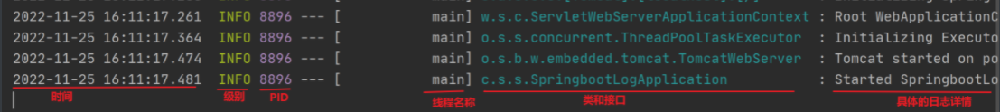

## 一、SpringBoot 概述

### 1、SpringBoot 介绍

> SpringBoot 开发团队认为 Spring 操作太繁琐，目的在于简化开发配置，能够快速搭建开发环境，集成 Tomcat ，对于开发者特别方便友好

### 2、特点

- 开箱即用
- 简化配置
- 集成很多组件

### 3、系统要求

| 名称     | 版本要求    |
| -------- | ----------- |
| Maven    | 3.5+        |
| Tomcat 9 | Servlet 4.0 |
| JDK      | 1.8+        |

## 二、SpringBoot 介绍

### 1、parent

- 前言：之前是使用 Spring/SpringMVC 开发，整合不同组件会有依赖，这些依赖会涉及待很多版本信息，可能会导致版本冲突问题
- 概述：把很多组件技术的搭配放到一起，就叫 parent

#### 1.1 引入 parent

自己项目的 pom.xml

```xml
<parent>
    <groupId>org.springframework.boot</groupId>
    <artifactId>spring-boot-starter-parent</artifactId>
    <version>2.7.18</version>
    <relativePath/>
</parent>
```

点击后发现又引入一个 parent

```xml
<parent>
    <groupId>org.springframework.boot</groupId>
    <artifactId>spring-boot-dependencies</artifactId>
    <version>2.7.18</version>
</parent>
```

通过该 parent 可以找到对应的依赖管理：通过 properties 管理版本信息，通过 dependencyManagement 管理依赖

#### 1.2 引入依赖

方式一：通过 dependencies 引入依赖

```xml
<dependencies>
    <dependency>
        <groupId>org.springframework.boot</groupId>
        <artifactId>spring-boot-starter-web</artifactId>
    </dependency>
    <dependency>
        <groupId>org.springframework.boot</groupId>
        <artifactId>spring-boot-starter-test</artifactId>
        <scope>test</scope>
    </dependency>
</dependencies>
```

方式二：通过导入的方式获取依赖

```xml
<dependencyManagement>
    <dependencies>
        <dependency>
            <groupId>org.springframework.boot</groupId>
            <artifactId>spring-boot-dependencies</artifactId>
            <version>${spring-boot.version}</version>
            <type>pom</type>
            <scope>import</scope>
        </dependency>
    </dependencies>
</dependencyManagement>
```

### 2、starter

#### 2.1 SpringMVC 存在的问题

> 导入依赖比较麻烦，比如使用 spring-webmvc，还需要导入 spring-web

#### 2.2 解决办法

starter：SpringBoot 团队直接把这些固定搭配技术做成一个成品

```xml
<dependency>
    <groupId>org.springframework.boot</groupId>
    <artifactId>spring-boot-starter-web</artifactId>
</dependency>
```

#### 2.3 starter 总结

- starter 其实就是很多个依赖坐标的组合

- parent 和 starter 总结：

  - parent：定义若干版本信息，交给 SpringBoot 统一管理，目的是减少依赖冲突

  - starter：在同一个坐标中关联很多个依赖，目的是简化依赖配置

- 使用步骤：

  - 先找有没有 starter，如果有直接引用

  - 没有直接提供版本信息

### 3、引导类

#### 3.1 传统 Spring 配置 

提供如下配置：

- SpringConfig
- SpringMvcConfig

#### 3.2 引导类作用

```java
@SpringBootApplication
public class SpringBootPractice {
    public static void main(String[] args) {
        SpringApplication.run(SpringBootPractice.class, args);
    }
}
```

- 用来启动程序
- SpringBoot 工程启动后创建并初始化 Spring 容器

> 注意：引导类必须有一个注解 `@SpringBootApplication`，否则启动不起来

### 4、内嵌 Tomcat 服务器

#### 4.1 定义依赖

pom.xml 中引入如下依赖

```xml
<dependency>
    <groupId>org.springframework.boot</groupId>
    <artifactId>spring-boot-starter-web</artifactId>
</dependency>
```

点开发现如下依赖：

```xml
<dependency>
    <groupId>org.springframework.boot</groupId>
    <artifactId>spring-boot-starter-tomcat</artifactId>
    <version>2.7.18</version>
    <scope>compile</scope>
</dependency>
```

#### 4.2 Tomcat 运行原理

- Tomcat：Java 语言开发的，就可以直接通过创建 Tomcat 对象的方式去运行 Tomcat
- 通过 starter 引入 Tomcat 服务器之后，就可以直接创建 Tomcat 对象了

#### 4.3 更换内置服务器

- Tomcat：Apache 公司，受众大，使用多，提供了较多组件
- jetty：轻量级服务器，负载比 Tomcat 弱
- undertow

更换操作：

```xml
<dependency>
    <groupId>org.springframework.boot</groupId>
    <artifactId>spring-boot-starter-web</artifactId>
    <exclusions>
        <exclusion>
            <groupId>org.springframework.boot</groupId>
            <artifactId>spring-boot-starter-tomcat</artifactId>
        </exclusion>
    </exclusions>
</dependency>
<dependency>
    <groupId>org.springframework.boot</groupId>
    <artifactId>spring-boot-starter-jetty</artifactId>
</dependency>
<dependency>
    <groupId>org.springframework.boot</groupId>
    <artifactId>spring-boot-starter-test</artifactId>
    <scope>test</scope>
</dependency>
```

## 三、配置文件

### 1、前言

- 曾经使用 SpringMVC 时是手动修改 Tomcat 配置的端口信息，现在 SpringBoot 该如何修改？
- SpringBoot 有一个默认的配置文件：application.properties

### 2、常用配置

- 官网文档：[Common Application Properties (spring.io)](./https://docs.spring.io/spring-boot/docs/current/reference/html/application-properties.html#appendix.application-properties)

### 3、propeties

- 默认 SpringBoot 通过 application.properties 可以修改配置信息

- 通过 properties 修改端口信息

  ```properties
  server.port=8081
  ```

- 修改 banner 信息：直接在 resource 文件夹下新建一个 banner.txt 。关闭 banner

  ```properties
  spring.main.banner-mode=off
  ```

- 指定日志级别：

  ```properties
  logging.level.root=debug
  ```

### 4、yaml

#### 4.1 语法要求

- `#` 号：表示注释
- 大小写敏感
- 属性层级关系使用多行描述，每行结尾使用 `:` 结束
- 使用缩进表示层级关系，同层级左侧对齐，只允许使用空格（不逊于使用 Tab 键）
- 属性值前面添加空格（是姓名与属性值时间使用 `冒号 + 空格` 作为分隔）

#### 4.2 分类

yaml 和 yml（主流格式）

#### 4.3 读取 yaml / yml 数据

- 读取单行数据

  ```java
  @Value("${taiyi.name}")
  private String name;
  ```

- 读取配置全部数据

  ```java
  @Autowired
  private Environment env;
  ```

- 读取对象数据

  ```java
  @Component
  @ConfigurationProperties(prefix = "taiyi")
  @Data
  public class User {
      private String name;
      private String password;
  }
  ```

### 5、配置文件优先级

properties > yml > yaml

### 6、抽取公共配置

```yml
basedir: /home/springboot

dir:
  logdir: ${basedir}/log
  picturedir: ${basedir}/picture
```

## 四、SSM 整合

### 1、MyBatis 整合

```xml
<dependency>
    <groupId>org.mybatis.spring.boot</groupId>
    <artifactId>mybatis-spring-boot-starter</artifactId>
    <version>2.2.2</version>
</dependency>

<dependency>
    <groupId>com.mysql</groupId>
    <artifactId>mysql-connector-j</artifactId>
    <scope>runtime</scope>
</dependency>
```

添加配置

```yml
spring:
  datasource:
    driver-class-name: com.mysql.cj.jdbc.Driver
    url: jdbc:mysql://localhost:3306/springboot_ssm
    username: root
    password: 123456
```


### 2、Druid 整合

SpringBoot 默认使用 Hikari 连接池

更换 Druid 连接池：

```xml
<dependency>
    <groupId>com.alibaba</groupId>
    <artifactId>druid-spring-boot-starter</artifactId>
    <version>1.2.15</version>
</dependency>
```

```yml
spring:
  datasource:
    druid:
      url: jdbc:mysql://localhost:3306/springboot_ssm
      username: root
      password: 123456
      driver-class-name: com.mysql.cj.jdbc.Driver
```

### 3、Junit 整合

```xml
<dependency>
    <groupId>org.springframework.boot</groupId>
    <artifactId>spring-boot-starter-test</artifactId>
    <scope>test</scope>
</dependency>
<!-- Junit5 需要额外引入如下依赖 -->
<dependency>
    <groupId>org.junit.platform</groupId>
    <artifactId>junit-platform-launcher</artifactId>
    <version>1.9.2</version>
    <scope>test</scope>
</dependency>
```

直接开始使用

```java
@SpringBootTest
class SpringbootSsmApplicationTests {
    @Autowired
    private ItemMapper mapper;

    @Test
    public void contextLoads() {
        User user = mapper.selectById(1L);
        System.out.println(user);
    }
}
```

### 4、其他依赖整合

1. 导入相关 starter 依赖
2. 添加相关配置（可选）

## 六、热部署

### 1、热部署概述

> 程序更改后，不需要重新启动服务器也能够实现动态更新

### 2、依赖导入

```xml
<dependency>
  <groupId>org.springframework.boot</groupId>
  <artifactId>spring-boot-devtools</artifactId>
  <optional>true</optional>
</dependency>
```

### 3、手动 Builder

快捷键：Ctrl + F9

### 4、自动热部署（不推荐）

Setting --> Compiler --> Build project automatically

ctrl + shfit + alt + / 打开一个维护面板：Registry --> compiler.automake.allow.when.app.running

### 5、修改热部署监控资源

通过配置文件指定热部署不参与文件

```yml
devtools:
  restart:
    exclude: application.yml,application.properties
```

## 七、SpringBoot 项目打包与运行

### 1、Maven 打包项目

```shell
mvn package
```

### 2、项目运行

```shell
java -jar 项目.jar
```

### 3、SpringBoot 打包需要对应的 Maven 插件

```xml
<plugin>
    <groupId>org.springframework.boot</groupId>
    <artifactId>spring-boot-maven-plugin</artifactId>
</plugin>
```

通过插件打包，能够把当前 Jar 打包成一个独立可运行 Jar：

- 包含原始工程依赖的 Jar
- 读取 MANIFEST.MF 中的 Main-Class，可以得到启动类
- 运行 JarLauncher 类执行

## 八、配置高级

### 1、临时属性设置

#### 1.1 现存的问题

如果目标电脑上 8080 端口已经被占用，运行 Jar 包会出现端口被占用的错误提示

解决方式：

- 修改配置文件，重新打包
- 通过临时属性配置端口
- 更换配置文件

#### 1.2 临时属性配置

```shell
java -jar 项目.jar --server.port=8081 --logging.level.org.springframe.web=debug
```

### 2、属性加载优先级

官网文档地址：[Core Features (spring.io)](./https://docs.spring.io/spring-boot/docs/current/reference/html/features.html#features.external-config)


注意：从上往下，优先级越来越高

- 开发中使用 3 ，刚刚的命令行使用 11

- 在开发中，会遇见自己定义属性名和系统变量名一致的情况，导致自己配置的数据被覆盖

  **以后开发中，自己定义变量但是发现取出来的不是想要的值时，优先考虑属性优先级问题**

### 3、开发环境使用临时属性

1. IDEA 中的设置步骤（主流）

   - Program arguments：

     ```shell
     --server.port=8081
     ```

2. 程序入口的启动类中设置参数（了解）

   ```java
   public static void main(String[] args) {
       args[0] = "--server.port=9999";
       SpringApplication.run(SpringbootSsmApplication.class, args);
   }
   ```

问题：如果需要修改的配置很多，手动输入可能会出错，怎么办？

> 配置文件修改解决

### 4、配置文件分类

#### 4.1 类路径下的配置文件

> 就是默认使用的配置文件，优先级最低

> 开发人员使用

#### 4.2 类路径 config 目录下的配置文件

> 项目经理、技术经理使用

#### 4.3 程序包所在目录中配置文件

> 与 Jar 统计目录下的配置文件，优先级比 config 高

> 运维人员、架构师使用

#### 4.4 程序包所在目录中 config 目录下的配置文件

> 一般开发人员接触不到目录

> 技术总监，优先级最高

#### 4.5 通过临时属性设置配置文件

Program arguments：

```shell
--spring.config.name=application
```

```shell
--spring.config.location=classpath:/application.yml
```

### 5、@ConfigurationProperties

#### 5.1 回顾基础使用

配置文件

```properties
dbconfig.url=123123
dbconfig.username=root
```

绑定类

```java
@Data
@Component
@ConfigurationProperties(prefix = "dbconfig")
public class DbConfig {
    private String url;
    private String username;
}
```

添加如下依赖解决提示问题：

```xml
<dependency>
    <groupId>org.springframework.boot</groupId>
    <artifactId>spring-boot-configuration-processor</artifactId>
</dependency>
```

#### 5.2 配置第三方类

配置 Druid 连接池

```xml
<dependency>
    <groupId>com.alibaba</groupId>
    <artifactId>druid</artifactId>
    <version>1.2.15</version>
</dependency>
```

```java
@Bean
@ConfigurationProperties(prefix = "druid")
public DruidDataSource dataSource(){
    DruidDataSource druidDataSource = new DruidDataSource();
    return druidDataSource;
}
```

#### 5.3、宽松绑定/松散绑定

> 注意：只有 @ConfigurationProperties 支持宽松绑定（好像 @Value 也支持）

- 驼峰命名会报错：

  ```java
  @Component
  @ConfigurationProperties(prefix = "dbConfig")
  public class DbConfig {
      private String url;
      private String username;
  }
  ```

- 宽松绑定:

  ```properties
  dbConfig.url=123123
  dbConfig.user_name=taiyi
  db-config.PASSWORD=12345223123
  db-config.home-address=bj
  ```

  ```java
  @Data
  @Component
  @ConfigurationProperties(prefix = "db-config")
  public class DbConfig {
      private String url;
      private String username;
      private String password;
      private String homeAddress;
  }
  ```

### 6、常用计量单位绑定

- 配置时间需求

  ```properties
  db-config.timeout=600
  ```

- 使用 Duration 表示时间

  ```java
  @DurationUnit(ChronoUnit.HOURS)
  private Duration timeout;
  ```

- 使用 DataSize 表示空间

  ```java
  @DataSizeUnit(DataUnit.MEGABYTES)
  private DataSize datasize;
  ```

### 7、检验

- 导入依赖

  ```xml
  <dependency>
      <groupId>javax.validation</groupId>
      <artifactId>validation-api</artifactId>
  </dependency>
  ```

- 检查配置如下

  ```java
  @Max(value = 9999,message = "无效的配置")
  @Min(value = 80,message = "无效的配置")
  private int port;
  ```

### 8、数据类型转换

- 配置文件中的字符串可以使用引号表示
- boolean 类型直接使用 true/false

## 九、多环境开发（重点）

### 1、概述

> 开发环境、测试环境、生产环境

### 2、单文件控制多环境开发

1. 使用 spring.profiles 区分是什么环境

2. 并使用 `---` 将多个环境区隔开

3. 在文件的最开始使用 `spring.profiles.active` 加载具体的环境

   ```yml
   spring:
     profiles:
       active: test
   ---
   #开发环境
   spring:
     profiles: dev
   server:
     port: 8082
   ---
   #测试环境
   spring:
     profiles: test
   server:
     port: 8888
   
   ---
   #生产环境
   spring:
     profiles: prod
   server:
     port: 9999
   ```

### 3、多文件控制多环境开发

#### 3.1 properties 文件

- 主配置文件：application.properties

  ```properties
  spring.profiles.active=dev
  ```

- 开发配置文件：application-dev.properties

  ```properties
  # 应用名称
  spring.application.name=springboot-dev
  # 应用服务 WEB 访问端口
  server.port=8082
  ```

- 测试配置文件：application-test.properties

  ```properties
  # 应用名称
  spring.application.name=springboot-test
  # 应用服务 WEB 访问端口
  server.port=8888
  ```

- 生产配置文件：application-prod.properties

  ```properties
  # 应用名称
  spring.application.name=springboot-prod
  # 应用服务 WEB 访问端口
  server.port=9999
  ```

#### 3.2 yml 文件

- 主配置文件：application.yml

  ```yml
  spring:
    profiles:
      active: test
  ```

- 开发配置文件：application-dev.yml

  ```yml
  server:
    port: 8082
  ```

- 测试配置文件：application-test.yml

  ```yml
  server:
    port: 8888
  ```

- 生产配置文件：application-prod.yml

  ```yml
  server:
    port: 9999
  ```

### 4、多环境开发抽取独立配置

#### 4.1 现存的问题

> 全部把配置配置到一个大文件里面，很多很乱，可以使用拆分配置的方式来解决独立的配置耦合太严重的问题

#### 4.2 include 解决

```yml
spring:
  profiles:
    active: dev
    include: devmysql,devredis
```

#### 4.3 新的问题

> 每次都需要修改 include 中的 value 值

#### 4.4 group 解决

注意：2.4 版本之后支持

```yml
spring:
  profiles:
    active: dev
    group:
      "dev": devmysql,devredis
      "test": testmysql,testredis
```

### 5、总结

实际开发中，多环境开发很常用：

- 开发环境：dev
- 测试环境：test
- 生产环境：prod

## 十、日志

### 1、日志使用

```java
@RestController
public class LogController {
    public static final Logger log = LoggerFactory.getLogger(LogController.class);

    @GetMapping("/index")
    public String index(){
        log.info("请求 info 信息");
        log.debug("请求 debug 信息");
        log.warn("请求 warn 信息");
        log.error("请求 error 信息");
        return "OK";
    }
}
```

注意：debug 需要在配置文件中打开：`debug=true`

- 日志级别：

  - FAFAL：灾难信息

  - ERROR：错误信息

  - WARN：警告信息

  - **INFO**：运维过程信息

  - **DEBUG**：调试信息

  - TRACE：堆栈信息

- 设置日志级别：

  ```yml
  logging:
    level:
      root: info
  ```

  注意：级别越低，打印的信息越多

- 设置组

  ```yml
  logging:
  #  设置组
    group:
      controller: cn.sycoder.springbootlog.controller
    level:
      root: info
      controller: warn
  ```

### 2、使用 lombok 简化操作

```java
@Slf4j
@RestController
public class LogController {
    @GetMapping("/index")
    public String index(){
        log.info("请求 info 信息");
        log.debug("请求 debug 信息");
        log.warn("请求 warn 信息");
        log.error("请求 error 信息");
        return "OK";
    }
}
```

底层反编译结果：

```java
@RestController
public class LogController {
    public static final Logger log = LoggerFactory.getLogger(LogController.class);
    
    public LogController(){
    }

    @GetMapping({"/index"})
    public String index(){
        log.info("请求 info 信息");
        log.debug("请求 debug 信息");
        log.warn("请求 warn 信息");
        log.error("请求 error 信息");
        return "OK";
    }
}
```

### 3、日志输出格式



- 自定义日志输出格式：

  ```yml
  logging:
    pattern:
      console: "%d %clr(%-5p){yellow} %clr(${pid}){magenta} ---[%20t] %-40.40c : %m %n"
  ```

### 4、输出日志到文件

#### 4.1 指定路径输出

```yml
logging:
  file:
    path: F:\03-Spring\SpringBoot\homework\springboot-log
```

输出到 spring.log 文件中

#### 4.2 指定名称输出

```yml
logging:
  file:
    name: F:\03-Spring\SpringBoot\homework\springboot-log\taiyi.log
```

> 注意：指定名称优先级更高

#### 4.3 拆分日志文件

按照日期格式拆分：`taiyi2024-01-03.log`、`taiyi2024-01-04.log` ……

```yml
logdir: F:\03-Spring\SpringBoot\homework\springboot-log\
logging:
  logback:
    rollingpolicy:
      max-file-size: 2KB
      file-name-pattern: ${logdir}taiyi-%d{yyyy-MM-dd}-%i.log
  file:
    name: ${logdir}sy.log  
```

## 十一、Web 环境模拟测试用例

### 1 现存的问题

- 实际测试没有走 Web MVC 环境，是直接调用接口的
- 数据是实际添加到数据库的，应该回滚
- 却反实际返回值的对比

### 2、模拟 Web 环境开发

- 添加如下属性

  ```java
  @SpringBootTest(webEnvironment = SpringBootTest.WebEnvironment.RANDOM_PORT)
  ```

- 开启虚拟 MVC 调用

  ```java
  @AutoConfigureMockMvc
  ```

- 测试虚拟请求方法

  ```java
  @Resource
  private MockMvc mvc
  
  @Test
  public void getById() throws Exception {
      //创建虚拟请求的
      MockHttpServletRequestBuilder builder = MockMvcRequestBuilders.get("/item/29");
      mvc.perform(builder);
  }
  ```

### 3、预期结果比较

- 比较请求状态码

  ```java
  @Test
  public void getById() throws Exception {
      //创建虚拟请求的
      MockHttpServletRequestBuilder builder =
          MockMvcRequestBuilders.get("/item/20");
  
      ResultActions actions = mvc.perform(builder);
      //定义请求结果的预期值
      ResultMatcher ok = MockMvcResultMatchers.status().isOk();
      actions.andExpect(ok);
  }
  ```

- 比较返回值

  ```java
  @Test
  public void getById() throws Exception {
      //创建虚拟请求的
      MockHttpServletRequestBuilder builder =
          MockMvcRequestBuilders.get("/item/20");
  
      ResultActions actions = mvc.perform(builder);
  
      //比较你实际结果值
      ResultMatcher json = MockMvcResultMatchers.content().json(
          "{\n" +
          "  \"id\": 20,\n" +
          "  \"name\": \"笔记本电脑\",\n" +
          "  \"remark\": \"1二手电脑只要一千块\"\n" +
          "}"
      );
      actions.andExpect(json);
  }
  ```

- 比较响应头

  ```java
  @Test
  public void getByIdHeader() throws Exception {
      //创建虚拟请求的
      MockHttpServletRequestBuilder builder =
          MockMvcRequestBuilders.get("/item/20");
  
      ResultActions actions = mvc.perform(builder);
      //比较响应头
      ResultMatcher header = MockMvcResultMatchers.header().string("Content-Type","application/json");
      actions.andExpect(header);
  }
  ```

- 发起 Post 请求直接在 content 中添加即可

  ```java
  @Autowired 
  private MockMvc mvc;
  @Autowired
  private ItemTest itemTest;
  
  @Test
  public void postItemBoolean() throws Exception {
      Item item = new Item();
      item.setName("键盘111");
      item.setRemark("1000元1111");
      System.out.println("==================");
      System.out.println(itemTest);
      //创建虚拟请求的
      MockHttpServletRequestBuilder builder = MockMvcRequestBuilders.post("/item");
      builder.contentType("application/json");
      builder.accept(MediaType.APPLICATION_JSON);
      ObjectMapper objectMapper = new ObjectMapper();
      String s = objectMapper.writeValueAsString(itemTest);
      builder.content(s);
      ResultActions actions = mvc.perform(builder);
      MvcResult mvcResult = actions.andReturn();
      System.out.println(mvcResult.getResponse().getStatus());
  
      ResultMatcher ret = MockMvcResultMatchers.content().string("true");
      actions.andExpect(ret);
  }
  ```

### 4、测试用例的数据设定

直接提供配置即可

```yml
testcase:
  item:
    name: ${random.int(5)}
    remark: ${random.int(5)}
```

domain

```java
@ConfigurationProperties(prefix = "testcase.item")
@Component
@Data
public class ItemTest {
    private String name;
    private String remark;
}
```

### 5、数据层测试回滚

```java
@SpringBootTest(webEnvironment = SpringBootTest.WebEnvironment.RANDOM_PORT)
@AutoConfigureMockMvc
@Rollback
@Transactional
class SpringbootTestApplicationTests {
}
```

> 开启事务和回滚之后，数据就不会写入数据库了

## 十二、项目实战

### 1、后端开发

#### 1.1 domain

```java
@Data
public class Item {
    private Long id;
    private String name;
    private String type;
    private String remark;
}
```

#### 1.2 mapper

```java
@Mapper
public interface ItemMapper {

    @Insert("insert into item(name, type, remark) values (#{name}, #{type}, #{remark})")
    int insert(Item item);

    @Delete("delete from item where id = #{id}")
    int deleteById(Long id);

    @Update("update item set name=#{name}, type=#{type}, remark=#{remark} where id=#{id}")
    int update(Item item);

    @Select("select * from item where id = #{id}")
    Item selectById(Long id);

    @Select("select * from item where name like concat('%', #{name}, '%')")
    List<Item> selectListByName(@Param("name") String name);

    @Select("select * from item")
    List<Item> selectList();
}
```


#### 1.3 service

```java
public interface IItemService {

    /**
     * 添加操作
     *
     * @param item 物品信息
     * @return 是否成功
     */
    boolean save(Item item);

    /**
     * 删除操作
     *
     * @param id 物品 ID
     * @return 是否成功
     */
    boolean remove(Long id);

    /**
     * 更新操作
     *
     * @param item 物品信息
     * @return 是否成功
     */
    boolean update(Item item);

    /**
     * 根据 ID 查询物品信息
     *
     * @param id 物品 ID
     * @return 物品信息
     */
    Item getById(Long id);

    /**
     * 查询所有物品信息
     *
     * @return 物品信息列表
     */
    List<Item> list(String name);

}
```

serviceImpl

```java
@Service
@Transactional
public class ItemServiceImpl implements IItemService {

    @Resource
    private ItemMapper itemMapper;

    @Override
    public boolean save(Item item) {
        return itemMapper.insert(item) > 0;
    }

    @Override
    public boolean remove(Long id) {
        return itemMapper.deleteById(id) > 0;
    }

    @Override
    public boolean update(Item item) {
        return itemMapper.update(item) > 0;
    }

    @Override
    public Item getById(Long id) {
        return itemMapper.selectById(id);
    }

    @Override
    public List<Item> list(String name) {
        if (name == null || name.trim().length() == 0) {
            return itemMapper.selectList();
        }
        return itemMapper.selectListByName(name);
    }
}
```

#### 1.4 controller

- 统一结果集处理

  ```java
  @Data
  @Builder
  public class Resp {
      private Integer code;
      private Object data;
      private String msg;
  }
  ```

  ```java
  public class RespCode {
      public static final Integer SAVE_SUCCESS_CODE = 20000;
      public static final Integer SAVE_FAIL_CODE = 20001;
      public static final Integer REMOVE_SUCCESS_CODE = 20020;
      public static final Integer REMOVE_FAIL_CODE = 20021;
      public static final Integer UPDATE_SUCCESS_CODE = 20010;
      public static final Integer UPDATE_FAIL_CODE = 20011;
      public static final Integer GET_SUCCESS_CODE = 20040;
      public static final Integer GET_FAIL_CODE = 20041;
  
  }
  ```

- 控制器层开发

  ```java
  @Slf4j
  @RestController
  @RequestMapping("/item")
  public class ItemController {
  
      @Resource
      private IItemService itemService;
  
      @PostMapping
      public Resp postItem(@RequestBody Item item) {
          boolean save = itemService.save(item);
          return Resp.builder().code(save ? RespCode.SAVE_SUCCESS_CODE : RespCode.SAVE_FAIL_CODE)
                  .data(save).build();
      }
  
      @DeleteMapping("/{id}")
      public Resp deleteItem(@PathVariable Long id) {
          boolean remove = itemService.remove(id);
          return Resp.builder().code(remove ? RespCode.REMOVE_SUCCESS_CODE : RespCode.REMOVE_FAIL_CODE)
                  .data(remove).build();
      }
  
      @PutMapping
      public Resp updateItem(@RequestBody Item item) {
          boolean update = itemService.update(item);
          return Resp.builder().code(update ? RespCode.UPDATE_SUCCESS_CODE : RespCode.UPDATE_FAIL_CODE)
                  .data(update).build();
      }
  
      @GetMapping
      public Resp getItem(@RequestParam(required = false) String name) {
          List<Item> itemList = itemService.list(name);
          return Resp.builder().code(RespCode.GET_SUCCESS_CODE).data(itemList).build();
      }
  }
  ```

  ```java
  @Controller
  public class IndexController {
      @GetMapping("/index")
      public String index() {
          return "/pages/items.html";
      }
  }
  ```

### 2、项目部署

#### 2.1 提供数据库的建表语句

```sql
CREATE DATABASE springmvc;
USE springmvc;
CREATE TABLE `item`
(
    `id`     bigint NOT NULL AUTO_INCREMENT,
    `name`   varchar(64) DEFAULT NULL,
    `type`   varchar(64) DEFAULT NULL,
    `remark` text,
    PRIMARY KEY (`id`)
) ENGINE = InnoDB
  AUTO_INCREMENT = 20
  DEFAULT CHARSET = utf8mb4
  COLLATE = utf8mb4_0900_ai_ci
```

#### 2.2 提供 Jar 包

```shell
mvn package
```

#### 2.3 启动服务

```shell
./mysqld
```

```shell
java -jar SpringBootTask-1.0-SNAPSHOT.jar
```

#### 2.4 注意

- 打开 8080 端口：本机可以访问网页
- 打开 3306 端口：本机可以连接虚拟机中的 MySQL 服务，进行数据准备

#### 2.5 Linux 后台启动

```shell
nohup java -jar SpringBootTask-1.0-SNAPSHOT.jar >taiyi.log 2>&1 &
```

- nohup：表示终端关闭时，程序不关闭，和 `&` 搭配使用
- `2>&1`：
  - 0：表示 stdin 标准输入
  - 1：表示 stdout 标准输出
  - 2：表示 stderr 标准错误
- `>filename` 等价于 `1>filename`：标准输出到文件
- `2>&1>filename`：错误也输出到文件中
- `>taiyi.log 2>&1` 等价于 `2>&1>taiyi.log`
- `&` 放到命令行结尾，表示后台运行
