## 一、了解微服务

### 1、单体架构

将所有业务功能集中到一个项目中开发

**优点：**

- 架构简单
- 部署成本低

**缺点：**

- 耦合度高

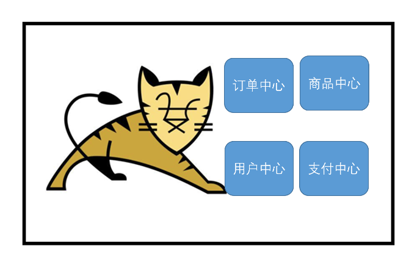

### 2、分布式架构

根据业务功能对系统进行拆分，每个业务模块作为独立项目开发，成为一个服务

**优点：**

- 降低服务耦合度
- 有利于服务升级拓展

**缺点：**

- 运维复杂

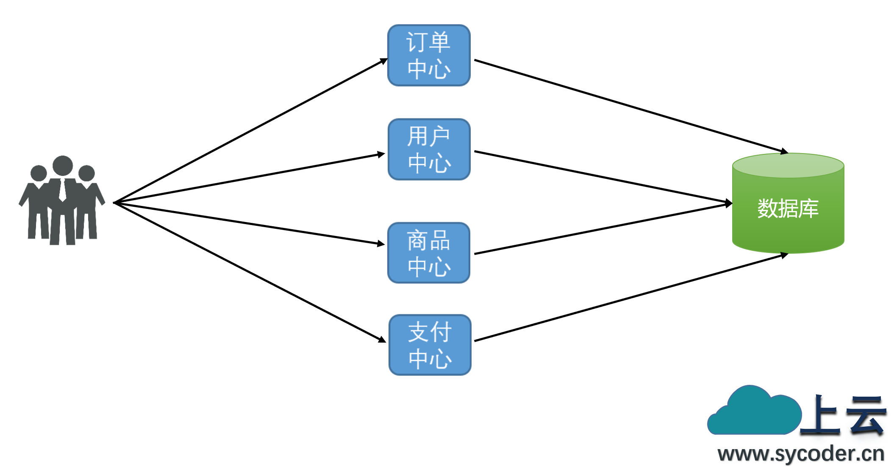

### 3、微服务

微服务是一种经过良好架构设计的**分布式**架构方案，微服务架构特征：

- 单一职责：微服务拆分粒度更小，每一个服务都对应唯一的业务能力，做到单一职责，避免重复业务开发
- 面向服务：微服务对外暴露业务接口
- 服务自治：团队独立、技术独立、数据独立、部署独立
- 隔离性强：服务调用做好隔离、容错、降级，避免出现级联问题

## 二、微服务

### 1、概述

微服务这种方案需要技术框架来落地，全球的互联网公司都在积极尝试自己的微服务落地技术。在国内最知名的就是SpringCloud和阿里巴巴的Dubbo。

SpringCloud 是目前国内使用最广泛的微服务框架。官网地址：https://spring.io/projects/spring-cloud。

SpringCloud 集成了各种微服务功能组件，并基于 SpringBoot 实现了这些组件的自动装配，从而提供了良好的开箱即用体验。

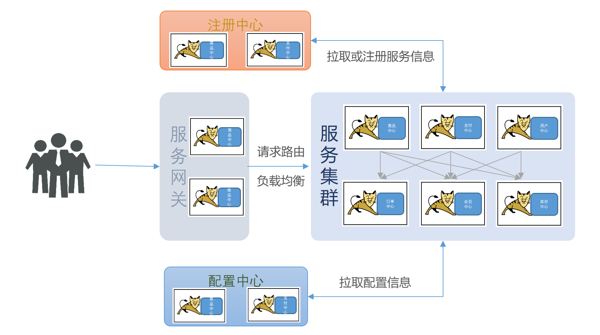

### 2、微服务常用技术对比

目前最常用的分布式技术解决方案：

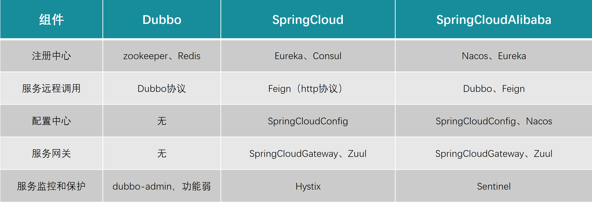

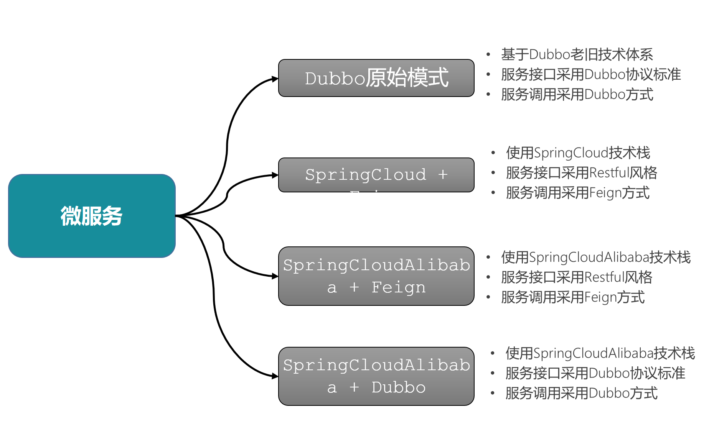

### 3、微服务常用组件

其中常见的组件包括：

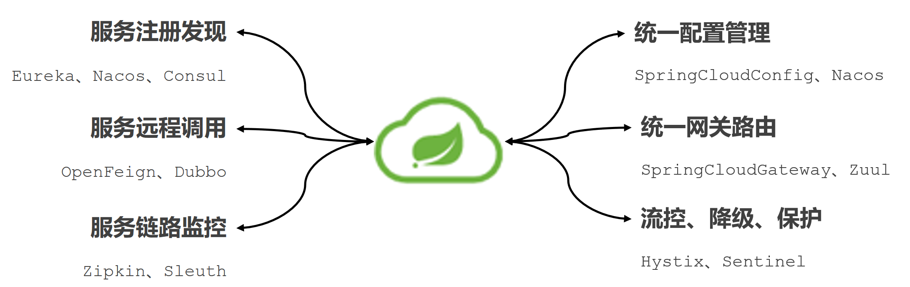

## 三、微服务拆分与调用

### 1、拆分原则

- 单一职责：不同的业务拆分到不同的服务

- 数据独立：不同的业务间不能相互访问数据库

- 面向服务：不同业务需要提供接口，供其它服务调用

### 2、拆分实战

1. 项目结构图

   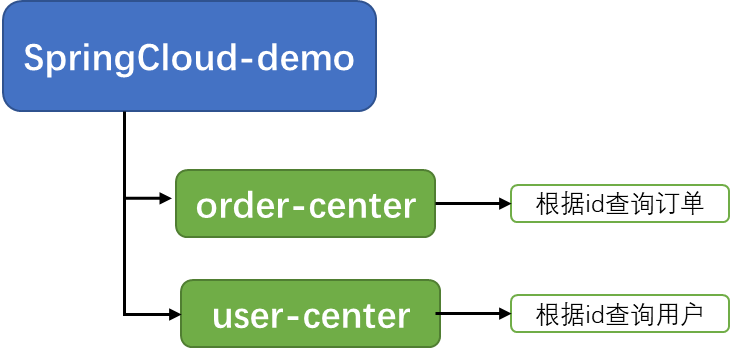

   - springcloud-demo：父工程，管理依赖

     - order-center：订单中心微服务，负责订单相关业务
     - user-center：用户微服务，负责用户相关业务
   - 要求
     - 订单微服务和用户微服务都必须有各自的数据库，相互独立
     - 订单服务和用户服务都对外暴露Restful的接口
     - 订单服务如果需要查询用户信息，只能调用用户服务的Restful接口，不能直接查询用户数据库

2. 导入 SQL 文件：user 表和 order 表

### 3、微服务调用

- 需求分析：根据订单id查询订单的同时，把订单所属的用户信息一起返回

- 代码实现：

  - user-ceter 配置文件：

    ```yaml
    server:
      port: 8082
    spring:
      datasource:
        driver-class-name: com.mysql.cj.jdbc.Driver
        url: jdbc:mysql://localhost:3306/spring-cloud
        username: root
        password: 123456
    # 开启经典命名与驼峰命名转化
    mybatis:
      configuration:
        map-underscore-to-camel-case: true

  - order-center 配置文件：

    ```yaml
    server:
      port: 8081
    spring:
      datasource:
        driver-class-name: com.mysql.cj.jdbc.Driver
        url: jdbc:mysql://localhost:3306/spring-cloud
        username: root
        password: 123456
    #开启经典命名与驼峰命名转化
    mybatis:
      configuration:
        map-underscore-to-camel-case: true
    ```

  - order-center 微服务中注册 RestTeamplate

    ```java
    @MapperScan("cn.sycoder.ordercenter.mapper")
    @SpringBootApplication
    public class OrderApplication {
        public static void main(String[] args) {
            SpringApplication.run(OrderApplication.class, args);
        }
        @Bean
        public RestTemplate restTemplate() {
            return new RestTemplate();
        }
    }
    ```

  - order-center 微服务中通过 restTemplate 远程调用 user-center 服务

    ```java
    @Service
    public class OrderService {
    
        @Autowired
        private OrderMapper orderMapper;
    
        @Resource
        private RestTemplate restTemplate;
    
        public Order queryOrderById(Long orderId) {
            // 1.查询订单
            Order order = orderMapper.findById(orderId);
            // 2 查询用户信息
            String url = "http://localhost:8082/user/" + order.getUserId();
            User user = restTemplate.getForObject(url, User.class);
            // 3 拼接信息
            order.setUser(user);
            // 4.返回
            return order;
        }
    }
    ```

### 4、服务提供者与调用者

- 服务提供者：一次业务中，提供接口给其它服务调用的服务

- 服务消费者：一次业务中，调用其它微服务提供的接口的服务

- 注意：服务提供者与消费者是相对的，服务可以相互调用，谁调用谁谁就是消费者，被调用者就是提供者


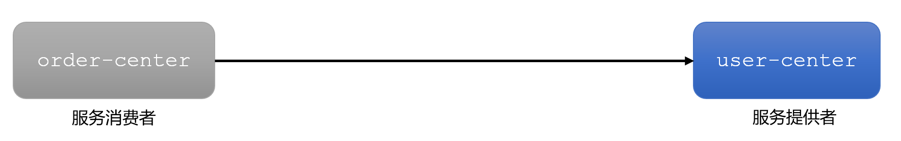

## 四、Eureka 注册中心

> Eureka是[Netflix](./https://baike.baidu.com/item/Netflix/662557?fromModule=lemma_inlink)开发的[服务发现](./https://baike.baidu.com/item/服务发现/23734240?fromModule=lemma_inlink)框架，本身是一个基于[REST](./https://baike.baidu.com/item/REST/6330506?fromModule=lemma_inlink)的服务，主要用于定位运行在 AWS 域中的中间层服务，以达到[负载均衡](./https://baike.baidu.com/item/负载均衡/932451?fromModule=lemma_inlink)和中间层服务[故障转移](./https://baike.baidu.com/item/故障转移/14768924?fromModule=lemma_inlink)的目的。
>
> SpringCloud 将它集成在其[子项目](./https://baike.baidu.com/item/子项目/6866890?fromModule=lemma_inlink) spring-cloud-netflix 中，以实现 SpringCloud 的服务发现功能。

### 1、RestTeamplate 缺陷

- 服务消费者该如何获取服务提供者的地址信息？

- 如果有多个服务提供者，消费者该如何选择？

- 消费者如何得知服务提供者的健康状态？

### 2、Eureka 注册中心

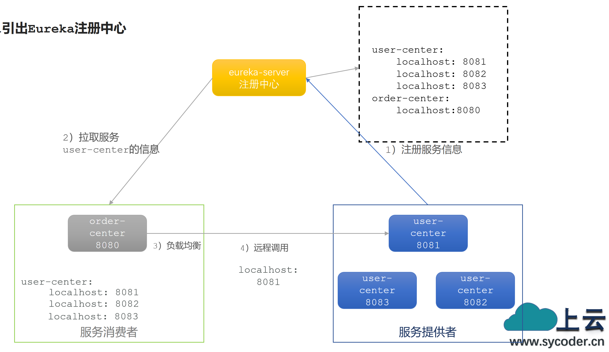

> 注意：
>
> 一个微服务，既可以是服务提供者，又可以是服务消费者，因此 eureka 将服务注册、服务发现等功能统一封装到了 eureka-client 端

注册中心如何解决 RestTemplate 远程调用的问题？

- order-center 如何得知 user-center 实例地址？获取地址信息的流程如下：
  - 服务注册：user-center 服务实例启动后，将自己的信息注册到 eureka-server（Eureka服务端）。
  - eureka-server 保存服务名称到服务实例地址列表的映射关系。
  - 服务发现：order-center 根据服务名称，拉取实例地址列表。

- order-center 如何从多个 user-center 实例中选择具体的实例？
  - order-center 从实例列表中利用负载均衡算法（Loadbalancer）选中一个实例地址。
  - 向该实例地址发起远程调用。

- order-center 如何得知某个 user-center 实例是否依然健康，是不是已经宕机？

  - 心跳机制：user-center 会每隔一段时间（默认30秒）向 eureka-server 发起请求，报告自己状态。

  - 当超过一定时间没有发送心跳时，eureka-server 会认为微服务实例故障，将该实例从服务列表中剔除。

  - order-center 做服务发现时，就能将故障实例排除。

### 3、Eureka 服务发现与注册

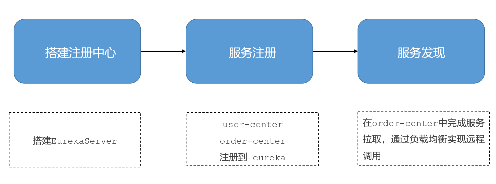

#### 3.1 搭建 eureka-server 服务

总项目下创建子模块 eureka

- 引入 eureka-server 依赖

  ```xml
  <dependency>
      <groupId>org.springframework.cloud</groupId>
      <artifactId>spring-cloud-starter-netflix-eureka-server</artifactId>
  </dependency>
  ```

- 编写启动类：使用 @EnableEurekaServer 注解

  ```java
  @SpringBootApplication
  @EnableEurekaServer
  public class EurekaApplication {
      public static void main(String[] args) {
          SpringApplication.run(EurekaApplication.class, args);
      }
  }
  ```

- 编写配置文件

  ```yaml
  server:
    port: 8888
  spring:
    application:
      name: eurekaserver
  eureka:
    client:
      service-url:
        defaultZone: http://localhost:8888/eureka
  ```

- 启动 eureka-server 服务，然后在浏览器访问：http://localhost:8888

#### 3.2 服务注册

- 注册 usercenter

  - 引入 eureka-client 依赖

    ```xml
    <dependency>
        <groupId>org.springframework.cloud</groupId>
        <artifactId>spring-cloud-starter-netflix-eureka-client</artifactId>
    </dependency>
    ```

  - 配置文件中添加配置

    ```yaml
    spring:
      application:
        name: usercenter
    
    eureka:
      client:
        service-url:
          defaultZone: http://localhost:8888/eureka
    ```

  > VM options 添加启动时参数：`-Dserver.port=8083`

- 注册 ordercenter

  - 引入 eureka-client 依赖

    ```xml
    <dependency>
        <groupId>org.springframework.cloud</groupId>
        <artifactId>spring-cloud-starter-netflix-eureka-client</artifactId>
    </dependency>
    ```

  - 配置文件中添加配置

    ```yaml
    spring:
      application:
        name: ordercenter
    
    eureka:
      client:
        service-url:
          defaultZone: http://localhost:8888/eureka
    ```

  - 给 RestTeamplate 添加 负载均衡

    ```java
    @Bean
    @LoadBalanced
    public RestTemplate restTemplate() {
        return new RestTemplate();
    }
    ```

  - 修改远程调用服务

    ```java
    public Order queryOrderById(Long orderId) {
        // 1.查询订单
        Order order = orderMapper.findById(orderId);
        // 2 查询用户信息
        String url = "http://usercenter/user/" + order.getUserId();
        User user = restTemplate.getForObject(url, User.class);
        // 3 拼接信息
        order.setUser(user);
        // 4.返回
        return order;
    }
    ```

### 4、负载均衡

#### 4.1、LoadBalance 负载均衡流程

- order-center 发起请求到 LoadBalancer 处理
- 获取到服务列表
- 通过负载均衡处理

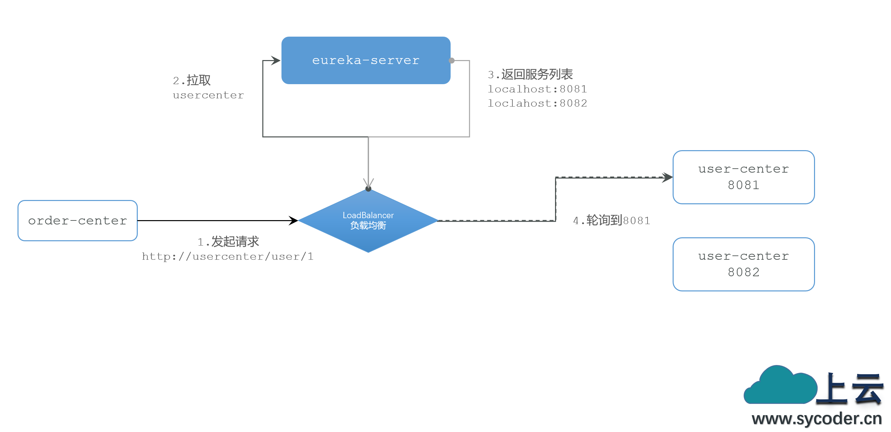

#### 4.2、LoadBalance 负载均衡底层原理

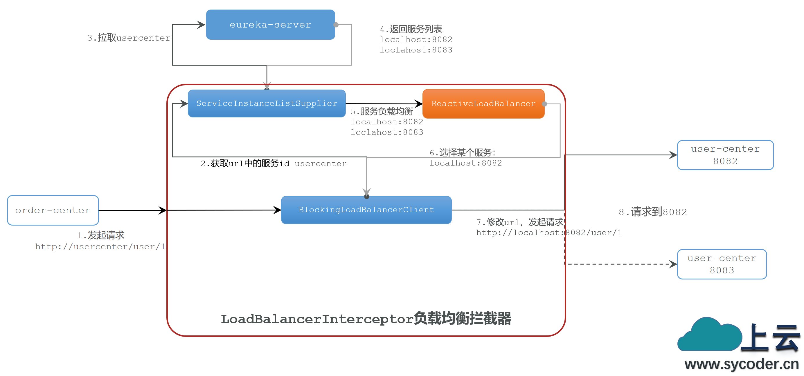

**为什么我们只输入了服务名称就可以访问了呢？之前还要获取ip和端口。**

就是通过`LoadBalancerInterceptor`，这个类会在对 RestTemplate 的请求进行拦截，然后从Eureka根据服务id获取服务列表，随后利用负载均衡算法得到真实的服务地址信息，替换服务id。

```java
public class LoadBalancerInterceptor implements ClientHttpRequestInterceptor {
 	//...省略非必须代码
    public ClientHttpResponse intercept(final HttpRequest request, final byte[] body, final ClientHttpRequestExecution execution) {
        URI originalUri = request.getURI();
        String serviceName = originalUri.getHost();
        Assert.state(serviceName != null, "Request URI does not contain a valid hostname: " + originalUri);
        return (ClientHttpResponse)this.loadBalancer.execute(serviceName, this.requestFactory.createRequest(request, body, execution));
    }
}
```

从 intercept 方法，可以得到如下信息：

- `request.getURI()`：获取请求uri，本例中就是 http://usercenter/user/1
- `originalUri.getHost()`：获取uri路径的主机名，其实就是服务id，user-center
- `this.loadBalancer.execute()`：处理服务id，和用户请求

继续查看execute 方法：

```java
public <T> T execute(String serviceId, LoadBalancerRequest<T> request) throws IOException {
       //...
        ServiceInstance serviceInstance = this.choose(serviceId, lbRequest);//选择服务
       //...
    }
```

继续查看 choose 方法：

```java
public <T> ServiceInstance choose(String serviceId, Request<T> request) {
        ReactiveLoadBalancer<ServiceInstance> loadBalancer = this.loadBalancerClientFactory.getInstance(serviceId);//通过负载均衡客户端工厂获取ReactiveLoadBalancer实例
        if (loadBalancer == null) {
            return null;
        } else {
            Response<ServiceInstance> loadBalancerResponse = (Response)Mono.from(loadBalancer.choose(request)).block();//挑选服务实例
            return loadBalancerResponse == null ? null : (ServiceInstance)loadBalancerResponse.getServer();
        }
    }
```

ReactiveLoadBalancer 接口实现类有两个：一个是随机均衡策略，一个是轮询策略，默认就是轮询策略。

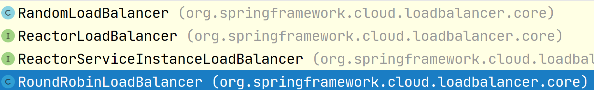

RoundRobinLoadBalancer 底层原理：

```java
 private Response<ServiceInstance> getInstanceResponse(List<ServiceInstance> instances) {
        //...
        } else if (instances.size() == 1) { //实例数量如果为1，直接返回
            return new DefaultResponse((ServiceInstance)instances.get(0));
        } else {
            int pos = this.position.incrementAndGet() & 2147483647;//计数器每次请求自增1
            ServiceInstance instance = (ServiceInstance)instances.get(pos % instances.size());//通过取模轮询，是不是和我教大家的 HashMap 底层一模一样
            return new DefaultResponse(instance);
        }
    }
```

服务列表代码：

```java
private Response<ServiceInstance> processInstanceResponse(ServiceInstanceListSupplier supplier, List<ServiceInstance> serviceInstances) {
    //List<ServiceInstance> serviceInstances 这个就是服务实例列表
        Response<ServiceInstance> serviceInstanceResponse = this.getInstanceResponse(serviceInstances);
        if (supplier instanceof SelectedInstanceCallback && serviceInstanceResponse.hasServer()) {
            ((SelectedInstanceCallback)supplier).selectedServiceInstance((ServiceInstance)serviceInstanceResponse.getServer());
        }

        return serviceInstanceResponse;
    }
```

除了这些代码，还会用到 `EurekaDiscoverClient` 客户端

```java
public List<ServiceInstance> getInstances(String serviceId) {
    List<InstanceInfo> infos = this.eurekaClient.getInstancesByVipAddress(serviceId, false);
    List<ServiceInstance> instances = new ArrayList();
    Iterator var4 = infos.iterator();

    while(var4.hasNext()) {
        InstanceInfo info = (InstanceInfo)var4.next();
        instances.add(new EurekaServiceInstance(info));
    }

    return instances;
}
```

> 注意：底层原理这里，一开始上手大家是看不懂的，可以先从简单的版本看起，比如 Ribbon 这个源码会简单很多，不过我们现在学习的版本已经把它废除了。

## 五、Nacos

### 1、概述与安装

[Nacos](./https://nacos.io/)是阿里巴巴的产品，现在是[SpringCloud](./https://spring.io/projects/spring-cloud)中的一个组件。相比[Eureka](./https://github.com/Netflix/eureka)功能更加丰富，在国内受欢迎程度较高。

Docker 安装

- 拉取镜像

  ```shell
  docker pull nacos/nacos-server:v2.2.2
  ```

- 创建容器

  ```shell
  docker run --name myNacos -d -p 8848:8848 -p 9848:9848 -e MODE=standalone  nacos/nacos-server:v2.2.2
  ```

- 登录网址验证：`localhost:8848/nacos` ，用户名：`nacos`，密码：`nacos`

### 2、Nacos 服务注册

Nacos 是 SpringCloudAlibaba 的组件，而 SpringCloudAlibaba 也遵循 SpringCloud 中定义的服务注册、服务发现规范。因此使用 Nacos 和使用 Eureka 对于微服务来说，并没有太大区别。

主要差异在于：

- 依赖不同
- 服务地址不同

#### 2.1 配置使用

**引入依赖**

- 在 SpringCloud-demo 父工程的 pom 文件中的`<dependencyManagement>`中引入 SpringCloudAlibaba 的依赖：

  ```xml
  <dependency>
      <groupId>com.alibaba.cloud</groupId>
      <artifactId>spring-cloud-alibaba-dependencies</artifactId>
      <version>2.2.5.RELEASE</version>
      <type>pom</type>
      <scope>import</scope>
  </dependency>
  ```

- 在 user-center 和 order-center 中的 pom 文件中引入 nacos-discovery 依赖：

  ```xml
  <dependency>
      <groupId>com.alibaba.cloud</groupId>
      <artifactId>spring-cloud-starter-alibaba-nacos-discovery</artifactId>
  </dependency>
  <dependency>
      <groupId>org.springframework.cloud</groupId>
      <artifactId>spring-cloud-starter-loadbalancer</artifactId>
  </dependency>
  ```

**配置 Nacos 地址**

在 user-center 和 order-center 的 application.yml 中添加 nacos 地址：

```yaml
spring:
  cloud:
    nacos:
      server-addr: localhost:8848
```

**重启服务**

重启微服务后，登录nacos管理页面http://localhost:8848/nacos，可以看到微服务信息。

#### 2.2 临时实例和非临时实例（面试）

服务注册到Nacos时，可以选择注册为临时或非临时实例，通过下面的配置来设置：

```yaml
spring:
    cloud:
      nacos:
        discovery:
          ephemeral: false
```

> 临时实例宕机时，会从 nacos 的服务列表中剔除，而非临时实例则不会

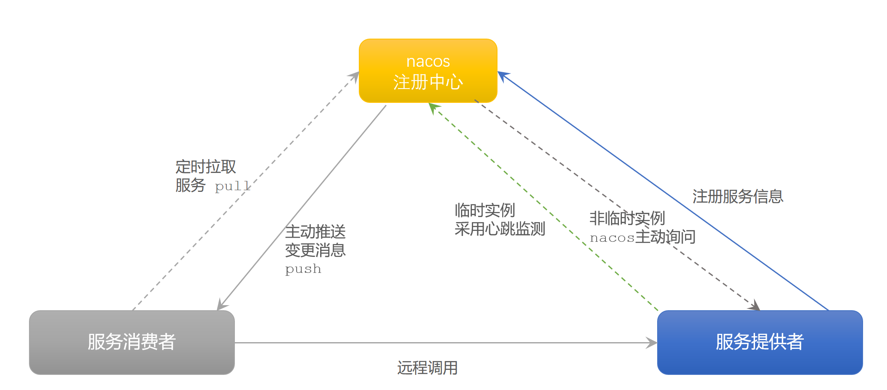

#### 2.3 命名空间

Nacos中服务存储和数据存储的最外层都是一个名为 namespace 的东西，用来做最外层隔离。

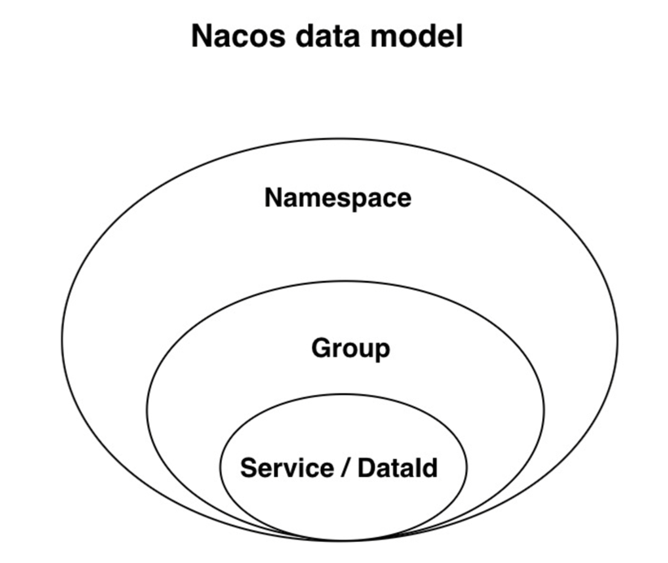

实现环境隔离：

- 在 localhost:8848/nacos 中创建命名空间

- 拷贝命名空间生成的id配置进配置文件中

  ```yaml
  spring:
      cloud:
        nacos:
          discovery:
            namespace: 8dd850f3-172c-4a45-b6e5-9372783bc87a
  ```

#### 2.4 小结（面试）

- Nacos 与 Eureka 的相同点：

  - 都支持服务注册与发现
  - 都支持服务提供者通过心跳方式做健康监测

- Nacos 与 Eureka 的区别：

  - Nacos 支持服务端主动检测提供者状态：临时实例-心跳检测；非临时实例-主动监测

  - 临时实例不正常-被剔除；非临时实例不正常-不会被剔除

  - Nacos 支持服务列表变更的消息推送模式，服务列表更新更及时

  - Nacos 集群默认采用 AP（可用性强，一致性弱）方式，当集群中存在非临时实例时，采用 CP（一致性强，可用性弱）模式；

    Eureka 采用 AP 方式

### 3、Nacos 配置管理

#### 3.1 配置更改热更新

Nacos 不单单可以做注册中心，还可以做配置管理。

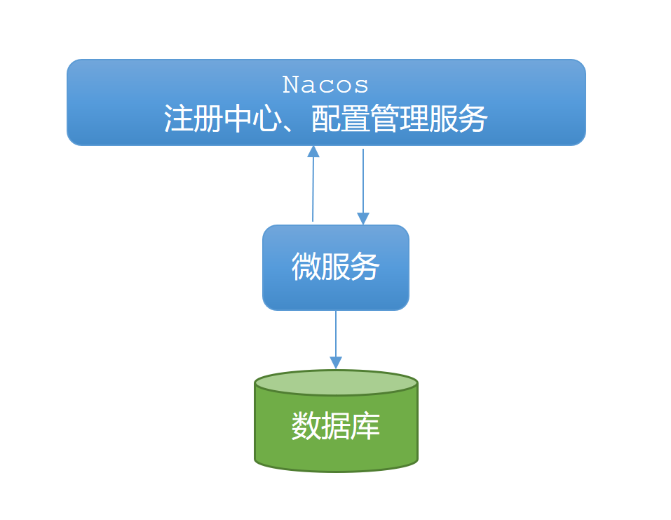

在 Nacos 中添加配置信息：

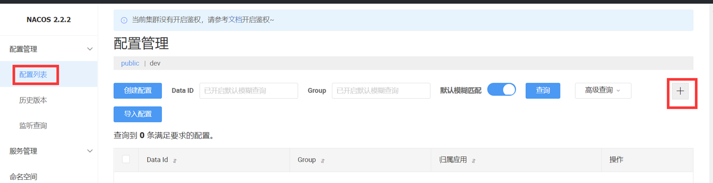

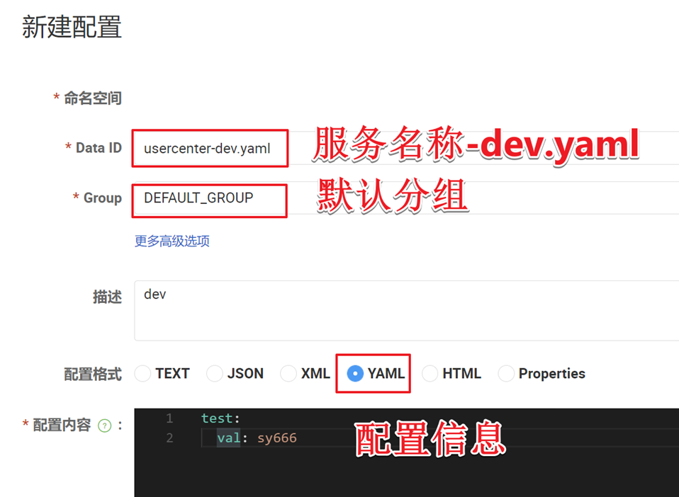

#### 3.2 配置获取的步骤

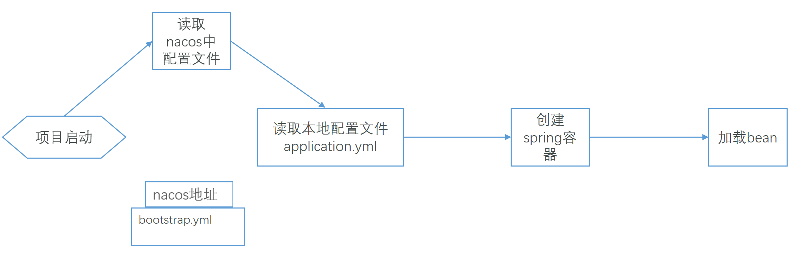

一定要记得新建 bootstrap.yml 配置文件，将 nacos 配置信息添加到 bootstrap.yml 文件中。

在 user-center 中添加 bootstrap.yaml ：

```yaml
spring:
  application:
    name: usercenter # 服务名称
  profiles:
    active: dev #开发环境，这里是dev
  cloud:
    nacos:
      server-addr: localhost:8848 # Nacos地址
      config:
        file-extension: yaml # 文件后缀名
```

这里会根据spring.cloud.nacos.server-addr获取nacos地址，再根据

`${spring.application.name}-${spring.profiles.active}.${spring.cloud.nacos.config.file-extension}`作为文件id，来读取配置。

本例中，就是去读取`usercenter-dev.yaml`

#### 3.3 添加依赖

在 user-center 服务中，引入 nacos-config 的客户端依赖：

```xml
<!--nacos配置管理依赖-->
<dependency>
    <groupId>com.alibaba.cloud</groupId>
    <artifactId>spring-cloud-starter-alibaba-nacos-config</artifactId>
</dependency>
```

> Nacos 中的配置文件变更后，微服务无需重启就可以感知，可以使用 @RefreshScope 注解实现

#### 3.4 配置热更新

最终的目的，是修改nacos中的配置后，微服务中无需重启即可让配置生效，也就是**配置热更新**。

在 @Value 注入的变量所在类上添加注解 @RefreshScope：

```java
@Slf4j
@RestController
@RequestMapping("/user")
@RefreshScope
public class UserController {

    @Autowired
    private UserService userService;

    @Value("${test.val}")
    private String val;

    @GetMapping("/{id}")
    public User queryById(@PathVariable("id") Long id) {
        System.out.println("test.val: " + val);
        return userService.queryById(id);
    }
}
```

## 七、Feign 远程调用

### 1、Feign 简介

使用 RestTeamplate 发起远程调用存在的问题：

- 硬编码
- 代码可读性差
- 参数复杂时，URL 很难拼接

Feign 是一个声明式的 HTTP 客户端：

- SpringCloud地址：[https://cloud.spring.io/spring-cloud-openfeign/reference/html](./https://cloud.spring.io/spring-cloud-openfeign/reference/html/)[/](./https://cloud.spring.io/spring-cloud-openfeign/reference/html/)
- GitHub地址：https://github.com/OpenFeign/feign

### 2、Feign 快速入门

- 新建 feign-api 模块导入 Feign 客户端：

  ```xml
  <dependency>
      <groupId>org.springframework.cloud</groupId>
      <artifactId>spring-cloud-starter-openfeign</artifactId>
  </dependency>
  ```

- 编写接口客户端：

  ```java
  @FeignClient("usercenter")
  public interface UserApi {
      @GetMapping("/user/{id}")
      User findById(@PathVariable Long id);
  }
  ```

### 3、order-center 中使用 Feign

- 引入依赖

  ```xml
  <dependency>
      <groupId>cn.sycoder</groupId>
      <artifactId>feign-api</artifactId>
      <version>0.0.1-SNAPSHOT</version>
  </dependency>
  ```

- 开启 Feign 支持

  ```java
  @MapperScan("cn.sycoder.ordercenter.mapper")
  @SpringBootApplication
  @EnableFeignClients(clients = UserApi.class)
  public class OrderApplication {
  
      public static void main(String[] args) {
          SpringApplication.run(OrderApplication.class, args);
      }
  
      @Bean
      @LoadBalanced
      public RestTemplate restTemplate() {
          return new RestTemplate();
      }
  }
  ```

- service 中直接调用

  ```java
  @Resource
  private UserApi userApi;
  public Order queryOrderById(Long orderId) {
      // 1.查询订单
      Order order = orderMapper.findById(orderId);
      // 2 查询用户信息
      User user = userApi.findById(order.getUserId());
      // 3 拼接信息
      order.setUser(user);
      // 4.返回
      return order;
  }
  ```

### 4、Feign 性能优化

#### 4.1 底层实现

Feign 底层客户端实现：

- URLConnection：默认实现，不支持连接池
- Apache HttpClient：支持连接池
- OKHttp：支持连接池

#### 4.2 优化配置

- 引入依赖

  ```xml
  <dependency>
      <groupId>io.github.openfeign</groupId>
      <artifactId>feign-httpclient</artifactId>
  </dependency>
  ```

- 配置连接池

  ```yaml
  feign:
    client:
      config:
        default:
          loggerLevel: BASIC
    httpclient:
      enabled: true
      max-connections: 200
      max-connections-per-route: 50
  logging:
    level:
      cn.sycoder: debug
  ```

## 八、Gateway 网关服务

Spring Cloud Gateway 是 Spring Cloud 的一个全新项目，该项目是基于 Spring 5.0，Spring Boot 2.0 和 Project Reactor 等响应式编程和事件流技术开发的网关，它旨在为微服务架构提供一种简单有效的统一的 API 路由管理方式。

### 1、Gateway 作用

网关的核心功能特性：

- **权限控制**：网关作为微服务入口，需要校验用户是是否有请求资格，如果没有则进行拦截。
- **路由和负载均衡**：一切请求都必须先经过gateway，但网关不处理业务，而是根据某种规则，把请求转发到某个微服务，这个过程叫做路由。当然路由的目标服务有多个时，还需要做负载均衡。

- **限流**：当请求流量过高时，在网关中按照下游的微服务能够接受的速度来放行请求，避免服务压力过大。

### 2、搭建 Gateway 服务网关

- 创建新 module，引入 SpringCloudGateway 和 Nacos 服务发现依赖：

  ```xml
  <dependency>
      <groupId>com.alibaba.cloud</groupId>
      <artifactId>spring-cloud-starter-alibaba-nacos-discovery</artifactId>
  </dependency>
  <dependency>
      <groupId>org.springframework.cloud</groupId>
      <artifactId>spring-cloud-starter-gateway</artifactId>
  </dependency>
  <!-- 使用 loadbalancer 做负载均衡器 -->
  <dependency>
      <groupId>org.springframework.cloud</groupId>
      <artifactId>spring-cloud-starter-loadbalancer</artifactId>
  </dependency>
  ```

- 编写路由配置：

  ```yaml
  server:
    port: 9999
  spring:
    application:
      name: gatway
    cloud:
      nacos:
        server-addr: localhost:8848
      gateway:
        routes:
          - id: usercenter
            uri: lb://usercenter
            predicates:
              - Path=/user/**
  ```

通过 Gateway 做负载均衡：

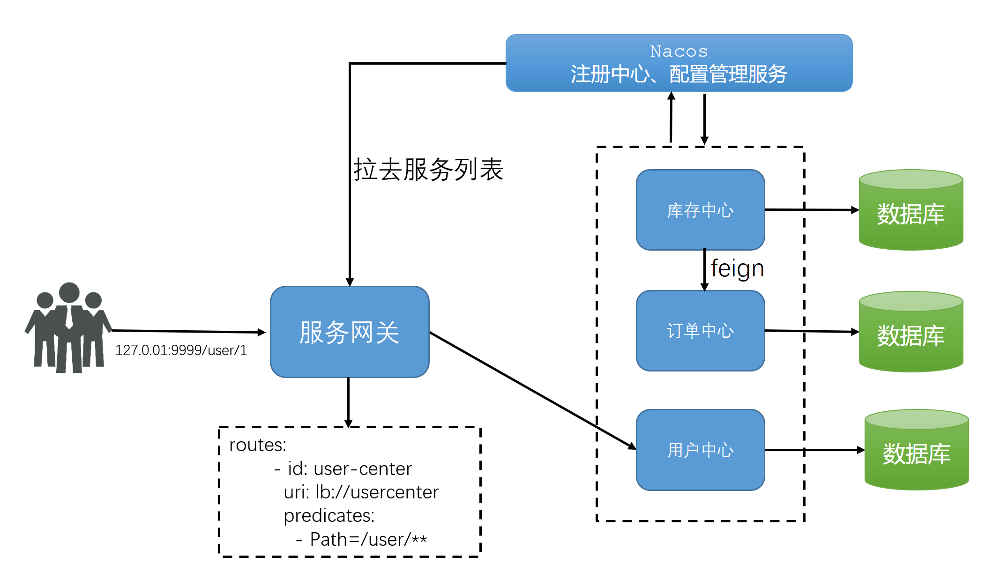

### 3、路由断言工厂

网关路由可以配置的路由包括：

- 路由id：路由唯一标示

- uri：路由目的地，支持lb和http两种

- predicates：路由断言，判断请求是否符合要求，符合则转发到路由目的地

- filters：路由过滤器，处理请求或响应

**路由断言工厂**Route Predicate Factory

配置文件中写的断言规则只是字符串，这些字符串会被 Predicate Factory 读取并处理，转变为路由判断的条件

例如Path=/user/**是按照路径匹配，这个规则是由 org.springframework.cloud.gateway.handler.predicate.PathRoutePredicateFactory 类来处理的

像这样的断言工厂在SpringCloudGateway还有十几个：

| **名称**   | **说明**                       | **示例**                                                     |
| ---------- | ------------------------------ | ------------------------------------------------------------ |
| After      | 是某个时间点后的请求           | -  After=2037-01-20T17:42:47.789-07:00[America/Denver]       |
| Before     | 是某个时间点之前的请求         | -  Before=2031-04-13T15:14:47.433+08:00[Asia/Shanghai]       |
| Between    | 是某两个时间点之前的请求       | -  Between=2037-01-20T17:42:47.789-07:00[America/Denver],  2037-01-21T17:42:47.789-07:00[America/Denver] |
| Cookie     | 请求必须包含某些cookie         | - Cookie=chocolate, ch.p                                     |
| Header     | 请求必须包含某些header         | - Header=X-Request-Id, \d+                                   |
| Host       | 请求必须是访问某个host（域名） | -  Host=**.somehost.org,**.anotherhost.org                   |
| Method     | 请求方式必须是指定方式         | - Method=GET,POST                                            |
| Path       | 请求路径必须符合指定规则       | - Path=/red/{segment},/blue/**                               |
| Query      | 请求参数必须包含指定参数       | - Query=name, Jack或者-  Query=name                          |
| RemoteAddr | 请求者的ip必须是指定范围       | - RemoteAddr=192.168.1.1/24                                  |
| Weight     | 权重处理                       |                                                              |

### 4、过滤器 

GatewayFilter 是网关中提供的一种过滤器，可以对进入网关的请求和微服务返回的响应做处理（面试）：

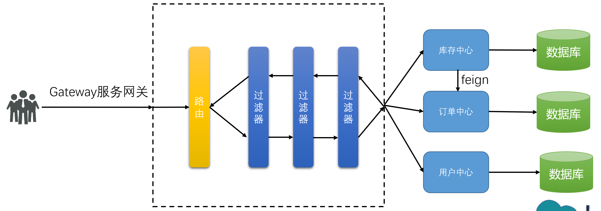

Spring常用过滤器工厂：

| **名称**             | **说明**                     |
| -------------------- | ---------------------------- |
| AddRequestHeader     | 给当前请求添加一个请求头     |
| RemoveRequestHeader  | 移除请求中的一个请求头       |
| AddResponseHeader    | 给响应结果中添加一个响应头   |
| RemoveResponseHeader | 从响应结果中移除有一个响应头 |
| RequestRateLimiter   | 限制请求的流量               |

#### 4.1 路由过滤器 GatewayFilter

需求：给进入 user-center 服务的所有请求添加请求头：userenv=prod 信息

实现方式：在 gateway 中修改 application.yml 文件，给 usercenter 的路由添加过滤器

```yaml
spring:
  application:
    name: gateway
  cloud:
    nacos:
      server-addr: localhost:8848
    gateway:
      routes:
        - id: usercenter
          uri: lb://usercenter
          predicates:
            - Path=/user/**
          filters:
            - AddRequestHeader=fromGateway,yes
        - id: ordercenter
          uri: lb://ordercenter
          predicates:
            - Path=/order/**
```

#### 4.2 全局过滤器 GlobalFilter

全局过滤器的作用也是处理一切进入网关的请求和微服务响应，与 GatewayFilter 的作用一样。

区别在于 GatewayFilter 通过配置定义，处理逻辑是固定的。而 GlobalFilter 的逻辑需要自己写代码实现。定义方式是实现GlobalFilter接口。

需求：定义全局过滤器，拦截请求，判断请求的参数是否满足下面条件：

- 参数中是否有authorization，

- authorization参数值是否为true(实际开发中可以验证jwt token 是否过期)

- 如果同时满足则放行，否则拦截

代码实现：

```java
@Order(1)
@Component
public class AuthFilter implements GlobalFilter {
    @Override
    public Mono<Void> filter(ServerWebExchange exchange, GatewayFilterChain chain) {
        ServerHttpRequest request = exchange.getRequest();
        String token = request.getQueryParams().getFirst("token");
        if ("yes".equals(token)) {
            return chain.filter(exchange);
        }
        // 添加没有权限的状态码
        exchange.getResponse().setStatusCode(HttpStatus.UNAUTHORIZED);
        return exchange.getResponse().setComplete();
    }
}
```

> 注意：路由过滤器、defaultFilter、全局过滤器的执行顺序？
>
> - order 值越小，优先级越高
>
> - 当 order 值一样时，顺序是 defaultFilter 最先，然后是局部的路由过滤器，最后是全局过滤器

### 5、跨域问题

跨域：域名不一致就是跨域，主要包括：

- 域名不同： www.sycoder.cn 和 www.sycoder.org

- 域名相同，端口不同：127.0.0.1:8080和127.0.0.1:8081

- 跨域问题：浏览器禁止请求的发起者与服务端发生跨域 ajax 请求，请求被浏览器拦截的问题

解决方案：CORS

代码配置：

```yaml
spring:
  cloud:
    gateway:
      globalcors:
        cors-configurations:
          '[/**]':
            allowedOrigins:
              - http://localhost:8080
              - http://www.baidu.com
            allowedMethods:
              - GET
              - POST
              - PUT
              - DELETE
            allowedHeaders: "*"
            allowCredentials: true
            maxAge: 3600
```

## 九、SpringCloud 相关版本号

```xml
<parent>
    <groupId>org.springframework.boot</groupId>
    <artifactId>spring-boot-starter-parent</artifactId>
    <version>2.6.3</version>
    <relativePath/> <!-- lookup parent from repository -->
</parent>

<properties>
    <spring-cloud.version>2021.0.1</spring-cloud.version>
    <spring-cloud-alibaba.version>2021.0.1.0</spring-cloud-alibaba.version>
</properties>

<dependencyManagement>
    <dependencies>
        <!-- springCloud -->
        <dependency>
            <groupId>org.springframework.cloud</groupId>
            <artifactId>spring-cloud-dependencies</artifactId>
            <version>${spring-cloud.version}</version>
            <type>pom</type>
            <scope>import</scope>
        </dependency>
        <!-- springCloudAlibaba -->
        <dependency>
            <groupId>com.alibaba.cloud</groupId>
            <artifactId>spring-cloud-alibaba-dependencies</artifactId>
            <version>${spring-cloud-alibaba.version}</version>
            <type>pom</type>
            <scope>import</scope>
        </dependency>
    </dependencies>
</dependencyManagement>
```

