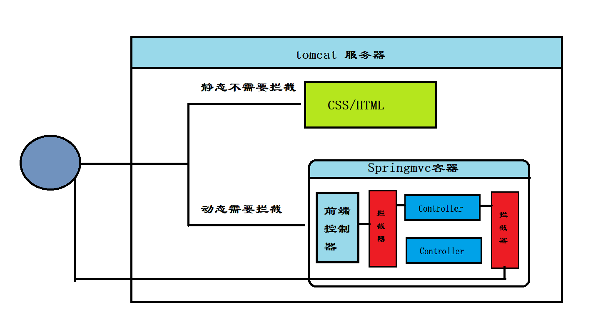
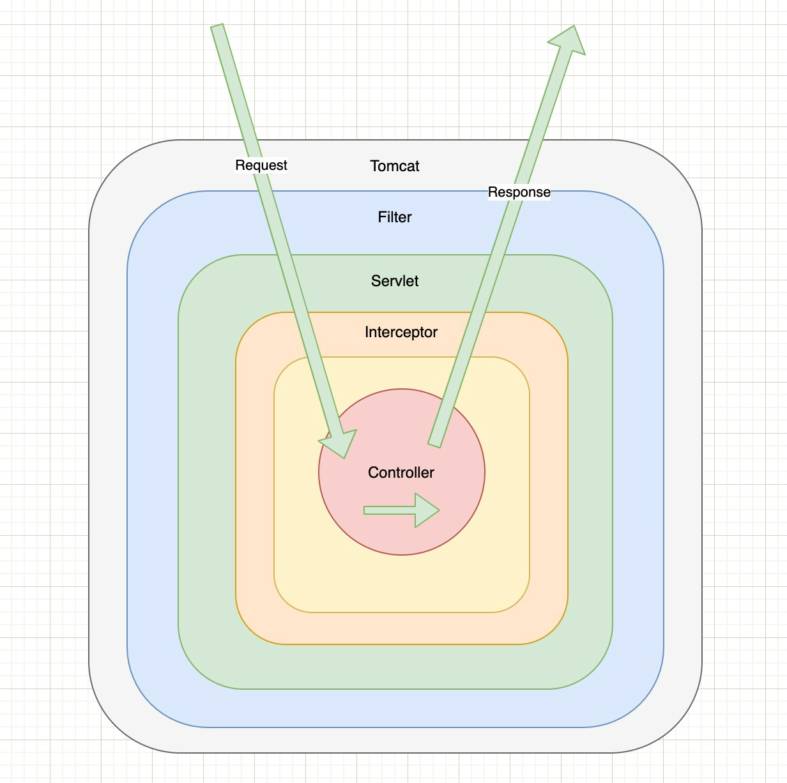

## 一、引言

### 1、回顾 MVC

- 概述：MVC 是一种软件设计架构，将软件按照模型、视图、控制器来划分
- MVC：
  - M（Model）：模型层，指工程中的 JavaBean，作用是处理数据
  - V（View）：视图层，指工程中的 HTML 或 JSP 等页面，作用是与用户进行交互，展示数据
  - C（Controller）：控制层，指工程中的 Servlet，作用是接收请求和响应数据

### 2、SpringMVC

- 概述：SpringMVC 是一种基于原生 Servlet 实现 MVC 模型的轻量级 Web 框架，基于原生 Servlet，通过前端控制器 DIspatcherServlet，对请求和响应进行统一处理
- 特点：
  - Spring 系列产品，可以与 Spring 无缝衔接
  - 基于原生的 Servlet ，使用 DispatcherServlet 对 Servlet 进行封装，可以对请求和响应做统一处理
  - 组件丰富，直接配置使用

## 二、SpringMVC 快速入门

### 1、基于 XML 方式配置

#### 1.1 导入相关依赖

```xml
<dependencies>
    <dependency>
        <groupId>junit</groupId>
        <artifactId>junit</artifactId>
        <version>4.13.1</version>
        <scope>test</scope>
    </dependency>
    <dependency>
        <groupId>org.springframework</groupId>
        <artifactId>spring-webmvc</artifactId>
        <version>5.3.24</version>
    </dependency>
    <dependency>
        <groupId>javax.servlet</groupId>
        <artifactId>jsp-api</artifactId>
        <version>2.0</version>
        <scope>provided</scope>
    </dependency>
    <dependency>
        <groupId>javax.servlet</groupId>
        <artifactId>jstl</artifactId>
        <version>1.2</version>
    </dependency>
    <dependency>
        <groupId>javax.servlet</groupId>
        <artifactId>javax.servlet-api</artifactId>
        <version>3.1.0</version>
        <scope>provided</scope>
    </dependency>
    <dependency>
        <groupId>taglibs</groupId>
        <artifactId>standard</artifactId>
        <version>1.1.2</version>
    </dependency>
</dependencies>
```

#### 1.2 SpringMVC 配置文件

spring-mvc.xml

```xml
<?xml version="1.0" encoding="UTF-8"?>
<beans xmlns="http://www.springframework.org/schema/beans"
       xmlns:xsi="http://www.w3.org/2001/XMLSchema-instance"
       xmlns:context="http://www.springframework.org/schema/context"
       xsi:schemaLocation="http://www.springframework.org/schema/beans http://www.springframework.org/schema/beans/spring-beans.xsd http://www.springframework.org/schema/context https://www.springframework.org/schema/context/spring-context.xsd">

    <context:component-scan base-package="org.taiyi.xml.controller"/>
</beans>
```

#### 1.3 配置 DispatcherServlet

web.xml

```xml
<!DOCTYPE web-app PUBLIC
 "-//Sun Microsystems, Inc.//DTD Web Application 2.3//EN"
 "http://java.sun.com/dtd/web-app_2_3.dtd" >

<web-app>
  <display-name>Archetype Created Web Application</display-name>
  <servlet>
    <servlet-name>spring-mvc</servlet-name>
    <servlet-class>org.springframework.web.servlet.DispatcherServlet</servlet-class>
  </servlet>
  <servlet-mapping>
    <servlet-name>spring-mvc</servlet-name>
    <url-pattern>/</url-pattern>
  </servlet-mapping>
</web-app>

```

#### 1.4 配置控制器

```java
@Controller
public class XmlController {
    @RequestMapping("/test")
    public void test(){
        System.out.println("=================");
    }
}
```

#### 1.5 配置视图解析器

```xml
<?xml version="1.0" encoding="UTF-8"?>
<beans xmlns="http://www.springframework.org/schema/beans"
       xmlns:xsi="http://www.w3.org/2001/XMLSchema-instance"
       xmlns:context="http://www.springframework.org/schema/context"
       xsi:schemaLocation="http://www.springframework.org/schema/beans http://www.springframework.org/schema/beans/spring-beans.xsd http://www.springframework.org/schema/context https://www.springframework.org/schema/context/spring-context.xsd">

    <!-- 配置包扫描 -->
    <context:component-scan base-package="org.taiyi.xml.controller"/>
    <!-- 配置视图解析器 -->
    <bean id="view" class="org.springframework.web.servlet.view.InternalResourceViewResolver">
        <!-- 配置视图前缀 -->
        <property name="prefix" value="/WEB-INF/pages/"/>
        <!-- 配置视图后缀 -->
        <property name="suffix" value=".jsp"/>
    </bean>
</beans>
```

- 控制器

  ```java
  @RequestMapping("/login")
  public String login(String username, String password) {
      if ("taiyi".equals(username) && "123456".equals(password)) {
          return "success";
      } else {
          return "fail";
      }
  }
  ```

- 视图

  ```jsp
  <%@ page contentType="text/html;charset=UTF-8" language="java" %>
  <html>
  <head>
      <title>Success</title>
  </head>
  <body>
  <h1>欢迎进入主页</h1>
  </body>
  </html>
  ```

  ```jsp
  <%@ page contentType="text/html;charset=UTF-8" language="java" %>
  <html>
  <head>
      <title>Fail</title>
  </head>
  <body>
  <h1>登陆失败，请重新登录</h1>
  </body>
  </html>
  ```


### 2、基于注解方式配置

#### 2.1 导入相关依赖

#### 2.2 创建 SpringMVC 配置类

```java
@Configuration
@ComponentScan("org.taiyi.anno")
public class SpringMvcConfig {
}
```

#### 2.3 通过配置类替换 web.xml

```java
public class ServletConfig extends AbstractDispatcherServletInitializer {
    @Override
    protected WebApplicationContext createServletApplicationContext() {
        // 获取 SpringMVC 容器
        AnnotationConfigWebApplicationContext context = new AnnotationConfigWebApplicationContext();
        context.register(SpringMvcConfig.class);
        return context;
    }

    @Override
    protected String[] getServletMappings() {
        return new String[]{"/"};
    }

    @Override
    protected WebApplicationContext createRootApplicationContext() {
        return null;
    }
}
```

#### 2.4 配置 Controller

```java
@Controller
public class SpringMvcController {
    @RequestMapping("/get")
    public void getString(){
        System.out.println("======");
    }
}
```

## 四、请求

### 1、设置请求映射路径

- 概述：SpringMVC 接收到指定请求时，在映射关系中找到对应的控制器方法

- 说明

  | 名称         | @RequestMapping                      |
  | ------------ | ------------------------------------ |
  | 位置         | 类（接口）、方法                     |
  | 作用         | 设置定义控制器方法的访问路径         |
  | 属性：value  | 设置访问路径                         |
  | 属性：method | 设置访问方法：GET、POST、PUT、DELETE |

- 延伸注解

  - @GetMapping：get 请求

  - @PostMapping：post 请求

  - @PutMapping：put 请求

  - @DeleteMapping：delete 请求

    

- 指定请求头（了解：权限拦截）

  ```java
  @RequestMapping(value = "/get", headers = "123")
  @ResponseBody
  public String getString() {
      System.out.println("======");
      return "hello";
  }
  ```

- 指定参数（参数）

  ```java
  @RequestMapping(value = "/get", params = {"username=123"})
  @ResponseBody
  public String getString() {
      System.out.println("======");
      return "hello";
  }
  ```

### 2、获取请求参数

#### 2.1 一般获取参数方式

```java
@RequestMapping("/test")
@ResponseBody
public String test(String username, String password) {
    return "username: " + username + ", password: " + password;
}
```

#### 2.2 参数名称不对应

```java
@RequestMapping("/test")
@ResponseBody
public String test(@RequestParam("username") String username, @RequestParam("password") String password) {
    return "username: " + username + ", password: " + password;
}
```

### 3、参数传递

#### 3.1 对象参数传递

```java
@RequestMapping("/user")
@ResponseBody
public String user(User user) {
    System.out.println("username: " + user.getAccount() + ", password: " + user.getPassword());
    return "ok";
}
```

- 要求：请求参数与类中的字段名要匹配

#### 3.2 复合型对象参数传递

直接通过 **属性名称.** 传参即可

```shell
localhost:8080/requestParams/user?account=taiyi&password=123456&address.city=杭州
```

#### 3.3 数组参数传递

```java
@GetMapping("/array")
@ResponseBody
public String array(String[] cities){
    System.out.println(Arrays.toString(cities));
    return "ok";
}
```

#### 3.4 集合参数传递

```java
@GetMapping("/list")
@ResponseBody
public String list(@RequestParam List<String> cities){
    System.out.println(cities);
    return "ok";
}
```

### 4、JSON 参数传递

SpringMVC 默认支持的 JSON 处理器是 jackson

#### 4.1 导入依赖

```xml
<dependency>
    <groupId>com.fasterxml.jackson.core</groupId>
    <artifactId>jackson-databind</artifactId>
    <version>2.13.4</version>
</dependency>
```

#### 4.2 开启 SpringMVC 注解支持

```java
@Configuration
@ComponentScan("org.taiyi.controller")
@EnableWebMvc
public class SpringMvcConfig {
}
```

| 名称 | @EnableWebMvc                  |
| ---- | ------------------------------ |
| 位置 | SpringMVC 配置类上             |
| 作用 | 开启 Spring MVC 的辅助功能支持 |

| 名称           | @RequestBody                     |
| -------------- | -------------------------------- |
| 位置           | Controller 方法形参前            |
| 作用           | 将请求中请求体中的数据传递给形参 |
| 属性：required | 表示是否必填                     |

#### 4.3 发送 JSON 数据

```java
@Controller
@RequestMapping("/RequestBodyController")
public class RequestBodyController {
    @PostMapping("/user/save")
    @ResponseBody
    public String saveUser(@RequestBody User user){
        System.out.println(user);
        return "OK";
    }
}
```

前端传参

```json
{  	
	"account": " 123",
    "password": "123456",
    "address": 
    	{
            "city": "杭州"
        } 
}
```

#### 4.4 JSON 数组传参

```java
@PostMapping("/user/lists")
@ResponseBody
public String saveUser(@RequestBody List<String> lists){
    System.out.println(lists);
    return "OK";
}
```

前端传参：

```java
[
    "杭州",
    "北京"
]
```

#### 4.5 JSON 对象集合传参

```java
@PostMapping("/user/lists/user")
@ResponseBody
public String listUser(@RequestBody List<User> lists){
    System.out.println(lists);
    return "OK";
}
```

前端传参：

```json
[
    {"account":" 123","password":"123456","address":{"city":"杭州"}},
    {"account":" sy","password":"123456","address":{"city":"北京"}}
]
```

### 5、@RequestParam 和 @RequestBody 总结

- 区别：
  - @RequestBody 用于接受 JSON 数据的 application/json
  - @RequestParam 用于接受 url 地址参数：application/x-www-form
- 应用：
  - 前后端分离，传参一 JSON 为主，@RequestBody 使用更多
  - 地址传参就用 @RequestParam

### 6、日期类型参数传递

`2023-12-28` 和 `2023/12/28`

#### 6.1 yyyy/MM/dd 格式

```java
@Controller
@RequestMapping("/date")
public class DateController {
    @GetMapping("/test")
    @ResponseBody
    public String testDate(Date date){
        System.out.println(date);
        return "ok";
    }
}
```

#### 6.2 yyyy-MM-dd 需修改格式

```java
@GetMapping("/test2")
@ResponseBody
public String testDate2(@DateTimeFormat(pattern = "yyyy-MM-dd") Date date){
    System.out.println(date);
    return "ok";
}
```

#### 6.3 @DateTimeFormat

| 名称          | @DateTimeFormat                       |
| ------------- | ------------------------------------- |
| 位置          | Conreoller 方法形参前面、类成员变量上 |
| 作用          | 指定日期格式                          |
| 属性：pattern | 指定日期格式                          |

底层转换原理：Converter 接口

### 7、路径中的占位符

 ```java
 @Controller
 @RequestMapping("/path")
 public class PathController {
     @GetMapping("/test/{name}")
     @ResponseBody
     public String test(@PathVariable("name") String username){
         System.out.println(username);
         return "ok";
     }
 }
 ```

```shell
localhost:8080/path/test/taiyi
```

| 名称        | @PathVariable           |
| ----------- | ----------------------- |
| 位置        | Conreoller 方法形参前面 |
| 作用        | 从请求路径上获取参数    |
| 属性：value | 指定路径参数名称        |

## 五、响应

### 1、注解配置：方式2

```java
public class ServletConfig2 extends AbstractAnnotationConfigDispatcherServletInitializer {
    @Override
    protected Class<?>[] getRootConfigClasses() {
        return new Class[0];
    }

    @Override
    protected Class<?>[] getServletConfigClasses() {
        return new Class[]{SpringMvcConfig.class};
    }

    @Override
    protected String[] getServletMappings() {
        return new String[]{"/"};
    }
}
```

### 2、设置向应用页面

#### 2.1 注解配置视图解析器

```java
@Configuration
@ComponentScan("org.taiyi.anno")
@EnableWebMvc
public class SpringMvcConfig implements WebMvcConfigurer {
    @Bean
    public ViewResolver viewResolver(){
        InternalResourceViewResolver resolver = new InternalResourceViewResolver();
        resolver.setPrefix("/WEB-INF/pages/");
        resolver.setSuffix(".jsp");
        return resolver;
    }
}
```

#### 2.2 控制器

```java
@Controller
public class ResponseController {
    @GetMapping("/test")
    public String test(){
        return "ok";
    }
}
```

### 3、响应文本类型

如果不使用 @ResponseBody 注解，会把返回值当成一个 JSP 页面来处理

```java
@GetMapping("/test2")
@ResponseBody
public String test2(){
    return "ok";
}
```

### 4、响应 JSON 数据

使用 @ResponseBody

#### 4.1 响应单个对象

```java
@GetMapping("/test3")
@ResponseBody
public ResponseUser test3() {
    return new ResponseUser(1L, "taiyi", "taiyi", new java.util.Date());
}
```

#### 4.2 响应集合 JSON 对象

```java
@GetMapping("/test4")
@ResponseBody
public List<ResponseUser> test4() {
    ResponseUser user = new ResponseUser(1L, "taiyi", "taiyi", new java.util.Date());
    ResponseUser user1 = new ResponseUser(2L, "zhangsan", "zhangsan", new java.util.Date());
    List<ResponseUser> users = new ArrayList<>();
    users.add(user);
    users.add(user1);
    return users;
}
```

#### 4.3 @RestController

@RestController = @Controller + @ResponseBody

```java
@RestController
public class MyRestController {
    @GetMapping("/myTest")
    public ResponseUser test() {
        return new ResponseUser(1L, "taiyi", "taiyi", new java.util.Date());
    }
}
```

#### 4.4 @ResponseBody 总结

| 名称 | @ResponseBody                                                |
| ---- | ------------------------------------------------------------ |
| 位置 | 类、方法                                                     |
| 作用 | 设置 Controller 的返回值作为响应体，如果返回的是对象类型，会转换成 JSON 对象传输 |

## 六、域对象共享（了解）

JSP

```jsp
<%@ page contentType="text/html;charset=UTF-8" language="java" %>
<%@ taglib uri="http://java.sun.com/jsp/jstl/core" prefix="c" %>
<%@ page isELIgnored="false" %>
<html>
<head>
	<title>Title</title>
</head>
<body>
    ${data}
</body>
</html>
```

### 1、HttpServletRequest

```java
@GetMapping("/ok")
public String okServletRequest(HttpServletRequest request){
    request.setAttribute("data", "servletRequest传参");
    return "ok";
}
```

### 2、ModelAndView

```java
@GetMapping("/modelAndView")
public ModelAndView modelAndView(){
    ModelAndView modelAndView = new ModelAndView();
    modelAndView.addObject("data", "modelAndView传参");
    modelAndView.setViewName("ok");
    return modelAndView;
}
```

### 3、Map 向 Request 中共享数据

```java
@GetMapping("/map")
public String map(Map<String, Object> map){
    map.put("data", "map 传参");
    return "ok";
}
```

## 七、RESTFul 风格

### 1、REST 简介

> Representational State Transfer，表现层资源状态转移

### 2、传统访问资源和 REST 对照

| 操作 | 传统方式             | REST 风格             |
| ---- | -------------------- | --------------------- |
| 查找 | getStudentById?id=5  | student/5 GET 请求    |
| 保存 | saveStudent          | student POST 请求     |
| 更新 | updateStudent        | student PUT 请求      |
| 删除 | deleStudentById?id=5 | student/5 DELETE 请求 |

- REST 优点：
  - 隐藏资源访问行为，无法根据资源访问猜测是什么样的逻辑
  - 书写简单化
- 注意：
  - RESTFul 风格知识一种约定方式，并不是规范
  - 以后通过 REST 风格访问网络资源 就叫 RESTFul 风格

### 3、静态资源访问不到 404

- 原因：SpringMVC 拦截了静态资源，根据 /pages/item.html 去找对应的 Controller 方法执行，匹配 / 的getServletMappings，找不到 404

- 解决方案

  配置静态资源放行

  ```java
  @Configuration
  public class StaticSupport extends WebMvcConfigurationSupport {
      @Override
      protected void addResourceHandlers(ResourceHandlerRegistry registry) {
          //当访问 /pages/ 资源的时候，设置放行
          registry.addResourceHandler("/pages/**").addResourceLocations("/pages/");
          registry.addResourceHandler("/js/**").addResourceLocations("/js/");
          registry.addResourceHandler("/css/**").addResourceLocations("/css/");
          registry.addResourceHandler("/plugins/**").addResourceLocations("/plugins/");
      }
  }
  ```


## 八、SpringMVC 接口访问流程

### 1、容器加载分析


- 手动注册 WebApplicationContext

  ```java
  public class ServletConfig extends AbstractDispatcherServletInitializer {
  
      @Override
      protected WebApplicationContext createServletApplicationContext() {
          //获取SpringMVC容器
          AnnotationConfigWebApplicationContext context = new AnnotationConfigWebApplicationContext();
          context.register(SpringMvcConfig.class);
          return context;
      }
  
      @Override
      protected String[] getServletMappings() {
          return new String[]{"/"};
      }
  
      @Override
      protected WebApplicationContext createRootApplicationContext() {
          return null;
      }
  }
  ```


### 2、容器加载过程分析

- Tomcat 服务器启动时，加载 ServletConfig 类之后，做初始化 Web 容器操作，相当于 web.xml
- 执行注册容器的方法，获取 SpringMVC 容器：WebApplicationContext
- 通过 @ComponentScan 加载指定路径下的 Bean 进 WebApplicationContext
- 把使用 @RequestMapping 注解的方法：value -- 对应一个方法，建立起一对一的映射关系

### 3、请求接口过程

- 访问 http://localhost:8082/test/1
- 匹配 SpringMVC 的 `/`  servletMapping 规则，交给 SpringMVC 处理
- 解析 /test/1 路径找到对应的方法
- 执行方法
- 因为使用 @RestController，方法的返回值作为响应体返回给浏览器

### 4、SSM 整合会出现 Bean 界定不清楚的问题

- SpringMVC 需要加载那些 Bean？
  - Controller（表现层即可）
- Spring 加载在那些 Bean？
  - Service
  - Dao

#### 4.1 如何处理？

将 Spring 配置注入到 Web 容器中

```java
@Configuration
@ComponentScan(value={"cn.sycoder.service","cn.sycoder.dao"})
public class SpringConfig {
}
```

```java
public class ServletConfig  extends AbstractAnnotationConfigDispatcherServletInitializer {
    @Override
    protected Class<?>[] getRootConfigClasses() {
        return new Class[]{SpringConfig.class};
    }

    @Override
    protected Class<?>[] getServletConfigClasses() {
        return new Class[]{SpringMvcConfig.class};
    }

    @Override
    protected String[] getServletMappings() {
        return new String[]{"/"};
    }
}
```

#### 4.2 验证两个容器的 Bean 相互不干扰

```java
@Test
public void test(){
    AnnotationConfigApplicationContext applicationContext =
            new AnnotationConfigApplicationContext(SpringConfig.class);
    ITestService bean = applicationContext.getBean(ITestService.class);
    bean.get(1L);

    TestController bean1 = applicationContext.getBean(TestController.class);
    System.out.println(bean1.test(1L));
}
```

## 九、SSM 整合

### 1、SSM 概述

Spring、SpringMVC、MyBatis

### 2、Spring 常用注解（面试）

#### 2.1 导入相关依赖

#### 2.2 配置 Spring

- SpringConfig
  - @Configuration：标记 Spring 配置类，替换 spring-config.xml
  - @ComponetScan：草庙需要被 Spring 管理的类
  - @EnableTransactionManagment：开启 Spring 事务支持
  - @PropertySource：引入 properties 文件
- 配置 JdbcConfig 配置类
  - 使用 Durid DataSource 数据源
  - 构建平台事务管理器：DataSourceTransactionManager
- 配置 MyBatis 配置类
  - 构建 SqlSessionFactoryBean
  - 指定 MapperScanner，设置 mapper 包扫描路径虚招 mapper.xml 文件

#### 2.3 配置 SpringMVC

配置 SpringMvcConfig 配置类

- @Configuration
- @ComponetScan
- @EnableWebMvc：开启 SpringMVC 注解支持

#### 2.5 业务开发

- 依赖注入
  - @Autowired
- RestController
  - GetMapping
    - @RequestParam
  - PostMapping
    - @RequestBody
  - DeleteMapping
    - @PathVariable
  - PutMapping
- @Service
  - @Transactional
- Junit
  - @RunWith
  - @ContextConfiguration
  - @Test

### 3、SSM 整合

#### 3.1 导入相关依赖

#### 3.2 SpringConfig 配置类

```java
@Configuration
@ComponentScan({"org.taiyi.service", "org.taiyi.dao"})
@PropertySource("classpath:db.properties")
@EnableTransactionManagement
@Import({DbConfig.class, MyBatisConfig.class})
public class SpringConfig {
}
```

#### 3.3 DbConfig 配置类

```java
public class DbConfig {
    @Value("${jdbc.url}")
    private String url;
    @Value("${jdbc.driver}")
    private String driver;
    @Value("${jdbc.username}")
    private String username;
    @Value("${jdbc.password}")
    private String password;

    @Bean
    public DataSource dataSource() {
        DruidDataSource dataSource = new DruidDataSource();
        dataSource.setDriverClassName(driver);
        dataSource.setUrl(url);
        dataSource.setUsername(username);
        dataSource.setPassword(password);
        return dataSource;
    }

    @Bean
    public PlatformTransactionManager transactionManager(DataSource dataSource) {
        DataSourceTransactionManager manager = new DataSourceTransactionManager();
        manager.setDataSource(dataSource);
        return manager;
    }
}
```

#### 3.4 MyBatisConfig 配置类

```java
public class MyBatisConfig {
    @Bean
    public SqlSessionFactoryBean sqlSessionFactoryBean(DataSource dataSource) {
        SqlSessionFactoryBean factoryBean = new SqlSessionFactoryBean();
        factoryBean.setDataSource(dataSource);
        return factoryBean;
    }

    @Bean
    public MapperScannerConfigurer mapperScannerConfigurer() {
        MapperScannerConfigurer configurer = new MapperScannerConfigurer();
        configurer.setBasePackage("org.taiyi.dao");
        return configurer;
    }
}
```

#### 3.5 SpringMVC 配置类

```java
@Configuration
@ComponentScan("org.taiyi.controller")
@EnableWebMvc
public class SpringMvcConfig {
}
```

#### 3.6 Web 项目入口配置类

```java
public class ServletConfig extends AbstractAnnotationConfigDispatcherServletInitializer {
    @Override
    protected Class<?>[] getRootConfigClasses() {
        return new Class[]{SpringConfig.class};
    }

    @Override
    protected Class<?>[] getServletConfigClasses() {
        return new Class[]{SpringMvcConfig.class};
    }

    @Override
    protected String[] getServletMappings() {
        return new String[]{"/"};
    }
}
```

### 4、SSM 功能开发

#### 4.1 domain

```java
@Data
public class Item {
    private Long id;
    private String name;
    private String type;
    private String remark;
}
```

#### 4.2 mapper

```java
public interface ItemMapper {
    @Insert("insert into item(name, type, remark) VALUE (#{name}, #{type}, #{remark})")
    int insert(Item item);

    @Delete("delete from item where id = #{id}")
    int delete(Long id);

    @Update("update item set name = #{name}, type = #{type}, remark = #{remark} where id = #{id}")
    int update(Item item);

    @Select("select * from item where id = #{id}")
    Item selectById(Long id);

    @Select("select * from item")
    List<Item> list();
}
```

#### 4.3 service

```java
public interface IItemService {
    /**
     * 添加物品
     *
     * @param item 物品信息
     * @return 添加成功？
     */
    boolean save(Item item);

    /**
     * 删除闲置物品
     *
     * @param id 物品 ID
     * @return 删除成功？
     */
    boolean remove(Long id);

    /**
     * 跟新限制物品
     *
     * @param item 物品信息
     * @return 更新成功？
     */
    boolean update(Item item);

    /**
     * 根据 ID 查询物品
     *
     * @param id 物品 ID
     * @return 物品信息
     */
    Item getById(Long id);

    /**
     * 查询所有物品
     *
     * @return 物品列表
     */
    List<Item> list();
}
```

```java
@Service
public class ItemService implements IItemService {

    @Resource
    private ItemMapper itemMapper;

    @Override
    public boolean save(Item item) {
        return itemMapper.insert(item) > 0;
    }

    @Override
    public boolean remove(Long id) {
        return itemMapper.delete(id) > 0;
    }

    @Override
    public boolean update(Item item) {
        return itemMapper.update(item) > 0;
    }

    @Override
    public Item getById(Long id) {
        return itemMapper.selectById(id);
    }

    @Override
    public List<Item> list() {
        return itemMapper.list();
    }
}
```

#### 4.5 controller

```java
@RestController
@RequestMapping("/item")
public class ItemController {

    @Resource
    private ItemService itemService;

    @PostMapping
    public boolean save(@RequestBody Item item) {
        System.out.println(item);
        return itemService.save(item);
    }

    @DeleteMapping("/{id}")
    public boolean remove(@PathVariable Long id) {
        return itemService.remove(id);
    }

    @PutMapping
    public boolean update(@RequestBody Item item) {
        return itemService.update(item);
    }

    @GetMapping("/{id}")
    public Item getById(@PathVariable Long id) {
        return itemService.getById(id);
    }

    @GetMapping
    public List<Item> list() {
        return itemService.list();
    }
}
```

#### 4.6 test

```java
@RunWith(SpringJUnit4ClassRunner.class)
@ContextConfiguration(classes = {SpringConfig.class})
public class ItemServiceTest {

    @Resource
    private IItemService itemService;

    @Test
    public void getTest() {
        Item item = itemService.getById(1L);
        System.out.println(item);
        List<Item> itemList = itemService.list();
        System.out.println(itemList);
    }

    @Test
    public void saveTest() {
        Item item = new Item();
        item.setName("test");
        item.setType("test");
        item.setRemark("test");
        boolean save = itemService.save(item);
        System.out.println(save);
    }

    @Test
    public void updateTest() {
        Item item = new Item();
        item.setId(9L);
        item.setName("test2");
        item.setType("test2");
        item.setRemark("test2");
        boolean update = itemService.update(item);
        System.out.println(update);
    }

    @Test
    public void deleteTest() {
        boolean remove = itemService.remove(9L);
        System.out.println(remove);
    }
}
```

### 5、前后端联调

设置 index 访问主页

```java
@Controller
public class IndexController {
    @RequestMapping("/index")
    public String index(){
        return "/pages/items.html";
    }
}
```

#### 5.1 问题：静态资源无法访问 404

配置静态资源访问放行

```java
@Configuration
public class StaticSupport extends WebMvcConfigurationSupport {
    @Override
    protected void addResourceHandlers(ResourceHandlerRegistry registry) {
        registry.addResourceHandler("/pages/**").addResourceLocations("/pages/");
        registry.addResourceHandler("/css/**").addResourceLocations("/css/");
        registry.addResourceHandler("/js/**").addResourceLocations("/js/");
        registry.addResourceHandler("/plugins/**").addResourceLocations("/plugins/");
    }
}
```

将该配置交给 SpringMVC 管理

```java
@Configuration
@ComponentScan(value = {"org.taiyi.controller", "org.taiyi.config"})
@EnableWebMvc
public class SpringMvcConfig {
}
```

#### 5.2 前端发起 Ajax 请求

```js
//物品列表
getAll() {
    axios.get("/item").then((response) => {
        this.dataList = response.data;
    })
},

//弹出添加窗口
handleCreate() {
	this.dialogFormVisible = true;
},

        //重置表单
resetForm() {
	axios.get("/item").then((response) => {
		this.dataList = response.data;
	})
},

//添加物品
handleAdd() {
	axios.post("/item", this.formData).then((response) => {

	}).finally(() => {
		// this.dialogFormVisible = false;
		this.resetForm();
	})
},

//弹出编辑窗口
handleUpdate(row) {
	this.dialogFormVisible4Edit = true;
	this.formData = row;
},

//编辑物品
handleEdit() {
	axios.put("/item", this.formData).then((response) => {

	}).finally(() => {
		this.resetForm();
	})
},

// 删除物品
handleDelete(row) {
	axios.delete("/item/" + row.id).then((response)=>{

	}).finally(()=>{
		this.resetForm();
	})
}
```

### 6、全局统一结果集处理

#### 6.1 后端修改

ResultResp

```java
@Data
@AllArgsConstructor
@NoArgsConstructor
public class ResultResp {
    private Integer code;
    private Object data;
    private String msg;

    public ResultResp(Integer code, Object data) {
        this.code = code;
        this.data = data;
    }
}
```

Code

```java
public class Code {
    public static Integer SAVE_SUCCESS = 20010;
    public static Integer SAVE_FAIL = 20011;

    public static Integer REMOVE_SUCCESS = 20020;
    public static Integer REMOVE_FAIL = 20021;

    public static Integer UPDATE_SUCCESS = 20030;
    public static Integer UPDATE_FAIL = 20031;

    public static Integer GET_SUCCESS = 20040;
    public static Integer GET_FAIL = 20041;
}
```

controller

```java
@RestController
@RequestMapping("/item")
public class ItemController {

    @Resource
    private ItemService itemService;

    @PostMapping
    public ResultResp save(@RequestBody Item item) {
        boolean save = itemService.save(item);
        return new ResultResp(save ? Code.SAVE_SUCCESS : Code.SAVE_FAIL, save);
    }

    @DeleteMapping("/{id}")
    public ResultResp remove(@PathVariable Long id) {
        boolean remove = itemService.remove(id);
        return new ResultResp(remove ? Code.REMOVE_SUCCESS : Code.REMOVE_FAIL, remove);
    }

    @PutMapping
    public ResultResp update(@RequestBody Item item) {
        boolean update = itemService.update(item);
        return new ResultResp(update ? Code.UPDATE_SUCCESS : Code.UPDATE_FAIL, update);
    }

    @GetMapping("/{id}")
    public ResultResp getById(@PathVariable Long id) {
        Item item = itemService.getById(id);
        return new ResultResp(null != item ? Code.GET_SUCCESS : Code.GET_FAIL, item);
    }

    @GetMapping
    public ResultResp list(@RequestParam(required = false) String name) {
        List<Item> itemList = itemService.list(name);
        return new ResultResp(null != itemList ? Code.GET_SUCCESS : Code.GET_FAIL, itemList);
    }
}
```

#### 6.1 前端修改

```js
//物品列表
getAll() {
	axios.get("/item", {
		params: {name: this.pagination.queryString}
	}).then((response) => {
		if (response.data.code === 20040) {
			this.dataList = response.data.data;
		} else {
			this.$message.error("加载失败");
		}
	})
},

//弹出添加窗口
handleCreate() {
	this.dialogFormVisible = true;
	this.formData = {};
},

//重置表单
resetForm() {
	this.getAll();
},

//添加物品
handleAdd() {
	axios.post("/item", this.formData).then((response) => {
		if (response.data.code === 20010) {
			this.dialogFormVisible = false;
			this.$message.success("添加成功");
		} else {
			this.$message.error("添加失败");
		}
	}).finally(() => {
		this.resetForm();
	})
},

//弹出编辑窗口
handleUpdate(row) {
	this.dialogFormVisible4Edit = true;
	this.formData = row;
},

//编辑物品
handleEdit() {
	axios.put("/item", this.formData).then((response) => {
		if (response.data.code === 20030) {
			this.dialogFormVisible4Edit = false;
			this.$message.success("编辑成功");
		} else {
			this.$message.error("编辑失败");
		}
		}).finally(() => {
			this.resetForm();
	})
},

// 删除物品
handleDelete(row) {
	axios.delete("/item/" + row.id).then((response) => {
		if (response.data.code === 20020) {
			this.$message.success("删除成功");
		} else {
			this.$message.error("删除失败");
		}
	}).finally(() => {
		this.resetForm();
	})
}
```

### 7、全局统一异常处理

#### 7.1 配置

基于 AOP

```java
@RestControllerAdvice
public class ExceptionHandlerController {

    @ExceptionHandler(value = Exception.class)
    public ResultResp exceptionHandler(Exception e) {
        e.printStackTrace();
        return new ResultResp(500, null, "服务端出现异常");
    }
}
```

#### 7.2 @RestControllerAdvice

| 名称 | @RestControllerAdvice    |
| ---- | ------------------------ |
| 位置 | REST 风格增强类上        |
| 作用 | 给 Controller 做增强操作 |

组合注解：

- @ControllerAdvice
- @ResponseBody
- @Component

#### 7.3 @ExceptionHandler

| 名称        | @ExceptionHandler                                            |
| ----------- | ------------------------------------------------------------ |
| 位置        | 方法上                                                       |
| 作用        | 处理具体异常：出现异常后，终止 controller 中方法的执行，转入当前方法执行 |
| 属性：value | 异常类字节码                                                 |

#### 7.4 项目中具体操作

- 自定义异常

  ```java
  @Data
  public class BusinessException extends RuntimeException {
      private Integer code;
  
      public BusinessException(Integer code, String msg) {
          super(msg);
          this.code = code;
      }
  }
  ```

  ```java
  @Data
  public class SystemException extends RuntimeException {
      private Integer code;
  
      public SystemException(Integer code, String msg) {
          super(msg);
          this.code = code;
      }
  }
  ```

  ```java
  @Data
  public class OtherException extends RuntimeException {
      private Integer code;
  
      public OtherException(Integer code, String msg) {
          super(msg);
          this.code = code;
      }
  }
  ```

- 异常统一处理

  ```java
  @RestControllerAdvice
  public class ExceptionHandlerController {
  
      // 账号 密码错误
      @ExceptionHandler(value = Exception.class)
      public ResultResp exceptionHandler(Exception e) {
          e.printStackTrace();
          return new ResultResp(500, null, "服务端出现异常");
      }
  
      @ExceptionHandler(value = BusinessException.class)
      public ResultResp businessExceptionHandler(BusinessException e) {
          return new ResultResp(e.getCode(), null, e.getMessage());
      }
  
      @ExceptionHandler(value = SystemException.class)
      public ResultResp systemExceptionHandler(SystemException e) {
          // 发送短信提醒业务人员修改 Bug
          // 日志打印
          return new ResultResp(e.getCode(), null, e.getMessage());
      }
  
      @ExceptionHandler(OtherException.class)
      public ResultResp otherExceptionHandler(OtherException e) {
          return new ResultResp(e.getCode(), null, e.getMessage());
      }
  }
  ```


### 8、拦截器

#### 8.1 拦截器概述

- 一种动态拦截方法调用的机制，在 SpringMVC 中动态拦截控制器方法的执行
- 实际开发中，静态资源（HTML/CSS）不需要交给框架处理，需要拦截的是动态资源

#### 8.2 拦截器图示



#### 8.3 案例

定义拦截器

```java
@Component
public class LoginInterceptor implements HandlerInterceptor {
    @Override
    public boolean preHandle(HttpServletRequest request, HttpServletResponse response, Object handler) throws Exception {
        System.out.println("登录拦截操作");
        String username = request.getParameter("username");
        if("sy".equals(username)){
            return true;
        }
        System.out.println("preHandle");
        return false;
    }

    @Override
    public void postHandle(HttpServletRequest request, HttpServletResponse response, Object handler, ModelAndView modelAndView) throws Exception {
        System.out.println("postHandle");
    }

    @Override
    public void afterCompletion(HttpServletRequest request, HttpServletResponse response, Object handler, Exception ex) throws Exception {
        System.out.println("afterCompletion");
    }
}
```

修改 SpringMVC 配置

```java
@Configuration
@ComponentScan({"cn.sycoder.controller","cn.sycoder.interceptor"})
@EnableWebMvc
public class SpringMvcConfig implements WebMvcConfigurer {

    @Autowired
    LoginInterceptor loginInterceptor;

    @Override
    public void addInterceptors(InterceptorRegistry registry) {
        registry.addInterceptor(loginInterceptor).addPathPatterns("/item","/item/*");
    }
}
```

#### 8.4 拦截器参数讲解

- HttpServletRequest request
- HttpServletResponse response
- Object handler：相当于对访问接口的一种包装

#### 8.5 拦截器链

新增拦截器

```java
@Component
public class AuthInterceptor implements HandlerInterceptor {
    @Override
    public boolean preHandle(HttpServletRequest request, HttpServletResponse response, Object handler) throws Exception {
        System.out.println("权限拦截的方法");
        return true;
    }

    @Override
    public void postHandle(HttpServletRequest request, HttpServletResponse response, Object handler, ModelAndView modelAndView) throws Exception {
        System.out.println("权限拦截的postHandle方法");
    }

    @Override
    public void afterCompletion(HttpServletRequest request, HttpServletResponse response, Object handler, Exception ex) throws Exception {
        System.out.println("权限拦截的afterCompletion方法");
    }
}
```

添加到拦截器链中

```java
@Configuration
@ComponentScan({"cn.sycoder.controller","cn.sycoder.interceptor"})
@EnableWebMvc
public class SpringMvcConfig implements WebMvcConfigurer {

    @Autowired
    LoginInterceptor loginInterceptor;

    @Autowired
    AuthInterceptor authInterceptor;

    @Override
    public void addInterceptors(InterceptorRegistry registry) {
        registry.addInterceptor(loginInterceptor).addPathPatterns("/item","/item/*");
        registry.addInterceptor(authInterceptor).addPathPatterns("/item","/item/*");
    }
}
```

拦截器链注意点：

- 拦截器链 先进后出 原则
- preHandle：与配置顺序保持一致
- postHandle：与配置顺序相反
- afterCompletion：与配置顺序相反

#### 8.6 过滤器与拦截器的区别（面试）

技术所属不同：

- Filter：Servlet 规范定义的接口，依赖于 Tomcat 等容器，只能用在 web 程序中
- Interceptor：Spring 组件，可以单独使用

触发时机不同：

- Filter：在请求进入容器后，进入 Servlet 之前进行处理；响应也是在 Servlet 处理完之后进行处理
- Interceptor：在请求进入 Servlet 之后，进入 Controller 之前处理；响应是在 Controller 渲染了视图之后进行处理

应用场景：

- Filter：通用功能过滤：敏感词过滤、字符编码设置……
- Interceptor：更接近业务层：登录判断、权限判断……



访问流程：


## 十、SpringMVC 执行流程

### 1、SpringMVC 组件

- **DispatcherServlet**：前端控制器，用于对请求和响应进行统一处理
- **HandlerMapping**：处理器映射器，根据 url/method 去找到对应的 Handler（Controller）
- **Handler**：具体处理器（程序员，以后开发这一部分需要）
- **HandlerAdapter**：处理器适配器，进行处理器方法的执行
- **ViewResolver**：处理视图相关的

### 2、SpringMVC 执行流程


